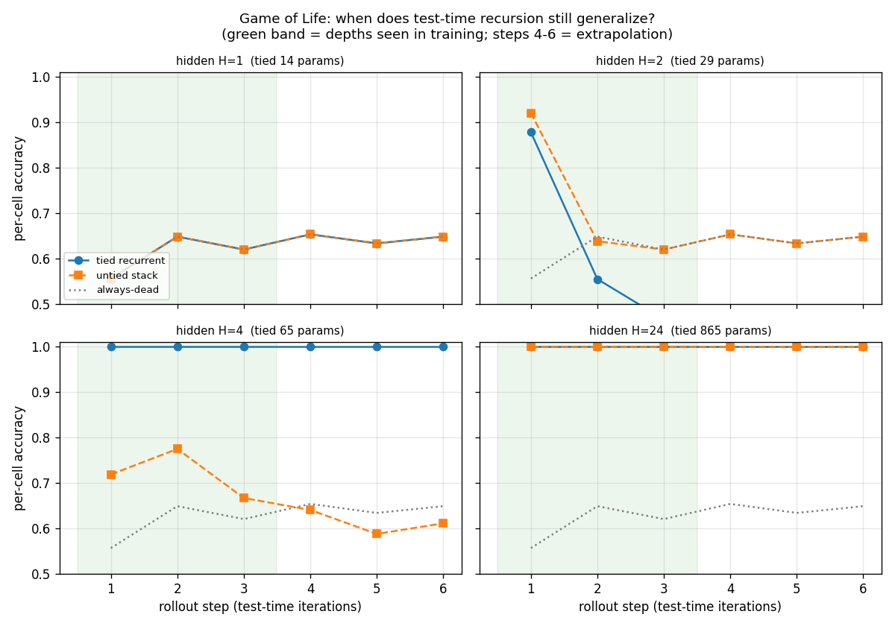

# Game of Life: when does test-time recursion still generalize?

**Date:** 2026-07-21 · **Status:** done · **Compute:** CPU, ~170 s

## Hypothesis
A weight-tied recurrent cell trained to roll out Conway's Game of Life for up to K=3 steps will keep predicting accurately when iterated *more* times at test time (depths 4-6), and will extrapolate better than an untied stack of separate per-step cells. Sweeping the cell's capacity should reveal *where* this holds.

## Method
- **Architecture:** a tiny cell = `Conv2d(1→H, 3×3, circular) → ReLU → Conv2d(H→H,1×1) → ReLU → Conv2d(H→1,1×1)`, applied recurrently by feeding its own (soft) prediction back in. **Tied** = one cell reused at every step; **untied** = one distinct cell per training step (min-clamped for extrapolation).
- **Task:** predict Conway's Game of Life on a 16×16 toroidal grid, generated on the fly (2,500 train / 1,000 test grids).
- **Varied:** hidden width `H ∈ {1, 2, 4, 24}` and tied vs untied. **Held fixed:** trained rollout depth K=3, evaluated depth 6 (steps 4-6 are pure extrapolation), seed, optimizer, steps.

## Result

| H (params, tied) | tied @6 | untied @6 | tied − untied @6 |
|---|---|---|---|
| 1 (14) | 0.65 | 0.65 | 0.00 — both collapse to the "always-dead" baseline |
| 2 (29) | **0.45** | 0.65 | −0.20 — tied recursion is *unstable*, error compounds |
| 4 (65) | **1.00** | 0.61 | **+0.39** — tied learns the exact rule, untied (3× params) does not |
| 24 (865) | 1.00 | 1.00 | 0.00 — ample capacity, tying no longer matters |

## Takeaway
There is a **capacity window** where weight-tying is decisive. Too starved (H=1) and nothing learns Life. Ample (H=24) and everything does, so tying is irrelevant. But in between (H=4) the **tied** cell finds the one exact, reusable update rule and therefore extrapolates to rollout depths it never saw with perfect accuracy — while the **untied** stack, despite having three times the parameters, never learns a single reusable operator and decays with depth. The lesson that transfers to the latent-reasoning lineage (TRM/Universal Transformers): weight-tying is not just a parameter-saving trick, it is the inductive bias that *forces* a model to learn an operator it can iterate. The H=2 panel adds a caution — a marginally-capable tied cell is *unstable* under its own iteration (error compounds catastrophically), which is exactly the regime deep supervision / fixed-point methods are designed to tame. **Next:** repeat with an explicit fixed-point (DEQ) solver vs unrolled recursion, and on a rule that is *not* exactly representable (a larger CA neighborhood) so the clean 100% ceiling disappears.

## Novelty check
- **Verdict:** partial-prior-art (novel framing). Learning cellular automata with CNNs is well trodden ([Differentiable Logic CA](https://google-research.github.io/self-organising-systems/difflogic-ca/), Mordvintsev Neural CA), and weight-tied/looped depth-generalization is studied at scale ([Universal Transformers](https://arxiv.org/abs/1807.03819), [Looped Transformers for length generalization](https://arxiv.org/abs/2409.15647)).
- **How this differs:** a controlled *capacity × tied-vs-untied* sweep on the extrapolation of test-time recursion depth, at <1k params on CPU, isolating the exact window where tying buys depth-generalization. I did not find this specific tiny controlled comparison published.
- Sources checked: arXiv, OpenAlex, GitHub (`weight tied CNN game of life extrapolation`), plus the latent-reasoning survey list.
