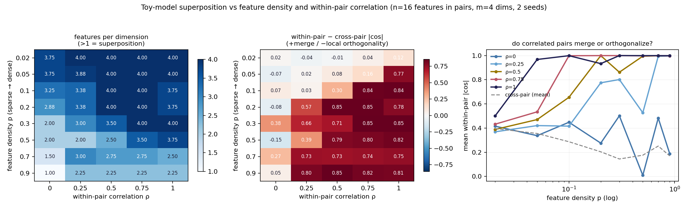

# Superposition phase diagram: does feature correlation resist or reshape superposition?

**Date:** 2026-07-23 · **Status:** done (hypothesis refuted — clean opposite result)

## Hypothesis
Raising within-pair activation correlation pushes paired features toward local orthogonality
(lower within-pair |cos| than cross-pair) and delays superposition onset, because co-occurring
features pay interference cost on every sample.

## Method
- Architecture: Anthropic-style toy autoencoder `x_hat = ReLU(W^T W x + b)`, n=16 features → m=4
  hidden dims (4× compression), equal feature importance, MSE, Adam lr=0.01, 3000 online steps,
  batch 1024, 2 seeds per cell. ~68 params; whole 80-run grid ≈ 6 min on CPU.
- Task / dataset: synthetic sparse features in 8 pairs. Per sample per pair, with probability ρ
  both members share ONE Bernoulli(p) on/off coin, else independent coins → within-pair indicator
  correlation is exactly ρ. Active values are independent Uniform[0,1], so merging directions is
  always lossy.
- Varied: density p ∈ {0.02…0.9} × correlation ρ ∈ {0, 0.25, 0.5, 0.75, 1}. Held fixed: n, m,
  importance, optimizer, steps.
- Measured per cell: features-per-dimension (represented count / m, threshold ‖W_i‖ ≥ 0.5), mean
  within-pair vs cross-pair |cos(W_i, W_j)| among represented features.

## Result
The opposite of the hypothesis, consistently across the grid:

- **Correlated pairs MERGE, they do not orthogonalize.** At p=0.05, within-pair |cos| climbs
  0.34 (ρ=0) → 0.97 (ρ=1) while cross-pair |cos| falls 0.41 → 0.20 (`metrics.headline` in
  `results.json`). From p≥0.1, ρ≥0.5 pins within-pair |cos| ≈ 1.00: the model spends one
  direction per *pair* and accepts the value-reconstruction loss.
- **Correlation extends superposition into the dense regime.** At p=0.9 the uncorrelated model
  collapses to 1.0 features/dim (no superposition, 4 features for 4 dims), but any ρ≥0.25 holds
  2.25 features/dim. Merging halves the effective feature count, so the sparsity phase boundary
  shifts: what matters is the density of *directions* the model chooses to represent, not of the
  raw features.
- The middle heatmap is a crisp phase boundary: merge (within − cross |cos| ≈ +0.8) invades from
  the dense-correlated corner; the sparse-uncorrelated corner stays near 0 (no pair structure).

## Takeaway
In this tiny equal-importance regime, correlation is compression: the model treats a correlated
pair as one feature and represents its shared indicator direction, rather than paying the
interference cost of two co-active directions — the "local orthogonal bases" behavior Anthropic
describe for correlated features did not appear at this scale, only their merging/"collapsing"
behavior, and it onsets at surprisingly low ρ (0.25–0.5) once density crosses ~0.1. Next: give
pair members unequal importance or anti-correlated *values* to see when merging becomes too lossy
and local orthogonality finally wins; and check whether an SAE trained on this model recovers 8
merged pair-features or 16 true features.

## Novelty check
- Verdict: partial-prior-art
- Closest prior work: [Toy Models of Superposition](https://transformer-circuits.pub/2022/toy_model/index.html)
  (correlated/anticorrelated features section, qualitative geometry);
  [Dynamical vs Bayesian phase transitions in toy superposition](https://arxiv.org/abs/2310.06301).
- How this differs: prior work shows qualitative geometry vignettes; this is a quantitative 2D
  phase diagram over (density × exact within-pair indicator correlation) with a scalar
  merge-vs-orthogonality metric (within − cross |cos|) and the density-boundary-shift readout.
