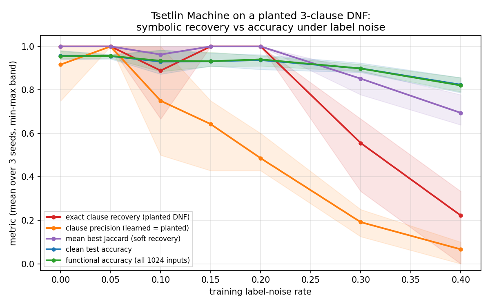

# Tsetlin Machine: does exact rule recovery break before accuracy under label noise?

**Date:** 2026-07-24 · **Status:** done

## Hypothesis
As label noise rises, a Tsetlin Machine's test accuracy degrades gracefully but its exact symbolic
recovery of the planted DNF clauses collapses earlier — interpretability breaks before accuracy does.

## Method
- Architecture: vanilla two-class Tsetlin Machine (Granmo 2018) implemented in ~100 lines of pure
  numpy (pyTsetlinMachine's C extension does not build in this environment). 20 clauses
  (10 positive / 10 negative polarity), T=10, s=3.0, 100 automaton states per side, 60 epochs.
  s=3.0 was chosen because it recovers the planted DNF exactly on clean data (s=5.0 over-includes
  literals: recovery 0.17 even at zero noise).
- Task / dataset: planted ground-truth 3-clause DNF over 10 boolean variables
  (x0∧x1∧¬x2) ∨ (¬x3∧x4∧x5) ∨ (x6∧¬x7∧¬x8), x9 an irrelevant distractor. 3000 train samples with
  labels flipped at rate ε, 2000 clean test samples, plus exhaustive evaluation on all 1024 inputs.
- What is varied vs held fixed: label-noise rate ε ∈ {0, .05, .1, .15, .2, .3, .4} × 3 seeds;
  everything else fixed. Metrics: clean test accuracy, functional accuracy (full input space),
  **exact clause recall** (fraction of planted clauses appearing verbatim among learned
  positive-polarity clauses), **clause precision** (fraction of distinct learned positive clauses
  that are exactly planted clauses), and mean best Jaccard (soft recovery).

## How to run
```bash
pip install -r requirements.txt
python run.py
```

## Result
Hypothesis **partially refuted**, and the true picture is more interesting: the interpretability
failure mode under label noise is **clutter, not forgetting**.

- Exact recall of the planted clauses is remarkably robust: mean 1.0 at ε ≤ 0.05, and still **1.0 at
  ε = 0.15 and 0.20** (the 0.89 dip at ε = 0.10 is one seed) — the true rules stay in the machine
  verbatim deep into the noisy regime. Recall only collapses at ε ≥ 0.3 (0.56, then 0.22 at 0.4).
- Clause **precision breaks first and monotonically**: 0.92 → 1.0 → 0.75 → 0.64 → **0.49 at ε = 0.2**
  → 0.19 → 0.07. From ~10% noise on, the learned rule set fills with spurious noise-fitted clauses
  even while every planted clause is still present.
- Accuracy meanwhile degrades gently (test 0.956 → 0.937 at ε = 0.2 → 0.824 at ε = 0.4; functional
  accuracy tracks it), partly because the redundant clause vote averages the clutter away.
- See `metrics.aggregate` in `results.json`; the auto-headline "recovery first breaks at ε=0.1" is
  the single-seed dip — the per-noise means above are the honest summary.



## Takeaway
For a Tsetlin Machine on a recoverable planted rule, label noise does not primarily erase the true
rules — it buries them. The practical consequence for TM interpretability is that reading the clause
list raw becomes misleading (precision ≈ 0.5 at 20% noise) long before the model loses either the
planted clauses or its accuracy, so clause-level pruning/weighting (e.g. by empirical clause
precision on a validation set) should restore a clean rule set cheaply. Next: rank clauses by how
often they fire on validation positives vs negatives and test whether simple pruning recovers
precision 1.0 at ε = 0.2–0.3; also test whether integer-weighted TMs concentrate weight on the
planted clauses.

## Novelty check
- Verdict: partial-prior-art
- Closest prior work: the original TM paper ([1804.01508](https://arxiv.org/abs/1804.01508)) shows
  noisy-XOR robustness; TM interpretability/rule-extraction studies exist
  ([Drop Clause 2105.14506](https://arxiv.org/abs/2105.14506),
  [TM rule discovery in NLP](https://onlinelibrary.wiley.com/doi/10.1111/exsy.12873),
  [state-space/reasoning-by-elimination 2407.09162](https://arxiv.org/abs/2407.09162)).
- How this differs: a controlled planted-DNF ground truth with a **quantitative
  exact-recall vs clause-precision vs accuracy sweep over label noise**, isolating WHICH
  symbolic property fails first. arXiv/OpenAlex APIs 403'd from this environment; verified via web
  search instead.
