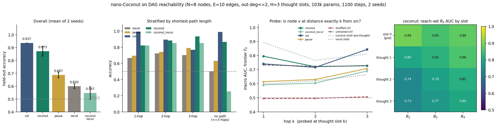

# nano-Coconut on DAG reachability: continuous thoughts need the curriculum, still lose to discrete CoT, and are *not* a BFS frontier

**Date:** 2026-07-25 · **Status:** done (hypothesis half-confirmed on accuracy, refuted on the probe)

## Hypothesis
At ~0.1M params on yes/no DAG reachability, Coconut-style continuous thoughts (H=3 latent steps
before the answer) beat discrete chain-of-thought and no-CoT at matched parameters and matched
training steps, and a per-node linear probe on the thought vectors decodes the BFS frontier
well above a shuffled-label control.

## Method
- **Architecture.** One 2-layer pre-norm decoder-only transformer, d_model=64, 4 heads, FFN 256,
  learned absolute positions, **103,168 params** — identical in every arm. (Backlog said 0.5–1M;
  shrunk to ~0.1M to fit the 12-minute CPU box, as the backlog row itself instructs.)
- **Task.** Random DAGs, N=8 nodes, out-degree ≤ 2, exactly E=10 edges. Query `(src, dst)`;
  label = *is dst reachable from src within 3 hops?* Negatives are pairs that are unreachable **or**
  further than 3 hops, so the model must track depth, not just connectivity. 50/50 label balance,
  positives stratified over shortest-path length 1/2/3 (train counts 3413/3365/3291 vs 9931 negative).
  Mean frontier sizes |F₁|,|F₂|,|F₃| = 1.40, 1.00, 0.40.
- **Encoding (deviation, see Shrinks).** Fixed-width adjacency-slot block: 2 token slots per node in
  node-id order holding that node's sorted successors, padded with `NONE`; then `SEP src dst QM`.
  21 prefix tokens. Node ids are randomly permuted per example, so token identity carries no
  topological information.
- **Five arms**, all with identical params, optimiser, batch size and **1100 training steps**:

  | arm | slots before the answer | supervision |
  |---|---|---|
  | `nocot` | none | answer CE only |
  | `pause` | 3 learned `<pause>` tokens | answer CE only (filler-token control) |
  | `cot` | 3 discrete hop tokens | answer CE + CE on all 3 hop tokens; **greedily decoded at eval**, not teacher-forced |
  | `coconut` | 3 continuous thoughts | Coconut curriculum: k=0→1→2 latents over the first 60% of steps, then k=3 |
  | `coconut_nocur` | 3 continuous thoughts | k=3 from step 0, answer CE only |

  A continuous thought is the model's own last hidden state fed back as the next input embedding
  (arXiv:2412.06769), one thought per reasoning hop, with full backprop through the chain.
  `pause`/`cot`/`coconut*` use exactly the same number of token positions and block applications;
  `nocot` is the cheaper reference.
- **CoT trace.** Positives: the shortest path (ties broken by lowest index). Negatives: a greedy
  lowest-successor dead-end walk. Both are deterministic functions of the graph. Padded to 3 with `NONE`.
- **Probe (the novel angle).** Per-node logistic probe on the hidden state at each slot, predicting
  the BFS frontier F_k = {v : dist(src,v)=k} and reach set R_k = {v : 1≤dist(src,v)≤k}, reported as
  macro AUC over the 8 node columns, on 1200 train / 1000 held-out probe graphs from disjoint seeds.
  **Three reference points:** (1) a *shuffled-label* control, (2) an *untrained random-init* model,
  (3) slot 0 — the hidden at the query position, **before any thought**.
- 10 training runs (5 arms × 2 seeds) + 7 probe fits, **553 s total** on one CPU thread.

## How to run
```bash
pip install -r requirements.txt
python run.py
```

## Result

**Accuracy (held-out graphs, mean of 2 seeds).** Discrete CoT wins; continuous thoughts land in
between; the curriculum is the whole difference.

| arm | accuracy | ±std | 1-hop | 2-hop | 3-hop | no path |
|---|---|---|---|---|---|---|
| `cot` | **0.937** | 0.000 | 0.994 | 0.894 | 0.768 | 0.990 |
| `coconut` | **0.873** | 0.038 | 0.821 | 0.884 | 0.934 | 0.865 |
| `pause` | 0.687 | 0.022 | 0.696 | 0.742 | 0.790 | 0.631 |
| `nocot` | 0.600 | 0.019 | 0.668 | 0.725 | 0.703 | 0.502 |
| `coconut_nocur` | 0.547 | 0.049 | 0.821 | 0.853 | 0.852 | 0.254 |

- **Continuous thoughts do buy real accuracy: +0.273 over no-CoT and +0.186 over the pause-token
  control at identical positions and compute** — so the gain is not merely extra forward passes,
  the *content* fed back matters.
- **But the curriculum is load-bearing: +0.326.** Dropped in (`coconut_nocur`), continuous thoughts
  are *worse than no-CoT* (0.547 vs 0.600); it answers YES on 75% of negatives.
- **Discrete CoT still wins by 0.064** at matched params and matched steps. It gets there differently:
  `cot` is near-perfect on negatives (0.990) and 1-hop (0.994) but **degrades with depth**
  (0.894 → 0.768), while `coconut` **improves with depth** (0.821 → 0.884 → 0.934) and pays for it on
  negatives (0.865). `cot`'s greedily generated trace is exactly right on 83.5% of graphs.

**Probe (`metrics.probe_*` in results.json).** The BFS frontier is decodable from the thought
vectors — 0.796/0.721/0.729 macro AUC for F₁/F₂/F₃ — and this is **far above the shuffled-label
control (0.495/0.496/0.507)**. That is the comparison the backlog asked for, and it passes. But the
two extra controls kill the interesting reading:

- **An untrained, randomly initialised model scores 0.734/0.723/0.727.** Lift of the trained Coconut
  thoughts over random features is **+0.062 / −0.002 / +0.002**. Essentially all of the "decodability"
  is generic random-projection decodability of a 21-token graph, not learned structure.
- **The pre-thought hidden (slot 0, at the query position) decodes the frontier *better* than any
  thought: 0.893/0.766/0.811 vs 0.796/0.721/0.729** — the thoughts *lose* 0.05–0.10 AUC. The reach-set
  heatmap is monotonically decreasing down the slots (R₁: 0.89 → 0.80 → 0.74 → 0.73).
- Probe machinery sanity check: the `cot` model scores **AUC 1.000** for F₁ at slot 0, exactly as it
  must — it is trained to emit the first hop token at that position.
- The one genuinely positive probe finding is at slot 0: training *with* thoughts makes the
  query-position representation far more frontier-decodable than training without
  (**coconut 0.893 vs nocot 0.598 vs untrained 0.734** for F₁).



## Takeaway
Two honest results, pulling in opposite directions. On accuracy, nano-Coconut is a real mechanism:
at 0.1M params and 1100 matched steps, continuous thoughts add +0.27 over no-CoT and +0.19 over
compute-matched pause tokens, and they degrade *more gracefully with hop count* than discrete CoT
does — but only if you pay for the curriculum, without which they are worse than doing nothing, and
even then discrete supervised CoT still wins outright. On interpretability, the headline is negative
and it is the more interesting half. The obvious story — "each continuous thought is one BFS
frontier", which is what the superposition theory (arXiv:2505.12514) constructs by hand — does not
describe what gradient descent actually built here. The frontier is decodable, and it beats a
shuffled control by 0.22–0.30 AUC, but it beats a *random untrained network* by ~0.00–0.06, and it is
strictly **more** decodable from the hidden state *before* the first thought than from the thoughts
themselves. Whatever the thoughts carry that raises accuracy from 0.60 to 0.87, it is not a linearly
readable frontier set; the thought chain appears to compress toward the yes/no decision rather than
maintain an explicit search state. Caveats: one task, one graph size, 2 seeds, 1100 steps
(no arm is trained to convergence — `cot` and `coconut` were both still improving), and the
probe is linear only. Next: (a) give every arm 10× steps to check whether the coconut/cot gap is
optimisation speed or a ceiling; (b) re-probe with a nonlinear (1-hidden-layer) probe and with a
*causal* intervention — patch a thought vector from a graph with a different frontier and see whether
the answer follows, which is the decodable-vs-used distinction from the `dyck-probe-can-lie` backlog
row; (c) the deepest-hop crossover (coconut 0.934 vs cot 0.768 at 3 hops) suggests testing hop
extrapolation: train at ≤3 hops, test at 4–5.

## Shrinks and deviations from the backlog spec
- **Params 0.5–1M → 0.103M**, per the backlog's own instruction to shrink into the 12-minute box.
- **Graph encoding is a fixed-width adjacency-slot block, not a free-order edge list.** This is the
  one substantive deviation and it is disclosed because it was forced: with a randomly-ordered edge
  list (N=9, E=12) *every* arm sat at chance (0.49–0.52) after 500 steps and no-CoT reached only 0.59
  after 2400 steps, because locating a node's successors needs an induction-head-like circuit that
  does not form in this budget. The slot encoding makes a node's block position a function of its id,
  which makes 1-hop lookup easy while leaving multi-hop composition — the part the thoughts are
  supposed to do — genuinely hard. Node ids are still permuted per example.
- **Reachability is "within 3 hops"**, so >3-hop-reachable pairs count as negatives.
- Curriculum implemented (not skipped), but compressed: 3 stages over the first 60% of 1100 steps
  rather than several epochs per stage.
- Added an arm the backlog did not ask for (`pause`, filler tokens) and a second, harsher probe
  control (untrained random-init) beyond the requested shuffled-label control. Both changed the
  conclusion, so both are reported.

## Novelty check
- Verdict: **partial-prior-art**
- Checked 2026-07-26 via web search (arXiv/OpenAlex APIs 403 from this environment, as documented
  in the brief). Queries:
  1. "Coconut continuous chain of thought linear probe latent thought BFS frontier graph reachability"
  2. "nano Coconut tiny transformer continuous thoughts DAG reachability probe latent replication small scale"
  3. "arXiv 2505.12514 Reasoning by Superposition continuous thought superposition search frontier directed graph reachability"
- Closest prior work:
  - [Coconut, arXiv:2412.06769](https://arxiv.org/abs/2412.06769) /
    [facebookresearch/coconut](https://github.com/facebookresearch/coconut) — the method and the
    curriculum; evaluates on GSM8k/ProntoQA/ProsQA at GPT-2 scale, and *qualitatively* observes
    breadth-first-like behaviour in the latent space.
  - [Reasoning by Superposition, arXiv:2505.12514 (NeurIPS 2025)](https://arxiv.org/abs/2505.12514) /
    [Ber666/reasoning-by-superposition](https://github.com/Ber666/reasoning-by-superposition) — the
    direct hit: proves a 2-layer transformer with D continuous-CoT steps solves directed graph
    reachability and *constructs* thoughts that hold a superposition of the search frontier.
  - [lucidrains/coconut-pytorch](https://github.com/lucidrains/coconut-pytorch) — reimplementation, no ablation.
  - [pause tokens, arXiv:2310.02226](https://arxiv.org/abs/2310.02226) — the filler-token control.
- How this differs: the superposition result is a hand-built construction plus theory; this is an
  empirical linear-probe test of whether a *gradient-trained* nano model puts the frontier in a
  linearly readable form, with two controls (shuffled labels **and** untrained random-init) and a
  pre-thought slot-0 reference. To our search, no prior work reports the frontier-decodability lift
  over a random-init network, and the finding that the pre-thought hidden decodes the frontier
  *better* than the thoughts is not in either paper. The accuracy comparison itself
  (continuous vs discrete vs pause vs none at matched params and steps at ~0.1M) is a new scale point;
  the curriculum-ablation direction replicates Coconut's own finding that removing the curriculum hurts.
