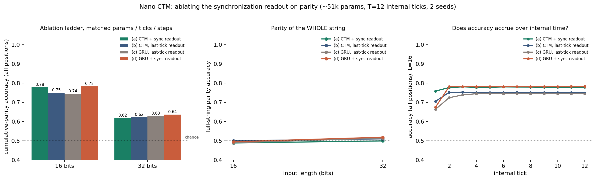

# TITLE

**Date:** DATE · **Status:** in_progress

## Hypothesis
_One sentence._

## Method
- Architecture:
- Task / dataset:
- What is varied vs held fixed:

## How to run
```bash
pip install -r requirements.txt
python run.py
```

## Result
_Filled after the run. Point at the number in `results.json` and the figure below._



## Takeaway
_One paragraph: what did we learn, and what would we try next?_

## Novelty check
- Verdict: novel | partial-prior-art | replication
- Closest prior work:
- How this differs:
