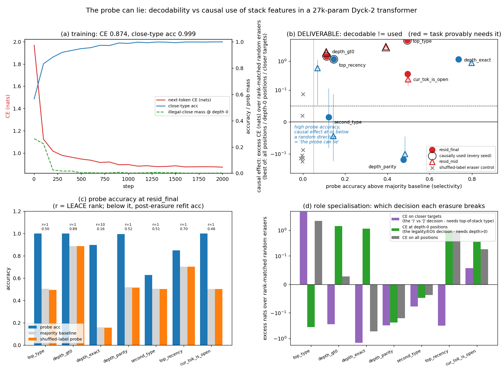

# The probe can lie: probe accuracy vs causal effect for seven stack features in a 2-layer Dyck-2 transformer

**Date:** 2026-07-25 · **Status:** done (hypothesis confirmed for the headline feature, with two
honest misses)

## Hypothesis
In a tiny transformer trained to next-token-predict Dyck-2 bracket sequences, several state
variables (exact nesting depth, depth parity, second-from-top bracket type, top-of-stack recency)
will be **decodable** by a linear probe at well-above-chance accuracy while carrying **near-zero
causal effect** on the model's predictions — whereas the variables the next-token decision actually
requires (top-of-stack bracket type, the depth>0 indicator, current-token identity) will be both
decodable *and* causally load-bearing.

## Method
- **Architecture:** 2-layer, 1-head, pre-norm decoder-only transformer, d_model=32, d_ff=128,
  learned absolute positions, **27,200 params**. Two seeds (0, 1); the whole pipeline — train,
  probe, erase, measure — is repeated per seed.
- **Task:** next-token prediction (chosen over balanced/unbalanced classification because it gives
  a *per-position* target whose correct answer is a known function of the stack, so "which variable
  does this decision need" is answerable analytically rather than by intuition).
  Vocab `PAD BOS EOS ( ) [ ]`; sequences are `BOS <dyck-2 string> EOS`, 10–20 bracket pairs
  (22–42 tokens), max depth 10, generated from the seed (mean depth 3.51).
- **Behavioural metrics** (1200 held-out sequences = 37,074 predicted positions, the same set for
  every intervention):
  - `close_type_acc` — at positions whose target is a closer, is the *correct* closer scored above
    the wrong one? Provably a function of **top-of-stack type**.
  - `illegal_close_mass` — probability mass on closers at depth-0 positions (must be ~0). Provably
    a function of **depth>0**.
  - cross-entropy on all positions, on depth-0 positions (`ce_d0`), and on closer targets
    (`ce_close`).
- **Candidate features** (per position, from the true stack state): `top_type`, `depth_gt0`,
  `depth_exact` (11-way), `depth_parity`, `second_type` (2nd-from-top), `top_recency`
  (matching opener >3 tokens back; restricted to closer positions so it cannot proxy for token
  identity), `cur_tok_is_open`.
- **Probes:** linear, on residual-stream activations at two sites (`resid_mid` = after block 1,
  `resid_final` = after block 2). Train/test split is **by sequence**; 20k train / 8k test
  positions. Every probe is paired with a **shuffled-label probe** on the same data.
- **Causal test — LEACE, not plain directional ablation.** A null causal effect only means
  something if the feature is really gone, so each feature is removed with a closed-form
  [LEACE](https://arxiv.org/abs/2306.03819) eraser `h -> mu + (h-mu)Aᵀ` fitted at that site, which
  guarantees *linear guardedness*. Verified by **refitting a fresh probe on the erased
  activations**: all 7 features at `resid_final`, both seeds, land exactly on their majority
  baseline afterwards.
- **Controls:** (1) **12 random rank-matched erasers** of identical form per (site, rank) — because
  LEACE operates in whitened space, a random subspace there is automatically variance-matched;
  every reported causal effect is *excess over the random-eraser mean*; (2) a **shuffled-label
  eraser** of the same rank; (3) the shuffled-label probe above.
- **Verdict rule (fixed before reading results):** *decodable* = probe beats majority by ≥0.05;
  *causally used* = erasure costs ≥0.05 excess nats **and** ≥2 sd above the random-eraser spread,
  on at least one of the three CE slices.
- **Time-box:** 2 seeds × (2000 steps ≈ 100 s train + ~60 s probes/erasures) = **6.0 min wall
  clock**, CPU-only, single-threaded. Shrunk from the backlog's implied budget by capping training
  at 2000 steps (the task saturates by ~1500) and using 2 seeds rather than more.

## How to run
```bash
pip install -r requirements.txt
python run.py
```

## Result
The model learns the task: **close-type accuracy 0.9994**, illegal-close mass at depth 0 **0.0010**
(from 0.26 at init), next-token CE 0.874 nats (the residual CE is irreducible — the generator's
open/close choice is genuinely stochastic).

Per-feature at `resid_final`, mean of 2 seeds (full table in `results.json`):

| feature | probe acc | majority | shuffled-label probe | LEACE rank | refit acc after erasure | causal effect (excess nats) | z | Δ close-type acc |
|---|---|---|---|---|---|---|---|---|
| `top_type` | **0.999** | 0.505 | 0.494 | 1 | 0.496 | **+5.31** | +13.6 | **−0.640** |
| `depth_gt0` | **1.000** | 0.887 | 0.887 | 1 | 0.887 | **+1.48** | +3.2 | −0.000 |
| `top_recency` | 0.848 | 0.702 | 0.702 | 1 | 0.702 | **+1.17** | +3.2 | −0.000 |
| `depth_exact` | 0.896 | 0.160 | 0.158 | 10 | 0.160 | +1.16 | +1.9 | +0.120 |
| `cur_tok_is_open` | **0.999** | 0.503 | 0.503 | 1 | 0.477 | +0.36 | +0.8 | −0.000 |
| `second_type` | 0.628 | 0.506 | 0.503 | 1 | 0.505 | +0.01 | −0.1 | −0.000 |
| **`depth_parity`** | **0.995** | 0.519 | 0.515 | 1 | 0.519 | **−0.16** | **−0.8** | −0.000 |

**Headline (the probe lies): `depth_parity`.** A linear probe reads nesting-depth parity out of the
final residual stream at **99.5%** accuracy (majority 51.9%, shuffled-label control 51.5%) — one of
the most decodable variables in the model. Erasing it is a rank-1 operation that leaves the feature
provably unreadable (refit probe 0.5188 vs majority 0.5188) and yet costs **−0.16 nats**, i.e.
*less* damage than a random direction of the same rank, in both seeds (−0.156, −0.165). Close-type
accuracy and illegal-close mass do not move at all. The reason is structural and could have been
stated in advance: **in any Dyck prefix depth(t) ≡ t (mod 2)**, so depth parity is decodable *for
free* from the positional embedding while carrying exactly zero information about the answer. It is
about as clean a demonstration as one can build that probe accuracy is not evidence of use.

`depth_exact` is the same story at higher selectivity (probe 0.896 against a 0.160 majority; Pearson
r 0.962 between predicted and true depth) but its rank-10 erasure necessarily deletes the depth>0
predicate too (Cramér's V(`depth_exact`, `depth_gt0`) = 1.0), so its positive effect is inherited
rather than its own: on *overall* CE it scores **−0.52 excess nats**, and it *improves* close-type
accuracy by 0.12 relative to a random rank-10 eraser.

**The positive control works.** `top_type` is the answer: a single direction holding **76%** of the
residual variance at `resid_final`, whose erasure costs **+5.31 nats on closer targets** and drops
close-type accuracy by **0.640** (0.999 → 0.359, i.e. below chance). That is a ~33× larger effect in
nats than any lying feature, at essentially the same probe accuracy — panel (b) is just the two
points (0.999, +5.31) and (0.995, −0.16).

**Role specialisation is clean** (panel d): `top_type`'s erasure damages only the closer-target
slice; `depth_gt0`'s erasure damages only the depth-0 slice (+1.48 nats, invisible in the
all-position average at +0.03, because depth-0 positions are 11% of the data). Averaging over all
positions would have *falsely* declared depth>0 unused.

**Two honest misses**, both against the pre-registered expectations:
1. `top_recency` was predicted unused but scores +1.17 nats (z=+3.2) in both seeds. Its label is
   near-independent of every other feature (Cramér's V ≤ 0.13), but its *direction* overlaps the
   `cur_tok_is_open` erased subspace at cos 0.62 and `depth_exact` at 0.33 — collateral damage, not
   use. This is the failure mode that makes erasure evidence one-directional.
2. `cur_tok_is_open` was predicted used (the next-token distribution does differ after an opener)
   but comes in at +0.36 nats, z=+0.8 — under-powered rather than clearly null, and it is the only
   feature whose refit probe lands slightly *below* majority (0.477).

At `resid_mid` the picture is the same with weaker probes (`top_type` 0.897) and the same headline
(`depth_parity` probes at **1.000** and scores −0.10 excess nats).



## Takeaway
At 27k parameters on a task whose ground-truth algorithm is known exactly, **decodability and causal
use dissociate completely at matched probe accuracy**: `top_type` (probe 0.999) and `depth_parity`
(probe 0.995) are equally readable and only one of them is doing anything, with +5.31 vs −0.16
excess nats. The dissociation is not an artifact of a weak intervention — LEACE certifies the
erasure and the refit probe confirms it lands on the majority baseline every time. Three
methodological points fell out that are worth carrying into any larger probing study:
(i) **average over the wrong positions and you will call a used feature unused** — `depth_gt0` looks
inert on all-position CE (+0.03 nats) and is clearly load-bearing on the 11% of positions where it
decides anything (+1.48);
(ii) **erasure evidence is asymmetric** — a null (`depth_parity`, `second_type`) is strong, a
positive (`top_recency`) can be collateral damage on an entangled direction, so the erased-subspace
overlap matrix belongs next to the effect sizes;
(iii) **the shuffled-label probe control is necessary but nowhere near sufficient** — every shuffled
probe here sat on the majority baseline, which certifies the probe is not memorising and says
nothing whatsoever about whether the model uses what the probe found.
Caveats: 2 seeds, one architecture, one depth regime; `top_recency`'s positive and
`cur_tok_is_open`'s null are both explained by measurement limits rather than resolved.
Next: activation patching between minimal pairs differing in exactly one variable (directional, and
immune to the collateral-damage problem), and a d_model sweep to see whether the lying features
acquire causal effect as capacity grows.

## Novelty check
- Checked on 2026-07-26 via WebSearch (arXiv/OpenAlex APIs 403 from this environment; the closest
  paper was verified by page fetch).
- Queries: *"probe accuracy vs causal effect Dyck transformer decodable but not used directional
  ablation"*; *"amnesic probing probing vs causal intervention decodable feature not causally used
  transformer stack depth"*; *"linear guardedness INLP verify ablation erased feature refit probe
  control null causal effect interpretability"*.
- **Verdict: replication** (of a directly-overlapping 2026 paper), with three methodological
  additions.
- Closest prior work: **[Dissociating Decodability and Causal Use in Bracket-Sequence Transformers
  (arXiv:2604.22128)](https://arxiv.org/abs/2604.22128)** — 2-layer 1-head Dyck transformers at
  d ∈ {16,32,64}, 15k–137k params, next-token prediction, probing depth / tree-distance /
  top-of-stack, causal tests by residual rank-r ablation, attention knockout and activation
  patching, with random rank-matched subspace controls. Its headline is ours: depth and distance are
  decodable but causally inert; top-of-stack is both decodable and necessary (attention knockout
  −0.967 ± 0.009 vs random edge −0.014 ± 0.002). Also relevant:
  [amnesic probing (Elazar et al.)](https://arxiv.org/abs/2006.00995),
  [LEACE (Belrose et al., arXiv:2306.03819)](https://arxiv.org/abs/2306.03819),
  [Causality ≠ Decodability (arXiv:2510.09794)](https://arxiv.org/abs/2510.09794).
- How this differs (offered as method, not as new science):
  1. **Erasure is certified, not assumed.** Prior work projects out a rank-r probe subspace; here a
     closed-form LEACE eraser is used and linear guardedness is *verified* by refitting a probe on
     the erased activations (7/7 features, both seeds, land on the majority baseline). Without that
     check, a near-zero causal effect is indistinguishable from an ineffective ablation.
  2. **A provably-zero-information decodable feature.** `depth_parity` is not merely "empirically
     unused" — depth(t) ≡ t (mod 2) makes it derivable from the positional embedding alone, so it
     is a ground-truth-null probe target. To our search this specific control does not appear in
     the Dyck-probing literature.
  3. **A shuffled-label probe control *and* a shuffled-label eraser control**, plus a
     decision-relevant CE decomposition that catches the false negative on `depth_gt0`, and an
     erased-subspace overlap matrix that explains the false positive on `top_recency`.
