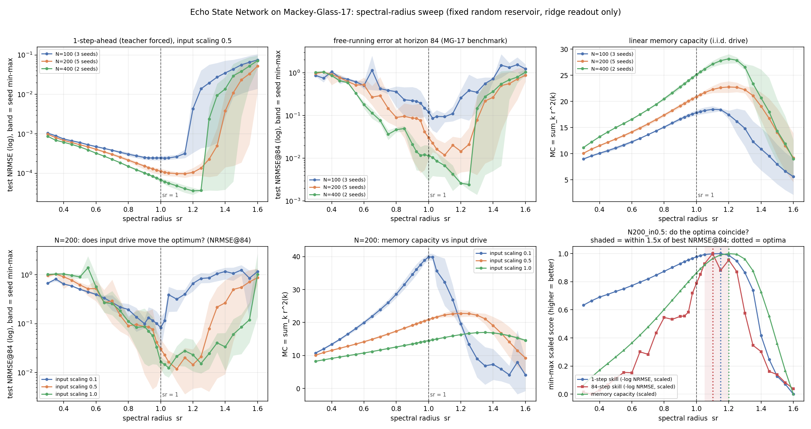

# Is there an edge-of-chaos ridge? A fine spectral-radius sweep of a hand-rolled ESN on Mackey-Glass-17

**Date:** 2026-07-25 · **Status:** done (hypothesis refuted on location, partly confirmed on sharpness)

## Hypothesis
The classic "edge of chaos" claim predicts a **sharp performance ridge just below spectral radius 1**:
NRMSE on Mackey-Glass-17 should be minimised in a narrow band around sr ≈ 0.9–1.0, degrade quickly past
sr = 1, and the NRMSE optimum should coincide with the peak of linear memory capacity.

## Method
- **Architecture:** hand-rolled Echo State Network in numpy (~50 lines of model code). Sparse random
  recurrent matrix `W` (density 0.1, entries `U(-1,1)`) rescaled to a target spectral radius `sr`;
  `x[t] = tanh(W x[t-1] + W_in u[t] + b)`, leak rate 1.0 (classic, non-leaky); `W_in, b ~ U(-1,1)*input_scaling`.
  **Nothing is trained by gradient descent** — the only learned object is a linear readout
  `ŷ[t+1] = [1, u[t], x[t]] · W_out` fitted by ridge regression (closed form).
- **Task / dataset:** Mackey-Glass τ=17, `dx/dt = 0.2·x(t−17)/(1+x(t−17)^10) − 0.1·x(t)`, RK4 at dt=0.1
  with the delayed term held over the step, subsampled to unit time step, 1000 unit-steps of transient
  discarded, then squashed with `tanh(x−1)` (Jaeger's standard MG-17 ESN preprocessing). Deterministic
  (constant history x=1.2), so every arm sees the identical series. Splits: 200 washout / 3000 train /
  1000 val / 2000 test.
- **Metrics:** (1) teacher-forced **1-step NRMSE** on test; (2) free-running **NRMSE at horizon 84**, the
  classic MG-17 benchmark — the readout's own output is fed back for 84 steps from 50 test start points,
  error taken at step 84, normalised by the test signal's std; (3) **valid prediction time** (first step
  where |error| > 0.2·std); (4) **linear memory capacity** MC = Σ_k r²(k) over k=1..N delays, measured on a
  *separate* i.i.d. uniform drive rescaled to the MG signal's std, with a states-only readout.
- **What is varied:** `sr` over **30 values from 0.30 to 1.60** (0.05 spacing, refined to 0.025 in
  [0.90, 1.05]), across 5 arms = 16 (size, seed) reservoirs, 480 cells total:

  | arm | N | input_scaling | seeds |
  |---|---|---|---|
  | N200_in0.5 (headline) | 200 | 0.5 | 5 |
  | N100_in0.5 | 100 | 0.5 | 3 |
  | N400_in0.5 | 400 | 0.5 | 2 |
  | N200_in0.1 | 200 | 0.1 | 3 |
  | N200_in1.0 | 200 | 1.0 | 3 |

- **Controls that matter:** the recurrent topology is drawn **once per (N, seed)** and only *rescaled* by
  `sr`, so the sweep is a strictly within-reservoir comparison; the input-scaling arms reuse the same
  topologies; and the MC probe uses the same i.i.d. sequence across arms. The **ridge coefficient α is
  re-selected on validation for every single cell** (grid 1e-10…1, selected separately for the 1-step and
  the free-running metric), so no part of the sr curve is an artifact of a regulariser tuned at one sr.
- **Cost:** 480 cells, ~6.8 min wall clock on one CPU thread. No gradient training anywhere.
  Two back-to-back runs produced byte-identical `results.json` apart from `duration_sec`.

## How to run
```bash
pip install -r requirements.txt
python run.py                 # full sweep, writes results.json + chart.png (~7 min)
python run.py --chart-only    # redraw chart.png from an existing results.json
```

## Result



**The ridge is real but it is in the wrong place, and memory capacity does not mark it.**

**1. The optimum is at or *above* sr = 1, not below it.** At the headline arm (N=200, input scaling 0.5)
the free-running NRMSE@84 minimum is at **sr = 1.10** (0.0118) and the 1-step minimum at **sr = 1.15**.
Across all 16 independent (size, seed) reservoirs the per-seed argmin of NRMSE@84 has **median 1.10**,
range [0.95, 1.30], and **13 of 16 lie strictly above 1** (14 of 16 at ≥ 1.0). The conventional
"set sr just under 1" default is measurably expensive: sr = 0.90 costs **7.3×** the error of the optimum
(0.0868 vs 0.0118), and sr = 0.95 costs 6.4×.

**2. The curve is a ramp and a cliff, not a resonance peak.** Below the optimum NRMSE@84 falls smoothly and
monotonically over the whole subcritical range (0.962 at sr=0.30 → 0.0118 at sr=1.10, an 81× improvement
with no sharp knee: the largest single-grid-step improvement below the optimum is only 1.98×). Above the
optimum it collapses abruptly — the largest single-step degradation is **3.7× across one 0.05 step**
(sr 1.25 → 1.30), reaching 73× the best error by sr = 1.60. So the "sharp ridge" intuition is really the
supercritical cliff, and it sits well past sr = 1.

**3. "Sharp" depends entirely on which metric you ask.** For NRMSE@84 the band within 1.5× of the best
covers only **10% of the swept range** (sr ∈ [1.05, 1.20]) at N=200 and 6.7% at N=400 — genuinely sharp.
But for 1-step prediction the same band covers **33%** (sr ∈ [0.925, 1.25]), and valid-prediction-time
saturates at the full 84 steps everywhere in sr ∈ [1.025, 1.20]. The task's memory requirement, not the
reservoir, decides whether there is a ridge at all.

**4. Where the ridge sits is set by the input drive, which is the mechanism.** Sweeping input scaling at
fixed N=200: the NRMSE@84 optimum sits at sr = **1.00** for weak drive (0.1), **1.10** for 0.5, **1.05** for
1.0 — and, more tellingly, the *tolerance* for supercritical sr grows with drive: at sr = 1.4 the error is
14× the best at input scaling 0.1, but only 2.7× at input scaling 1.0. The linear memory capacity peak
moves the same way and much more cleanly: **MC peaks at sr = 1.00 (0.1 drive), 1.20 (0.5), 1.35 (1.0)**.
This is the expected consequence of `tanh` saturation — the *effective* local gain at the operating point
is below the *nominal* linear spectral radius, and the harder you drive the reservoir, the further above 1
you must push `sr` to reach the same effective gain. In the zero-drive limit the classic boundary reappears
exactly (optimum = 1.000, all three seeds).

**5. Memory capacity is a bad guide to the task optimum, in both directions.** The MC peak is displaced
from the NRMSE@84 optimum by +0.10 (N=200), +0.075 (N=100), −0.05 (N=400), 0.00 (weak drive) and **+0.30**
(strong drive). Worse, MC is far too flat to be useful: its within-1.5×-of-peak band covers **63%** of the
sweep versus 10% for NRMSE@84. The sharpest illustration: at N=200, sr = 1.40 retains **84% of peak memory
capacity** while free-running error is already **22× worse** than at the optimum. MC tells you nothing about
the cliff that actually destroys the prediction.

**6. Sanity / absolutes.** Zero divergences in 480 cells (24,000 free-running rollouts); best NRMSE@84 is
0.0024 at N=400, in the right ballpark for a classic MG-17 ESN of that size. Bigger is better everywhere
(N=100 → 200 → 400 best NRMSE@84: 0.086 → 0.0118 → 0.0024), and the sr curve's *shape* is size-invariant
while its optimum drifts slightly right with N (1.025 / 1.10 / 1.25).

## Takeaway
The backlog asked whether the edge-of-chaos ridge is sharp, broad, or displaced. The honest answer is
**"displaced, and sharp only on one side and only for the long-horizon metric."** There is no ridge *just
below* sr = 1 — the optimum is above 1 in 13 of 16 reservoirs and the usual sr = 0.9 default costs a 7×
error penalty on the classic MG-17 free-running benchmark. The sharpness that people remember is the
supercritical collapse, which is one-sided and located past the optimum, and even that dissolves into a
33%-of-range plateau if you measure 1-step prediction instead of 84-step generation. Memory capacity, the
usual theoretical stand-in for "reservoir quality", peaks in roughly the right region but is far too flat to
localise the optimum and completely fails to warn about the cliff. The practical rule this supports is
Lukoševičius's: `sr` is not the thing to tune in isolation — the pair (spectral radius, input scaling) sets
an *effective* gain, and it is that gain, not the nominal linear spectral radius of `W`, that has an
optimum. **Caveats, worst first:** one MG realisation and one test set (deterministic series, so the sr
curves are paired but the absolute numbers carry no data-sampling error bar); only 2 seeds at N=400 and 3 at
N=100; leak rate, density and horizon fixed at one value each, so this is a 2-D slice (sr × input scaling)
of a bigger hyperparameter space; no state noise during training, which is the classic stabiliser for
generative mode and is here replaced by the swept ridge α; MC is measured on an i.i.d. drive, a different
input distribution from the task, which is standard but means the two x-axes are only loosely comparable.
**Next:** measure the mean `|tanh′|` at the operating point and re-plot every curve against that *effective*
gain instead of `sr` — the prediction is that the five arms' optima collapse onto one point, which would turn
this negative result into a positive reparameterisation.

## Novelty check
- Verdict: **replication** (of a claim that is well established in the specialist literature but still
  widely repeated in its folk form), with two additions we did not find combined elsewhere: a paired
  input-scaling arm on *identical* reservoir topologies isolating the drive-dependence of the optimum's
  location, and a per-cell validation-selected ridge α so the sr curve cannot be a regulariser artifact.
- Closest prior work:
  [Carroll, "Do Reservoir Computers Work Best at the Edge of Chaos?" (arXiv:2012.01409, Chaos 2020)](https://arxiv.org/abs/2012.01409)
  — reaches the same conclusion (no, they do not) on Lorenz/Rössler-type signals;
  [Carroll, "Optimizing memory in reservoir computers" (Chaos 32, 023123, 2022)](https://pubs.aip.org/aip/cha/article/32/2/023123/2835760/Optimizing-memory-in-reservoir-computers)
  — MC optimum ≠ task optimum;
  [Yildiz, Jaeger & Kiebel, "Re-visiting the echo state property" (Neural Networks 2012)](https://www.ai.rug.nl/minds/uploads/2519_Yildizetal12.pdf)
  — sr < 1 is neither necessary nor sufficient for the echo state property;
  [Lukoševičius, "A Practical Guide to Applying Echo State Networks"](https://www.ai.rug.nl/minds/uploads/PracticalESN.pdf)
  and [Lukoševičius & Jaeger 2009 survey](https://cenl.ucsd.edu/CompNeuro/Readings/week13/Lukosevicius-Jaeger+Reservoir-computing-recurrent-neural-network+CompSciRev+2019.pdf)
  — both state that sr > 1 can be optimal for tasks with short memory requirements and that input scaling
  co-determines the effective regime; Jaeger 2001 (the original MG-17 ESN benchmark);
  [reservoirpy](https://github.com/reservoirpy/reservoirpy) (the library we deliberately did not use).
- How this differs: a 30-point sr grid on the exact classic MG-17 free-running-84 benchmark with 16
  independent reservoirs, three sizes and three input scalings, all sharing topologies, in under 7 CPU
  minutes — and a quantified answer to "how sharp" (10% of the swept range within 1.5× of best for the
  84-step metric vs 33% for 1-step vs 63% for memory capacity) rather than a qualitative one.
- Search: `scripts/novelty_check.py` is unusable from this box (arXiv/OpenAlex return 403, as documented in
  the brief); WebSearch was used instead, three queries, 2026-07-26.
