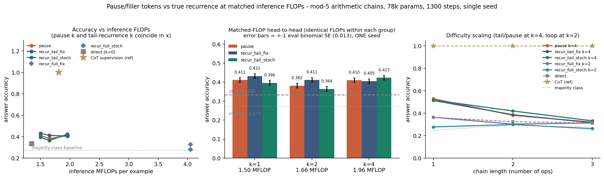

# Pause tokens vs true recurrence at matched inference FLOPs: on mod-5 arithmetic chains they tie, both saturate at k=1, and discrete CoT supervision beats every latent mechanism by +0.57 at *fewer* FLOPs

**Date:** 2026-07-25 · **Status:** done (main hypothesis refuted; the two mechanisms tie)

## Hypothesis
On left-nested modular-arithmetic chains `((a op1 b) op2 c) op3 d mod p`, where difficulty is exactly
the number of *sequential* reductions, extra inference compute spent as **true recurrence** (re-applying
the same 2-layer block) buys more accuracy per FLOP than the same FLOPs spent as **k learnable pause /
filler tokens** ([arXiv:2310.02226](https://arxiv.org/abs/2310.02226)), and — transferring
`2026-07-25_loop-test-time-compute` from parity to arithmetic — training the recurrent arm with a
**stochastic depth schedule** `k ~ U{1..k_max}` beats training it at a fixed `k`.

The theoretical prior favours recurrence: [arXiv:2505.21024](https://arxiv.org/abs/2505.21024) proves
pause tokens buy *wider parallel* computation but not serial depth, and
[arXiv:2404.15758](https://arxiv.org/abs/2404.15758) shows filler tokens only help when a
*parallelizable* algorithm exists. This task is strictly serial. So the prediction was a clean win
for recurrence.

## Method
**Task.** Left-nested chains `a op1 b op2 c ...` mod `p=5`, ops drawn uniformly from `{+,-,*}`,
difficulty = chain length `n ∈ {1,2,3}` (`n=3` is exactly the backlog's `((a op1 b) op2 c) op3 d`).
The expression is right-aligned into a fixed 9-token prefix `[BOS][PAD…][a op b op c][EQ]`, so the
answer is always read at the last prefix position. Data is generated fresh every step (no repeats,
no train/test overlap possible); the eval set is 1536 held-out examples (512 per chain length) from a
disjoint fixed seed. Because `*` skews the answer marginal, the reported floor is the empirical
**majority-class baseline 0.2715** (uniform chance would be 0.20).

**Architecture (identical, 77,632 params, in every arm).** 2-layer pre-LN decoder-only transformer,
`d_model=64`, 4 heads, FFN 128, learned absolute positions. Every loop iteration applies a
recurrent-depth-style input-injection adapter `z = W[h ; e]` before the block stack, so `direct` is
*exactly* the recurrent model with zero extra loops — the arms are strictly nested, not different
models.

**The seven arms** differ only in what happens between the expression and the answer readout:

| arm | mechanism | extra inference cost |
|---|---|---|
| `direct` | one pass, answer read at `[EQ]` | — |
| `pause k` | `k` learnable `<pause>` tokens appended before the readout | `k` extra positions |
| `recur_tail k` | 1 full pass, then `k` extra applications of the same 2-layer block **at the answer position only**, attending to the frozen pass-1 KV cache | `k` extra single-position applications |
| `recur_full k` | the same 2-layer block looped `k+1` times over the **whole sequence** | `k` extra full passes |
| `cot` | discrete supervision on the running intermediate values (3 slots + answer), teacher-forced at train, **greedily decoded** at eval | 3 extra positions |

`recur_tail k` is the point of the design: **it costs the same FLOPs as `pause k`** (measured
mismatch ≤ 0.26%, see `matched_flop_head_to_head.flop_rel_mismatch`), because k pause tokens and k
extra block applications at one position are both "k extra position-applications of the 2-layer
stack". That makes the pause-vs-recurrence comparison a true head-to-head rather than a
recurrence-gets-5x-the-compute comparison. `recur_full` is the literal whole-sequence loop, kept as a
reference point and priced honestly (its k=2 setting costs **2.06x** the FLOPs of `pause k=4`).

Both recurrent styles are trained twice: **fixed** depth and **stochastic** depth
(`recur_full`: passes `~U{1..k+1}`; `recur_tail`: extra applications `~U{0..k}`).

**FLOPs** are computed analytically per example (`arm_flops`) — QKV+proj+FFN+injection per
layer-position plus `2·2·d` per attended key — not measured wall-clock, so the matching is exact and
hardware-independent. CoT is priced with a KV cache (emitting 3 tokens = processing 3 extra
positions), which is why it lands *below* `pause k=4`.

**Held fixed everywhere:** 1300 steps, batch 96, AdamW lr 2e-3 (60-step warmup), wd 0.01, grad-clip
1.0. 13 configurations, 1 seed, CPU single-threaded, **633.6 s total**.

### Shrinks to fit the 12-minute box (all deliberate, all documented)
- **`p=5` and chain lengths `{1,2,3}`** instead of `p=7` / `{2,3,4}`. A pilot showed `p=7` with
  chains `{2,3,4}` needs >3000 steps/run to leave the majority baseline; that is ~40 min for this
  sweep. `n=1` (single op) lets the model bootstrap the mod-p op table inside the budget and gives a
  clean difficulty ladder.
- **0.078M params** (FFN 128) rather than the backlog's 0.2–0.5M.
- **`recur_full` trained only at `k=2`.** The whole-sequence loop costs `(k+1)x` a full pass, so its
  `k=4` point alone would have eaten a quarter of the box.
- **One seed.** The box does not fit two. This is the single biggest caveat — see below.

## How to run
```bash
pip install -r requirements.txt
python run.py
```

## Result



**1. At identical FLOPs, pause tokens and recurrence tie.** (`metrics.matched_flop_head_to_head`)

| matched FLOPs | `pause` | `recur_tail_fix` | `recur_tail_stoch` | best − pause |
|---|---|---|---|---|
| k=1 · 1.50 MFLOP | 0.4108 | **0.4316** | 0.3958 | +0.0208 |
| k=2 · 1.66 MFLOP | 0.3815 | **0.4115** | 0.3639 | +0.0300 |
| k=4 · 1.96 MFLOP | 0.4102 | 0.4049 | **0.4232** | +0.0130 |

Recurrence is nominally ahead at all three points, but the margins (+0.013 … +0.030) are 1.0–2.4
binomial standard errors on the 1536-example eval set (SE ≈ 0.0125) and come from a single seed, and
the *winning variant* is not even consistent (fixed at k=1,2; stochastic at k=4). **The honest read is
a tie.** Both mechanisms are worth roughly **+0.08 accuracy over the `direct` baseline (0.3333)** —
real, ~6 SE, but far short of the task.

**2. Both mechanisms saturate at k=1.** `pause`: 0.411 → 0.382 → 0.410; `recur_tail_fix`:
0.432 → 0.412 → 0.405 as k goes 1 → 2 → 4. Nothing after the *first* extra position/application buys
anything, for either mechanism. Consequently the accuracy-per-FLOP ranking is dominated by the k=1
points: `recur_tail_fix_k1` 0.287 > `pause_k1` 0.273 > `recur_tail_stoch_k1` 0.264 >
`recur_tail_fix_k2` 0.249 > `direct` 0.247 > everything else.

**3. The whole-sequence loop is the worst possible way to spend the FLOPs.** `recur_full` at k=2
costs 4.05 MFLOP (2.06x `pause k=4`, 3.0x `direct`) and scores **0.3262** fixed / **0.2793**
stochastic — at or *below* the 1.35-MFLOP `direct` baseline, and the stochastic version is
statistically indistinguishable from the 0.2715 majority-class floor. Accuracy per MFLOP: 0.081 and
0.069 against `direct`'s 0.247, i.e. **3.1–3.6x worse than doing nothing extra**. This independently reproduces
`2026-07-25_shadow-loop-vs-depth-isoflop` ("the loop loses at iso-FLOPs") on a second, non-language
task.

**4. Stochastic depth does not transfer as an accuracy fix — but it does transfer as a
depth-robustness fix.** `stochastic − fixed` is −0.036 (k=1), −0.048 (k=2), +0.018 (k=4) for tail
recurrence and −0.047 for the whole-sequence loop: no accuracy gain, mostly a loss. But the
test-time-k sweep (`metrics.extrapolation_kmax`) tells the more interesting story:

| test-time k | 1 | 2 | 4 (trained) | 6 | 8 |
|---|---|---|---|---|---|
| `recur_tail_fix_k4` | 0.262 | 0.254 | **0.405** | 0.288 | 0.343 |
| `recur_tail_stoch_k4` | **0.432** | **0.437** | 0.423 | 0.408 | 0.390 |

Exactly as in `2026-07-25_loop-test-time-compute`, fixed-k training produces a model that only works
at its trained depth and collapses (−0.14) one iteration either side, while stochastic-depth training
produces a model that works at *every* depth. The sting: the stochastic model is **already at its
best accuracy at k=1** (0.432 = its k=4 score). It has learned a depth-invariant fixed point, so the
extra iterations are free of charge *and free of benefit*. Stochastic depth bought robustness, not
compute-scaling.

**5. The reference upper line is brutal: discrete CoT supervision gets 1.000.** At **1.81 MFLOP —
less than `pause k=4` (1.96)** — supervising the three running intermediate values takes accuracy to
**1.000 at every chain length** (greedily decoded, not teacher-forced), 0.553 accuracy per MFLOP,
2x the best latent mechanism. The mechanism is obvious in hindsight and is the point: CoT converts one
n-step serial problem into n independent 1-step problems, and a 2-layer transformer solves a single
mod-5 op perfectly. Neither pause tokens nor latent recurrence discovers that decomposition on their
own within this budget.

**6. Difficulty scaling.** Every latent arm degrades with chain length (`pause k=4`:
0.529 / 0.381 / 0.320 at n=1/2/3; `recur_tail_stoch k=4`: 0.518 / 0.420 / 0.332), and at n=3 all of
them are within 0.05–0.09 of the majority baseline. `direct` is flat-and-low (0.363 / 0.324 / 0.313).
CoT is flat at 1.000. So the extra compute is buying *easy* instances, not deep ones — precisely the
opposite of what a working serial-compute mechanism should do.

## Takeaway
At matched inference FLOPs and 78k params, **pause/filler tokens and true recurrence are the same
deal**: both convert the first extra position-application into about +0.08 accuracy over a direct
readout and then flatline, neither scales with k, and neither touches the serial structure of the
task — the arm that should have exploited it (the whole-sequence loop) is the single worst use of
FLOPs in the sweep, worse than not spending them. The one asymmetry that survives is not about
accuracy at all: stochastic-depth training makes the recurrent arm depth-*invariant* (usable at any
test-time k) where fixed-k training makes it depth-*brittle*, replicating `loop-test-time-compute`'s
mechanism while refuting its promise here — invariance is what you get when the loop converges to a
fixed point in one step, which is also why it cannot scale.

The result that actually matters for the Shadow/ARC line is the price tag on the reference line:
**3 tokens of discrete intermediate supervision beat every unsupervised extra-compute mechanism by
0.57–0.67 absolute accuracy while costing fewer FLOPs than 4 pause tokens.** This is consistent with
the theory ([2505.21024](https://arxiv.org/abs/2505.21024): pause tokens add parallel width, not
serial depth; [2404.15758](https://arxiv.org/abs/2404.15758): filler tokens need a parallelizable
algorithm) and with our own `coconut-toy-graph` (pause tokens 0.687 vs discrete CoT 0.937). On serial
tasks, *supervision of the intermediate state* — not the amount of latent compute — is the binding
constraint.

**Caveats, stated plainly.** (i) **One seed.** The ±0.02 matched-FLOP margins are not seed-resolved;
only the large effects (extra-compute vs direct ≈ +0.08; loop vs direct ≈ −0.01 at 3x FLOPs; CoT
≈ +0.67) survive any plausible seed variance. (ii) This is an **iso-compute, undertrained**
comparison: at 1300 steps the latent arms sit at 0.36–0.43 with a pilot showing the task continues to
improve past 2000 steps, so these are *learning-speed-at-fixed-budget* rankings, not
converged-accuracy rankings — a mechanism that is merely slower to train would look like a loser here.
(iii) `recur_tail` freezes the pass-1 KV cache, so its loop refines the answer state against a fixed
context; the un-frozen version is `recur_full`, which was trained at only one k.

**Next.** (a) Re-run the three matched-FLOP points at 3 seeds and 4000 steps — the only clean way to
turn this tie into a real ranking. (b) Give the pause arm *supervised* pause targets (a "parallelizable
CoT" in the sense of 2404.15758) to test whether the CoT gap is about supervision or about
serialization. (c) Interpolate CoT → latent by replacing the discrete intermediates with continuous
thoughts one at a time (a Coconut curriculum on this task), to find where the 0.57 gap actually opens.

## Novelty check
- **Checked on:** 2026-07-26. `scripts/novelty_check.py` returns HTTP 403 from this environment for
  both arXiv and OpenAlex (known); web search used instead. Queries:
  `"pause tokens versus looped recurrent transformer matched compute FLOPs comparison filler tokens"`
  and `"filler tokens OR pause tokens vs looped transformer latent recurrence accuracy per FLOP
  arithmetic modular chain small model"`, plus direct reads of 2505.21024, 2404.15758, 2606.31779 and
  2607.16051.
- **Verdict: novel** (each mechanism has heavy prior art; the matched-FLOP head-to-head does not).
- **Closest prior work.**
  - [arXiv:2310.02226](https://arxiv.org/abs/2310.02226) Goyal et al., *Think before you speak*: the
    pause-token mechanism itself. Compares to a no-pause baseline, not to recurrence.
  - [arXiv:2404.15758](https://arxiv.org/abs/2404.15758) Pfau et al., *Let's think dot by dot*:
    filler tokens help on 3SUM/2SUM-Transform but **only** with parallelizable algorithms, and the
    no-filler baseline is trained 5x longer (compute is *not* matched). No recurrence comparison.
  - [arXiv:2505.21024](https://arxiv.org/abs/2505.21024) (NeurIPS 2025), *Pause Tokens Strictly
    Increase the Expressivity of Constant-Depth Transformers*: proves pause tokens reach AC⁰ but
    explicitly cannot buy serial depth. Experiments compare causal vs non-causal masking only — no
    looped/recurrent baseline, no FLOP matching.
  - [arXiv:2607.16051](https://arxiv.org/abs/2607.16051) *Loop the Loopies!*: compute-matched looped
    MoE, but at 6B–20B params, matched by optimizer-step wall time, and with no pause-token arm.
  - [arXiv:2606.31779](https://arxiv.org/abs/2606.31779) *LOTUS*: looped transformers vs Coconut /
    CODI / SIM-CoT at 3B on GSM8K; pause tokens cited only in passing, never run.
  - Own registry: `2026-07-25_coconut-toy-graph` (pause 0.687 vs CoT 0.937 vs Coconut 0.873),
    `2026-07-25_loop-test-time-compute` (stochastic depth is what makes a loop extrapolate),
    `2026-07-25_shadow-loop-vs-depth-isoflop` (the loop loses at iso-FLOPs on char-LM).
- **How this differs.** No source we found puts pause tokens and a weight-tied loop on the *same*
  analytic FLOP budget. The `recur_tail` construction (k extra block applications at the answer
  position against a frozen KV cache) is what makes that possible — it is the exact FLOP dual of k
  pause tokens (mismatch ≤ 0.26%). Also new here: pricing the whole-sequence loop against pause
  tokens in the same figure, and the fixed-vs-stochastic-depth split evaluated *at matched FLOPs*
  rather than as an extrapolation test, which is what exposes stochastic depth as a
  depth-invariance fix rather than a compute-scaling fix.
