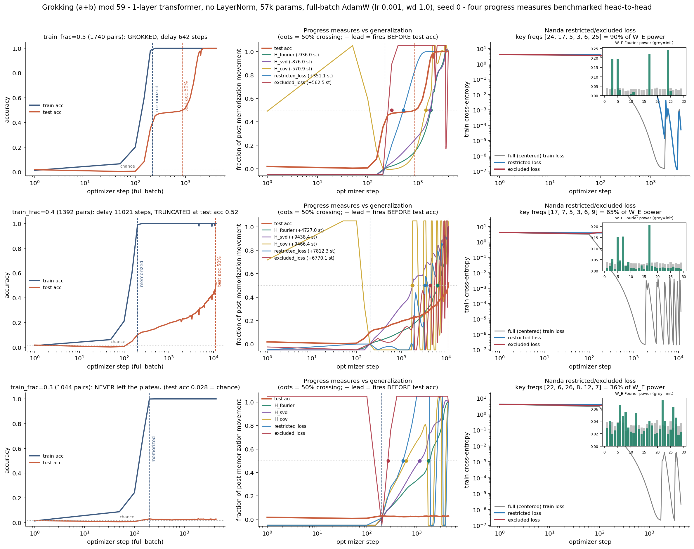

# Grokking (a+b) mod 59: spectral-entropy collapse LAGS the test-accuracy jump

**Date:** 2026-07-25 · **Status:** done (hypothesis **refuted** — honest negative on the novel angle)

## Hypothesis
A 1-layer LayerNorm-free transformer trained full-batch on a fraction of (a+b) mod 59 will memorize fast
and generalize late (grokking); the **spectral entropy of its token-embedding matrix will collapse, and
that collapse will begin measurably BEFORE the test-accuracy jump** — making it a predictive progress
measure, and one competitive with Nanda's restricted/excluded loss without needing the model's key
frequencies in advance.

## Method
- **Architecture:** 1-layer, **no LayerNorm**, no biases, over the sequence `[a, b, "="]`, logits read from
  the last position only. d_model 64, 4 heads, d_mlp 256, vocab p+1 = 60. **56,960 params.**
- **Task:** all 59² = 3481 pairs of (a+b) mod 59, deterministic random split. Full-batch AdamW,
  lr 1e-3, **weight decay 1.0**, betas (0.9, 0.98), seed 0.
- **Train-fraction sweep** (the delay is controlled by how much data you remove), 3 runs, wall-clock capped:
  **0.5** (150 s), **0.4** (360 s), **0.3** (90 s). 600 s = 10.0 min of compute total.
- **Four progress measures**, tracked at every eval (every 50 steps):
  1. `H_fourier` — entropy of the DFT power spectrum of `W_E[0:p]` down the token axis (DC dropped).
  2. `H_svd` — entropy of the normalized singular-value energy spectrum of the same `W_E[0:p]`.
  3. `H_cov` — entropy of the eigenvalue spectrum of the **penultimate-representation covariance**.
     This is the measure of [arXiv:2604.13123](https://arxiv.org/abs/2604.13123), reimplemented here.
  4. `restricted` / `excluded` **loss** ([Nanda et al. 2301.05217](https://arxiv.org/abs/2301.05217)):
     logits over the full p×p grid, centered over the output axis, 2D-DFT'd over (a,b), split into the
     part supported on the model's own key frequencies and the remainder. Computed by replaying
     in-RAM checkpoints against the **final** model's key frequencies — Nanda's own protocol.
- **Fair timing:** lead time is measured from the **memorization step** (train acc ≥ 0.99), not step 0, so
  the large transient every measure shows *while memorizing* cannot be mistaken for an early warning.
  For each measure we take the fraction of its total post-memorization movement completed at step *t* and
  compare when that crosses 0.5 against when test accuracy crosses 0.5.

## How to run
```bash
pip install -r requirements.txt
python run.py
```

## Result

**The classic grokking curve reproduces** at train_frac 0.5: train acc hits 0.99 at **step 220**, test
accuracy sits near chance, then jumps — 50% at **step 862**, 100% by step ~3000. **Grok delay = 642 steps.**
The delay explodes as data is removed: **642 steps at frac 0.5 → 11,021 steps at frac 0.4 (still only
0.524 at the cap) → never generalizes at frac 0.3** (test acc 0.028 vs chance 0.017 after 4388 steps).
The grokked model is unambiguously doing Fourier multiplication: **6 frequencies hold 90.5%** of the
embedding power, and `H_fourier` falls 4.85 → 2.90 bits (28.8 → 7.5 effective frequencies).

**But the hypothesis is refuted.** On the only run that grokked fully, every spectral entropy *lags*:

| measure | lead vs test-acc-50% (steps) | % of its collapse done at test-acc 50% | monotone? |
|---|---|---|---|
| `H_fourier` | **−936** | 14.5% | yes |
| `H_svd` | **−876** | 24.7% | ~ |
| `H_cov` (prior art) | **−571** | 13.7% | no |
| `restricted_loss` | **+351** | 83.8% | yes |
| `excluded_loss` | **+562** | overshoots ×6.4 | no |

Positive = fires first. **Only the restricted/excluded loss leads.** When test accuracy is already at 50%,
the spectral entropies have completed just 14–25% of their collapse — they are describing the *grokked
state*, not predicting it.

**Two controls explain why a lead gets reported anyway.**

1. **The lead is a normalization artifact of truncated training.** Re-analyzing the *same* run as if
   training had been stopped at the jump (step 900) flips every sign: `H_fourier` **−936 → +298**,
   `H_svd` **−876 → +386**, `H_cov` **−571 → +146**. Normalizing by "fraction of total movement" when the
   denominator is still growing manufactures a lead out of a lag. (Our own frac-0.4 run, capped at test
   acc 0.52, reports fake leads of +4727 to +9466 for exactly this reason.)
2. **Spectral entropy false-positives on a model that never generalizes.** In the frac-0.3 run, test
   accuracy never leaves chance, yet `H_svd` still falls **0.98 bits** and `H_fourier` **0.12 bits** —
   while only 35.9% of embedding power is in the top 6 frequencies (no Fourier circuit). `H_cov` moves
   the *wrong way* (+0.48 bits). Entropy dropping does not imply generalization is coming.



## Takeaway
At this scale, **spectral-entropy collapse is a lagging indicator of grokking, not a leading one**, and the
two ways it can be made to look leading are both measurement artifacts: truncating training at the jump
(which inflates the normalized progress of any still-moving quantity), and ignoring the false-positive rate
on runs that never generalize. The only measure that genuinely fired early here is Nanda's restricted loss
(+351 steps, monotone, 84% complete at the jump) — but it is not an *online* measure: it needs the final
model's key frequencies, so it cannot be computed causally during training. That is the real gap this
experiment maps: at 57k params on mod 59, there is currently **no cheap online progress measure that both
leads the jump and stays silent when the model never groks.** `H_cov`, the published measure, was also by
far the noisiest signal we tracked (it swung 2.4→4.8 bits between adjacent evals).

Honest caveats: **one seed, one modulus, one architecture**; all three runs were wall-clock capped
(frac 0.4 is an explicitly partial curve, reported as such); p=59 and d_model=64 are smaller than the
97/113 and d=128 of the prior work; and the prior-art paper used train_frac **0.20**, a far longer plateau
than fits this box — the lead could be regime-dependent. Next: 3 seeds × train_frac {0.2, 0.3, 0.4, 0.5} to
get error bars on the sign of the lead, and test whether an *online* key-frequency estimate (top-k of the
current `W_E` spectrum rather than the final one) preserves restricted loss's lead.

## Checkpoints (for the `sae-on-grokked-model` follow-up)
`*.pt` is **gitignored**, so these exist **locally only**, in this folder:
- `model.pt` — the **fully grokked** model (train_frac 0.5, step 4056, train acc 1.000, **test acc 1.000**),
  including `arch`, `p`, `key_freqs` ([24, 17, 5, 3, 6, 25]) and the exact `train_idx`/`test_idx` split.
- `model_mid.pt` — a **memorized-but-not-generalizing** checkpoint (step 200, train acc 0.991,
  test acc 0.102). Note it comes from the **train_frac 0.4** run: the frac-0.5 plateau was too short to
  contain a "memorized but test acc < 0.3" eval, so this is a different data split from `model.pt`.

## Novelty check
- Verdict: **partial-prior-art** (checked 2026-07-26 via web search; arXiv/OpenAlex APIs 403 from here).
- Closest prior work:
  - [arXiv:2604.13123, *Spectral Entropy Collapse as an Empirical Signature of Delayed Generalisation in
    Grokking*](https://arxiv.org/abs/2604.13123) — proposes spectral entropy of the **representation
    covariance**, p=97, d_model=128, train_frac 0.20, and claims a **mean lead of 1020 steps** (95% CI
    [890, 1140]). We reimplement that measure as `H_cov` and **do not reproduce the lead** in our regime
    (−571 steps).
  - [arXiv:2301.05217, Nanda et al., *Progress measures for grokking*](https://arxiv.org/abs/2301.05217) —
    restricted/excluded loss, the baseline we benchmark against.
  - [Power et al. 2201.02177](https://arxiv.org/abs/2201.02177) — the original grokking result.
  - [arXiv:2605.20441, *Weight Decay Regimes in Grokking Transformers*](https://arxiv.org/html/2605.20441)
    — proposes *attention-based* online diagnostics; disjoint from the measures tested here.
  - A "measurement-validity audit for grokking representation metrics" also surfaced in search, which is
    consistent with the truncation artifact we isolate.
- How this differs: to our search, **no prior work benchmarks spectral-entropy-style measures head-to-head
  against restricted/excluded loss on the same runs**, and none reports a **false-positive control** (a
  memorized model that never generalizes) or isolates the **truncation/normalization artifact** that can
  flip the sign of a reported lead. Those three additions are the contribution; the grokking curve itself
  is a replication.
