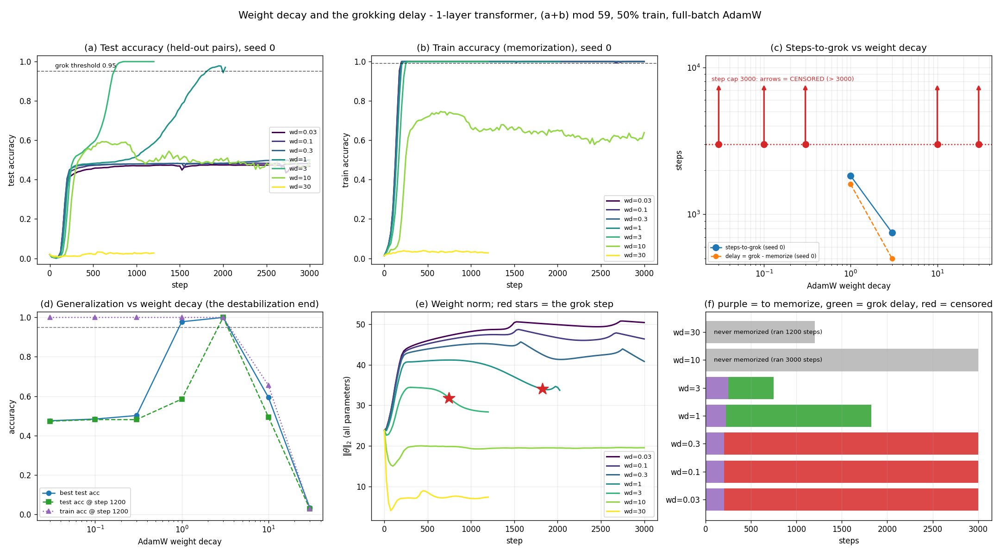

# Weight decay and the grokking delay: a phase boundary, not a monotone knob

**Date:** 2026-07-25 · **Status:** done (hypothesis **supported in both halves**, but the grokking
window turns out to be **narrow** — only 2 of 7 decades-spanning arms grok inside the budget)

## Hypothesis
Weight decay controls the memorize → generalize (grokking) delay: **steps-to-grok decreases
monotonically as weight decay increases**, until a weight decay so high that it **destabilizes
training** (the model can no longer even fit the training set), at which point generalization is lost.

## Method
- **Architecture:** 1-layer transformer, **no LayerNorm, no biases**, over the sequence `[a, b, "="]`,
  logits read from the last position only. d_model 64, 4 heads, d_mlp 256, vocab p+1 = 60.
  **56,960 params.** This is byte-for-byte the architecture of the sibling run
  [`2026-07-25_grokking-modular-addition`](../2026-07-25_grokking-modular-addition), so the WD=1.0 arm
  is a direct cross-check against a run made by a different agent.
- **Task:** all 59² = 3481 pairs of (a+b) mod 59, deterministic random **50/50** split
  (1740 train / 1741 test). Chance = 1/59 = 0.017.
- **Training:** full-batch AdamW, lr 1e-3, betas (0.9, 0.98), seed 0, eval every 25 steps.
- **The swept variable:** AdamW **decoupled weight decay** ∈ {0.03, 0.1, 0.3, 1.0, 3.0, 10.0, 30.0} —
  three orders of magnitude around the WD = 1.0 of Nanda et al. and of the sibling run.
- **Metrics per arm:** `step_memorized` (first train acc ≥ 0.99), `steps_to_grok` (first test acc ≥ 0.95),
  `grok_delay` = the difference, final/best test accuracy, accuracy at a **common step (1200)**, and the
  L2 norm of all parameters at memorization, at grok, and at the end.
- **Censoring is reported, not hidden.** Every arm gets the same **3000-step cap**. An arm that never
  reaches test acc 0.95 is recorded as `steps_to_grok > 3000` (red arrows in panel (c)) rather than
  dropped. Arms stop early only after a **confirmed** grok (grok step + 200 steps) or after failing to
  fit train for 500 steps; no arm may stop before step 1200.

**Time-box (12 min, CPU, 1 thread).** 718 s of training+eval over 7 arms, against a 720 s budget.
Shrinks vs the backlog spec: **p = 59 not 97**, **1 layer**, d_model 64, and a **3000-step cap**.
The sweep was widened from the suggested 5 values to 7 to reach the collapse regime.

## How to run
```bash
pip install -r requirements.txt
python run.py                # full sweep, ~12 min on one CPU thread
python run.py --chart-only   # re-render chart.png from results.json
```

## Result

| weight decay | memorized at | steps-to-grok | delay | best test acc | final train acc | ‖θ‖ max → final |
|---|---|---|---|---|---|---|
| 0.03 | 200 | **> 3000** (censored) | — | 0.475 | 1.000 | 50.8 → 50.5 |
| 0.1  | 200 | **> 3000** (censored) | — | 0.484 | 1.000 | 48.7 → 46.4 |
| 0.3  | 200 | **> 3000** (censored) | — | 0.501 | 1.000 | 45.7 → 40.8 |
| **1.0**  | 225 | **1825** | **1600** | 0.978 | 1.000 | 41.2 → 33.7 |
| **3.0**  | 250 | **750**  | **500**  | **1.000** | 1.000 | 34.5 → 28.4 |
| 10.0 | **never** | **> 3000** (censored) | — | 0.593 | **0.639** | 23.8 → 19.5 |
| 30.0 | **never** | **> 3000** (censored) | — | 0.033 | **0.028** | 23.8 → **7.3** |

**Both halves of the hypothesis hold, but the picture is a phase boundary, not a knob.**

1. **Monotone where it groks.** Among the arms that reached test acc 0.95, steps-to-grok is strictly
   decreasing in weight decay: **1825 → 750 steps** (delay **1600 → 500**) going from WD 1.0 to 3.0 —
   a **2.4× / 3.2× speed-up for a 3× increase in WD**. Spearman ρ(WD, steps-to-grok) over the arms at or
   below the optimum is **−0.894**; over the whole sweep it is only **−0.178**, because the top end
   reverses.
2. **Destabilization is real and sharp.** At WD = 10 the model **never memorizes** — train accuracy
   plateaus at 0.64–0.73 and then *declines* — and test accuracy stalls at 0.59. At WD = 30 training
   collapses outright: train acc 0.028, test acc 0.027 (chance is 0.017), and the parameter norm is
   crushed from 23.8 to **7.3** rather than being allowed to grow. So the curve is an **inverted U**:
   best test accuracy runs 0.475 → 0.484 → 0.501 → 0.978 → **1.000** → 0.593 → 0.033.
3. **Weight decay does not change memorization speed at all — only the delay.** `step_memorized` is
   flat at **200 / 200 / 200 / 225 / 250** across a 100× range of WD. Everything weight decay does, it
   does *after* the training set is fit. That is the cleanest single number here.
4. **A weight-norm band predicts the outcome.** Peak ‖θ‖₂ falls monotonically with WD
   (50.8, 48.7, 45.7, 41.2, 34.5, 23.8, 23.8). The two arms that grokked did so at ‖θ‖ ≈ **34.0** and
   **31.8**. Arms that memorize but never grok sit *above* the band (final norm 50.5 / 46.4 / 40.8);
   arms that cannot fit at all sit *below* it (19.5 / 7.3). Grokking here happens exactly when weight
   decay is strong enough to pull the norm down to ≈30–34 but not so strong that it prevents the norm
   from rising to fit the data in the first place.
5. **Cross-check against the sibling run passes.** At WD = 1.0 this run memorizes at step **225** and
   crosses test acc 0.5 at step **875**, i.e. a delay of **650**. The sibling agent, same architecture
   and split protocol, reported **220 / 862 / 642**. Two independently written runners agree to within
   one 25-step eval interval.



## Takeaway
Weight decay is the grokking-delay knob the folklore says it is — but only inside a **narrow window**,
and it works by a mechanism that leaves memorization untouched. Across three orders of magnitude, only
WD ∈ [1, 3] both groks and groks inside a few thousand steps; below it the model memorizes just as fast
and then sits on a **partial-generalization plateau at ~0.47–0.50 test accuracy** for the whole budget,
and above it the model loses the ability to fit its own training set before it ever gets the chance to
generalize. The practical reading is that "turn up weight decay to grok faster" has a ceiling roughly one
order of magnitude wide, and the failure past that ceiling is not a slow grok — it is a model that never
memorizes.

**Honest caveats, in order of how much they matter.**
- **One seed.** The budget was written to run seed 1 on whatever arms fit after the seed-0 sweep;
  the sweep consumed 718 s of the 720 s budget, so **all seven seed-1 arms were skipped** (logged
  explicitly in `train.log`). Everything here is n = 1 per arm. The sibling cross-check above is the
  only independent evidence that the WD = 1.0 numbers are not a seed fluke.
- **Censoring is a budget artifact, not a proof of "never".** The WD ≤ 0.3 arms are censored at 3000
  steps, and the closest prior work ([arXiv:2605.20441](https://arxiv.org/html/2605.20441)) locates the
  true memorization/grokking critical point near λ_c ≈ 0.016 — well *below* 0.03. So those arms would
  most likely grok eventually; this experiment shows only that they do not do it within 3000 steps
  while WD = 3 does it in 750. The monotone claim is therefore supported as **"steps-to-grok is
  decreasing in WD"**, not as a measurement of how long the slow arms actually take.
- **The plateau is not a pure memorization plateau.** At train_frac 0.5 the non-grokking arms sit at
  ~0.48 test accuracy, ~28× chance, so they have learned real structure. The classic clean
  memorize-at-chance plateau needs a much smaller train fraction than fits this time-box.
- One modulus, one architecture, one learning rate. WD and lr interact in AdamW (the decoupled shrink is
  `lr × wd` per step), so the numbers above are a slice at lr = 1e-3, not a WD axis in general.

**Next:** 3 seeds × WD ∈ {1, 2, 3, 5, 7} to resolve the optimum and put error bars on it; and a
`lr × wd` grid to test whether the whole curve is really a function of the product.

## Checkpoints
`model.pt` (**gitignored**, local only) is the **fastest-grokking** model: WD = 3.0, step 750, test acc
0.959 at that step and 1.000 by step 1200. Stored with its `arch` dict, `weight_decay`, `step`,
`train_frac` and seed.

## Novelty check
- Verdict: **partial-prior-art** (checked 2026-07-26 via web search + page fetch; the repo's
  `scripts/novelty_check.py` returned `unchecked` — arXiv/OpenAlex 403 from this environment, as
  documented in the brief).
- Queries run: *"grokking weight decay sweep steps-to-grok modular addition transformer monotonic"*;
  *"weight decay grokking delay accelerates generalization inverted U optimum too large weight decay
  fails to fit"*; *"Omnigrok Liu grokking weight decay critical role time to grok versus weight decay
  curve modular addition"*; fetched [arXiv:2605.20441](https://arxiv.org/html/2605.20441),
  [arXiv:2602.02859](https://arxiv.org/html/2602.02859v1) and
  [github.com/teddykoker/grokking](https://github.com/teddykoker/grokking).
- Closest prior work:
  - [**arXiv:2605.20441**, *Weight Decay Regimes in Grokking Transformers*](https://arxiv.org/html/2605.20441)
    — **direct prior art**: sweeps λ ∈ {0.01, 0.1, 0.5, 1.0, 2.0, 10.0} at p = 97, 4-layer / 8-head /
    d_model 128 (0.82M params), 50% train, 10–30 seeds. Reports three regimes (memorization below
    λ_c ≈ 0.0158; time-to-grok falling ~1090 → ~83 epochs over λ ∈ [0.1, 2.0]; **collapse at λ = 10**)
    and a power-law exponent ν = 0.757. Our three regimes and our collapse point at λ = 10 **agree with
    it**, at 1/14 the parameter count and on one CPU thread.
  - [Power et al. 2201.02177](https://arxiv.org/abs/2201.02177) — original grokking; weight decay noted
    as the strongest lever on the delay.
  - [Nanda et al. 2301.05217](https://arxiv.org/abs/2301.05217) — progress measures; source of the
    WD = 1.0 default we sweep around.
  - [teddykoker/grokking](https://github.com/teddykoker/grokking) — the backlog's listed prior art; it
    is a reproduction of the Power et al. curve and (per its README) contains **no weight-decay sweep**
    and no steps-to-grok-vs-WD plot.
  - [arXiv:2602.02859](https://arxiv.org/html/2602.02859v1), *anti-grokking* — a late-stage collapse of
    test accuracy *after* generalization. **Not** our destabilization: that paper finds weight decay
    *suppresses* anti-grokking, whereas our WD ≥ 10 arms fail before ever memorizing.
- How this differs: this is best described as a **small-scale replication with two additions**. It is
  the cheapest published-scale check of the three-regime picture we know of (57k params, 12 CPU-minutes,
  7 arms), it **extends the top of the sweep to λ = 30** where the parameter norm is actively crushed
  (23.8 → 7.3) rather than merely stalled, and it separates the two distinct failure modes by an
  explicit metric — *cannot generalize* (λ ≤ 0.3: train acc 1.0, test 0.48) versus *cannot memorize*
  (λ ≥ 10: train acc 0.64 / 0.03) — plus the observation that `step_memorized` is invariant (200–250)
  across the entire usable range of λ. Given 2605.20441 exists, the delay-vs-WD curve itself is **not**
  novel and is not claimed as such.
