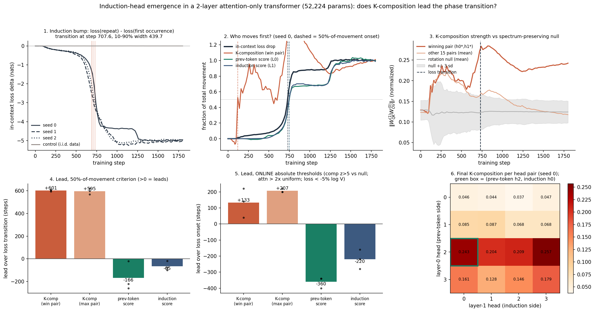

# Induction-head emergence: does K-composition strength LEAD the in-context loss phase transition?

**Date:** 2026-07-25 · **Status:** done (hypothesis confirmed on timing, refuted on specificity)

## Hypothesis
In a 2-layer attention-only transformer trained on repeating random-token sequences, the in-context
loss drops as a sharp phase transition, and the K-composition strength
‖W_QK<sup>(1)</sup> W_OV<sup>(0)</sup>‖ of the winning (previous-token head, induction head) pair starts
rising **before** the drop — a leading progress measure, unlike the spectral-entropy measures that
**lagged** in [`2026-07-25_grokking-modular-addition`](../2026-07-25_grokking-modular-addition).

## Method
- **Architecture:** 2-layer **attention-only** transformer — no MLPs, **no LayerNorm** (so the
  W_QK<sup>(1)</sup> @ W_OV<sup>(0)</sup> path is exact, with no normalization to fold through),
  d_model 64, 4 heads per layer (head dim 16), learned absolute positions, untied unembed.
  **52,224 params.**
- **Task:** per sample a period `p ~ U{12..24}` is drawn, the first `p` tokens are sampled **without
  replacement** from a 128-symbol vocab, and the sequence is tiled to length 48. Two design choices
  matter: the **per-sample random period** blocks a purely positional "attend to i−p" shortcut (which
  the classic fixed "second half repeats first half" setup does not), and **sampling without
  replacement inside a period** makes the induction target unambiguous, so the diagnostics are exact.
  - *first-occurrence* targets (index `j ≤ p−1`): irreducible, loss floor = log 128 = 4.852 nats.
  - *repeat* targets (`j ≥ p+1`): solvable **only** by an induction circuit.
  - `j = p` is excluded from both: it is a repeat token, but the query token at `p−1` has no earlier
    occurrence to induct from.
- **Tracked every 20 steps** (plus every 5 steps up to step 100, so an early onset is resolvable) on a
  **fixed** 192-sequence held-out eval batch:
  1. **in-context loss delta** = mean loss(repeat) − mean loss(first occurrence) — the induction bump.
  2. **prev-token score**: layer-0 head attention mass on position `i−1`.
  3. **induction score**: layer-1 head attention mass on `(previous occurrence of token i) + 1`.
  4. **composition scores** for all 4×4 head pairs: ‖A·W_OV<sup>(0)</sup>‖_F / (‖A‖_F ‖W_OV<sup>(0)</sup>‖_F)
     with A = W_QK<sup>(1)</sup> (**K**-composition), W_QK<sup>(1)T</sup> (Q), W_OV<sup>(1)</sup> (V),
     each against a **spectrum-preserving null**: 16 random orthogonal rotations `R` applied as
     `A·(R W_OV)`, which destroys alignment while leaving both singular-value spectra untouched.
     This is what turns a raw composition number into a z-score.
- **Onset criteria — three of them, deliberately.** The grokking run showed that "fraction of total
  movement" manufactures fake leads when the denominator is still growing, so nothing here rests on
  one criterion:
  - **A (50 % of total init→final movement)** — matched to the grokking experiment; needs the final model.
  - **B (10 % of movement)** — earliest-detection version of the same family.
  - **C (online absolute thresholds)** — pre-declared, uses **no** information from the future:
    composition `z > 5` vs its rotation null; attention scores `> 2×` their uniform-attention baseline
    (0.0736 prev, 0.0331 induction); loss delta `< −5 % of log V` (−0.243 nats); all sustained 2 evals.
  - Plus a **truncation control**: criterion A recomputed as if training had *stopped* at the transition.
- **Held fixed:** 1800 steps, batch 64, AdamW lr 3e-3 (100-step warmup), wd 0.01, betas (0.9, 0.98).
  **3 seeds**, plus a **false-positive control**: an identical model trained on **i.i.d. non-repeating**
  tokens, where an induction head is impossible, evaluated on the same repeating eval batch.
- 4 runs, **368 s (6.1 min)** on one CPU thread. Shrunk from the backlog's 10–30 min budget; d_model 64
  (the backlog's low end), seq len 48, 1800 steps.

## How to run
```bash
pip install -r requirements.txt
python run.py
```

## Result

**The transition is real and the composition measure leads it by a wide margin — but the measure is a
coarse alarm, not a circuit identifier.**

**1. The phase transition reproduces.** The in-context loss delta goes **0.00 → −5.00 nats**
(loss on repeat tokens 4.85 → **0.087**; loss on first-occurrence tokens rises to 5.08, above the 4.852
floor, as the model spends capacity on copying). It transitions at step **707.6** (per seed 728 / 689 / 706)
after ~500 steps of near-total flatness. Honest sharpness: the 10–90 % width is **440 steps = 24 % of
training** (648 / 366 / 305 per seed) — a fast sigmoid on a flat plateau, not a discontinuity, and seed 0
shows a **two-stage** transition (a shelf at −4.2 from step ~850 to ~1250, then a second drop).

**2. K-composition leads under all three criteria; the attention-pattern scores lag under all three.**

| measure | lead, criterion A (50 % mvmt) | criterion B (10 % mvmt) | criterion C (online absolute) | fraction of its movement done at the transition |
|---|---|---|---|---|
| **K-composition, winning pair** | **+601.0** (609/592/601) | **+458.0** | **+133.3** (40/140/220) | **1.68** (overshot) |
| **K-composition, best of 16 pairs** | **+594.6** | **+445.2** | **+206.7** (200/200/220) | 1.01 |
| prev-token score (L0) | −166.5 (−20/−258/−221) | −45.8 | −360.0 | 0.30 |
| induction score (L1) | −64.8 (−19/−99/−77) | −55.2 | −220.0 | 0.34 |

Positive = leads. Every seed agrees in sign for every measure. In online terms: composition crosses its
threshold at step **120–280**, the loss at **320–340**, the induction score at **480–600**, the
prev-token score at **660–720**. At the moment the loss transition happens, composition has already
completed **168 %** of its total movement while the attention patterns have done **30–34 %** of theirs.

**3. The lead is not a truncation artifact — and the artifact is visible on the other measures.**
Recomputing criterion A on data truncated at the transition (the manoeuvre that flipped every spectral
entropy from lagging to leading in the grokking run) moves composition only **+601 → +521**, but flips
prev-token **−166 → +24** and induction **−65 → +1.5**. The truncation artifact is real and reproduces
here; composition's lead survives it, the attention scores' apparent leads are entirely manufactured by it.

**4. K-composition specifically — Q and V composition go the *other* way.** For the same head pair, at
the end of training: K-composition sits at **z = +6.09** above its rotation null, while
Q-composition is at **z = −6.47** and V-composition at **z = −7.45** (raw 0.184 vs 0.052 vs 0.048).
The layer-1 head reads the layer-0 head's output on the **key side only** and actively avoids it on the
query and value sides — exactly the K-composition story of the Anthropic framework, recovered from
weights alone.

**5. But the measure does not identify *which* pair, and it has a false positive.** This is where the
hypothesis breaks:
- The **early rise is broad, not specific.** At the transition, the winning pair exceeds the mean of
  the other 15 pairs by only **+0.043** (raw units) — per seed **+0.110 / −0.007 / +0.025**.
- The pair picked out by the *final attention patterns* is the top-composition pair in only
  **1 of 3 seeds**: winning-pair z at the end is **13.44 / 0.10 / 4.74**, while the best-of-16 pair
  reaches **13.44 / 11.37 / 7.99**. In seed 1 the identified circuit's composition score has returned
  **to the null** by the end of training even though it crossed z > 5 at step 180 — the weight-level
  alignment is a **transient scaffold** (hence the 1.68 overshoot), not a persistent signature.
- The **i.i.d. control** (induction impossible) behaves correctly on everything measured from
  activations — delta stays at **+0.0001 nats**, prev-token score **0.0725** and induction score
  **0.0330** are *exactly* the uniform-attention baselines (0.0736 / 0.0331), and none of their online
  onsets ever fire — but its **best-of-16 composition still reaches z = 4.48** and crosses the z > 5
  threshold at step **1720**. That is a genuine false positive; it is 14× later than the trained models'
  step-120 onset, and it brackets seed 2's own winning-pair z of 4.74.



## Takeaway

**Composition strength leads where spectral entropy lagged — the answer to the question this experiment
was framed against is yes, and by a large margin (+601 steps on the matched criterion, +133 steps on a
strictly online one, 3/3 seeds).** That is a real difference from
`2026-07-25_grokking-modular-addition`, and it holds up under the exact control that demolished the
spectral result there: truncating the run at the transition barely moves composition's lead while it
flips the attention-pattern measures from lagging to leading. The natural reading is mechanistic and
matches the circuit story — the weights have to be arranged for K-composition *before* the softmax
patterns can sharpen, so a weight-space measure sees the circuit assembling while an activation-space
measure only sees it fire.

The catch is what the alarm actually says. It is a **coarse, non-specific early warning**: at the time it
fires, the composition rise is shared by all 16 head pairs (the winning pair beats the rest by only
+0.043, and by a negative amount in one seed), so it tells you *that* a circuit is forming, not *which*
one — and on a model where the circuit is impossible, the best-of-16 statistic still crosses the same
threshold, just very late. It is also **non-monotone**: composition overshoots to 1.68× its final value
around the transition and then decays, in one seed all the way back to the null, so the *final* score is
a poor circuit fingerprint even when the *trajectory* was a good predictor. The practical version of the
result: watch the max-over-pairs K-composition z-score online (it fires at step 120, 2.7× earlier than
the loss and 5× earlier than any attention diagnostic), but treat a crossing as "something is coming"
and use attention patterns, after the fact, to say what.

Caveats: 3 seeds, one task, one architecture, one hyperparameter setting; a synthetic task where the
transition is engineered to be findable; and the "winning pair" is selected using the final model, which
is not causally available online (the max-over-pairs variant is, and behaves the same). Next: (a) does
the lead survive on natural text, where the induction bump is smaller and heads are messier?
(b) does a **causal** version — clamping the layer-0 → layer-1 K-path during training, as in
[arXiv:2404.07129](https://arxiv.org/pdf/2404.07129) — show the composition rise is load-bearing rather
than correlated? (c) the overshoot-and-decay shape deserves its own experiment: what is being built at
step 250 that is thrown away by step 1500?

## Novelty check
- **Verdict: partial-prior-art** (checked 2026-07-26; arXiv/OpenAlex 403 from this environment —
  `scripts/novelty_check.py` returned `unchecked`, so this rests on web search + direct page reads).
- Closest prior work:
  - [In-context Learning and Induction Heads (Olsson et al., transformer-circuits.pub 2022)](https://transformer-circuits.pub/2022/in-context-learning-and-induction-heads/index.html)
    — the source of the setting and of composition scores as a diagnostic. Read directly: the authors
    describe the phase change as abrupt, state that they have **no leading indicator** ("there is not
    some known exogenous factor precipitating everything"), and report composition scores rising
    **during** the window, not before it — with only 15 snapshots for their large models.
  - [A Mathematical Framework for Transformer Circuits (2021)](https://transformer-circuits.pub/2021/framework/index.html)
    — the K/Q/V-composition definitions used here.
  - [arXiv:2511.16893, Predicting the Emergence of Induction Heads](https://arxiv.org/abs/2511.16893)
    — predicts the formation *step* from a scaling law in batch×context (U_PT = T√(BC), r = 0.98) on a
    2-layer toy GPT-2 over 1B tokens, using the **prefix-matching score**, not a weight-based measure,
    and with no leading-indicator comparison.
  - [arXiv:2404.07129, What needs to go right for an induction head?](https://arxiv.org/pdf/2404.07129)
    — causal clamping of three subcircuits during training; finds they **co-evolve** into the apparent
    discontinuity, rather than ranking measures by lead time.
  - [arXiv:2509.22947, Induction Signatures Are Not Enough](https://arxiv.org/html/2509.22947)
    — attention-map induction signatures are not load-bearing; uses random-head ablation as its control,
    not weight-space composition.
- **How this differs:** to our search, no prior work puts a **weight-only K-composition score head-to-head
  against the attention-pattern scores as competing *leading* progress measures on the same runs**, with
  (a) a **spectrum-preserving rotation null** that converts composition into a z-score, (b) an **online**
  threshold criterion alongside the artifact-prone fraction-of-movement one **and** the truncation control
  that distinguishes them, (c) a **false-positive control** (i.i.d. data, induction impossible), and
  (d) **Q- and V-composition of the same pair as specificity controls**. The prior art either asserts no
  leading indicator exists (Olsson), predicts the step from data statistics rather than from the model
  (2511.16893), or works causally on subcircuits without a lead-time ranking (2404.07129).
