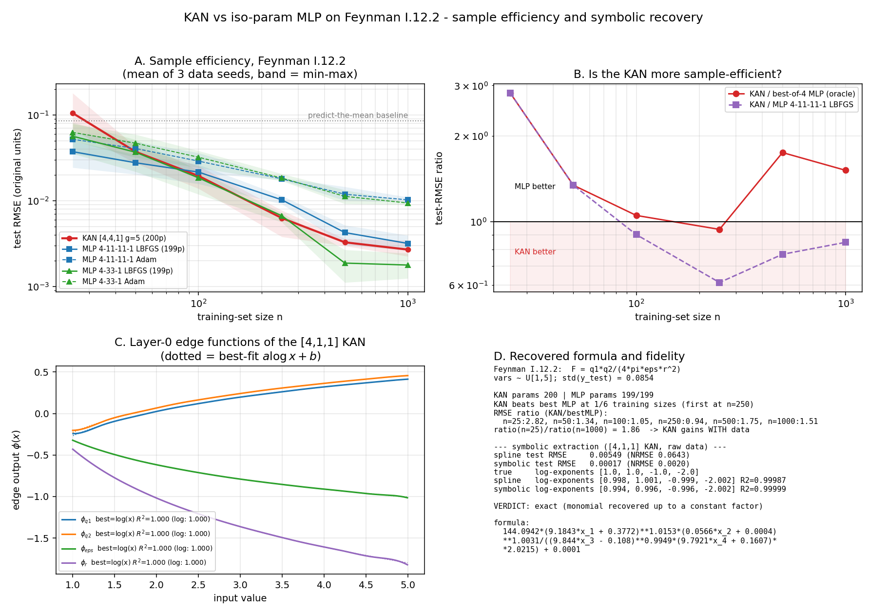

# KAN vs iso-param MLP on Feynman I.12.2: the formula is recovered exactly, the sample-efficiency claim is not

**Date:** 2026-07-25 · **Status:** done (split result — symbolic claim confirmed, sample-efficiency claim refuted)

## Hypothesis
At ~200 parameters on the Feynman I.12.2 Coulomb law `F = q1*q2/(4*pi*eps*r^2)`, a KAN is
**more sample-efficient** than iso-parameter MLPs — lower test RMSE at every training-set size,
with the gap **widening as n shrinks** — and its edge functions can be snapped back to the true
multiplicative formula.

## Method
- **Equation / data.** Feynman **I.12.2**, `F = q1*q2/(4*pi*eps*r^2)`, generated synthetically and
  seeded, with the AI-Feynman benchmark ranges `q1, q2, eps, r ~ U[1,5]`. Fixed 2000-point test set
  (seed 999); `std(y_test) = 0.0854`, so RMSE ≈ 0.085 is the predict-the-mean floor.
  (The backlog suggested a 2–3 variable equation; I.12.2 is 4-variable but is one of the three
  equations it names explicitly, and its pure-monomial structure makes formula recovery objectively
  scorable — see "exponent recovery" below.)
- **KAN.** Real **pykan 0.2.8** (`pip install --break-system-packages pykan`, plus its unlisted
  import-time deps `tqdm`/`pandas`/`scikit-learn`). No hand-rolled substitute was needed.
  Sweep arm: `KAN [4,4,1]`, grid 5, k 3 → **200 trainable spline parameters**; LBFGS, 60 steps,
  grid updates stopped at step 20, `lamb=0`.
- **Iso-param MLP baselines.** tanh MLPs matched to 199 params: **4-11-11-1** (deep) and **4-33-1**
  (wide), each trained with **both** full-batch LBFGS (60 steps) and Adam (2000 steps).
  The headline "MLP" is the **oracle best-of-4 per n** — the baseline is deliberately given a
  model-selection advantage the KAN does not get, so the comparison is *conservative with respect
  to the KAN hypothesis*.
- **Sweep.** n ∈ {25, 50, 100, 250, 500, 1000} × 3 data seeds. X and y are z-scored with
  **training statistics only**; RMSE is reported back in original units.
- **Symbolic arm.** A separate `KAN [4,1,1]` (the shape the true formula needs: a sum of logs into
  one exp) trained on **raw, un-standardized** data at n=1000, grid 5 → refined to grid 10, best of
  4 init seeds **selected on training loss only**. Then pykan's `auto_symbolic` over
  `{x, x^2, x^3, 1/x, 1/x^2, sqrt, exp, log, tanh, sin, abs}`, an affine refit, and
  `symbolic_formula()`.
- **Fidelity metric (objective, not eyeballed).** Regress `log F_pred` on
  `(log q1, log q2, log eps, log r)` over the test set. A true monomial gives exponents
  `(1, 1, -1, -2)` with log–log R² = 1. Verdict thresholds are declared in `experiment.yaml`.
- ~8.3 min CPU, single-threaded (sweep 353 s, symbolic arm 141 s).

## How to run
```bash
pip install -r requirements.txt
python run.py
```

## Result

### 1. Sample efficiency — **refuted, and refuted in the worst possible place**

Mean test RMSE (original units, 3 data seeds); the "best MLP" column is the per-n oracle winner:

| n | KAN (200p) | MLP 4-11-11-1 LBFGS | MLP 4-33-1 LBFGS | best MLP | **KAN / best MLP** |
|---|---|---|---|---|---|
| 25 | 0.1052 | 0.0373 | 0.0565 | 0.0373 | **2.82** |
| 50 | 0.0372 | 0.0277 | 0.0367 | 0.0277 | **1.34** |
| 100 | 0.0194 | 0.0215 | 0.0184 | 0.0184 | **1.05** |
| 250 | 0.0063 | 0.0102 | 0.0067 | 0.0067 | **0.94** |
| 500 | 0.0033 | 0.0042 | 0.0019 | 0.0019 | **1.75** |
| 1000 | 0.0027 | 0.0032 | 0.0018 | 0.0018 | **1.51** |

- The KAN beats the oracle MLP at **1 of 6** training sizes (n=250, and only by 6%).
- At n=25 the KAN is **2.8× worse** and is essentially at the predict-the-mean floor (0.105 vs
  std(y)=0.085) — it has not learned anything, while a 199-param MLP is already at 0.037.
- `ratio(n=25) / ratio(n=1000) = 1.86`: the KAN's *relative* position **improves with more data**.
  That is the exact opposite of a sample-efficiency advantage.
- Against a single *fixed* baseline (MLP 4-11-11-1 + LBFGS, no oracle selection) the KAN does win
  from n=100 up (ratios 0.90 / 0.61 / 0.77 / 0.85) — so the published-style "KAN < MLP" plot is
  reproducible **if you pick one MLP shape and never sweep it**. Sweeping width flips it: the wide
  4-33-1 MLP is the best model overall at n ≥ 500.

### 2. Symbolic recovery — **exact**

The `[4,1,1]` KAN's four layer-0 edges are `log(x)` to R² = **0.9997–1.0000** (panel C: the dotted
best-fit `a log x + b` is visually indistinguishable from the learned curve), and the single
hidden→output edge is exponential to R² = **1.0000** once an inner scale is allowed
(best member `exp(2.33·x)`; note that fitting `a·exp(x)+b` without an inner scale scores only 0.55
and would have produced a false negative).

`auto_symbolic` returns:

```
144.0942*(9.1843*q1 + 0.3772)**1.0153 * (0.0566*q2 + 0.0004)**1.0031
        / ( (9.8440*eps - 0.1080)**0.9949 * (9.7921*r + 0.1607)**2.0215 ) + 0.0001
```

i.e. `q1^1.02 · q2^1.00 / (eps^0.99 · r^2.02)` up to a constant — Coulomb's law.
The objective check agrees: recovered log-exponents **[0.994, 0.996, −0.996, −2.002]** vs true
**[1, 1, −1, −2]** (max error **0.006**, log–log R² = **0.99999**).
**Verdict: exact (monomial recovered up to a constant factor).**

Symbolic snapping is also a *massive* regularizer, which was not something we set out to test:
the spline KAN scores test RMSE 0.00549, the symbolic version of the same model scores
**0.000174 — 32× better**, and 10× better than the best MLP anywhere in the sweep (0.00177).



## Takeaway
On this equation the two halves of the KAN pitch come apart cleanly. **Interpretability is real and
better than advertised**: pykan found `log, log, log, log → exp` unaided, printed Coulomb's law with
exponents correct to 0.006, and snapping to symbols cut test error 32× because it removes every
degree of freedom the true law does not have. **Sample efficiency at this scale is not real**: the
KAN is worst exactly where the claim is loudest (2.8× worse than a 199-param MLP at n=25, sitting at
the predict-the-mean floor), and its relative standing *improves* with data rather than degrading.
The mechanism is visible in the method: a spline edge is a *local* basis, so with 25 points spread
over `[1,5]^4` most knots see almost no data, whereas an MLP's global tanh features are constrained
everywhere by every point. B-splines need samples per knot; that is a sample-efficiency *tax* at
small n, and it is repaid only once the grid is populated.

Two practical warnings for anyone reproducing a KAN-beats-MLP plot: (1) sweep the MLP's shape — one
fixed MLP loses from n=100 on, the best-of-two-shapes MLP wins at 5 of 6 sizes; (2) run the KAN at
several inits. In pre-run probes with identical settings (not recorded in `results.json`, which
keeps only the selected model) the four `[4,1,1]` inits at n=1000 spanned test RMSE 0.0014–0.0126,
a 9× spread, and at n=400 a single init landed at train MSE 0.70 — no better than predicting the
mean. `run.py` therefore selects over 4 inits by **training** loss.

Next: (a) re-run the sweep on a *non*-multiplicative Feynman equation (I.6.20b gaussian, I.27.6
`1/(1/d1 + n/d2)`) to test whether the crossover point is a property of KANs or of this monomial's
perfect match to the log/exp decomposition; (b) add PySR as a third arm — if a symbolic regressor
recovers I.12.2 from 25 points, the honest ranking at small n is PySR > MLP > KAN.

## Reproducibility note
MLP numbers are bit-identical across runs. The pykan arm is not: two runs of this script (before and
after a cosmetic fix to how the width list is handed to `KAN()`, which pykan rewrites in place)
differed by <6% in KAN test RMSE — e.g. the KAN won 2/6 vs 1/6 sizes against the oracle MLP — with
every conclusion, and the "exact" symbolic verdict, unchanged. `results.json` records the final run.

## Novelty check
- **Verdict: partial-prior-art.**
- Checked 2026-07-26. `scripts/novelty_check.py` returned `unchecked` (arXiv/OpenAlex 403 from this
  environment, as documented); prior art was verified by web search + page fetch instead. Queries:
  "KAN sample efficiency vs MLP Feynman symbolic regression comparison"; "KAN vs MLP small training
  set size sweep test RMSE sample efficiency ablation critique"; "pykan auto_symbolic Feynman
  equation exact formula recovery"; "'KAN or MLP: A Fairer Comparison' findings".
- Closest prior work:
  - [KAN: Kolmogorov–Arnold Networks (arXiv:2404.19756)](https://arxiv.org/abs/2404.19756) —
    the Feynman-benchmark section and the `auto_symbolic` workflow; symbolic recovery of I.12.2-type
    monomials is **their** result, so §2 here is a **replication** (a useful one: it confirms pykan
    0.2.8 still does this on 1 CPU thread in ~2 minutes).
  - [pykan](https://github.com/KindXiaoming/pykan) — the implementation used, unmodified.
  - [KAN or MLP: A Fairer Comparison (arXiv:2407.16674)](https://arxiv.org/abs/2407.16674) — the
    closest critique. Fetched and read: it controls params/FLOPs across 5 domains and concludes KAN
    wins *only* on symbolic formula representation. Crucially it (a) does **not** sweep training-set
    size / sample efficiency at all, and (b) scores **fitting accuracy only**, never symbolic
    *recovery*.
- How this differs: to our search, no prior work puts a **training-set-size sweep** underneath the
  symbolic-formula-representation task where KAN is supposed to be strongest. That is the gap this
  fills, and the answer is that KAN's one uncontested win is *not* a small-data win — it is a
  large-data win that a width-swept iso-param MLP takes back at n ≥ 500. Also new here: an
  **objective formula-fidelity metric** (log–log exponent recovery, max error 0.006) instead of
  eyeballing the printed expression, and the observation that symbolic snapping improves test RMSE
  by 32× over the spline model it came from.
