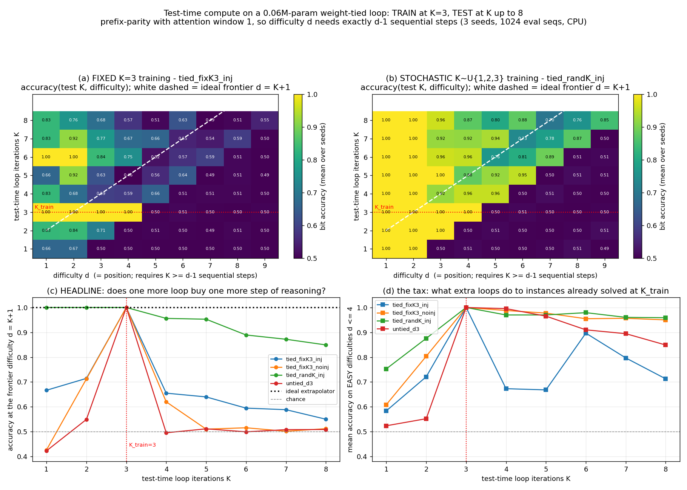

# Trading test-time compute for accuracy in a 0.06M-param weight-tied loop: does running MORE loop iterations than you trained on solve harder instances?

**Date:** 2026-07-25 · **Status:** done

This is the experiment that [`2026-07-25_shadow-loop-vs-depth-isoflop`](../2026-07-25_shadow-loop-vs-depth-isoflop)
demanded. That run found the weight-tied loop *loses* to plain depth at iso-FLOPs on natural language
(+0.079 bpc at k=4) and concluded: **Shadow's loop must earn its place on the test-time-compute /
extrapolation axis, not on raw LM loss.** This is the direct test of that axis, on a task built so the
axis actually exists.

## Hypothesis

A weight-tied looped block trained at K=3 loop iterations, on a task whose difficulty *is* the number
of required sequential steps, learns a **reusable one-step rule** — so running K > 3 at test time
monotonically raises accuracy on harder instances instead of degrading it, while an untied depth-3
baseline with 2.6x the parameters cannot extend at all.

## Method

**The task is engineered so that test-time compute is the only currency that buys accuracy.**
Prefix-parity (cumulative XOR): input `BOS x_1 .. x_L` with `x_i ∈ {0,1}`, target `y_i = XOR(x_1..x_i)`.
The attention window is **1** — every position attends only to itself and its immediate predecessor —
so after K applications of the block, position `i` can only have seen bits `[i-K, i]`. Therefore

> difficulty `d` (= position index) is solvable **iff `K ≥ d-1`**.

There is no shortcut, no shallow heuristic, and no parameter count that substitutes for a loop
iteration. An ideal extrapolator sits at 100% on the frontier `d = K+1` for every K; a model that
cannot reuse its own rule sits at chance (0.5) the moment `d > K_train + 1`.

- **Architecture:** pre-LN transformer block, `d_model 64`, 2 heads, `d_ff 256`, banded causal
  attention (window 1), NoPE (the BOS token plus the band is all the positional structure needed),
  final LayerNorm + 2-way linear readout. **58,370 params** tied (50,178 without the injection
  adapter); the untied control is **149,634 params (2.6x)**.
- **Train:** K=3, lengths L ~ U{1..4} (exactly what 3 loops covers), AdamW lr 2e-3, wd 0.01, batch 256,
  1500 steps, grad-clip 1.0, 100-step warmup. **Every arm converges to train loss ≤ 5e-5** and every
  arm is *perfect in-distribution*: at K=3 all four arms score 1.00 on d=1..4 and chance on d≥5.
  In-distribution fit is therefore not a confound anywhere in this experiment.
- **Test:** K ∈ {1..8} on 1024 held-out length-9 sequences (fixed eval seed). Because attention is
  causal, per-position accuracy on one length-9 batch gives every difficulty d=1..9 at once.
- **3 seeds per arm**, 4 arms, 12 runs.

**Arms**

| arm | params | what it is |
|---|---|---|
| `tied_fixK3_inj` | 58,370 | the backlog's literal spec: tied block, K=3 fixed, with recurrent-depth-style per-iteration input injection (adapter on `[h ; e]`) |
| `tied_fixK3_noinj` | 50,178 | vanilla loop, no input injection — the variant `shadow-loop-vs-depth-isoflop` flagged as its caveat |
| `tied_randK_inj` | 58,370 | **stochastic depth schedule**: sample `k ~ U{1,2,3}` per batch and set `L = k+1`, so every supervised position is computable at the sampled depth. Still never sees K>3 or L>4. |
| `untied_d3` | 149,634 | control: 3 independent blocks, evaluated once. Also probed with two ad-hoc extensions (repeat-last-block, cycle-blocks) that it has no right to. |

## Result



### The headline: frontier accuracy — accuracy at difficulty `d = K+1`, the deepest instance K loops could possibly solve

| arm | K=1 | K=2 | **K=3 (trained)** | K=4 | K=5 | K=6 | K=7 | K=8 |
|---|---|---|---|---|---|---|---|---|
| `tied_fixK3_inj` | 0.67 | 0.71 | **1.00** | 0.66 | 0.64 | 0.59 | 0.59 | 0.55 |
| `tied_fixK3_noinj` | 0.43 | 0.71 | **1.00** | 0.62 | 0.51 | 0.52 | 0.50 | 0.51 |
| **`tied_randK_inj`** | 1.00 | 1.00 | **1.00** | **0.96** | **0.95** | **0.89** | **0.87** | **0.85** |
| `untied_d3` | 0.42 | 0.55 | **1.00** | 0.50 | 0.51 | 0.50 | 0.51 | 0.51 |

(chance = 0.50, 3-seed mean, 1024 eval sequences)

**1. The backlog's literal setup fails, and fails in the predicted way.** `tied_fixK3_inj` is perfect at
K=3 and then *degrades*: frontier accuracy falls 1.00 → 0.55 by K=8, and the damage is not confined to
hard instances — mean accuracy on the **easy, trained-depth** difficulties (d ≤ 4) drops **1.000 → 0.713**
when you run 8 loops instead of 3. Zero of the 5 hard difficulties (d=5..9) are monotone in K. Running
extra loops on this model is strictly worse than stopping at the trained depth. **This is the common
failure the backlog named, reproduced cleanly at 0.06M params.**

**2. Stochastic depth training fixes it, and the fix is large.** `tied_randK_inj` — same architecture,
same parameter count, same 1500 steps, and it *also* never sees more than 3 loops or more than 4 tokens
in training — tracks the ideal frontier all the way out to **K=8, i.e. 2.67x the trained depth**, at
0.85 accuracy on a difficulty (d=9) where every other arm is at chance. Per-difficulty, its accuracy at
the required K vs at K_train:

| difficulty | d=5 | d=6 | d=7 | d=8 | d=9 |
|---|---|---|---|---|---|
| acc at K=3 (trained depth) | 0.503 | 0.509 | 0.503 | 0.497 | 0.505 |
| acc at required K (=d-1) | **0.956** | **0.953** | **0.889** | **0.872** | **0.849** |

The single most legible number is **full-sequence exact match on all 9 positions**, which requires
8 correct sequential steps: `tied_randK_inj` goes **0.038 at K=3 → 0.428 at K=8, an 11x gain purely
from test-time compute**. The other three arms go 0.038 → 0.056 / 0.080 / 0.026 over the same sweep.
All 3 seeds of `tied_randK_inj` extrapolate (frontier acc at K=8 = 0.77 / 0.83 / 0.95) and all 3 seeds
of `tied_fixK3_inj` fail (0.47 / 0.51 / 0.67) — the distributions do not overlap.

**3. The untied control cannot extend, exactly as predicted, and no hack rescues it.** `untied_d3` has
2.6x the parameters and matches every tied arm in-distribution (1.00 on d≤4 at K=3), but its **maximum
accuracy anywhere in the entire `d>4, K>3` region of the matrix is 0.511** — it never leaves chance,
not once, in 40 cells. Both ad-hoc extensions were tried and both are null: repeating the last block
gets d=5 to 0.495 at K=4; cycling blocks 0,1,2,0,1,2 leaves rows K=4 and K=5 **bit-identical** to K=3
and then degrades. Depth you did not tie is depth you cannot spend later.

**4. The failure of fixed-K is computational drift, not numerical blow-up.** Mean residual-stream norm
across 8 iterations: `tied_fixK3_inj` 9.4 → 8.7 (bounded, the injection adapter re-normalizes each
step) yet its accuracy collapses; `tied_fixK3_noinj` 13.7 → **90.7** (6.6x blow-up) yet it is the second
*most* stable arm on easy instances (1.000 → 0.950). Norm growth and accuracy degradation are
anti-correlated here, so "the residual stream explodes" is not the mechanism.

**5. Input injection is what makes a loop able to move at all — and therefore able to break.** Without
injection the loop converges to a **fixed point**: rows K=4..8 of `tied_fixK3_noinj` are nearly identical
(`1.00 1.00 0.91 0.91 0.65 …`), so extra loops are safe *because they compute nothing new* — its best
accuracy anywhere in the `d>4` region, over all K, is 0.653, and it never solves a single difficulty
beyond d=4. With injection the state keeps moving, which is the precondition
for extrapolation (arm 3) and for collapse (arm 1). Which one you get is decided entirely by the
training depth schedule.

## Takeaway

**On a task where extra sequential steps are the only thing that can help, a weight-tied loop really
does trade test-time compute for accuracy — but only if it was trained with a stochastic depth
schedule. Trained at a single fixed K, it does the opposite: extra loops destroy accuracy on instances
it had already solved.** The delta between those two conditions (frontier accuracy 0.85 vs 0.55 at K=8;
9-position exact match 0.428 vs 0.056) is far larger than the delta between tied and untied, between
0.05M and 0.15M params, or between injecting and not injecting. **The test-time-compute axis is real,
and the depth schedule is the knob that unlocks it.**

For the Shadow track specifically: this is the first axis on which the loop has earned anything.
`shadow-loop-vs-depth-isoflop` showed the loop loses on LM loss, `shadow-recursion-capacity-window`
showed the GoL capacity effect does not transfer to language, and `shadow-halt-entropy-tiny` showed
entropy halting is worthless at tiny scale — but *all three trained at fixed loop counts*. This run says
that a fixed loop count is precisely the configuration in which the loop's one advantage does not
exist. The ledger entry should read: **tie the block, train the depth stochastically, or do not loop at
all.** It also retro-explains `shadow-halt-entropy-tiny`: an adaptive-depth policy needs a model whose
quality *varies usefully* with depth, and a fixed-K-trained loop does not have one.

Caveats, worst first. **(a) The task is designed to reward looping.** Attention window 1 makes required
sequential steps exactly equal to difficulty; this is the friendliest possible arena for the hypothesis
and says nothing about whether natural-language difficulty has this structure (`shadow-loop-vs-depth-isoflop`
suggests it does not). **(b) It is one task, one architecture, one width, 3 seeds, 1500 steps.**
**(c) The extrapolation is good, not perfect** — 0.85 at K=8, not 1.00, and it decays gently with K
(0.96/0.95/0.89/0.87/0.85), so it would presumably die somewhere past K≈15. We did not find that point.
**(d) Two metrics in `results.json` are brittle and should not be read as the result.** `deepest_solved`
demands ≥95% on *every* prefix, so a single 0.92 zeroes it, and it badly under-reports `tied_randK_inj`;
and the strict `nondecreasing` flag in `monotonicity_by_arm` fires `false` for the stochastic arm too,
but only because of sub-1% jitter between chance-level cells (d=5 runs 0.503 → 0.509 → 0.503 → **0.956**
over K=1..4). `frontier_acc_by_arm` is the metric to read. **(e) `tied_randK_inj` differs from `tied_fixK3_inj` in two ways at once** — random k *and* the
coupled L=k+1 — so "stochastic depth" here means the schedule as a package, not the k-randomization
alone. **(f)** Shrunk to a ~12-minute CPU box (12 runs, 639 s of compute at 1 thread): hence 0.06M
params, 1500 steps, and lengths ≤9 instead of the backlog's ~1.5 hr budget.

Next: sweep the coupling in (e) apart (random k with fixed L=4 vs coupled L=k+1); push K to 20 to find
where extrapolation dies; and re-run `shadow-halt-entropy-tiny` on a stochastically-trained loop, where
depth actually carries information.

## How to run

```bash
pip install -r requirements.txt
python run.py              # ~10 min, CPU, 1 thread
python run.py --chart-only # redraw chart.png from results.json
```

## Novelty check

- **Verdict: partial-prior-art (replication of a known effect at ~1/10,000 the usual scale, with a new control).**
- Checked 2026-07-26. `scripts/novelty_check.py` returned `unchecked` (arXiv/OpenAlex 403 from this
  environment, as documented in the brief); the verdict below is from WebSearch + WebFetch.
- Queries: *"looped transformer test-time compute extrapolate more loop iterations than trained parity
  length generalization"*; *"recurrent depth latent reasoning test-time compute accuracy degrades beyond
  trained recurrence count"*. Fetched: arXiv:2409.15647, arXiv:2606.29983.
- **Closest prior work.** [arXiv:2606.29983](https://arxiv.org/html/2606.29983v1) (*Stabilizing
  Extrapolation in Looped Transformers via Learned Stochastic Stopping*) is direct prior art and was
  read: on binary addition / Dyck-1 / Unique-Set / Copy with a looped 3-layer block, it reports that
  fixed-loop-depth training gives runs with matched in-distribution accuracy but wildly different OOD
  behaviour (binary addition at fixed K=20: 34.2% OOD, std 7.4 across runs), and that **sampling the
  loop count during training** substantially reduces that variance. Our arm-1-vs-arm-3 contrast is the
  same mechanism. [arXiv:2409.15647](https://arxiv.org/abs/2409.15647) (*Looped Transformers for Length
  Generalization*, UW-Madison) establishes that looped transformers with adaptive step counts length-generalize
  on arithmetic/algorithmic tasks including parity. [arXiv:2502.05171](https://arxiv.org/pdf/2502.05171v1)
  (recurrent depth) is the source of the per-iteration input injection used here and of the
  test-time-compute framing; it also trains with a randomized recurrence count.
- **How this differs.** (i) Scale: 58k parameters, 4 arms x 3 seeds, 639 s on **one CPU thread** — the
  cheapest demonstration of the effect we are aware of, and cheap enough to be a unit test. (ii) The
  task is constructed so that required sequential steps *equal* the difficulty axis, which turns the
  usual "OOD accuracy" scalar into a clean 2-D `accuracy(test K, difficulty)` matrix with an analytically
  known ideal frontier (`d = K+1`) — so extrapolation can be scored against ground truth rather than
  against another model. (iii) The untied-depth control extended by two explicit hacks (repeat-last,
  cycle-blocks) and shown to be exactly null, which the prior art asserts but does not measure.
  (iv) The norm-vs-accuracy dissociation (§4) — the arm that blows up 6.6x in residual norm is the
  *stable* one — is, as far as we found, not reported. (v) It is not novel that stochastic depth
  schedules help; that is the replicated part and is not claimed otherwise.
