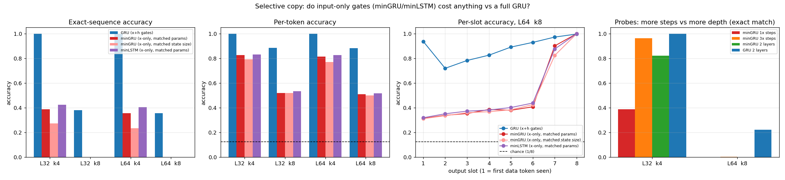

# minGRU vs GRU on selective copy: removing the hidden-state dependence of the gates costs a lot — and the cost is *ordering*, not memory

**Date:** 2026-07-25 · **Status:** done (hypothesis **confirmed**, with two important qualifiers)

## Hypothesis
"Were RNNs All We Needed?" ([arXiv:2410.01201](https://arxiv.org/abs/2410.01201)) removes the hidden-state
dependence from the GRU/LSTM gates — that is exactly what turns the recurrence into a parallel scan — and
claims the resulting minGRU/minLSTM match full RNNs broadly. The Mamba paper
([arXiv:2312.00752](https://arxiv.org/abs/2312.00752)) motivates *selective* (content-dependent) state
updates with precisely the **selective-copy** task. For minGRU these two claims **conflict**: its gate sees
the current input (so it *can* decide "this token is data, integrate it") but never the state (so it *cannot*
decide "this is the 3rd data token, so it belongs in slot 3"). We predicted minGRU would lose to a standard
GRU at matched params and matched steps, and that the gap would widen with **k** (number of tokens to
memorise) rather than with **L** (sequence length).

## Method
- **Task.** Mamba-style selective copy: a length-`L` sequence of a single blank/noise token (id 0) with `k`
  data tokens (ids 1..8) dropped at uniformly random positions; the target is the `k` data values **in order
  of appearance**. Difficulty sweep `L ∈ {32, 64} × k ∈ {4, 8}`. Fresh data every step (no repeats possible);
  eval = 1024 fixed held-out sequences per cell from a disjoint seed (binomial SE ≈ 0.016).
- **Architecture.** Embedding(48) → `n_layers` × (recurrent cell + LayerNorm) → GELU bottleneck(64) → `k`
  linear slot heads on the **final hidden state**. Everything except the cell is byte-identical across arms;
  there is no autoregressive decode phase, so the comparison is purely about the recurrence, not a decoder.
- **Cells** (all hand-rolled in PyTorch except the GRU baseline, which is `nn.GRU`):
  - `gru` — standard GRU: `r`, `z` and the candidate all see `x_t` **and** `h_{t-1}`.
  - `mingru` — minGRU exactly as in the paper: `h_t = (1−z_t)h_{t−1} + z_t h̃_t`, `z_t = σ(Linear(x_t))`,
    `h̃_t = Linear(x_t)`. Input-only gates ⇒ linear scan. Run in the *sequential* form (identical maths to the
    parallel scan; CPU, short sequences).
  - `minlstm` — minLSTM: `f, i = σ(Linear(x_t))`, normalised `f' = f/(f+i)`, `i' = i/(f+i)`, `h̃ = Linear(x_t)`.
- **Matched params.** Each arm's hidden width is fitted so the **total** parameter count is ≈60k
  (59.2k–60.3k for every arm). Because minGRU has no hidden→hidden matrices, matched params gives it a
  **3.3× larger state** than the GRU (d=350 vs d=106) — the comparison is therefore *conservative* against
  our hypothesis.
- **Held fixed.** 600 steps, batch 32, AdamW lr 3e-3 (OneCycle, 10% warmup), wd 0.01, grad-clip 1.0.
  Iso-step, not train-to-convergence.
- **Controls / probes.** `mingru_ms` = minGRU at the GRU's *state size* (d=106, 20k params) — capacity
  control. `mingru_long` = minGRU at **3× the step budget**, to separate "learns slowly" from "cannot".
  `gru_2l` / `mingru_2l` at 2 layers on the easiest and hardest cells — does depth recover state-dependent
  gating?
- **Shrinks vs the backlog spec** (12-minute CPU box, single thread): 600 steps, batch 32, one layer for the
  main sweep, vocab 8 (the paper uses 16), 2 seeds for the headline `gru` vs `mingru` pair and 1 seed for
  everything else. 24 training runs, **606 s** wall clock total.

## How to run
```bash
pip install -r requirements.txt
python run.py
```

## Result
**Confirmed, and the gap is enormous.** Exact-sequence accuracy (`metrics.headline_exact_match`), seed 0:

| cell | GRU | minGRU (matched params) | gap | chance |
|---|---|---|---|---|
| L=32, k=4 | **1.000** | 0.389 | **+0.611** | 2.4e-4 |
| L=64, k=4 | **1.000** | 0.356 | **+0.644** | 2.4e-4 |
| L=32, k=8 | **0.382** | 0.001 | **+0.381** | 6.0e-8 |
| L=64, k=8 | **0.357** | 0.000 | **+0.357** | 6.0e-8 |

Seed-mean over 2 seeds is the same picture (k=4: 1.000 vs 0.397 / 0.361; k=8: 0.334 vs 0.001, 0.297 vs 0.000).
Per-token accuracy: GRU 1.000 / 0.883 (k=4 / k=8) vs minGRU 0.827–0.816 / 0.520–0.510, against a 0.125 chance
floor — so minGRU learns *a lot*, it just never finishes the task.



Five things pin down the mechanism:

1. **The gap tracks `k`, not `L`.** Doubling the sequence length 32→64 changes nothing for either model
   (minGRU 0.389→0.356, GRU 1.000→1.000). Doubling `k` 4→8 destroys minGRU (0.389→0.001). The bottleneck is
   not remembering *far*, it is keeping `k` items **distinguishable and ordered**.
2. **minGRU does learn the input-dependent part.** Its mean input gate is `z̄ = 0.13–0.25` on noise tokens and
   `0.40–0.44` on data tokens (`by_cell.*.mingru_mp.gate_stats`) — it correctly learned "hold on blanks, write
   on data". That is exactly the half of selectivity a gate can implement from the current token alone, and
   it is not what it is failing at.
3. **Per-slot accuracy is the smoking gun** (panel 3). At L=64, k=8 minGRU scores
   `[0.31, 0.34, 0.35, 0.39, 0.38, 0.41, 0.90, 1.00]` across slots 1→8: it perfectly recovers the **last two**
   data tokens and is barely above chance on everything older. The GRU's profile is uniformly high and
   U-shaped (`[0.94, 0.72, 0.78, 0.83, 0.89, 0.93, 0.97, 1.00]`). A gate that cannot see the state can only
   implement a *fixed-rate leaky integrator over the tokens it decides to write*; each new write shrinks all
   older content by (1−z), so order is encoded only as **magnitude**, and after 2–3 writes the older items are
   below the readout's resolution. The GRU can instead condition the write on what is already stored and use
   the state as an addressable buffer.
4. **It is not a capacity problem.** minGRU at matched params already has 3.3× the GRU's state (350 vs 106)
   and still loses; shrinking it to the GRU's *state size* (20k params) costs only 0.11 exact match at k=4 and
   nothing at k=8. Within-minGRU capacity effects are an order of magnitude smaller than the GRU gap.
5. **It is not a minGRU quirk — it is the input-only-gate family.** minLSTM behaves identically
   (0.424 / 0.406 at k=4, 0.000 at k=8).

**Two qualifiers that keep this honest:**

- **At k=4 the gap is mostly a learning-speed gap.** Given 3× the steps, minGRU goes 0.389 → **0.964** at
  L=32, k=4. So the input-only gate *can* represent a 4-item ordered buffer; it just needs several times the
  optimisation budget to find it. At L=64, k=8, 3× steps moves per-token accuracy 0.510 → 0.673 but exact
  match only 0.000 → 0.003 — still far from the GRU's 0.357 at 1× steps, i.e. at k=8 the deficit is at least
  much larger than 3× and we did not reach the budget where it closes.
- **Depth partially substitutes for state-dependent gating.** A 2-layer minGRU at the same 60k params jumps
  0.389 → **0.821** at L=32, k=4 (2-layer GRU stays at 1.000). This is the expected mechanism: layer 2's gates
  see layer 1's *output*, which is a function of layer 1's accumulated state, so stacking recovers a
  restricted form of state-dependent gating. It is very likely why the paper's 3-layer minGRU reaches 99.5% on
  its selective-copy benchmark. At L=64, k=8 depth is not enough at this budget (minGRU 2L: exact 0.000,
  per-token 0.510 → 0.575; the 2-layer GRU actually *drops* to 0.222 because at fixed params depth costs width
  and at fixed steps it trains slower).

## Takeaway
On the task the Mamba paper invented to motivate selectivity, the minRNN simplification is **not free**: at
matched parameters and matched steps a 1-layer minGRU is 0.36–0.64 exact-match behind a 1-layer GRU on every
difficulty cell, and at k=8 it is at zero while the GRU is at ~0.36. The two literatures are both right about
different halves of "selectivity". minGRU keeps the half that only needs the current token — *should I write
this?* — and its learned gates show it uses that half correctly. What it loses is the half that needs the
state — *where should I write it, given what I already hold?* — and selective copy is scored precisely on
that. The observable signature is a hard recency profile: input-only gates give you the last ~2 items for
free and everything else at near chance. The paper's headline is nonetheless recoverable, by depth (2 layers
takes k=4 from 0.39 to 0.82) and by optimisation budget (3× steps takes it to 0.96) — both of which its
3-layer / 400k-step setup has in abundance and our 1-layer / 600-step box does not. So the honest statement is
**not** "minGRU can't do selective copy"; it is "removing the hidden-state gate costs a large constant factor
of depth and training compute on exactly the task that needs content-dependent state updates, and the price
is paid in *ordering* older items, not in remembering distant ones." Next: (a) push the k=8 cell to 10–30×
steps to find where (or whether) minGRU closes; (b) sweep layers 1→4 at fixed params to measure the
depth-for-gating exchange rate; (c) add a per-channel/matrix gate (toward GLA/Mamba) to see how much
state-dependence is the minimum needed.

## Novelty check
- **Verdict: partial-prior-art** (checked 2026-07-26 via WebSearch + direct read of the minRNN paper;
  arXiv/OpenAlex APIs 403 from this environment, which is known here).
- Closest prior work: **[arXiv:2410.01201, "Were RNNs All We Needed?"](https://arxiv.org/abs/2410.01201)** —
  reports minGRU 99.5 ± 0.2 and minLSTM 96.0 ± 2.8 on Selective Copying (vocab 16, L=4096, 16 data tokens,
  **3 layers**, expansion factor 6, 400k steps), alongside Mamba S6 99.8, H3 99.7, S4 18.3, Hyena 28.4.
  Also [arXiv:2312.00752 (Mamba)](https://arxiv.org/abs/2312.00752), which introduced the selective-copy
  motivation, and [arXiv:2506.11891 (Understanding Input Selectivity in Mamba)](https://arxiv.org/abs/2506.11891).
- How this differs: the minRNN paper **does not run a standard GRU/LSTM baseline on selective copy at all**
  (it says traditional RNNs cannot be trained efficiently on that benchmark) — so the head-to-head that its
  central claim implies has, to our search, never been run on this task. We run it at matched *total*
  parameters and matched steps in a regime where the sequential GRU is affordable, and add three ablations the
  paper does not have: state-size-matched minGRU (capacity control), a 3× step-budget probe (speed vs
  capability), and a 1-vs-2-layer probe that identifies **depth as the substitute for the missing
  hidden-state gate** — a mechanism that plausibly explains the paper's own 3-layer result.
- Caveats: single-layer main sweep, 600 steps, 60k params, vocab 8, 2 seeds on the headline pair and 1 seed
  elsewhere; these are learning-speed-at-fixed-budget rankings, not converged-accuracy rankings, and the
  probes above show the ranking is budget- and depth-sensitive at k=4.
