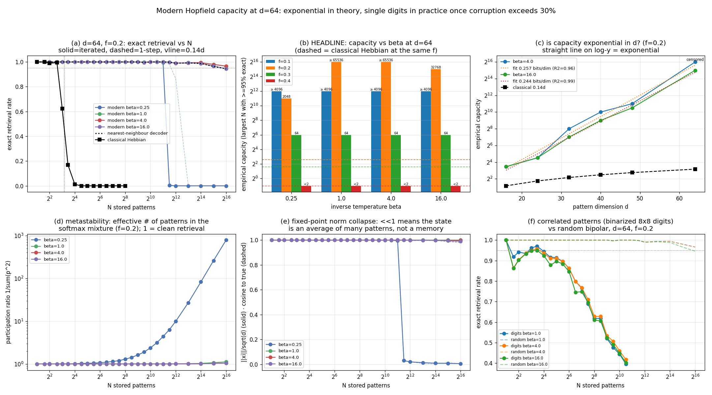

# Modern Hopfield capacity at d=64: exponential in theory, single digits in practice once corruption exceeds 30%

**Date:** 2026-07-25 · **Status:** done (hypothesis split — exponential capacity confirmed, the "beta moves the boundary" half refuted)

## Hypothesis
The modern (continuous, softmax) Hopfield update of Ramsauer et al. ([arXiv:2008.02217](https://arxiv.org/abs/2008.02217)),
`xi <- X^T softmax(beta * X xi)`, has capacity exponential in `d`, so at d=64 it should complete corrupted
queries from banks of thousands of random bipolar patterns — far past the classical Hebbian `0.14d ~ 9` —
with a **sharp retrieval boundary that moves outward as beta grows**, and at low beta retrieval should
collapse to **metastable averages** of many stored patterns.

## Method
- Architecture: hand-rolled, **no training**. Stored patterns `X` (N x d bipolar). Modern update
  `xi <- X^T softmax(beta X xi)`, iterated up to 10 steps or until `max|dxi| < 1e-6` (1-step results recorded
  separately). Reference: classical Hebbian `W = X^T X / d` with zeroed diagonal, asynchronous sign updates,
  5 random-order sweeps.
- Queries: pick a stored pattern, flip exactly `round(f*d)` components, `f in {0.1, 0.2, 0.3, 0.4}`,
  500 queries per cell.
- Metrics: **exact retrieval** = `sign(xi_final)` equals the true pattern in *all* d components; plus cosine
  overlap, Hamming error, softmax participation ratio `1/sum(p^2)`, fixed-point norm `||xi||/sqrt(d)`, and the
  query's nearest-neighbour margin (own overlap minus best competitor).
- **Empirical capacity** = the largest N in the grid such that every swept N' <= N still retrieves >= 95%
  exactly (first-crossing; the more generous "largest N anywhere above 95%" is also stored as
  `capacity_last`).
- Sweeps (all seeded, nested so every beta sees byte-identical queries):
  1. `d=64`, N = 2, 3, 4, 6, 8 ... 4096 (half-octave grid), beta in {0.25, 1, 4, 16}, all four f.
     The headline slice `f=0.2` is swept four octaves deeper: N up to **65536**.
  2. Classical Hebbian at the same N (up to 256) and f.
  3. Dimension sweep `d in {16, 24, 32, 40, 48}` at f=0.2, beta in {4, 16}; the d=64 point comes from
     sweep 1 (same protocol, different pattern bank) because that is the only slice swept deep enough
     to be uncensored.
  4. Correlated real patterns: 1752 unique binarized 8x8 sklearn digits (threshold 8), d=64.
- Compute: **2.8 min**, single-threaded numpy on CPU. No shrink was needed — this experiment is matrix
  products only. The one deliberate cap is N <= 65536 (see "censored" below).

## How to run
```bash
pip install -r requirements.txt
python run.py
```

## Result

**1. Capacity really is exponential in d — with the textbook constant.** Fitting `log2(capacity)` against d
over d = 16, 24, 32, 40, 48, 64 at f=0.2, beta=16 gives **0.244 bits per dimension, R^2 = 0.993**
(beta=4: 0.257 bits/dim, R^2 = 0.963). The random-code prediction for a nearest-neighbour decoder is
`(1-2f)^2 / (2 ln 2) = 0.2597` bits/dim. Measured capacities: 11 (d=16), 23, 256, 1024, 2048 (d=48),
**65536** (d=64). Classical Hebbian on the same banks grows linearly, reaching 6 at d=64.

**2. At d=64, f=0.2 the modern network stores ~10<sup>4</sup>x more than the classical one.**
Empirical capacity: **>=65536 at beta=1 and beta=4** (censored — retrieval is still 96.6% at the largest bank
we swept), 32768 at beta=16, 2048 at beta=0.25; **classical Hebbian = 6** (theory `0.14d = 9`; it is already
at 73% exact retrieval by N=8 and 5% by N=16). One step of the update gets 32768 at every beta >= 1, so
iterating buys about one octave.

**3. The "boundary moves with beta" half of the hypothesis is refuted.** Above beta=1 the retrieval curves are
indistinguishable: at f=0.3 all four temperatures give **exactly the same capacity, 64**; at f=0.2, beta=16 is
marginally *worse* than beta=4. The reason is visible in panel (a): for beta >= 1 the exact-retrieval curve lies
on top of the **nearest-neighbour decoder** curve (at N=65536: retrieval 0.966 vs NN-margin 0.944, the gap being
integer-overlap ties). So at d=64 the softmax adds nothing over "snap to the closest stored pattern" — beta only
matters when it is too *low*. Between beta=0.25 and beta=1 the boundary jumps 32x, and that is the whole beta effect.

**4. Corruption, not beta and not N, is the binding constraint.** At d=64: f=0.1 -> >=4096 (censored),
f=0.2 -> >=65536, f=0.3 -> **64**, f=0.4 -> **below 2** (even a two-pattern memory only completes 91.8% of
40%-corrupted queries). A 10-point increase in corruption from 0.2 to 0.3 costs three orders of magnitude of
capacity. This is the honest "far below exponential in practice" outcome the backlog anticipated — it just
shows up as a *corruption* cliff rather than a *dimension* one.

**5. Metastable collapse at low beta is confirmed, and it is sharp.** At beta=0.25, f=0.2 the retrieval rate
goes 0.996 (N=2048) -> **0.004 (N=2896)** in one half-octave step. Past that boundary the participation ratio
of the softmax weights climbs to **784 effective patterns** at N=65536 and the fixed point's norm collapses to
**0.005 sqrt(d)** with cosine 0.005 to the true pattern: the state is a near-zero average of hundreds of
memories, exactly the metastable regime. The striking part is that **the memory is not lost — the readout is**:
the true pattern is still the softmax argmax for **96.8%** of queries at that same point, identical to the
argmax accuracy at beta=16. Iterating makes it worse (1-step capacity 2896 vs iterated 2048), because each
extra step shrinks the state's norm and therefore the effective temperature.

**6. Correlated real patterns lose almost all of it.** Binarized digits have mean |cos| = 0.487 between stored
patterns versus 0.100 for random bipolar. Capacity at f=0.1 drops to 128–181 depending on beta (random:
censored at >=4096), and at f=0.2 the digits curve never reaches 95% past N=11 and is at 0.42 by N=1448 —
versus >=65536 for random patterns at the same d, f and beta. Beta is again nearly irrelevant (1, 4 and 16
give the same curve to within a half-octave).



## Takeaway
The exponential-capacity claim survives a clean measurement — 0.244 bits of capacity per dimension with
R^2=0.993, within 6% of the random-code constant `(1-2f)^2/(2 ln 2)` — and the gap to classical Hebbian at
d=64 is roughly 10<sup>4</sup>x. But two of the mechanism's marketing points do not survive. First, beta is
not a capacity knob: any beta >= 1 puts the update in the nearest-neighbour-decoder regime and the retrieval
boundary stops moving; beta is a *floor*, not a dial, and its only visible effect is the catastrophic
metastable collapse below it. Second, the practically binding constraint is query corruption, not the size of
the memory: the same d=64 network holds >=65536 patterns against 20% corruption, 64 against 30%, and fewer
than 2 against 40%. The most useful diagnostic we found is that at low beta the argmax stays correct (96.8%)
while the retrieved state has 0.5% of a pattern's norm — a failed modern-Hopfield lookup is a readout failure,
not a storage failure, and re-normalizing or annealing beta at inference should recover it. Next: (a) test
that directly — anneal beta across iterations and see whether the beta=0.25 collapse is fully reversible;
(b) apply the same protocol to Hopfield-layer *attention* (learned projections) to see whether training moves
the corruption cliff that raw storage cannot.

Caveats: one seed per cell (500 queries per cell; binomial sd at rate 0.95 is 0.0097, so capacities are
half-octave-resolved, not exact); the f=0.1 and f=0.2 (beta 1, 4) cells are **censored** at the largest bank
we swept, so those capacities are lower bounds; capacity is defined on a half-octave N grid, so every reported
number is a grid point.

## Novelty check
- Verdict: **partial-prior-art** (a measurement, not a new mechanism), checked 2026-07-26 via WebSearch
  (arXiv/OpenAlex APIs 403 from this environment, as documented in the brief).
- Queries: "modern Hopfield network empirical storage capacity experiment beta softmax retrieval bipolar
  patterns exponential capacity"; "\"modern Hopfield\" metastable states low beta averaging similar patterns
  empirical capacity vs corruption fraction numpy replication".
- Closest prior work: [Ramsauer et al., *Hopfield Networks is All You Need* (arXiv:2008.02217)](https://arxiv.org/abs/2008.02217)
  and [ml-jku/hopfield-layers](https://github.com/ml-jku/hopfield-layers) (the exponential-capacity theorem
  and the metastable-state illustration); [*Provably Optimal Memory Capacity for Modern Hopfield Models*
  (arXiv:2410.23126, NeurIPS 2024)](https://arxiv.org/html/2410.23126v2) (capacity as spherical codes);
  [*The Capacity of Modern Hopfield Networks under the Data Manifold Hypothesis* (arXiv:2503.09518)](https://arxiv.org/html/2503.09518)
  (capacity loss for correlated/real data); [*Uniform Memory Retrieval with Larger Capacity* (arXiv:2404.03827)](https://arxiv.org/html/2404.03827v3).
- How this differs: the capacity results in that literature are theorems with retrieval-error tolerances; what
  is measured here is the *empirical, exact-retrieval* capacity on a joint (beta x corruption x N x d) grid at
  a single tiny dimension, with the classical Hebbian rule measured on the identical pattern banks. Two
  outcomes we did not find stated anywhere: that the boundary stops responding to beta above ~1 because the
  update degenerates to a nearest-neighbour decoder, and that in the metastable regime the softmax argmax
  remains correct (96.8%) while the retrieved state has 0.5% of a pattern's norm — i.e. the collapse is a
  readout failure with the memory still intact. The correlated-data penalty replicates the qualitative claim
  of arXiv:2503.09518 on a much smaller, fully reproducible setup.
