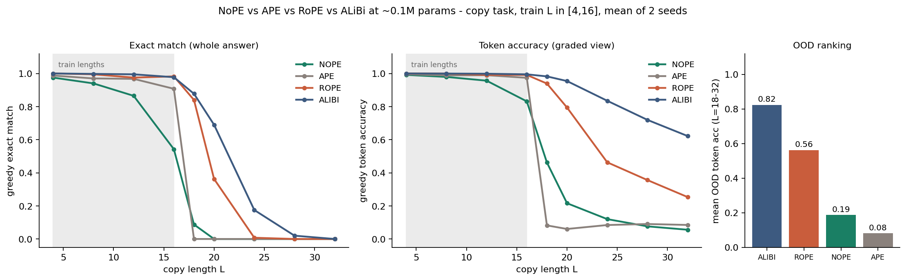

# NoPE vs RoPE vs ALiBi vs APE: does the length-generalization ranking survive at 0.1M params?

**Date:** 2026-07-25 · **Status:** done (hypothesis refuted)

## Hypothesis
At ~0.1M params on an autoregressive copy task, the Kazemnejad et al. (NeurIPS 2023, 107M-param) ranking
**NoPE >= ALiBi > RoPE >= APE** for length generalization still holds — i.e. the ranking is a property of
the positional mechanism, not of scale.

## Method
- Architecture: 2-layer pre-norm decoder-only transformer, d_model=64, 4 heads, FFN 256, ~0.10M params.
  Four variants differing ONLY in positional information: **NoPE** (none), **APE** (learned absolute,
  table covers test lengths but positions >35 are untrained), **RoPE** (rotary on q/k, theta=10000),
  **ALiBi** (standard geometric head slopes).
- Task / dataset: copy — `BOS x1..xL SEP x1..xL EOS`, 16-symbol vocab, loss on the answer span only.
  Train L uniform in [4,16]; evaluate greedy autoregressive decode at L in {4,8,12,16 | 18,20,24,28,32},
  200 fixed sequences per length (identical eval data for every run).
- Held fixed: 4000 steps, batch 64, AdamW lr 2e-3 (100-step warmup), wd 0.01, 2 seeds per variant.
  This is an **iso-compute** comparison, not a train-to-convergence one.
- 8 runs total, ~11 min on CPU.

## How to run
```bash
pip install -r requirements.txt
python run.py
```

## Result
**Refuted — the tiny-scale ranking is ALiBi > RoPE > NoPE > APE**, almost the reverse of the published one
(`metrics.ood_ranking_by_token_acc` in `results.json`).

- Mean OOD token accuracy (L=18–32): **ALiBi 0.823, RoPE 0.561, NoPE 0.186, APE 0.080**.
- Exact match at L=20 (train max 16): ALiBi 0.69, RoPE 0.36, NoPE 0.00, APE 0.00; at L=24 only ALiBi is
  nonzero (0.175). By L=32 every variant is at 0 exact match — nothing truly extrapolates far.
- NoPE is also the slowest learner in-distribution (exact match at L=16: 0.54 vs 0.91–0.99 for the others),
  so at fixed small compute it loses twice: it has not finished learning the task, and what it has learned
  does not transfer to longer sequences.
- APE shows the sharpest cliff: near-perfect in-distribution, ~0 one step past the trained positions —
  exactly the failure mode the original paper describes, and the one part of the ranking that DOES survive.



## Takeaway
The celebrated NoPE length-generalization advantage is not a scale-free property of the mechanism: at 0.1M
params and ~1 minute of CPU training, NoPE cannot even discover position reliably, while ALiBi's hard-coded
recency bias acts as a strong inductive prior that both accelerates learning and degrades gracefully out of
distribution (its OOD failure is a slow slide, not a cliff). The honest caveat is that this is an iso-compute
comparison on one task: NoPE's deficit is partly an optimization-speed effect, and the paper's result was at
107M params trained to convergence on multiple tasks. But that is the practically relevant regime for tiny
models — if you are training a ~0.1M model on a budget, ALiBi is the clear pick. Next: give NoPE 10–20x more
steps to separate "learns slowly" from "cannot extrapolate", and test whether the reversal persists on a
second task (reverse or addition).

## Novelty check
- Verdict: **replication (at a new scale), with a refutation twist** — closest to partial-prior-art.
- Closest prior work: [The Impact of Positional Encoding on Length Generalization in Transformers
  (arXiv:2305.19466, NeurIPS 2023)](https://arxiv.org/abs/2305.19466) and its
  [official repo](https://github.com/McGill-NLP/length-generalization) (107M models, 100k steps);
  ALiBi ([arXiv:2108.12409](https://arxiv.org/abs/2108.12409)).
- How this differs: first (to our search) tiny-CPU iso-compute version of the comparison at ~0.1M params;
  the published ranking inverts at this scale, which the original paper does not test.
  arXiv/OpenAlex APIs 403'd from this environment; verified prior art via web search (2026-07-25).
