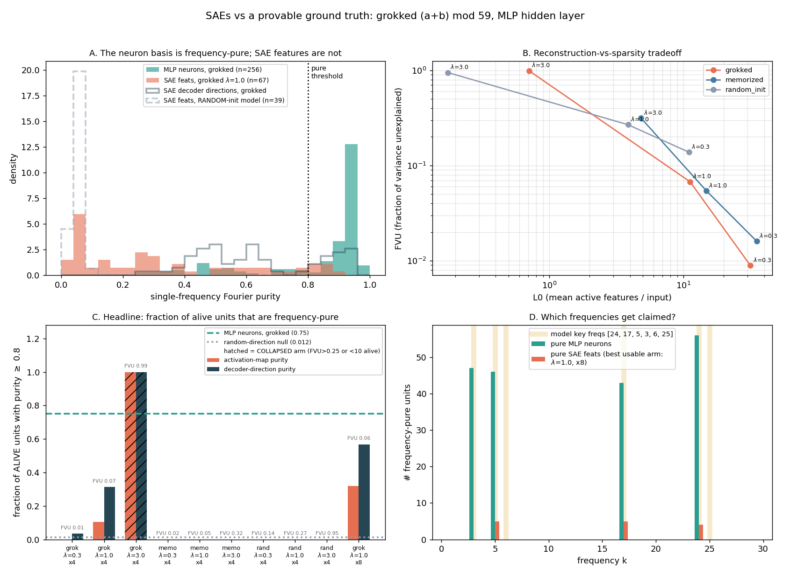

# SAEs on a grokked modular-addition transformer: the neuron basis is already the answer key, and the SAE loses it

**Date:** 2026-07-25 · **Status:** done (hypothesis **refuted** — honest negative)

## Hypothesis
A small overcomplete L1 sparse autoencoder trained on the MLP hidden activations of a **fully grokked**
`(a+b) mod 59` transformer will recover the model's known Fourier structure: most of its alive features
will be **frequency-pure** (≥80% of their 2D Fourier power on a single frequency *k*), and the set of
frequencies those features claim will match the model's key frequencies.

This is the rare interpretability setting with a **provable ground truth**: a grokked mod-*p* transformer
is known to implement Fourier multiplication (Nanda et al. 2301.05217), so "did the SAE find the right
units?" has a checkable answer rather than a vibe.

## Method
- **Model (not trained here).** Loaded from the sibling run `2026-07-25_grokking-modular-addition`:
  `model.pt`, a 1-layer LayerNorm-free transformer over `[a, b, "="]`, d_model 64 / 4 heads / d_mlp 256,
  56,960 params, **train acc 1.000, test acc 1.000** (verified in-run: **1.0000 accuracy on all 3481
  pairs**). Its saved `key_freqs` are **[24, 17, 5, 3, 6, 25]** (top-6 frequencies of `W_E`, 90.5% of power).
- **Activations.** Post-ReLU MLP hidden layer (d = 256) for **all p² = 3481** inputs. Activations are
  norm-scaled so `E‖x‖ = √d`, which makes the L1 coefficient comparable across models.
- **SAE.** Standard ReLU SAE (`f = ReLU((x − b_dec)W_enc + b_enc)`, `x̂ = f·W_dec + b_dec`), unit-norm
  decoder rows renormalised every step, L1 on `f`. **4× expansion (1024 features)**, Adam lr 3e-3,
  batch 256, 2500 steps, **dead-feature resampling** at 40% and 70% of training.
  Three sparsity coefficients **λ ∈ {0.3, 1.0, 3.0}**, plus one extra **8× (2048-feature)** grokked arm
  at λ = 1.0. 10 SAEs total.
- **Ground-truth score.** Build the orthonormal real 2D Fourier basis over `(a,b) ∈ Z₅₉²`. Frequency *k*'s
  block is the 3×3 span `{1, cos w_k a, sin w_k a} × {1, cos w_k b, sin w_k b}` minus DC; these blocks are
  disjoint once DC is dropped. **purity = max_k power_k / (total non-DC power)**; **pure ⇔ purity ≥ 0.8**.
  A feature is **alive** if it fires on ≥1% of the 3481 inputs.
- **Two purity views.** (i) *activation-map purity* — the spectrum of the feature's own firing pattern
  `f(a,b)`; (ii) *decoder-direction purity* — the spectrum of `w_f · x(a,b)`, the map read out by the
  feature's unit-norm decoder direction. (ii) is the metric most favourable to the SAE, since it ignores
  the ReLU gating. For a raw neuron the two coincide.
- **Four controls.** (1) the **raw MLP neuron basis** scored identically; (2) SAEs on `model_mid.pt`, the
  **memorized-not-generalizing** checkpoint (test acc 0.102); (3) SAEs on a **random-init** transformer;
  (4) **random-direction** and **random sparse-indicator-map** nulls.
- **Budget.** CPU, single thread. Whole thing runs in **~8.1 min** (487 s), inside the 12-min box.

## How to run
```bash
pip install -r requirements.txt
python run.py    # expects ../2026-07-25_grokking-modular-addition/model.pt and model_mid.pt
```
Fully deterministic: two back-to-back runs produced byte-identical `results.json` apart from timing fields.

## Result

**The hypothesis is refuted, and the interesting part is *why*.** The answer key was already sitting in the
standard basis, and the SAE degraded it.

| units (grokked model) | mean purity | **frac pure (≥0.8)** | frequencies claimed | FVU | L0 | dead |
|---|---|---|---|---|---|---|
| **raw MLP neurons** (256) | **0.827** | **0.750** | **{3, 5, 17, 24}** | — | — | 0.00 |
| SAE 4×, λ=0.3 | 0.120 | **0.000** | {} | 0.009 | 31.6 | 0.46 |
| SAE 4×, λ=1.0 | 0.334 | **0.105** | {3, 5, 17} | 0.068 | 11.2 | 0.83 |
| SAE 8×, λ=1.0 (best usable) | 0.516 | **0.318** | {5, 17, 24} | 0.065 | 9.8 | 0.91 |
| SAE 4×, λ=3.0 *(collapsed)* | 0.917 | *1.000* | {24} | **0.990** | 0.7 | 0.97 |
| random-direction null | 0.482 | 0.012 | — | — | — | — |

**1. The SAE never beats the neuron basis.** Best usable arm: **0.318 vs 0.750** frequency-pure. The
decoder-direction metric — the SAE-friendly one — reaches **0.568**, still below the neurons. Panel A shows
the shape of it: the neuron purity distribution is a spike at ~0.93; the SAE feature distribution is a mass
near 0.05 with a long smear.

**2. Sparsity is what destroys purity, and the "pure" limit is degenerate.** Purity rises monotonically with
λ (0.120 → 0.334 → 0.917) but so does FVU (0.009 → 0.068 → **0.990**). At λ = 3.0 the SAE is 100% pure and
explains **1% of the variance** with **one** surviving feature — a collapsed autoencoder, not an
interpretation. Every arm that actually reconstructs is ≤0.32 pure. The mechanism is not subtle: a true
Fourier feature `cos(w_k(a+b))` is **dense** — it is nonzero almost everywhere on the grid — while an L1
objective rewards features that fire rarely. Alive SAE features fire on 6.6–21.7% of inputs vs **62.6%**
for the average neuron. A localised indicator is spectrally broad by construction, so **the sparsity prior
and the ground-truth feature shape are in direct conflict.**

**3. No arm recovers the key-frequency set — but neither do the neurons.** The model's saved `key_freqs`
are 6 frequencies **{24, 17, 5, 3, 6, 25}**, but the MLP layer only *uses* 4: every one of the 192 pure
neurons claims **{3, 5, 17, 24}**, which hold 97.0% of neuron activation power (freq 25 holds 0.65%, freq 6
holds 0.32% — less than frequency 11, which is not a key freq at all). So `key_freqs`, read off the
embedding spectrum, **over-counts** the algorithm the MLP actually runs by two. The best
SAE arm claims a **subset** — {5, 17, 24} — dropping frequency 3 entirely. Under a fixed answer key, the
SAE both misses a real frequency and has 0.91 of its dictionary dead.

**4. The controls all land where they should.** SAEs on the memorized checkpoint: **0.000** pure at every λ
(max mean purity 0.092). SAEs on a random-init transformer: **0.000** pure. Random sparse indicator maps
score 0.005 mean purity. So the metric is not measuring "any SAE looks pure" — the grokked model is the only
one with recoverable structure, and the SAE partially finds it.

**5. One caveat that cuts against the metric itself.** A *random unit direction* in the grokked model's
activation space already scores **0.482** mean purity (p99 = 0.80), because that space is spanned by only 4
frequencies. So decoder-direction purity has a high null; 0.638 mean (λ=1.0, 4×) is a real but modest lift
over 0.482. The activation-map metric has a near-zero null (0.005) and is the honest one — and that is the
metric on which the SAE does worst.



## Takeaway
On the one problem where the units are *provably known*, an L1 SAE recovers them **worse than doing nothing**
— worse than reading the raw neuron basis, which is 75% frequency-pure straight out of the box. This is a
concrete, ground-truth instance of the ICLR-2025 canonical-units critique: the SAE finds plausible,
sparse, low-FVU units that are **not** the model's units, and its own reconstruction/sparsity metrics give
no warning (the λ=0.3 arm has FVU 0.009 and 0% purity). The failure has a clean mechanistic cause rather
than a tuning cause: **the ground-truth features are dense and the sparsity prior forbids dense features**,
so the SAE tiles each Fourier wave into localised fragments whose spectra are broad. Two mitigations are
suggested by the data and are the obvious next runs: (a) score SAEs against a *dense-feature-tolerant*
objective (top-k / JumpReLU or a matryoshka SAE, which decouple L0 from the density of any one feature);
(b) always report the **standard-basis baseline** — if the neuron basis already beats the dictionary, the
dictionary is not buying interpretability.

Honest caveats: **one seed, one model, one site** (MLP hidden; the post-attention residual stream was not
swept for budget); 3 sparsity coefficients and 2 expansions only; 2500 SAE steps on 3481 datapoints, so
the SAE is trained on a small, fully-enumerated dataset that it can in principle memorize; `model_mid.pt`
comes from a different train/test split than `model.pt` (inherited from the sibling experiment, noted
there) — this does not affect its use here since activations are extracted on all p² inputs. The "collapsed
arm" rule (FVU ≤ 0.25 and ≥10 alive features) is a judgement call, made before looking at purity, to stop a
dead SAE from claiming a perfect score.

## Novelty check
- Verdict: **partial-prior-art** (checked 2026-07-26 via web search; arXiv/OpenAlex APIs 403 from this box,
  so `scripts/novelty_check.py` was not usable).
- Queries: *"sparse autoencoder grokked modular addition transformer recover Fourier features ground truth"*;
  *"SAE features polysemantic grokking modular arithmetic sparse autoencoder evaluation known ground truth
  features 2025"*.
- Closest prior work:
  - [ICLR 2025, *Rethinking Evaluation of Sparse Autoencoders* / canonical-units critique](https://openreview.net/pdf?id=HpUs2EXjOl)
    — the general claim that SAEs recover plausible-but-non-canonical units. This run is a
    ground-truth-anchored instance of it.
  - [Nanda et al. 2301.05217, *Progress measures for grokking*](https://arxiv.org/abs/2301.05217) — the
    source of the Fourier-multiplication answer key and of the frequency-purity style of neuron scoring.
  - [arXiv:2402.16726, *Towards Empirical Interpretation of Internal Circuits ... in Grokked Transformers on
    Modular Polynomials*](https://arxiv.org/abs/2402.16726) — circuit analysis of grokked modular models,
    but not SAE-based.
  - [Bricken et al., *Towards Monosemanticity*](https://transformer-circuits.pub/2023/monosemantic-features)
    and ARENA 3.1 SAE tutorials — the SAE recipe used here.
  - [*On the Limits of Sparse Autoencoders: A Theoretical Framework and Reweighted Remedy*](https://openreview.net/forum?id=DSOTgzeH3w)
    — theory that L1 SAEs are biased against high-density features; consistent with the density mechanism
    isolated here empirically.
- How this differs: to our search, no prior work **scores SAE features against the provable Fourier answer
  key of a grokked modular-addition transformer** with (i) the **raw neuron basis as the head-to-head
  baseline**, (ii) **memorized and random-init models as negative controls**, and (iii) a **random-direction
  null** for the purity statistic itself. The finding that the standard basis beats the learned dictionary,
  and that the residual gap is explained by feature *density* rather than by SAE tuning, is the contribution.
  The grokked model and the purity metric are replications.

## Related
- `2026-07-25_grokking-modular-addition` — produced `model.pt` / `model_mid.pt` and the `key_freqs` used
  as the answer key here.
- `2026-07-23_superposition-correlation-phase` and the open backlog item `sae-on-merged-pairs` — the same
  "SAE faithfulness against a known ground truth" question in the toy-superposition setting.
