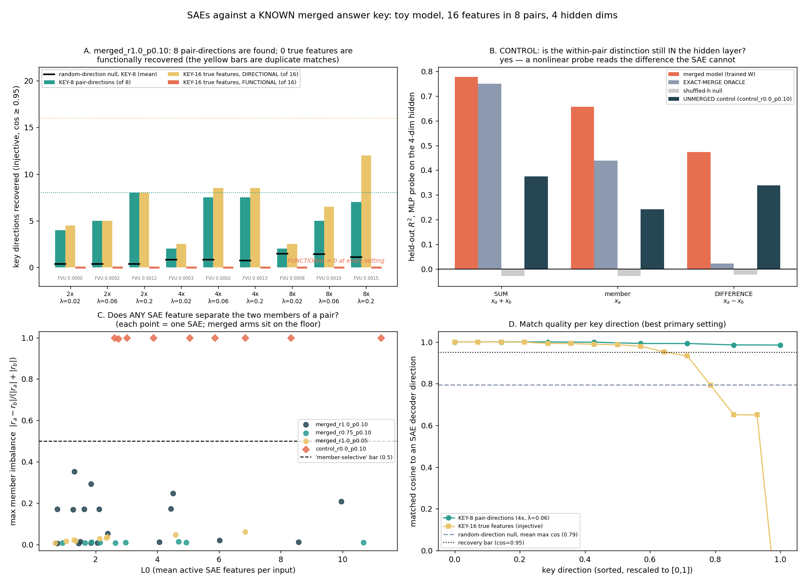

# SAEs on the merged-pair toy model: the dictionary finds all 8 merged directions, 0 of the 16 true features — and a nonlinear probe proves the information was still there

**Date:** 2026-07-25 · **Status:** done (hypothesis **confirmed on the SAE half, refuted on the "information is gone" half** — the more interesting outcome)

Third run in the superposition thread, and the friendly-regime complement to
[`2026-07-25_sae-on-grokked-model`](../2026-07-25_sae-on-grokked-model). There the SAE failed because
the ground-truth features were **dense** and L1 forbids dense features. Here the ground-truth features
are genuinely **sparse** — the regime SAEs are designed for — and the answer key is a *known merged
representation* built by [`2026-07-23_superposition-correlation-phase`](../2026-07-23_superposition-correlation-phase).

## Hypothesis
An L1 SAE trained on the 4-dim hidden layer of the merged-pair toy model recovers the **8 merged
pair-directions**, not the 16 true generative features, and no SAE feature can separate the two members
of a merged pair **because the model's hidden layer no longer contains that information** (a probe on
the 4-dim hidden cannot predict the within-pair value difference).

## Method

**The model (retrained here, ~6 s per fit).** The 2026-07-23 recipe unchanged: Anthropic-style toy
autoencoder `x̂ = ReLU(WᵀW x + b)`, `W` is 4×16, so **n = 16 features → m = 4 hidden dims** (80 params).
Adam lr 0.01, 3000 online steps, batch 1024, MSE. Data: 16 features in 8 pairs; per sample per pair,
with probability ρ both members share **one** Bernoulli(p) on/off coin, else independent coins (so the
within-pair indicator correlation is exactly ρ); active **values are always independent Uniform[0,1]**,
so a merged pair still carries two independent numbers and merging is genuinely lossy.

**Arms (5 toy models).** primary `ρ=1.0, p=0.10` × seeds {0,1}; `ρ=0.75, p=0.10`; `ρ=1.0, p=0.05`;
and an **unmerged positive control** `ρ=0.0, p=0.10`. Merge is verified per arm before any SAE is
trained (see table).

**Activations.** `h = W x` (the 4-dim hidden), on **fresh seeded data drawn from a different generator
stream than training**: 65 536 samples for SAE training, 32 768 held out for every evaluation. Scaled
so `E‖h‖ = √m`, which makes λ comparable across arms.

**SAEs (45 of them).** Standard ReLU SAE `f = ReLU((h−b_dec)W_enc + b_enc)`, `ĥ = f·W_dec + b_dec`,
unit-norm decoder rows renormalised every step, L1 on `f`, dead-feature resampling at 40 %/70 %.
Adam lr 3e-3, batch 512, 4000 steps. **Expansion 2× / 4× / 8×** (8 / 16 / 32 dictionary features over a
4-dim space) **× λ ∈ {0.02, 0.06, 0.2}**. Alive = fires on ≥ 0.5 % of inputs.

**Two answer keys, and four things the usual max-cosine score lacks.**
- **KEY-8** — the 8 merged pair-directions (top left singular vector of each pair's 2-column block of `W`).
- **KEY-16** — the 16 true generative directions (unit columns of `W`).
- (1) **Signed cosine** (feature values are non-negative, so a feature pushes `h` along `+W_i`).
- (2) **Greedy injective matching**, so one SAE feature cannot be credited with recovering both members
  of a merged pair — whose unit columns are *the same vector to 2.6°*.
- (3) A **random-unit-direction null**, 400 trials at each alive-count. This matters enormously here:
  in ℝ⁴ a random direction lands within cos ≥ 0.9 of a fixed target **1.9 %** of the time, so 32 random
  directions already "recover" 3.6 of 8 pair-directions at that bar. All headline numbers use **cos ≥ 0.95**.
- (4) A **functional** criterion. For each alive SAE feature, correlate its activation with every true
  feature value and compute the **member imbalance** `|r_a − r_b| / (|r_a| + |r_b|)` on the pair it is
  most associated with: 0 = responds to both members identically (a *pair* feature), 1 = responds to
  exactly one member (a *true-feature* detector). A true feature counts as **functionally recovered**
  only if some SAE feature is both directionally matched to it (cos ≥ 0.95) and member-selective
  (imbalance ≥ 0.5).

**The decisive control (the backlog's "can a probe even distinguish pair members?").** Linear ridge and
2×64 ReLU-MLP probes from the 4-dim hidden onto, per pair, `x_a`, `x_b`, the **sum** `x_a+x_b` and the
**difference** `x_a−x_b` (all restricted to co-active samples), plus "which member fired" on
exactly-one-active samples. Two nulls: an **exact-merge oracle** (rebuild `h` after projecting each
pair's two columns onto their *exactly* shared direction — the reference for "the information really is
gone") and a **shuffled-h** null (the probe's own optimism floor). 70/30 train/test split, R² against
the masked-mean baseline.

**Budget.** CPU, single thread, `torch.set_num_threads(1)`. The whole thing — 5 toy models, 15 probe
fits, 45 SAEs, 5 600 null trials — runs in **7.5 min (447 s)**, inside the 12-min box. Two back-to-back
runs produced identical `results.json` on every metric (verified field by field on the headline block);
only the per-cell wall-clock fields differ.

## How to run
```bash
pip install -r requirements.txt
python run.py     # ~7.5 min, CPU only, writes results.json + chart.png + train.log
```

## Result

**Merge verified first.** Primary arm within-pair |cos| = **0.9990 / 0.9989** (seeds 0/1) vs cross-pair
0.154 / 0.157 — a **2.6° splay**, comfortably over the backlog's 0.95 bar. (Seed 0 additionally *killed*
one member of two pairs, `‖W‖` = 0.023 and 0.031, leaving 14/16 represented and 6 fully merged pairs;
seed 1 is clean at 16/16 and 8/8.) The `p=0.05` arm merged only 6 of 8 pairs (arm mean |cos| 0.9375,
two pairs at 0.80/0.71) and the `ρ=0` control did not merge at all (0.250).

### 1. Headline — 8 out of 8, and 0 out of 16

Primary arm `ρ=1.0, p=0.10`, seed-averaged, injective, cos ≥ 0.95:

| setting | FVU | L0 | alive | **KEY-8 (of 8)** | KEY-16 *directional* (of 16) | **KEY-16 *functional* (of 16)** | null (KEY-8) |
|---|---|---|---|---|---|---|---|
| 2×, λ=0.02 | 0.0000 | 1.74 | 8/8 | 4.0 | 4.5 | **0** | 0.37 |
| 2×, λ=0.06 | 0.0002 | 1.40 | 8/8 | 5.0 | 5.0 | **0** | 0.37 |
| **2×, λ=0.20** | 0.0012 | 0.76 | 8/8 | **8.0** | 8.0 | **0** | 0.37 |
| 4×, λ=0.02 | 0.0003 | 4.25 | 16/16 | 2.0 | 2.5 | **0** | 0.82 |
| **4×, λ=0.06** | 0.0002 | 2.09 | 15.5/16 | **7.5** | 8.5 | **0** | 0.83 |
| 4×, λ=0.20 | 0.0013 | 1.38 | 14/16 | 7.5 | 8.5 | **0** | 0.71 |
| 8×, λ=0.02 | 0.0008 | 9.26 | 32/32 | 2.0 | 2.5 | **0** | 1.47 |
| 8×, λ=0.06 | 0.0010 | 5.27 | 29.5/32 | 5.0 | 6.5 | **0** | 1.42 |
| 8×, λ=0.20 | 0.0015 | 2.12 | 22/32 | 7.0 | **12.0** | **0** | 1.08 |

- **Best single setting: 8 / 8 pair-directions** (4×, λ=0.06, seed 1; FVU 0.00021, L0 2.06, **0 % dead**),
  against a random-direction null of **0.83** (p95 = 2). `2×, λ=0.20` also hits **8/8 in *both* seeds**
  and is the cleanest result in the run: **exactly one dictionary feature per pair-direction, no
  duplicates** — a bijection between an 8-feature dictionary and the 8 merged directions.
- **0 of 16 true features are functionally recovered — in all 27 SAEs across all three merged arms.**
  Not one merged-arm SAE contains a single member-selective feature. The best setting's *maximum*
  member imbalance over its whole dictionary is **0.0069** (mean 0.0033) on a 0–1 scale where the
  unmerged control reaches **1.0000**.

### 2. The "16 true features" column is a mirage, and this is the methodological finding

Read naively, the standard max-cosine-against-a-feature-list score says the SAE recovered **up to 15 of
16 true features** (ρ=0.75, 8×, λ=0.2; 13/16 on the primary arm). Every one of those extra matches is a
**duplicate**: across all 27 merged SAEs the dictionary never claims **more than 8 distinct
pair-directions** (8 in 25 of 27, 7 in the other two), with up to **7 alive features piled onto one
direction**. Injective matching does not stop
it — with 32 features and only 8 real directions there are plenty of near-copies to hand out, so the
matcher happily assigns two different SAE features to the two (identical-to-2.6°) members of a pair and
scores both as "recovered". The functional test is what separates the two answer keys, and it is
unambiguous: **8 / 0**, not 8 / 12.

That is the transferable warning: **cosine-similarity recovery against a ground-truth feature list can
report 75–94 % recovery of features the representation does not separately encode.** Expansion makes it
worse (2× → 8× roughly doubles the false directional score) while the honest KEY-8 score *falls*.

### 3. The knob that matters is sparsity, not width

At fixed width, λ 0.02 → 0.2 is worth **+4 to +5 pair-directions** at every expansion (2×: 4.0 → 8.0;
4×: 2.0 → 7.5; 8×: 2.0 → 7.0) — and it is the *only* knob that ever reaches 8/8. Width is at best
neutral and mostly harmful: the widest dictionary is the worst at every λ (λ=0.2: 8.0 → 7.5 → 7.0;
λ=0.06: 5.0 → 7.5 → 5.0; λ=0.02: 4.0 → 2.0 → 2.0), while it inflates the *false* KEY-16 score from 8.0
to 12.0. FVU is
uninformative across the whole grid (0.0000–0.0019, i.e. every SAE reconstructs the 4-dim space
essentially perfectly) — reconstruction quality gives **zero** signal about which of the two answer keys
you are recovering, exactly as in the grokked-model sibling. The right dictionary size turned out to be
the number of directions the model *uses* (8), not the number of features the data *has* (16).

### 4. The control: the distinction is **not** destroyed — it is destroyed *linearly*

This is where the hypothesis was wrong, and it is the most interesting number in the run. Held-out R²
on the primary arm (mean of 2 seeds):

| probe target | **linear** | **MLP** | MLP, exact-merge **oracle** | MLP, shuffled-h null | MLP, **unmerged control** |
|---|---|---|---|---|---|
| sum `x_a+x_b` | 0.588 | **0.778** | 0.750 | −0.026 | 0.374 |
| member `x_a` | — | 0.657 | 0.439 | −0.029 | 0.242 |
| **difference `x_a−x_b`** | **0.034** | **0.473** | **0.023** | −0.023 | 0.338 (linear **0.299**) |
| which member fired solo (ρ=0.75 arm) | −0.003 | 0.477 | −0.080 | −0.066 | 0.745 (linear 0.389) |

- **Linearly, the pair members are gone.** The within-pair difference is decodable at R² = **0.034** in
  the merged model versus **0.299** in the unmerged control — a 9× gap — while the *sum* is decodable at
  0.588. A linear dictionary over `h` genuinely cannot represent the distinction, which is exactly why
  the SAE's ceiling is 8.
- **Nonlinearly, it survives.** An MLP probe reads the difference at R² = **0.473**. The residual **2.6°
  splay** between the two shared columns is a real, usable signal: collapse the pair onto an *exactly*
  shared direction (the oracle) and the same probe drops to **0.023**, with the shuffled-h floor at
  −0.023. The sum survives the oracle intact (0.750), confirming the oracle only removes the
  within-pair difference.
- **Dose-response.** The `p=0.05` arm merged less completely (|cos| 0.9375, two pairs at 0.80/0.71) and
  its MLP difference-R² is correspondingly higher: **0.736**. More splay, more recoverable difference.
- At ρ=0.75 even "*which* member fired, on samples where exactly one did" is linearly undecodable
  (−0.003) but nonlinearly decodable at 0.477 — the merged model has no linear "member A" direction at all.

### 5. Every control lands where it should

The unmerged `ρ=0` arm reaches **member imbalance 1.0000** with 3–17 member-selective features per SAE
and functionally recovers up to 2 true features, while recovering only 0–2 of the (non-existent) 8
pair-directions. So neither metric is pinned to its floor by construction: the merged arms' 0.0069 and
0/16 are real zeros. The random-direction null is reported at every alive-count and is large enough to
matter (0.37 → 1.47 pair-directions at cos ≥ 0.95; 1.15 → 3.56 at cos ≥ 0.9), which is why cos ≥ 0.9 is
*not* used for any headline claim.



## Takeaway

**On the friendly regime — sparse features, a small clean space, a known answer key — the SAE does
exactly the right thing, and "exactly the right thing" is 8, not 16.** An 8-feature dictionary at
λ = 0.2 finds all 8 merged pair-directions one-to-one, with FVU 0.001 and no dead features. It never
finds a 16-feature story, at any width or sparsity, and its most member-selective feature anywhere in
27 SAEs scores 0.007 out of 1. This is the honest success the backlog asked for: **the SAE recovers the
merged directions and cannot do better because the model itself merged them.**

The twist is the mechanism. We expected the pair-member distinction to be *destroyed*; it is only
destroyed **linearly**. A 2-layer MLP probe pulls the within-pair difference back out of the same 4
numbers at R² 0.47, and an exact-merge oracle proves that signal lives in the 2.6° residual splay
(R² → 0.02 when the splay is removed). So the SAE's failure to reach 16 is **not** an information-theoretic
ceiling — it is a **hypothesis-class ceiling**: an SAE is a linear dictionary plus a sparsity prior, and
this information is exactly the part of the representation that is not linearly available. Together with
the grokked-model sibling, the two runs give a pair of structural (not tuning) reasons an SAE misses a
provable ground truth: **the true features are too dense** (grokking), or **the true features are not
linearly separated in the activation** (merging). In both cases FVU/L0 give no warning whatsoever.

For the wider literature the sharpest deliverable is the **duplicate-match artifact**: scoring an SAE by
max cosine against a list of generative features credited this dictionary with up to 15/16 true features
that it demonstrably does not encode. Any SAE evaluation using a synthetic feature list should report
(i) injective matching, (ii) a random-direction null sized to the activation dimension, and
(iii) a functional selectivity check — the third is the only one that separated the two answer keys here.

**Next.** (a) Feed the *unequal-importance* merged models from
[`2026-07-25_superposition-merge-breakpoint`](../2026-07-25_superposition-merge-breakpoint) to this
harness — that run's "co-occurrence is worth a 16× importance discount" result predicts the SAE will find
the pair direction and miss the subsidised weak feature entirely, which this harness now measures
directly. (b) Give the SAE a non-linear or bilinear decoder, or a *transcoder*, and see whether the
difference-direction becomes representable — the probe says the signal is there to be found.

**Caveats, worst first.** Two seeds on the primary arm and one on each of the other three, so the
seed-to-seed spread (seed 0 dropped two features and had a 25× larger max member imbalance, 0.35 vs
0.007) is undersampled. One geometry (16→4) and one merge mechanism (indicator correlation at equal
importance); the 0.95 cosine bar and the 0.5 imbalance bar are judgement calls, chosen before scoring,
which is why the full cos ∈ {0.9, 0.95, 0.99} curves and the continuous imbalance values are in
`results.json`. The MLP probe is one architecture at one budget, so its 0.473 is a *lower* bound on
nonlinear decodability, not a measurement of it. Only one SAE family (ReLU + L1); top-k / JumpReLU /
gated variants were not run. The `p=0.05` arm did not fully merge, so it is reported as a partial-merge
data point rather than as a replicate of the primary arm.

## Novelty check
- Checked **2026-07-26** with WebSearch (`scripts/novelty_check.py` is unusable from this box — arXiv and
  OpenAlex both 403, as the brief documents).
- Queries: *"sparse autoencoder toy model of superposition correlated features merged direction ground
  truth recover feature"*; *"SAE identifiability superposition known ground truth features toy
  autoencoder how many features recovered correlated pairs 2025 2026"*; *"composed features sparse
  autoencoders toy models correlated features SAE learns combination instead of individual features"*;
  *"SynthSAEBench evaluating sparse autoencoders synthetic ground truth feature correlation"*.
- Verdict: **partial-prior-art**
- Closest prior work:
  - [Anders, *Sparse autoencoders find composed features in small toy models* (2024)](https://www.lesswrong.com/posts/a5wwqza2cY3W7L9cj/sparse-autoencoders-find-composed-features-in-small-toy) —
    the nearest neighbour by far: SAEs on correlated toy features learn *composed* rather than
    individual features. Same phenomenon, discovered independently of the merged-`W` framing.
  - [*Feature Hedging: Correlated Features Break Narrow Sparse Autoencoders* (arXiv:2505.11756)](https://arxiv.org/html/2505.11756v2) —
    correlated features cause narrow SAEs to mix directions; the mechanism is on the SAE side rather
    than in the model's own geometry.
  - [*SynthSAEBench* (arXiv:2602.14687)](https://arxiv.org/abs/2602.14687) and
    [*Are Sparse Autoencoder Benchmarks Reliable?* (arXiv:2605.18229)](https://arxiv.org/abs/2605.18229) —
    synthetic-ground-truth SAE evaluation, including feature correlation as a factor.
  - [*Toy Models of Superposition* (arXiv:2209.10652)](https://arxiv.org/abs/2209.10652) — the model and
    the correlated-feature merging behaviour; ARENA 3.1 SAE tutorials and
    [*Towards Monosemanticity*](https://transformer-circuits.pub/2023/monosemantic-features) — the SAE recipe.
  - [*On the Limits of Sparse Autoencoders* (arXiv:2506.15963)](https://arxiv.org/html/2506.15963) —
    theory on what L1 SAEs can and cannot identify.
- How this differs: to this search, no prior work (i) scores an SAE against **two explicit competing
  answer keys** derived from the *same trained* `W` (the 8 merged directions vs the 16 generative
  features), (ii) reports the **random-direction null for the recovery statistic itself** in the
  low-dimensional space where it is large, (iii) demonstrates the **duplicate-match artifact**
  quantitatively (up to 15/16 "recovered" with only 8 distinct directions claimed), or (iv) runs the
  **exact-merge oracle** probe that separates "the SAE cannot find it" from "the information is gone" —
  which is the finding that overturned half of our own hypothesis. The toy model, the merging behaviour
  and the SAE recipe are replications; the evaluation protocol and the linear-vs-nonlinear ceiling
  result are the contribution.

## Related
- `2026-07-23_superposition-correlation-phase` — produced the merged-pair recipe and the open question
  this run answers.
- `2026-07-25_superposition-merge-breakpoint` — merging survives essentially every stressor; its
  "weak features ride the shared direction at tiny amplitude" result is the natural next input here.
- `2026-07-25_sae-on-grokked-model` — the same SAE-vs-known-ground-truth question in the *hostile*
  (dense-feature) regime; this run is its friendly-regime complement and reaches a compatible
  structural conclusion.
