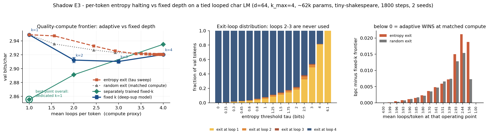

# Shadow E3 — does per-token entropy halting beat fixed depth on a 0.06M-param looped char LM?

**Date:** 2026-07-25 · **Status:** done (hypothesis refuted — honest negative)

## Hypothesis
On a weight-tied looped char LM (max k=4), an inference-time **per-token entropy exit** traces a better
val-bits/char vs mean-loops/token frontier than fixed loop counts — i.e. it saves compute by spending
loops only where they are needed. The competing prediction (TRM critique
[arXiv:2512.11847](https://arxiv.org/abs/2512.11847)) is that adaptive halting **collapses to a fixed
depth**, because loops past the first buy almost nothing at this scale.

**Context from this morning's wave 1:** registry id `2026-07-25_shadow-loop-vs-depth-isoflop` showed the
plain tied loop *loses* to depth at iso-FLOPs at this scale. So the interesting question here is narrower:
does adaptive halting recover any of that loss by spending loops only where needed? It does not.

## Method
- **Architecture.** One pre-norm decoder block (d_model 64, 4 heads, d_ff 256, ctx 64, vocab 65),
  weight-tied and applied up to k_max=4 times. **62,272 params** (0.062M). The LM head can be read out
  after *any* loop — that is what makes an early exit legal.
- **Four trained models × 2 seeds = 8 runs**, identical hyperparameters throughout
  (1800 steps, batch 16, AdamW lr 2e-3, 100-step warmup + cosine, wd 0.1, clip 1.0):
  - `fixed_k1` / `fixed_k2` / `fixed_k4` — cross-entropy on the **final** loop's readout only.
  - `deepsup_k4` — cross-entropy **averaged over the readouts after loops 1..4** (deep supervision).
    This is the model the halting policies run on; without it the intermediate readouts are garbage
    (see the ablation below).
- **Three inference-time policies on `deepsup_k4`**, no extra training, all on the *same* 51,200 fixed
  val tokens:
  1. **fixed** — every token runs exactly k ∈ {1,2,3,4} loops.
  2. **entropy exit** — after loop *i*, a token whose predictive entropy ≤ τ stops; its hidden state
     freezes (it still serves as a key/value for other positions) and its loop-*i* distribution is its
     answer. 15 thresholds τ ∈ [0, 6.1] bits (log2(65) = 6.02, so τ=0 ≡ fixed k=4 and τ=6.1 ≡ fixed k=1).
  3. **random exit (matched-compute control)** — each still-active token stops with probability *p*,
     with *p* solved numerically so the mean loops/token matches each entropy operating point.
     **This is the control that makes the claim falsifiable**: it separates "entropy is informative"
     from "any early exit at this average depth is fine."
- **Metric.** Val bits/char vs **mean loops per token** (the compute proxy the backlog asks for), plus a
  FLOP-honest x-axis that charges the entropy policy for the extra LM-head evaluation it needs at every
  loop (the head is 7.8% of a block).
- 8 training runs + all sweeps: **472 s (7.9 min)** on one CPU thread.

### Shrinks and substitutions (vs the backlog spec)
- Backlog said "looped **1M** char-LM"; shrunk to **0.062M** (d_model 64, ctx 64) for the 12-minute box.
- Backlog said TinyStories; **substituted tiny-shakespeare** per the data policy in `AGENT_BRIEF.md`.
- No trained halt head. The backlog explicitly allowed an inference-time entropy exit as the shrink; we
  went one step better than the suggested fallback by *deep-supervising* the loops so the intermediate
  readouts are calibrated. The suggested fallback (entropy exit on a plain fixed-k4 model) is run as an
  ablation and is catastrophic — see below.

## How to run
```bash
pip install -r requirements.txt
python run.py                # full run, ~8 min on 1 CPU thread
python run.py --chart-only   # redraw chart.png from results.json
```

## Result
**Refuted. Entropy halting never beats fixed depth, and it is no better than a coin flip at matched
compute.**



**1. Adaptive is never on the right side of the frontier.** Every entropy operating point sits *on or
above* the fixed-k curve of the same model (`metrics.entropy_exit.delta_vs_fixed`, positive = worse):

| mean loops/token | compute saved | val bpc | Δ vs fixed-k frontier | Δ vs random exit |
|---|---|---|---|---|
| 4.00 (τ=0) | 0% | 2.9203 | +0.0000 | — |
| 3.85 (τ=0.8) | 4% | 2.9203 | +0.0015 | −0.0002 |
| 3.39 (τ=2.0) | 15% | 2.9214 | +0.0072 | −0.0002 |
| 2.93 (τ=2.5) | 27% | 2.9254 | +0.0150 | **+0.0022** |
| 2.44 (τ=3.0) | 39% | 2.9326 | +0.0212 | **+0.0058** |
| 1.56 (τ=4.0) | 61% | 2.9471 | +0.0188 | **+0.0116** |

The best interior point is +0.0005 bpc at 3.96 loops — a 1% compute saving for a measurable loss.

**2. The entropy signal is worthless here.** For mean loops ≥ 3.4 the entropy policy is within ±0.0007
bpc of the compute-matched **random** exit — well inside the 0.003 seed spread. Once you ask for a real
saving it becomes *strictly worse than random* (+0.0022 / +0.0058 / +0.0116 bpc at 2.93 / 2.44 / 1.56
loops). Averaged over interior operating points, entropy costs **+0.0016 bpc versus coin-flipping**.

**3. It collapses — but to *deep*, not to shallow, and it never uses the middle.** At any threshold whose
quality cost is under 0.001 bpc, **≥96% of tokens still run all 4 loops**. Char-level Shakespeare is a
genuinely high-entropy target (~2.9 bits/char), so almost nothing looks "easy" to the halting rule. And
across the entire sweep loops 2 and 3 are essentially never used (≤4.4% and ≤1.5% of tokens at any τ):
the policy degenerates into a **binary 1-or-4 "easy vs hard" split**, not the graded depth allocation the
mechanism promises. This is a different failure shape than the TRM critique's "collapse to shallow"
prediction, but the same conclusion — no useful adaptivity.

**4. There is nothing to allocate in the first place.** The deep-sup model's own quality-vs-depth curve is
nearly flat *and non-monotone*: k1 = 2.9488, k2 = 2.9123, k3 = **2.9103**, k4 = 2.9203 bpc. Total gain
from 1→3 loops is 0.039 bpc and the 4th loop *hurts*. A halting rule can only redistribute compute along
a curve; if the curve is flat, there is no win available. And the separately trained fixed-k models are
monotonically **worse** with more loops (k1 = 2.8556, k2 = 2.8912, k4 = 2.9350) — reproducing wave 1's
finding at k_max=4. **The globally best point in this whole experiment is the dedicated k=1 model: fewest
loops *and* lowest bpc (2.8556).** Nothing adaptive comes within 0.06 bpc of it.

**5. The backlog's suggested shrink would have been uninformative.** Entropy exit on the plain `fixed_k4`
model (intermediate readouts never supervised) degrades from 2.9350 → **3.8370** bpc as tokens exit at
loop 1, and is already +0.05 bpc by a 10% compute saving (`metrics.naive_exit_on_fixed_k4`). Deep
supervision is a hard prerequisite for any early exit — which is worth stating, because it is not free
either: the deep-sup model's k=1 readout is **0.093 bpc worse** than a dedicated k=1 model, exactly where
you would most want to exit. (It does slightly help at full depth: −0.015 bpc vs `fixed_k4`.)

**6. FLOP-honest accounting makes it worse.** The entropy probe needs an LM-head evaluation at every loop
(7.8% of a block). Charged for that, the τ=0 operating point costs **4.31 loop-equivalents** — more than
fixed k=4 — and the whole entropy curve shifts right.

## Takeaway
At 0.06M params on natural text, entropy-based adaptive depth buys nothing: it never beats fixed depth at
matched average loops, it is indistinguishable from (and at aggressive settings worse than) a
compute-matched random exit, and it degenerates into a binary 1-or-4 split that skips the intermediate
depths entirely. The mechanistic reason is upstream of the halting rule — the loop's quality-vs-depth
curve is flat and non-monotone here, so there is no compute-quality tradeoff to exploit. This is the
predicted-either-way outcome the backlog called for, and it lands on the pessimistic side, consistent
with the TRM critique's claim that recursion gains beyond step 1 are largely illusory, though via a
different mechanism (collapse to *maximum* depth, not minimum).

**For the Shadow ledger:** entropy halting does **not** rescue the loop. Two of three Track-E ablations
now say the loop earns nothing on raw LM loss at ≤1M params. The remaining honest defence of the loop is
the test-time-compute / length-extrapolation axis (Track A's `looped-halt-nrasp`, `loop-test-time-compute`),
where the quality-vs-depth curve is steep by construction. **A halting rule should only be tested on a task
whose fixed-k curve is steep** — measure that curve first; it is a one-line precondition and it would have
predicted this null in advance. Natural next step: rerun this exact harness on such a task, and add a
per-token *oracle* exit (exit at the loop that would have been best in hindsight) to bound how much a
perfect halting rule could win — if the oracle gain is also ~0, no learned halt head can help either.

**Caveats.** (a) 1800 steps at 0.06M params is an early-training iso-compute regime (2.85–2.95 bpc, well
short of converged char-LM performance); a converged model might have a steeper depth curve. (b) One task,
one architecture, 2 seeds. (c) Inference-time exit only — a *trained* halt head (PonderNet/ACT-style)
could in principle learn a better rule than raw entropy, though the random-exit control suggests the
headroom is close to zero here. (d) Mean loops/token is a compute *proxy*; dense batched inference cannot
realise these savings as wall-clock, and we make no such claim.

## Novelty check
- **Verdict: partial-prior-art.** Checked 2026-07-25 via web search (arXiv and OpenAlex APIs 403 / rate-limit
  from this environment — the known issue noted in `AGENT_BRIEF.md`; abstracts could not be retrieved, so no
  numbers from 2026-dated preprints are relied on here).
- Queries: "entropy-based early exit adaptive halting looped recurrent-depth language model ablation small
  scale"; "Ouro looped language model exit gate entropy adaptive depth loops per token"; "'early exit'
  entropy threshold 'random exit' compute-matched control baseline"; "Adaptive Depth in Looped Transformers
  Halting Gates Trajectory Readouts".
- Closest prior work: [Ouro / LoopLM (2510.25741)](https://arxiv.org/abs/2510.25741) and
  [Mixture-of-Recursions (2507.10524)](https://arxiv.org/abs/2507.10524) — both ≥1B params;
  the TRM critique [2512.11847](https://arxiv.org/abs/2512.11847); classic ACT/PonderNet/DeeBERT-style
  entropy early exit. Search also surfaced several 2026-dated preprints in exactly this area —
  [2607.20519 "Adaptive Depth in Looped Transformers: Diagnosing Learned Halting Gates and Trajectory
  Readouts"](https://arxiv.org/abs/2607.20519), [LoopFormer 2602.11451](https://arxiv.org/html/2602.11451v1),
  [ADEPT 2601.03700](https://arxiv.org/html/2601.03700), [2606.18206](https://arxiv.org/abs/2606.18206),
  [2607.13491](https://arxiv.org/abs/2607.13491) — whose contents we could **not** verify from here.
  2607.20519 in particular may overlap substantially; treat the novelty claim below as provisional.
- How this differs: (1) the ≤0.1M-param regime, which none of the ≥1B prior work ablates; (2) the
  **compute-matched random-exit control**, which we did not find used as a baseline in the early-exit
  literature and which is what converts "adaptive saves compute" into a falsifiable claim — here it shows
  the entropy signal carries no usable information; (3) the explicit demonstration that the quality-vs-depth
  curve must be steep *before* a halting rule can pay off.
