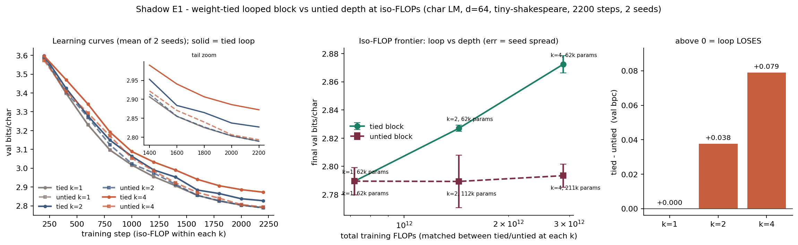

# Shadow E1: at iso-FLOPs on a 0.06–0.21M-param char LM, does a weight-tied looped block beat plain depth?

**Date:** 2026-07-25 · **Status:** done (hypothesis **supported** — the loop loses)

This is a deliberate **falsification target** for Track E's Shadow model. Shadow's proposed core
mechanism is a weight-tied block iterated k times. If that mechanism cannot pay for itself at
iso-FLOPs on tiny natural-language data, it should die here, cheaply, before anything gets built
on top of it.

## Hypothesis
At matched training FLOPs on tiny natural-language data (≤0.25M params), a weight-tied block looped
k times does **NOT** beat an untied k-layer stack — at this scale the extra parameters of untied depth
buy more than the extra iterations of a shared block.

## Method
- **The iso-FLOP construction.** A block applied k times does exactly the same forward (and backward)
  FLOPs as a stack of k distinct blocks, but holds 1/k the block parameters. So for each
  k ∈ {1, 2, 4} we train two models for the **same number of steps** on the **same token stream** at
  the **same per-step FLOPs**:
  - `tied-k`: **one** block, applied k times (49.7k block params at every k)
  - `untied-k`: **k** distinct blocks, applied once each (49.7k / 99.5k / 198.9k block params)

  | condition | total params | fwd FLOPs/token | total train FLOPs |
  |---|---|---|---|
  | tied-k1 = untied-k1 | 62,272 | 1.06e5 | 7.20e11 |
  | tied-k2 | 62,272 | 2.13e5 | 1.44e12 |
  | untied-k2 | 112,000 | 2.13e5 | 1.44e12 |
  | tied-k4 | 62,272 | 4.26e5 | 2.88e12 |
  | untied-k4 | 211,456 | 4.26e5 | 2.88e12 |

- **Architecture:** nanoGPT-style pre-norm decoder-only char LM, d_model 64, 4 heads, FFN 256,
  learned absolute positions, context 64 chars, vocab 65. Only the block-sharing scheme varies.
- **Data:** **tiny-shakespeare**, char level, 1,115,394 chars, 90/10 train/val split
  (md5 `6fb458f1232090904fb40fe944165e91`). The backlog specified TinyStories-1M; tiny-shakespeare is
  the substitute this lab's brief prescribes for natural text. **This is a substitution, not the
  specified corpus** — see Limitations.
- **Held fixed for every condition:** 2200 steps, batch 16 × 64 tokens (~2.25M tokens ≈ 2.0 epochs),
  AdamW lr 2e-3 (100-step warmup, cosine → 10%), wd 0.1, grad clip 1.0, identical init scheme,
  identical batch stream per seed. 2 seeds per condition, 12 runs.
- **Metric:** validation **bits/char** on a fixed 40-batch val set (identical batches for every run
  and every eval point).
- **Built-in sanity check:** at k=1 the tied and untied code paths describe the same model, so they
  must produce bit-identical numbers. They do (`k1_sanity_gap_bpc = 0.0`).
- 12 runs, **632 s (10.5 min)** on one CPU thread.

## How to run
```bash
pip install -r requirements.txt
python run.py
```

## Result
**Hypothesis supported, and more strongly than expected: the loop does not merely fail to win, it
gets monotonically worse the more it loops.**

Final val bits/char (mean of 2 seeds; `metrics.table` in `results.json`):

| k | tied (loop) | untied (depth) | **tied − untied** |
|---|---|---|---|
| 1 | 2.7895 | 2.7895 | +0.0000 (identical by construction) |
| 2 | 2.8270 | 2.7893 | **+0.0377** |
| 4 | 2.8724 | 2.7934 | **+0.0790** |

- **The loop tax is clean and grows with k.** Seed spread is small (std 0.002–0.019 bpc) and the
  tied/untied distributions are **fully separated at both k=2 and k=4** — every tied seed is worse
  than every untied seed (k=2: tied {2.8248, 2.8292} vs untied {2.7706, 2.8080}; k=4: tied
  {2.8786, 2.8662} vs untied {2.7852, 2.8016}). The penalty roughly doubles as k doubles:
  +0.038 bpc per doubling of loop count.
- **Looping is worse than not looping at all.** `loop_gain_over_k1_bpc` = {k2: −0.038, k4: −0.083}:
  tied-k4 spends **4× the FLOPs of tied-k1 for the same parameters and ends up 0.083 bpc worse**.
  Extra iterations of a shared block were a pure loss here, not a slow win.
- **But depth barely wins either.** `depth_gain_over_k1_bpc` = {k2: +0.0002, k4: −0.0039}: untied-k4
  has 3.4× the parameters and 4× the FLOPs of untied-k1 and lands within seed noise of it. At this
  scale and budget, **extra forward compute buys essentially nothing whichever way you spend it** —
  depth is a wash and looping is a tax.



## Takeaway
At ≤0.25M params and ~10^12 training FLOPs on char-level natural language, a plain weight-tied loop
is strictly dominated by plain depth at iso-FLOPs, and is dominated by *not looping at all* at
iso-params. Shadow cannot justify a looped block on tiny-scale language-modelling loss — if the loop
earns its place in the ledger, it will have to be on a different axis (test-time-compute scaling,
length/step extrapolation, or ARC-style puzzle refinement, which is exactly what Track A's
`loop-test-time-compute` and `looped-halt-nrasp` measure) rather than on bits/char. The secondary
result is arguably the more useful one for the ledger: in this regime the depth axis itself is nearly
flat, so a 1-block model is the honest default and any depth-like mechanism must be justified against
a k=1 baseline, not against a k=1 straw man. Next, in priority order: (1) re-run with per-iteration
input injection and per-loop LayerNorm — the two tricks the recurrent-depth literature considers
load-bearing, and which the vanilla loop tested here lacks; (2) a small LR sweep per condition, since
identical hyperparameters may flatter the shallow models; (3) push to the width band where
`shadow-recursion-capacity-window` predicts tied recursion could win.

## Limitations (read before citing this)
- **Undertrained.** Every curve is still descending at step 2200 and absolute loss (~2.79 bpc) is far
  from a converged char LM. This is an **iso-compute** comparison in the small-budget regime, not a
  train-to-convergence one. A loop that is slower to optimise but better asymptotically would look
  exactly like this.
- **Iso-hyperparameter, not per-condition-tuned.** All 12 runs share lr 2e-3, wd 0.1 and a
  non-depth-scaled init. Deeper effective stacks (tied-k4 has effective depth 4) may prefer a lower
  LR, so part of the loop tax may be an optimisation artefact rather than a capacity one.
- **Vanilla loop only.** No per-iteration input injection, no per-loop LayerNorm/adapter, no
  loop-count conditioning, no adaptive halting. This is the plain mechanism the backlog asked about;
  the literature's looped models use several of those additions.
- tiny-shakespeare substituted for TinyStories-1M; 2 seeds; single width (d=64); one context length.

## Novelty check
- **Verdict: partial-prior-art** (the mechanism is well studied; the ≤0.25M iso-FLOP control is not).
- Checked 2026-07-25 via web search (arXiv/OpenAlex APIs 403 from this environment, as documented in
  the agent brief). Queries run:
  1. `weight-tied looped transformer vs depth iso-FLOP small language model 1M params recurrent depth control`
  2. `Ouro looped language model 2510.25741 parameter sharing iso-FLOP comparison untied depth baseline`
  3. `looped transformer parameter sharing tiny 1M parameter char-level language model does looping beat depth negative result`
- Closest prior work found:
  - [Scaling Latent Reasoning via Looped Language Models (Ouro, arXiv:2510.25741)](https://arxiv.org/abs/2510.25741) — looped LMs at ≥1.4B.
  - [Scaling up Test-Time Compute with Latent Reasoning: A Recurrent Depth Approach (arXiv:2502.05171)](https://arxiv.org/pdf/2502.05171v1) — 3.5B recurrent-depth.
  - [Reasoning with Latent Thoughts: On the Power of Looping (ICLR 2025, arXiv:2502.17416)](https://arxiv.org/pdf/2502.17416) — looping vs depth at iso-param/iso-FLOP, but at conventional LM scale.
  - [How Much Is One Recurrence Worth? Iso-Depth Scaling Laws for Looped Language Models (arXiv:2604.21106)](https://arxiv.org/html/2604.21106) and
    [DeepLoop: Depth Scaling for Looped Transformers (arXiv:2607.13491)](https://arxiv.org/abs/2607.13491) — the closest framing (iso-depth/iso-FLOP scaling laws for loops); both 2026-dated, treat exact numbers with the caution `docs/BACKLOG.md` notes.
- How this differs: every published loop-vs-depth control we could find sits at ≳100M–1.4B+ params.
  This is a ≤0.25M-param, char-level, single-CPU-thread iso-FLOP control with a bit-identical k=1
  sanity check, run specifically as a falsification test rather than as a demonstration — and at this
  scale the loop clearly loses, which the large-scale literature does not report.
