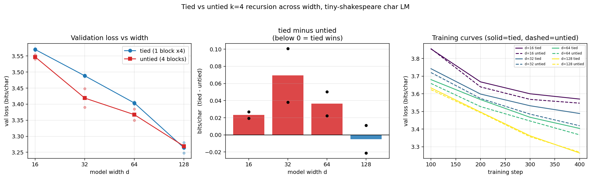

# Does the Game-of-Life capacity window transfer to language? Tied vs untied recursion across width

**Date:** 2026-07-25 · **Status:** done (hypothesis refuted — negative transfer)

## Hypothesis
The capacity-window result from registry id **2026-07-21_gol-depth-recursion** — a weight-tied recurrent
cell beat an untied per-step stack at hidden width H=4 but *not* at H=2 or H=24, i.e. tying helps only
inside a narrow width band — transfers to language modelling. Concretely: at fixed loop count k=4 and
fixed compute, a **tied** looped char-LM block should beat **k distinct untied** blocks in validation
bits/char *only at intermediate model width*, losing at both the narrow and the wide end.

## Method
- **Architecture.** Pre-norm decoder-only char LM: token + learned absolute position embeddings, `k=4`
  block applications, final LayerNorm, untied output head. Block = causal MHA (`heads = max(2, d/32)`)
  + 4x GELU MLP.
  - **tied** = ONE block applied 4 times (Universal-Transformer / looped style).
  - **untied** = FOUR distinct blocks (a plain 4-layer transformer).
  - The two variants have **identical compute** (same number of block applications, same FLOPs/token);
    untied has ~2.3–3.6x the parameters. This is the same tied-vs-untied contrast as the GoL run.
- **Width sweep.** `d ∈ {16, 32, 64, 128}` (7.4k / 20.9k / 66.4k / 231k params tied; 17.0k / 58.6k /
  215.6k / 824.3k untied).
- **Task / dataset.** Character-level tiny-shakespeare (1.115M chars, 65-char vocab), last 10% held out
  for validation. **Substituted for TinyStories-1M** per the brief's data policy.
- **Held fixed.** 400 steps, batch 16, context 128 (0.82M training chars/run ≈ 0.73 epochs), AdamW,
  wd 0.01, grad clip 1.0, 50-step warmup + cosine decay to 10% of peak. Peak LR is width-scaled
  (`lr = 3e-3·sqrt(64/d)`, capped at 4.5e-3) so no single width is handicapped by a bad LR.
- **Pairing.** For a given seed, *every* (width, variant) run sees the **identical training batch
  stream**, and all 16 runs are scored on the **same fixed 40-batch validation set** (81,920 chars).
  2 seeds per cell, 16 runs total.
- **Metric.** val loss in bits/char; headline is `delta = bpc(tied) − bpc(untied)` at each width
  (negative = tied wins).

### Shrinks vs the backlog spec (12-minute CPU box, 2 shared cores)
- **Dropped d=256** (it alone would have cost ~15 min); **added d=16** so the sweep still has 4 points
  and covers the narrow end where GoL found tying unstable.
- **TinyStories-1M → tiny-shakespeare** (brief's substitution policy).
- **400 steps** only. This is the binding limitation — see the caveat below.
- Actual compute: **463.5 s (7.7 min)** for all 16 runs, single-threaded CPU.

## How to run
```bash
pip install -r requirements.txt
python run.py
```

## Result
**Refuted. The capacity window does not transfer — there is no width at which tying significantly
helps.** `analysis.capacity_window_found = false` in `results.json`.

| d | params (tied / untied) | tied bpc | untied bpc | delta = tied − untied | sign consistent over 2 seeds |
|---|---|---|---|---|---|
| 16  | 7.4k / 17.0k   | 3.5700 | 3.5468 | **+0.0232** | yes (untied wins) |
| 32  | 20.9k / 58.6k  | 3.4882 | 3.4188 | **+0.0694** | yes (untied wins) |
| 64  | 66.4k / 215.6k | 3.4036 | 3.3673 | **+0.0363** | yes (untied wins) |
| 128 | 231.0k / 824.3k| 3.2642 | 3.2692 | **−0.0050** | **no** (+0.0112 / −0.0212) — noise |

- Untied wins at **three of four widths with a consistent sign across both seeds**. The only negative
  delta (d=128, −0.005 bpc) flips sign between seeds and is an order of magnitude smaller than the
  seed-to-seed spread, so it is not a win — it is parity.
- The shape is not a window but a **hump that decays**: the tied penalty *peaks at intermediate width*
  (d=32, +0.069) and then shrinks monotonically toward zero as width grows. That is close to the
  inverse of the GoL finding, where the middle of the sweep was exactly where tying paid off.
- The ordering is stable through training, not an end-of-run artefact: mean delta at steps
  100/200/300/400 is +0.022/+0.025/+0.047/+0.069 at d=32 and +0.010/+0.004/+0.006/−0.005 at d=128.
- Train and val bits/char are within ~0.05 of each other everywhere (e.g. d=128: 3.218 train vs 3.264
  val), so nothing here is memorisation-limited — untied's extra parameters are buying genuine fit, not
  overfitting.



## Takeaway
The Game-of-Life capacity window **does not transfer to language modelling** in this regime. In GoL the
target was a single exact, reusable, depth-invariant update rule, so weight tying was a correct
inductive bias and the untied stack's extra parameters were pure overfitting surface. Next-character
prediction has no such fixed point: the four block applications appear to want to do *different* things
(an embedding-shaped early layer, a prediction-shaped late one), and forcing them to share weights
costs 0.02–0.07 bits/char with no compensating benefit at any width tested. The one genuinely
suggestive signal points the *opposite* way from the hypothesis: the tied penalty vanishes at the
**widest** point rather than in the middle, which is consistent with the published looped-LM literature
finding that looping becomes competitive as models get bigger — i.e. if a crossover exists it is above
d=128, not inside a narrow band.

**The honest caveat that limits this result:** at 400 steps every model is heavily undertrained
(3.26–3.57 bits/char, roughly bigram-level; a converged tiny char LM reaches ~1.5). What is measured is
therefore *early-training* efficiency at iso-compute, and the tied model's disadvantage may partly be an
optimisation-speed effect rather than a capacity effect. Two follow-ups, in order: (1) rerun d∈{32,128}
at 4–8x the steps to see whether the d=128 parity becomes a real tied win once loss leaves the bigram
regime; (2) extend the sweep to d=256/512, since the trend in the delta curve predicts the crossover is
out there rather than in the middle. Ledger implication for Shadow: **weight tying is not yet earned as
a default at ≤1M params on natural language** — the sibling item `shadow-loop-vs-depth-isoflop` is the
decisive test.

## Novelty check
- **Verdict: partial-prior-art.** Checked 2026-07-25 via WebSearch (arXiv/OpenAlex APIs 403 from this
  environment, as documented in the brief).
- Queries: `looped transformer weight-tied vs untied width sweep capacity language model loss` (7 hits);
  `weight tying advantage only at intermediate model width capacity window recursion depth generalization`
  (9 hits).
- Closest prior work: [Ouro / Scaling Latent Reasoning via Looped Language Models
  (arXiv:2510.25741)](https://arxiv.org/abs/2510.25741),
  [Mixture-of-Recursions (arXiv:2507.10524)](https://arxiv.org/abs/2507.10524),
  [Looped Transformers (UW-Madison-Lee-Lab/looped-tf)](https://github.com/UW-Madison-Lee-Lab/looped-tf),
  and depth/iso-depth scaling-law work for looped LMs surfaced in search (e.g. "How Much Is One
  Recurrence Worth? Iso-Depth Scaling Laws for Looped Language Models",
  "DeepLoop: Depth Scaling for Looped Transformers", "Sparse Layers are Critical to Scaling Looped
  Language Models"). Per the backlog's own warning, those 2026-dated preprints were surfaced
  abstract-only and their exact numbers are not relied on here.
- How this differs: all of the above scale *up* (≥1.4B) and vary depth/recurrence count; none sweeps
  **model width at fixed loop count and asks whether the tied-vs-untied sign changes**, and none does it
  at ≤1M params. The specific claim tested — that the GoL capacity window is a general property of
  weight tying — is ours (registry 2026-07-21_gol-depth-recursion) and is refuted here.
