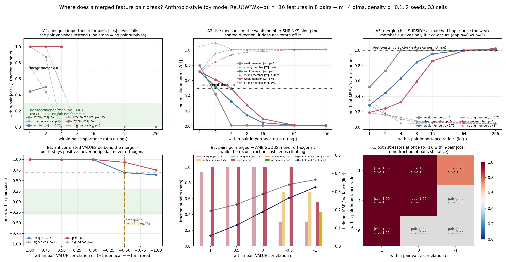

# The merge breakpoint: what makes a correlated feature pair stop sharing one direction?

**Date:** 2026-07-25 · **Status:** done (hypothesis refuted for importance, partially confirmed for
value-anticorrelation — no full breakpoint to local orthogonality was found in range)

Follow-up to [`2026-07-23_superposition-correlation-phase`](../2026-07-23_superposition-correlation-phase),
where correlated feature pairs always **merged** onto one shared direction at equal importance and
independent values. That run ended with the question this one answers: *when does pair-merging become
too lossy?*

## Hypothesis
The pair-merging seen at equal importance breaks down under two stressors — unequal within-pair
importance, and anticorrelated within-pair **values** — and past some breakpoint the pair abandons its
shared direction for a locally orthogonal basis (within-pair |cos| < 0.7).

## Method
- **Architecture:** identical family to the sibling run — Anthropic-style toy autoencoder
  `x_hat = ReLU(WᵀW x + b)`, `W` is 4×16, so n=16 features → m=4 hidden dims (4× compression).
  80 parameters. Loss is importance-weighted MSE, `mean_i I_i (x_i − x̂_i)²`. Adam lr=0.01,
  3000 online steps (fresh batch every step), batch 1024, 2 seeds. Density fixed at p=0.1
  ("moderate"), as the backlog specified.
- **Data:** n=16 features in 8 pairs. Within a pair, three independent knobs, each realised by an
  exact mixture construction (verified empirically in-run — `emp_indicator_corr` / `emp_value_corr`
  in `results.json` are all within 0.008 of target):
  - **indicator correlation ρ** — with prob ρ both members share one Bernoulli(p) on/off coin, else
    independent coins (the sibling's construction, unchanged);
  - **value correlation c** — with prob |c| the second member's value is copied (c>0) or mirrored,
    `v₂ = 1 − v₁` (c<0), from the first member's Uniform[0,1] draw, else independent. Marginals stay
    Uniform[0,1] and the Pearson correlation of co-active values is exactly c;
  - **importance ratio r** — importances within a pair are `(2/(1+r), 2r/(1+r))`, so the **pair's
    total importance is 2 for every r**: r moves the split, not the pair's share of the loss.
- **Three sweeps** (33 distinct cells, 66 training runs; cells shared between sweeps are trained once):
  - **A — importance ratio:** r ∈ {1,2,4,8,16,64,256} × ρ ∈ {0, 0.75, 1} at c=0. ρ=0 is the
    **uncorrelated control** that separates "the merge broke" from "low-importance features get
    dropped anyway".
  - **B — value anticorrelation:** c ∈ {+1, +0.5, 0, −0.5, −1} × ρ ∈ {0.75, 1} at r=1.
  - **C — joint corner:** r ∈ {1,4,16} × c ∈ {+1, 0, −1} at ρ=1.
- **Measured per cell:** the sibling's merge metric (mean within-pair |cos| among pairs where *both*
  members are represented, ‖W_i‖ ≥ 0.5) plus **signed** cosine; a per-pair classification into
  MERGED (|cos| ≥ 0.7) / AMBIGUOUS / LOCALLY-ORTHOGONAL (|cos| ≤ 0.3) / DROPPED (a member below the
  norm threshold); column norms; and **held-out per-feature reconstruction loss** on a fresh
  8192-sample batch, normalised by that feature's variance (**1.0 = no better than the best constant
  predictor**, 0.0 = perfect).

Time-box: the full 66-run experiment takes **6.5 min** on one CPU thread, matching the sibling's budget.

## How to run
```bash
pip install -r requirements.txt
python run.py
```

## Result

**Headline: no pair ever chooses local orthogonality. Across all 30 correlated cells (ρ ≥ 0.75), zero
of 240 pair-instances landed in the orthogonal bin (`max_frac_pairs_ortho_over_correlated_cells = 0.0`).
The model has two other escape routes, and it uses both.**

**A — unequal importance: the merge does not bend, the weak feature just fades along the same direction.**
Whenever both members survive, |cos| is 0.999 — at r=1, r=2 and r=4 alike. There is no intermediate
geometry: the line simply stops (`A_within_abs_cos` at ρ=1 is `[0.999, 0.999, 0.999, null, null, null, null]`).
The mechanism is in the norms, not the angles: at ρ=1 the weak member's ‖W‖ decays
**0.714 → 0.613 → 0.495 → 0.278 → 0.098 → 0.014** across r=1…64 while the strong member's grows
0.716 → 1.008. The pair stays collinear and the weak feature is *rescaled to zero along the shared
direction*. `breakpoint_importance_ratio` is `null` for both ρ=0.75 and ρ=1 — no merge-abandonment
breakpoint exists up to r=256, a 256× importance ratio.

**A — and merging turns out to be a subsidy.** The uncorrelated control makes this quantitative.
Weak-member held-out normalised MSE at matched importance ratio:

| weak-member NMSE | r=1 | r=2 | r=4 | r=8 | r=16 | r=64 | r=256 |
|---|---|---|---|---|---|---|---|
| ρ=0 (control) | 0.522 | 0.730 | **1.001** | 1.001 | 1.001 | 1.001 | 1.001 |
| ρ=0.75 | 0.287 | 0.444 | 0.634 | 0.843 | 0.953 | 1.002 | 1.009 |
| ρ=1 | 0.191 | 0.243 | **0.326** | 0.596 | 0.861 | 0.993 | 1.022 |

At r=4 an uncorrelated low-importance feature is already *completely* unrepresented (1.001 = the
constant-predictor floor), while a perfectly co-occurring one at the same importance is reconstructed
at 0.326. Riding a stronger feature's direction is worth roughly **a 16× importance discount**: ρ=1 at
r=16 (0.861) is about as well reconstructed as ρ=0 at r≈1–2. At ρ=1 the weak feature is only fully
dead by r≈64.

**B — anticorrelated values are the only stressor that moves the angle, and it stalls short of orthogonality.**
Within-pair |cos| as c goes +1 → −1:

| | c=+1 | c=+0.5 | c=0 | c=−0.5 | c=−1 |
|---|---|---|---|---|---|
| ρ=1, within &#124;cos&#124; | 1.000 | 1.000 | 0.999 | 0.933 | **0.750** |
| ρ=0.75, within &#124;cos&#124; | 1.000 | 0.999 | 0.999 | **0.688** | 0.636 |
| ρ=1, held-out NMSE | 0.057 | 0.115 | 0.189 | 0.264 | 0.324 |

The only threshold crossing in the whole experiment is at **ρ=0.75, c=−0.5** (|cos| 0.688, just under
0.7); at ρ=1 the merge survives even fully mirrored values, at |cos| 0.750. And the crossing is not a
split into an orthogonal basis: the pair classification goes merged → **ambiguous**, never orthogonal
(at ρ=0.75, c=−1: 0.31 merged / 0.69 ambiguous / **0.00 orthogonal**). The lowest within-pair |cos|
over every surviving correlated pair in the experiment is 0.636 — about 50°, not 90°.

Two further readouts on sweep B:
- **Signed cosine equals |cos| everywhere** (e.g. +0.750 at ρ=1, c=−1). Anticorrelated *values* do
  **not** produce the antipodal pairs that anticorrelated *co-occurrence* produces in Anthropic's
  original vignettes — non-negative feature values still need positive projection onto a shared axis.
- The response is **global, not local**: as values anticorrelate, *cross*-pair |cos| rises about as
  much as within-pair |cos| falls (ρ=1: 0.146 → 0.334). The model does not reorganise the pair; the
  whole arrangement decompresses. Meanwhile the cost of merging rises 5.7× (NMSE 0.057 → 0.324), so
  the geometry is clearly *under*-reacting to the loss it is paying.

**C — both stressors at once push toward dropping, not toward splitting.** At ρ=1, r=16 with c=+1
(merging is lossless) every pair stays perfectly merged and alive; at r=4, c=−1 the weak member is
already 100% dropped, where at r=4, c=0 half the pairs still keep both members. Value anticorrelation
makes the merge more expensive, and the model's answer to an expensive merge is to *delete* the cheap
member, never to rotate it away.



**Caveats, worst first.** One density (p=0.1) and one geometry (16→4) — the sibling showed the merge
*onset* moves with density, so the breakpoint may too; 2 seeds; the "represented" (‖W‖ ≥ 0.5) and
merge/ortho (0.7 / 0.3) cutoffs are inherited or chosen up front but are still thresholds, which is
why norms and per-feature NMSE are reported as continuous companions to every classification; 3000
steps with no per-cell convergence check; and only one within-pair value-coupling family (the
copy/mirror mixture) was tried — a coupling that keeps values non-negative but makes them *jointly*
uninformative, e.g. a shared-magnitude/opposite-sign encoding, might behave differently.

## Takeaway
In this toy model the shared-direction merge is far more robust than the sibling run's open question
assumed: it has no breakpoint in importance at all (it survives 256×, dying by amplitude decay rather
than by rotation), and value anticorrelation only bends it to ~0.64–0.75 |cos|. The honest answer to
"find the breakpoint" is **"merging survives essentially everything we threw at it"** — the single
0.7-crossing, at ρ=0.75 with mirrored values, is a partial rotation into an ambiguous geometry, not a
local orthogonal basis. The two real findings are the *mechanism* (unequal importance is answered by
rescaling along the shared axis, so a polysemantic direction degrades continuously into a
single-feature direction rather than splitting) and the *subsidy* (co-occurrence is worth roughly a
16× importance discount for the weaker feature — a feature far too unimportant to earn its own
direction still gets represented for free by riding a partner's). For interpretability the subsidy is
the uncomfortable part: a direction can carry a real, recoverable second feature at 1/16 the
importance with no angular signature at all that it is doing so. Next: (i) redo sweep B across
densities to see whether the ρ=0.75, c=−0.5 crossing is a genuine boundary or a p=0.1 artifact;
(ii) feed these unequal-importance merged models to `sae-on-merged-pairs` — the subsidy result
predicts an SAE will find the pair direction and miss the subsidised feature entirely.

## Novelty check
- Checked on 2026-07-26. `scripts/novelty_check.py` is unusable here (arXiv **403**, OpenAlex tunnel
  **403**, as the brief documents), so WebSearch was used instead; the queries were
  *"toy models of superposition unequal feature importance correlated pairs local orthogonal basis
  breakpoint"* and *"anticorrelated features superposition toy autoencoder antipodal pairs merge
  importance ratio sweep"*.
- Verdict: **partial-prior-art**
- Closest prior work: [Toy Models of Superposition](https://transformer-circuits.pub/2022/toy_model/index.html)
  / [arXiv:2209.10652](https://arxiv.org/abs/2209.10652) — has both a feature-importance axis and a
  correlated/anticorrelated-features section, but sweeps them separately and reports geometry
  qualitatively, and its "anticorrelated" means anticorrelated *co-occurrence*, not anticorrelated
  values within a co-occurring pair; [arXiv:2603.09972, *From Data Statistics to Feature Geometry*](https://arxiv.org/html/2603.09972)
  (fetched and read) studies how correlations shape superposition geometry, but on **binary**
  bag-of-words features from WikiText, so it has no value-magnitude axis at all, no importance-ratio
  sweep, and no within-pair cosine breakpoint metric;
  [Sign-Aware Gated SAEs (arXiv:2605.28149)](https://arxiv.org/html/2605.28149) models anticorrelated
  features but on the SAE side, downstream of this question.
- How this differs: the two stressors are crossed against the sibling's merge metric with a
  **normalised** importance split (pair total importance held constant, so r is a pure split knob), an
  **uncorrelated ρ=0 control** that separates merge-abandonment from ordinary feature-dropping, an
  explicit separation of **value** correlation from **indicator** correlation as independent axes, and
  per-feature held-out loss normalised against the constant-predictor floor. The "co-occurrence is
  worth a 16× importance discount" number and the amplitude-decay-not-rotation mechanism are, to this
  search, not stated quantitatively anywhere. Search was web-only; the one 2026-dated arXiv hit was
  read directly rather than leaned on for numbers.
