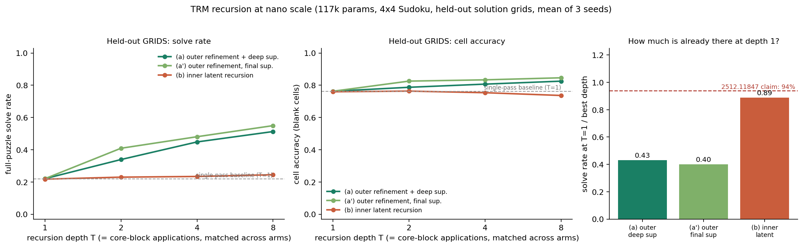

# TRM at nano scale: the outer refinement loop is the whole story, the inner latent recursion is not

**Date:** 2026-07-25 · **Status:** done (hypothesis confirmed; the TRM critique's "94% at step 1" claim splits in two)

## Hypothesis
At ~0.1M params on 4×4 Sudoku, TRM-style recursion (arXiv:2510.04871) buys accuracy mainly through the
**outer refinement loop** — repeatedly re-encoding a full candidate *solution* — rather than through
**inner latent recursion** at matched core-block applications; and, per the TRM critique
([arXiv:2512.11847](https://arxiv.org/abs/2512.11847)), most of the achievable full-puzzle solve rate is
already present at recursion depth 1.

## Method
**Model (identical across every arm and depth, 116,624 params ≈ 0.12M).** A 2-layer MLP "core"
`LN → Linear(256→192) → GELU → Linear(192→256)` operating on a flat 256-d state (16 cells × 16-d
per-cell embedding), plus an input embedding, a learned soft answer re-embedding, and a linear decode
head to 16×4 logits. The *only* thing that varies is **what the core is applied to on each of its T
applications**:

| arm | what passes between steps | supervision | decode |
|---|---|---|---|
| **(a) `outer_deepsup`** | the 4-way answer distribution over all 16 cells (a *solution*, re-embedded) — no latent carried | CE at **every** outer step (TRM-style deep supervision) | every step |
| **(a') `outer_finalsup`** | same as (a) | CE at the **final** step only (deep-supervision control) | every step |
| **(b) `inner_latent`** | the full-width 256-d latent `z` (`z ← z + core(x + z)`) | CE at the end | **once**, at the end |
| **(c) single-pass baseline** | — | — | this is exactly **T = 1**, where all three arms collapse to one core application + one decode |

**Matched compute** is exact: at a given T every arm performs T applications of the same core and has
the identical parameter count. Full backprop through the loop for all arms (no TRM 1-step gradient
approximation). Depths T ∈ {1, 2, 4, 8}; 3 seeds; 3 arms → 24 runs (T=1 arms differ only by init noise
in the unused answer-embedding).

**Data.** All 288 valid 4×4 Sudoku grids enumerated by backtracking, then split by **solution grid**:
202 train grids / 86 held-out grids. Puzzles are maskings with 4–8 givens, rejection-sampled so that
**exactly one** of the 288 grids is consistent with the givens (unique solution guaranteed). 2000 train
puzzles (mean 9.15 blanks), 800 test puzzles on **held-out grids** (the real generalization test — those
solutions are never seen in training), and 800 extra test puzzles on **train grids with unseen masks**
(the easier, memorization-friendly split). Loss over all 16 cells; metrics over blank cells only.

**Training.** 1200 steps, batch 128, AdamW lr 3e-3 (40-step warmup + cosine), wd 0.01, grad-clip 1.0.
Every arm reaches **1.000 solve rate on the training puzzles**, so this compares generalization at
converged train fit, not optimization speed.

## How to run
```bash
pip install -r requirements.txt
python run.py     # ~6.7 min, CPU, 1 thread
```

## Result

**Held-out-grid full-puzzle solve rate at T = 1 / 2 / 4 / 8** (mean of 3 seeds, `metrics.aggregate`):

| arm | T=1 | T=2 | T=4 | T=8 |
|---|---|---|---|---|
| (a) outer, deep sup. | 0.220 | 0.339 | 0.448 | **0.513** |
| (a') outer, final sup. | 0.220 | 0.409 | 0.481 | **0.550** |
| (b) inner latent | 0.218 | 0.230 | 0.234 | **0.245** |

- **The outer loop works; the inner latent recursion does not.** At matched compute T=8 the outer
  refinement loop scores **+0.268 solve rate** over inner latent recursion (0.513 vs 0.245), and
  **+0.089 cell accuracy** (0.826 vs 0.737). Seed spread is small (std ≤ 0.030), so the gap is ~9σ.
- **Inner latent recursion is nearly flat**: 0.218 → 0.245 across an 8× compute increase, i.e. +0.028
  absolute. Its held-out **cell accuracy actually decreases** with depth (0.760 → 0.737) while its
  solve rate on *seen* grids rises sharply (0.533 → 0.722). Extra latent depth buys **memorization
  capacity, not constraint propagation**.
- **The gain is the loop, not the deep supervision.** Supervising only the final step is if anything
  *better* than TRM-style deep supervision (0.550 vs 0.513 at T=8; delta −0.037, and −0.070 at T=2).
  So the answer-space refinement loop is doing the work on its own.
- **The critique's "94% at step 1" claim splits cleanly in two.** Fraction of best-depth solve rate
  already present at T=1: **0.43** (outer, deep sup.), **0.40** (outer, final sup.), **0.89** (inner
  latent). The claim is *refuted* for the outer refinement loop and roughly *confirmed* for the inner
  latent recursion.



## Takeaway
At 0.12M params, "the refinement loop, not the hierarchy, is what matters" reproduces cleanly and in a
sharper form than we expected: recursion helps **only** when the intermediate state is forced through
the answer space. Iterating a full-width latent for the same number of core applications is worth
essentially nothing on held-out solution grids — it looks like extra depth spent on fitting the
training grids instead. The likely mechanism is the bottleneck itself: passing state as a 16×4
distribution over cell values means each pass has to re-read the whole partial solution and check it
against the givens, which is exactly one round of constraint propagation; a 256-d latent is free to
carry an entangled shortcut that does not transfer to unseen grids.

This also sharpens the TRM critique rather than simply agreeing or disagreeing with it. "94% of
performance at recursion step 1" is a statement about *which* recursion you ablate: here it is close to
right for latent recursion (89%) and badly wrong for answer-space refinement (40–43%). If the critique's
ARC-scale measurement was dominated by the latent/hierarchical axis, both results can be true at once.

**For Shadow / ARC:** carry the outer answer-refinement loop into the solver, drop the inner latent
recursion, and do not assume deep supervision is load-bearing — it cost us accuracy here. Caveats: one
task, 4×4 (a 16-cell CSP with only 288 solutions), 1200 steps, and T=8 was the largest depth tested — the
outer curve is still rising, so we have not found its saturation point. Next: (i) push T to 16–32 to find
where the outer loop saturates, (ii) test **test-time** depth extrapolation (train at T=4, evaluate at
T=16), which is the property ARC actually needs, and (iii) an intermediate arm that carries a *narrow*
latent (rank 4–16) to check whether it is the bottleneck width or the answer-space semantics that matters.

## Novelty check
- Verdict: **partial-prior-art** (checked 2026-07-25 via web search; arXiv/OpenAlex APIs 403 from this box).
- Closest prior work: [Less is More: Recursive Reasoning with Tiny Networks (arXiv:2510.04871)](https://arxiv.org/abs/2510.04871)
  and [SamsungSAILMontreal/TinyRecursiveModels](https://github.com/samsungsailmontreal/tinyrecursivemodels)
  (7M params, 9×9 Sudoku-Extreme / ARC / Maze; ablates n and T but not the *information path*);
  [Tiny Recursive Models on ARC-AGI-1: Inductive Biases, Identity Conditioning, and Test-Time Compute
  (arXiv:2512.11847)](https://arxiv.org/abs/2512.11847) (the "94% at recursion step 1" critique);
  [allthingssecurity/trm_sudoku](https://github.com/allthingssecurity/trm_sudoku) (a TRM Sudoku
  reimplementation, not an ablation).
- Queries run: "Tiny Recursive Model TRM outer refinement loop vs inner latent recursion ablation
  Sudoku"; "arXiv 2512.11847 TRM critique 94% performance recursion step 1".
- How this differs: prior work varies recursion *counts* inside the full TRM architecture. This isolates
  the two recursion mechanisms as **mutually exclusive information paths through one identical 0.12M-param
  core at exactly matched core-block applications**, adds a deep-supervision control, and evaluates on
  **held-out solution grids** (not just held-out puzzles), which is what separates constraint propagation
  from memorization. No prior tiny-CPU version of this decomposition was found.
