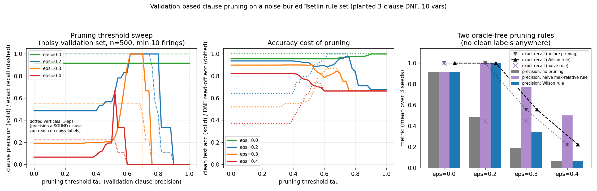

# Can validation-based clause pruning dig the planted DNF back out from under label noise?

**Date:** 2026-07-25 · **Status:** done · **Follow-up to:** `2026-07-24_tsetlin-dnf-recovery`

## Hypothesis
Yesterday's run found that label noise **buries** a Tsetlin Machine's planted rules rather than
erasing them: at ε = 0.2 all three planted clauses are still present verbatim (exact recall 1.0) but
only 49% of the distinct learned positive clauses are planted ones (clause precision 0.49); at
ε = 0.4 precision is 0.07. Hypothesis: scoring each learned clause by its **individual precision on
a held-out validation set** and pruning the low-precision ones restores clause precision to ≈1.0 at
ε = 0.2 without hurting recall or accuracy — and at ε = 0.3, where recall was already degraded
(0.556), pruning either helps or amputates the surviving true clauses.

**The validation set is drawn from the same NOISY distribution as training** (labels flipped at the
same rate ε). Clean labels are never used for pruning — only afterwards, to measure test/functional
accuracy. Assuming a clean validation set would trivialise the problem.

## Method
- Reuses `2026-07-24_tsetlin-dnf-recovery`'s pure-numpy Tsetlin Machine and planted-DNF generator
  verbatim (copied into this folder so it is self-contained). Same planted DNF
  (x0∧x1∧¬x2) ∨ (¬x3∧x4∧x5) ∨ (x6∧¬x7∧¬x8) over 10 boolean vars, same TM config (20 clauses, T=10,
  s=3.0, 100 states, 60 epochs, 3000 train samples), same rng streams — the baselines here
  **reproduce yesterday's per-run numbers exactly** (`max_abs_diff_vs_2026_07_24 = 0.0` over 12
  matched runs, recorded in `results.json`).
- ε ∈ {0.0 (control), 0.2, 0.3 (the burial regime), 0.4 (stress)} × seeds {0,1,2} = 12 trained TMs.
- After training, each clause j (both polarities) is scored on a noisy validation set of n samples
  by its coverage (how often it fires) and its **validation precision**
  P(y_val = clause polarity | clause j fires).
- Three post-hoc treatments, all label-noise-blind:
  1. **Threshold sweep** — drop every clause with validation precision < τ, for 51 values of τ, at
     validation sizes n ∈ {100, 500, 2000} and minimum-firing counts {1, 10, 25}. This is the
     *oracle* upper bound: it shows what a noisy validation set could in principle deliver.
  2. **Naive max-relative rule** (oracle-free) — keep clauses with precision ≥ 0.95 × the best
     scoreable clause's precision.
  3. **Wilson rule** (oracle-free, statistically corrected) — a *sound* clause's validation
     precision concentrates at 1−ε, which is unknown; estimate that ceiling as the largest Wilson
     **lower** bound over clauses covering ≥5% of the validation set, and keep every clause whose
     Wilson **upper** bound still reaches it.
  Plus a soft **weighting** variant (weight = excess precision over the validation base rate) that
  reweights the vote instead of pruning.
- Re-measured after each treatment: clause precision, exact clause recall, mean best Jaccard, clean
  test accuracy, functional accuracy on all 1024 inputs, fraction of kept clauses that are logically
  **sound**, and **DNF read-off accuracy** — the accuracy you get by reading the surviving positive
  clauses off as a plain disjunction, i.e. the quality of the interpretable artifact itself.
- CPU-only, single-threaded, 12 trained models, 237 s wall clock total. Nothing was shrunk relative
  to the backlog spec; ε = 0.0 and 0.4 were *added* as control and stress cases because training is
  cheap.

## How to run
```bash
pip install -r requirements.txt
python run.py
```

## Result
**Hypothesis confirmed at ε = 0.2, partially at ε = 0.3, refuted at ε = 0.4** — and the noise rate
itself, not clean labels, is what a pruning rule really needs to know.

Headline, oracle-free **Wilson rule** with a 500-sample noisy validation set (mean of 3 seeds):

| ε | clause precision | exact recall | test acc | DNF read-off acc | distinct pos clauses |
|---|---|---|---|---|---|
| 0.0 | 0.917 → 0.917 | 1.0 → 1.0 | 0.956 → 0.976 | 1.000 → 1.000 | 3.3 → 3.3 |
| **0.2** | **0.486 → 1.000** | **1.0 → 1.0** | 0.937 → 0.890 | **0.643 → 1.000** | 6.3 → 3.0 |
| 0.3 | 0.192 → 0.340 | 0.556 → 0.556 | 0.899 → 0.857 | 0.521 → 0.711 | 8.7 → 5.0 |
| 0.4 | 0.067 → 0.067 | 0.222 → 0.222 | 0.824 → 0.821 | 0.373 → 0.373 | 9.7 → 9.7 |

- **ε = 0.2 is a clean win.** Precision goes 0.486 → **1.000** with **no recall loss** (1.0 → 1.0) in
  all three seeds; the surviving positive clause set is *exactly* the three planted clauses, and
  reading them off as a DNF is now **functionally perfect** (read-off accuracy 0.643 → 1.000). The
  pruned TM *vote* costs 4.7 accuracy points (0.937 → 0.890) because pruning is applied to both
  polarities and unbalances the vote — but the oracle sweep shows this is not intrinsic: at
  τ = 0.74 you get precision 1.0, recall 1.0, read-off 1.0 **and** test accuracy **0.978**, above the
  unpruned 0.937.
- **ε = 0.3: pruning does not amputate.** Recall stays at its already-degraded 0.556 for every rule
  and every threshold in the working band — pruning never removed a planted clause that training had
  kept. The Wilson rule only gets precision to 0.34 at n=500, but that is a *sample-size* limit, not
  a fundamental one: with n = 2000 validation samples the same rule reaches precision **1.000** with
  recall still 0.556. The oracle sweep confirms the information is there even at n=500
  (τ ∈ [0.62, 0.68] → precision 1.0, recall 0.556).
- **ε = 0.4 is beyond rescue.** Nothing separates: precision stays 0.067, the rule keeps all 10
  clauses, and even the best oracle threshold only reaches 0.667 precision. At that noise level the
  true clauses' validation precision (≈0.6) is no longer distinguishable from the spurious ones'.
- **Why it works — and where the difficulty actually lives.** A sound clause's validation precision
  concentrates at **1−ε**, so the useful thresholds form a narrow band just below 1−ε (visible as
  the cliff at the dotted verticals in the chart's left panel). The problem is therefore not "no
  clean labels" but "unknown ε": the naive max-relative rule **amputates** badly (ε=0.2: precision
  1.0 but recall 1.0 → **0.444**, accuracy 0.937 → 0.820) because a low-coverage clause that gets
  lucky sets the ceiling too high. Replacing the raw max with a Wilson lower bound over
  well-covered clauses fixes exactly that failure; the rule's implied ε̂ was 0.28 at ε=0.2, 0.38 at
  ε=0.3 and 0.54 at ε=0.4 — accurate where it works, over-estimated where it fails.
- **Soft weighting is safer but weaker.** Weighting the vote by excess validation precision moves
  the weight mass on planted clauses from 0.667 → 0.858 (ε=0.2) and 0.200 → 0.416 (ε=0.3) without
  ever removing anything, and keeps accuracy at 0.910/0.810 — it de-emphasises clutter but never
  produces a clean rule list.
- The ε = 0.0 control shows pruning is harmless when there is nothing to clean (precision 0.917
  unchanged, accuracy 0.956 → 0.976).



## Takeaway
Yesterday's burial is **reversible, and cheaply**: a few hundred *noisily labelled* held-out samples
are enough to turn a 49%-precision clause list at ε = 0.2 into the exact planted DNF, with zero
recall loss and no clean labels anywhere. The catch is that the pruning threshold has to sit just
below 1−ε, so the practical problem reduces to estimating the noise rate from the clause-precision
distribution itself — a naive "keep the best" rule amputates true clauses, a Wilson-lower-bound
ceiling estimate does not. Validation size buys noise tolerance (n=500 cleans ε=0.2, n=2000 cleans
ε=0.3), and past ε ≈ 0.4 the signal is gone entirely. Practical recipe for TM interpretability:
prune clauses by validation precision against a Wilson-estimated 1−ε ceiling, and report the pruned
clause list, *not* the raw one — but keep the unpruned machine for prediction, since pruning both
polarities can cost a few accuracy points.

Next: estimate ε̂ jointly across clauses (a mixture over the precision histogram) instead of from the
best clause alone; and prune positive/negative polarities with a re-calibrated vote threshold so the
accuracy cost disappears.

## Novelty check
- Checked on 2026-07-26 via web search (arXiv/OpenAlex APIs 403 from this environment, as recorded
  in prior runs). Queries: *"Tsetlin machine clause pruning validation precision noisy labels rule
  extraction"*; *"weighted Tsetlin machine clause weighting spurious clauses interpretability arXiv
  2002.01245"*.
- Verdict: **partial-prior-art**. Clause/literal pruning and clause weighting for TMs are
  established — weighted TM ([1911.12607](https://arxiv.org/abs/1911.12607),
  [2005.05131](https://arxiv.org/abs/2005.05131),
  [regression TM 2002.01245](https://arxiv.org/abs/2002.01245)), literal pruning for explainability
  ([2411.04557](https://arxiv.org/abs/2411.04557)), clause-size constraints
  ([IJCAI 2023](https://www.ijcai.org/proceedings/2023/0378.pdf)), Drop Clause
  ([2105.14506](https://arxiv.org/abs/2105.14506)).
- How this differs: those methods change training to get compact models. Here pruning is **post
  hoc**, scored on a **noisily labelled** validation set, and evaluated against a **planted
  ground-truth DNF** — so we can state exactly when it restores clause precision to 1.0, when it
  amputates true clauses, and that the binding constraint is the unknown noise rate 1−ε rather than
  the absence of clean labels.
