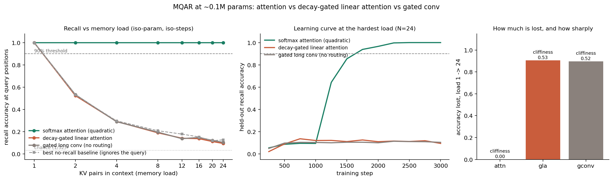

# MQAR at nano scale: does a decay-gated linear-attention mixer fall off a capacity cliff, or degrade gracefully?

**Date:** 2026-07-25 · **Status:** done (hypothesis half-confirmed, half-refuted — the interesting half is the refutation)

## Hypothesis
On hand-rolled MQAR at ~0.1M params, softmax attention holds ≥90% recall at every KV load while a
decay-gated linear-attention mixer degrades as load grows and a gated long-convolution (no
content-based routing) fails hardest. The fresh question from the backlog was the **shape** of the
linear mixer's failure: a sharp capacity cliff at a load threshold, or a graceful slide?

## Method
- **Task (hand-rolled MQAR, after [zoology](https://arxiv.org/abs/2312.04927); the repo is NOT cloned
  — its `mamba_ssm`/`causal-conv1d`/`fla` extras want CUDA).** Fixed 52-token context:
  `[k1 v1 … kN vN] [PAD …] [q1 q2 q3 q4]`. Keys are tokens 0–31, values 32–63, PAD 64 (vocab 65).
  Keys within a sequence are distinct, values are i.i.d., the 4 query keys are a distinct subset of
  the N present keys. Loss and accuracy live **only** at the 4 query positions. Values are
  re-randomised per sequence, so nothing is memorisable across sequences — it is pure in-context
  recall. Context length and query count are held **fixed**; only N varies, and the slack is PAD.
- **Three mixers** in an identical pre-LN residual block (2 layers, d_model 64, 4 heads, learned APE):
  - `attn` — causal multi-head softmax attention (the quadratic reference).
  - `gla` — **decay-gated linear attention**, RetNet/GLA-flavoured, written in its parallel form:
    `A[t,s] = ⟨φ(q_t), φ(k_s)⟩ · exp(c_t − c_s)` with `φ = elu+1`, a per-head input-dependent scalar
    decay gate `g_t = σ(w_g·x_t)`, cumulative log-decay `c`, sum-normalised, then a SiLU output gate.
    Decay biases init RetNet-style to `1 − 2^−(3+head)` (memory spans ~8–64 tokens). This is the
    backlog's "add your own pure-PyTorch mixer" arm.
  - `gconv` — gated long depthwise causal convolution (H3/Hyena-lite): `proj(u ⊙ conv(v))` with a
    learned full-context per-channel kernel. Multiplicative gating, but **no content-based routing**.
- **Iso-param.** `d_ff` is binary-searched per mixer to hit 100k params: attn 212 / gla 179 /
  gconv 218 → 99,880 / 100,078 / 99,892 params. **Spread 0.198%.**
- **Iso-step.** 3000 steps, batch 64, AdamW lr 3e-3 (100-step warmup), wd 0.01, grad-clip 1.0, for
  every mixer. No run hit the time cap.
- **Curriculum (deliberate deviation, see caveats).** One model per mixer, trained on a uniform
  mixture of loads N ~ U{1..24}, then evaluated separately at loads {1,2,4,8,12,16,20,24} on
  byte-identical held-out sets (256 sequences each).
- **No-recall baselines.** Because a model can score well without any matching, `results.json` also
  reports three query-ignoring strategies per load (pick a uniformly random value present in context;
  pick the mode of present values; pick the most recent value) and the per-mixer margin over the best
  of them. This is what makes the result readable.
- 3 training runs, 810s (13.5 min) total on one CPU thread.

## How to run
```bash
pip install -r requirements.txt
python run.py
```

## Result

**Attention holds 1.000 at every load. Both sub-quadratic mixers sit *on the no-recall baseline* at
every load ≥ 2 — they never learned associative recall at all.**

| KV load N | 1 | 2 | 4 | 8 | 12 | 16 | 20 | 24 |
|---|---|---|---|---|---|---|---|---|
| **attn** (softmax) | 1.000 | 1.000 | 1.000 | 1.000 | 1.000 | 1.000 | 1.000 | **1.000** |
| **gla** (decay-gated linear) | 1.000 | 0.523 | 0.291 | 0.190 | 0.141 | 0.137 | 0.111 | **0.094** |
| **gconv** (no routing) | 1.000 | 0.532 | 0.289 | 0.195 | 0.137 | 0.148 | 0.121 | **0.104** |
| *best no-recall baseline* | *1.000* | *0.529* | *0.297* | *0.208* | *0.178* | *0.152* | *0.118* | *0.126* |

- **Headline metric — first load below 90%:** attention **never** (holds at N=24, the largest tested);
  gla **N=2**; gconv **N=2**. Chance is 1/32 = 0.031.
- **The decay-gated linear mixer's margin over the best query-ignoring baseline is ≤ 0 at every load
  ≥ 2** (−0.006, −0.006, −0.019, −0.037, −0.016, −0.007, −0.032). gconv is the same (max +0.003).
  The apparently graceful ~1/N decay in both rows is *entirely* the guessing baseline: the two
  models learned "emit a value token that appears in this context" and nothing else.
- Whole-sequence exact match (all 4 queries right) makes it starker: attention 1.000 at every load;
  gla and gconv are **0.000 at every load ≥ 4** (0.082 / 0.102 at N=2).
- Load 1 is free for everyone (there is only one value to emit) — the baseline is 1.000 there too.
- Attention's learning curve at N=24 is a clean phase transition: 0.094 at step 1000 → 0.643 (1250)
  → 0.855 (1500) → 0.939 (1750) → 1.000 by step 2500.
- The two sub-quadratic curves are **statistically indistinguishable from each other**: the
  decay-gated linear-attention mixer, which has content-based routing, performs exactly like the
  gated convolution, which has none.



## Takeaway
The zoology headline reproduces at 0.1M params and 13 minutes of CPU — attention solves MQAR at every
load we could test, sub-quadratic mixers do not — but **the backlog's actual question, "cliff or
graceful?", turns out to be ill-posed at this budget, and that is the finding.** The gated linear
mixer does not fall off a capacity cliff *and* does not degrade gracefully; it never gets on the
curve. Its recall-vs-load line is the no-matching guessing baseline to within ±0.04 from N=2 onward,
so reading a "capacity" shape off it would be reading structure into the task's chance floor. The
"cliffiness 0.53, max drop between 1→2" that `results.json` computes is an artefact of exactly this —
which is why the no-recall baseline is in the metrics and on the chart. Anyone sweeping KV load
against a sub-quadratic mixer should plot that baseline before claiming a capacity curve.

The honest boundary on the claim is **compute, not capacity**. This is an iso-step (3000-step)
comparison; the gla arm's state (4 heads × 16 × 16 = 1024 scalars) is not obviously too small for 24
KV pairs, so the right reading is "at matched params and matched steps the linear mixer fails to
*learn* recall while attention learns it in ~1250 steps", not "the linear mixer cannot represent it".
Separating those needs a 10–50x longer run, which is the obvious next experiment. Two method notes
that cost most of the day and generalise beyond this item: (1) **batch size is the binding constraint
on recall-circuit formation** — at batch 16, *no* mixer including attention left chance in 10,000
steps; at batch 64 attention broke through in ~1250. (2) **Embedding init is load-bearing**: the
GPT-standard std 0.02 on both tables stalls MQAR (`nn.Embedding`'s default std 1.0 solves N=4 in ~750
steps), presumably because the previous-token head needs the position signal to be comparable in
scale to the token signal. Both are in `experiment.yaml` as explicit knobs.

**Caveats.** One seed. One GLA design — the sum-normalised elu+1 formulation is one point in a large
space (DeltaNet's delta rule, Based's Taylor feature map, and larger head dims are all known to help
recall), so this is evidence about *this* mixer, not about gated linear attention in general. The
curriculum (train on mixed loads, evaluate per load) is a deviation from a per-load training sweep,
forced by the time-box: in pilots a model trained on a *single* fixed load N≥8 never left chance in
10k steps for any mixer, while fixed N=4 was solved in ~750 steps — we did not disentangle whether
that fixed-load solution is positional. Iso-step is not iso-wall-clock (attn 236s, gla 375s,
gconv 197s for the same 3000 steps). Loads stop at 24 because the context is 52 tokens.

## Novelty check
- Verdict: **replication (with a new control)** — the core ranking is zoology's own result; the
  no-recall-baseline framing and the nano-scale/iso-param/iso-step setting are the additions.
- Checked 2026-07-26. `scripts/novelty_check.py` returned `unchecked` (arXiv/OpenAlex 403 from this
  environment, as the brief documents); verified via web search + fetch instead.
- Closest prior work:
  [Zoology: Measuring and Improving Recall in Efficient Language Models (arXiv:2312.04927)](https://arxiv.org/abs/2312.04927)
  and [HazyResearch/zoology](https://github.com/HazyResearch/zoology) — the MQAR synthetic and the
  attention-vs-gated-conv result. Its abstract was fetched and confirms the framing (gated
  convolutions solve simple AR perfectly yet underperform on language, motivating MQAR).
  [Based / "Simple linear attention language models balance the recall-throughput tradeoff"
  (arXiv:2402.18668)](https://arxiv.org/pdf/2402.18668) is the direct follow-up on linear-attention
  recall capacity.
  [Kernelized Linear Attention (arXiv:2607.17419)](https://arxiv.org/abs/2607.17419) was fetched and
  states linear attention "degrades **sharply** on associative recall" — the closest published
  statement on the cliff-vs-graceful question, and the claim this experiment set out to shape-check.
- How this differs: zoology sweeps model dimension at a training budget far larger than a 13-minute
  CPU box, and its published curves do not carry an explicit query-ignoring baseline. To our search,
  no prior work reports the sub-quadratic MQAR curve *against* that baseline, which is what shows the
  smooth decay to be chance rather than capacity, nor at ~0.1M params under a strict iso-param
  (0.198% spread) and iso-step control. The finding that a decay-gated linear mixer is
  indistinguishable from a routing-free gated conv at this scale is a sharper version of the
  published claim than "it degrades".
