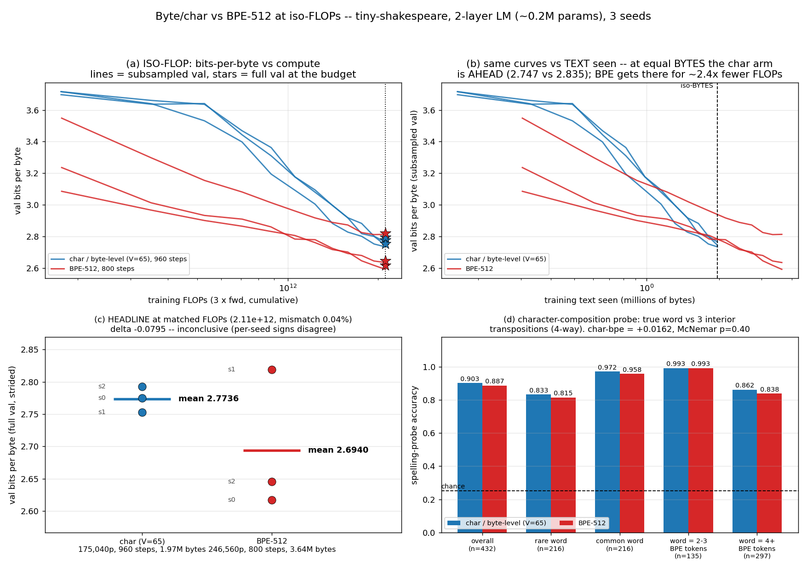

# Byte/char vs BPE at iso-FLOPs: bits-per-byte and a spelling probe

**Date:** 2026-07-26 · **Status:** done (headline INCONCLUSIVE, probe NULL — both honest negatives)

## Hypothesis
At fixed training compute, BPE wins validation **bits-per-BYTE** (it packs more text into each
forward pass), but a character/byte-level model wins a **character-composition (spelling)** probe,
because it is forced to model orthography explicitly.

## Result in one line
At 2.11e12 training FLOPs matched to 0.04%, **BPE-512 is 0.080 bpb better on the mean (2.694 vs
2.774) but this does not survive 3 seeds** — one of three seeds flips the sign, and the BPE arm's
seed-to-seed SD (0.109 bpb) is 5.5x the char arm's (0.020). The spelling probe goes in the
predicted direction (char 0.903 vs BPE 0.887) but is **not significant** (paired McNemar p = 0.40).
The one clean, sign-stable finding is the *third* number: at equal training **BYTES** the char arm
is ahead by 0.087 bpb — BPE's headline edge is throughput, not per-byte learning.

## Method

### Architecture (identical trunk in both arms)
nanoGPT-style decoder-only pre-norm LM: 2 layers, d_model 80, 4 heads, d_ff 320 (GELU), learned
absolute positions, ctx **128 tokens**, untied head, AdamW + 60-step warmup + cosine to 0.1x,
grad clip 1.0, wd 0.01 on 2-D weights. Only the vocab-facing matrices differ:

| arm | vocab | params | bytes/token | effective ctx in bytes |
|---|---|---|---|---|
| char (byte-level) | 65 | 175,040 | 1.000 | 128 |
| BPE | 512 | 246,560 | 2.220 | 284 |

BPE is a hand-rolled greedy merge loop (447 merges) fitted **on the train split only** — the
approach is reused from `experiments/2026-07-26_weight-tying-tiny/run.py`. Corpus:
tiny-shakespeare, 1,115,394 bytes, pure ASCII (verified with `assert text.isascii()`), so
1 char == 1 byte exactly. 90/10 train/val split.

### THE CONTROL: iso-FLOPs, not iso-steps
A BPE token covers 2.22 bytes, so at the same context length in *tokens* the BPE arm sees 2.22x
more *text* per forward pass. Comparing at equal steps would be meaningless. We equalise total
training FLOPs with an explicit, auditable model (embedding *lookup* is free, the output head is a
real matmul and is counted, attention uses the causal average over positions):

```
fwd_flops_per_token = 2*[ n_layer*(4*d^2 + 2*d*d_ff) + d*V ] + n_layer*2*ctx*d
train_flops         = 3 * fwd_flops_per_token * tokens_processed
```

|  | char | BPE |
|---|---|---|
| matmul params / token | 158,800 | 194,560 |
| fwd FLOPs / token | 358,560 | 430,080 |
| **steps at the same FLOP budget** | **960** | **800** (anchor) |
| tokens processed | 1,966,080 | 1,638,400 |
| **bytes of text seen** | **1,966,080** | **3,636,954** (1.85x more) |
| epochs over the 1.004M-byte train split | 1.96 | 3.62 |
| total train FLOPs | 2.1149e12 | 2.1139e12 |

FLOP mismatch **0.045%**. The char arm gets 1.20x *more* optimisation steps (its head is 80x65,
not 80x512); the BPE arm still sees 1.85x more *bytes*. That asymmetry is the mechanism under
test, not a confound.

### Headline metric: validation bits per BYTE
Total NLL in bits over the val text divided by the number of val **bytes actually predicted** —
never bits-per-token, which is incomparable across vocabularies (BPE's bits-per-token is 5.80 vs
char's 2.774, and that number means nothing on its own). Evaluation is **strided**: windows of 128
tokens at 50% overlap, scoring only each window's second half, so every scored token has >= 64
tokens of context and neither arm is penalised by cold-start block boundaries. Byte coverage of
the val split: 99.95% (char) / 99.97% (BPE), i.e. both arms are scored on essentially the same text.

### Second metric: character-composition (spelling) probe
144 words drawn from the **val** split (72 rare: train count <= 3; 72 common: train count >= 30;
all >= 6 chars). For each word, 3 distractors are made by transposing an adjacent **interior**
character pair (first and last character fixed) — every distractor has the identical character
multiset and length, so the task is pure orthographic composition, not lexical frequency. Each
model scores the **complete string** `context(96 bytes) + candidate` under its own canonical
tokenisation and must rank the true spelling first. 4-way choice, chance 0.25. Scoring complete
strings (rather than prompting mid-word) is what makes this exact and fair: it sidesteps BPE's
mid-word prompt-boundary problem entirely. We also report the incremental bits-per-byte of the
true word, `[logP(ctx) - logP(ctx+word)] / (ln2 * len(word))`.

### Fairness: per-arm lr probe
A shared lr would be the obvious way to accidentally handicap one arm, so the lr is swept per arm
(240/200 steps at seed 0, iso-FLOP scaled) over {1.5e-3, 3e-3, 6e-3} with an automatic edge
extension. **Both arms independently selected 1.2e-2**, the extended point, and both were still at
the grid edge — see caveats.

## How to run
```bash
pip install -r requirements.txt
python run.py     # ~9.5 min, CPU, 1 thread
```

## Result



### (1) Headline — val bits per byte at matched FLOPs

| arm | seed 0 | seed 1 | seed 2 | mean | seed SD |
|---|---|---|---|---|---|
| char (V=65) | 2.7752 | 2.7530 | 2.7925 | **2.7736** | 0.0198 |
| BPE-512 | 2.6173 | 2.8191 | 2.6457 | **2.6940** | 0.1092 |
| delta (BPE − char) | −0.158 | **+0.066** | −0.147 | −0.0795 | — |

**Verdict: inconclusive.** The mean favours BPE by 0.0795 bpb, but seed 1 flips the sign, and the
mean gap is only 0.39x the BPE arm's own seed spread (0.202). Welch t on the three-seed means
(arithmetic on the table above, not computed in `run.py`) is t = −1.24, df ≈ 2.1 — nowhere near
significance. The *direction* is BPE's, as hypothesised; the *evidence at this scale* is not.

A finding in its own right: **the larger-vocab arm is 5.5x more seed-unstable** (SD 0.109 vs
0.020) at a matched, aggressive lr. The bad BPE seed is not a late divergence — it is already
0.46 bpb behind at the first checkpoint (step 67) and never recovers, so it is early-training
sensitivity, not a loss spike.

### (2) Secondary — at iso-BYTES the char arm wins
Reading both arms' curves at the number of training bytes the char arm actually consumed
(1.97M), char is at 2.747 and BPE at 2.835: **char is 0.087 bpb ahead per byte of text**, and this
reading is sign-stable across seeds (panel b: the blue curves cross below the red ones). This is
*not* a compute-matched comparison — BPE reaches that byte count for ~2.4x fewer FLOPs — but it
localises the mechanism: BPE's iso-FLOP edge comes from **data throughput**, not from learning
more per byte. (Uses the subsampled curve eval, so not directly comparable to the headline number.)

### (3) Spelling probe — right direction, null result

| bin | n | char | BPE | char − BPE |
|---|---|---|---|---|
| overall | 432 | **0.903** | 0.887 | +0.016 |
| rare word (train count <= 3) | 216 | 0.833 | 0.815 | +0.019 |
| common word (>= 30) | 216 | 0.972 | 0.958 | +0.014 |
| word = 2–3 BPE tokens | 135 | 0.993 | 0.993 | 0.000 |
| word = 4+ BPE tokens | 297 | 0.862 | 0.838 | +0.024 |

Paired McNemar over matched items x seeds: 29 char-only-correct vs 22 BPE-only-correct,
**p = 0.40**. Restricted to 4+-token words: 28 vs 21, p = 0.39. **Not significant anywhere.**

Three honest observations that do survive:
- The entire (small) char edge lives on the **4+-BPE-token** words. On words BPE spells in 2–3
  tokens both arms are at 0.993 — the probe is at ceiling there, so it cannot discriminate.
- BPE is **more confident yet slightly less accurate**: mean correct-vs-best-distractor margin
  8.91 bits vs char's 6.67 (12.9 vs 9.0 on common words). Bigger margins, marginally worse
  ranking.
- Incremental bits-per-byte on the word itself splits by rarity in the predicted direction:
  on **rare** words char 3.974 vs BPE 4.097 (char better), on **common** words char 2.778 vs BPE
  2.712 (BPE better). Overall a wash (3.376 vs 3.405).

At V=512 **no probe word was a single BPE token** (minimum 2, median 4), so the backlog's
"single-BPE-token vs multi-token" split degenerates into the 2–3 vs 4+ split reported above. That
is a property of a 512-symbol vocabulary on 1M bytes of Shakespeare, not a design choice.

## Takeaway
At ~0.2M params and 2.1e12 FLOPs on 1M bytes of Shakespeare, **there is no reliable difference
between a byte-level and a BPE-512 model on either axis** — which the backlog names as a fully
successful outcome, and which is the correct answer at this scale rather than a failure to find
one. The decomposition is the useful part: BPE's mean bits-per-byte advantage is bought entirely
with **throughput** (1.85x more text at the same FLOPs), because at equal *bytes* the char arm is
ahead by 0.087 bpb; and the spelling advantage bytes are supposed to buy is +0.016 accuracy, five
times smaller than the between-seed noise on the primary metric.

Two things would be worth doing next, in order. **(a) More seeds and an interior lr.** Both arms
picked the grid-edge lr 1.2e-2 on a 25%-length probe, and the BPE arm's 0.109 SD at that lr is the
single reason the headline is inconclusive; 5 seeds at a stability-selected lr would settle the
sign for ~2x this run's compute. **(b) A harder probe.** Transposition discrimination is at
ceiling (0.993) on short words; the discriminating regime is long, rare, multi-token words, so the
probe should be restricted there and made 6- or 8-way. It is also worth noting that the probe as
built is *biased toward BPE*: a BPE model assigns probability only to its canonical tokenisation,
a lower bound on the true string probability that is looser for the odd distractor strings — so
the true char edge is, if anything, slightly larger than +0.016.

## Deviations from the backlog spec
- **enwik8-1M → tiny-shakespeare**, per `AGENT_BRIEF.md` ("if the backlog says TinyStories/enwik8,
  substitute tiny-shakespeare and note it"). This matters for the hypothesis: Shakespeare is a
  small, highly repetitive, 65-symbol ASCII corpus, so 447 merges only buy 2.22 bytes/token where
  a real BPE on enwik8 would buy 3–4. BPE's throughput advantage here is therefore about half
  what the backlog assumed.
- Shrunk to fit the 12-minute box: 0.18–0.25M params, 2 layers, 800/960 steps, **3 seeds** (the
  backlog said 2; a 2-seed pilot showed a 0.20 bpb spread in the BPE arm, so a third was added and
  it is what turned an apparent BPE win into an inconclusive one).
- At iso-FLOPs on a 1.0M-byte corpus the BPE arm necessarily makes 3.6 epochs against the char
  arm's 2.0. Per `2026-07-26_data-repetition-epochs` (naive knee at R=1.7, coverage-corrected knee
  8.6 < R <= 34), 3.6 epochs is past the naive knee but well inside the corrected one — so this
  asymmetry slightly *disfavours* BPE and does not explain away its mean advantage.
- Two arms only; no vocab-size sweep, no byte-vs-char distinction (identical on ASCII), no
  BLT-style patching arm.

## Caveats
1. **3 seeds.** The primary metric is not resolved. Do not cite the −0.0795 as a BPE win.
2. **lr at the grid edge.** Both arms selected 1.2e-2, the extended endpoint, on a 240/200-step
   probe — i.e. neither optimum is bracketed above. The saving grace for *fairness* is that both
   arms landed on the same value from independent sweeps, and the char arm's curve is nearly flat
   there (3.5408 at 6e-3 vs 3.5352 at 1.2e-2, a 0.0056 bpb gain), so neither arm is handicapped
   relative to the other. The saving grace for *stability* is absent: this lr is likely the cause
   of the BPE arm's 0.109 SD.
3. **Undertrained.** 2–3.6 epochs, ~2.7 bpb; both arms are still descending steeply at the budget
   (panel a). Rankings can move with longer training.
4. **One FLOP model.** The accounting counts the output head as a matmul and embedding lookups as
   free. A different (defensible) convention — e.g. counting embedding params in "N" — would
   change the 1.20x step ratio and could move the headline by a few hundredths of a bpb.
5. The probe's canonical-tokenisation lower bound biases *toward* BPE (see Takeaway).
6. Single shared 2-core box; wall-clock numbers are not benchmarks.

## Novelty check
- **Verdict: partial-prior-art (replication-in-miniature with an added iso-BYTES control).**
- Checked 2026-07-26. `scripts/novelty_check.py` returned `unchecked` (arXiv and OpenAlex both 403
  from this environment, as documented). Verdict rests on 3 WebSearches plus a direct fetch of
  arxiv.org/abs/2412.09871:
  - `byte-level vs BPE tokenizer iso-FLOP comparison bits-per-byte spelling character tasks small language model`
  - `ByT5 byte-level models character-level tasks spelling advantage compute matched comparison subword`
  - `"character-level" vs BPE language model matched compute "bits per byte" tiny shakespeare nanoGPT ablation`
- **Closest prior work.** ByT5 ([2105.13626](https://arxiv.org/abs/2105.13626)) establishes that
  byte-level models are more robust to orthographic noise and better on spelling-sensitive tasks
  while paying a compute/throughput penalty. BLT ([2412.09871](https://arxiv.org/abs/2412.09871))
  is the direct methodological ancestor of the control used here — a verbatim fetch confirms it is
  "the first FLOP controlled scaling study of byte-level models up to 8B parameters and 4T
  training bytes", claiming better scaling for fixed *inference* cost. Both the metric
  (bits-per-byte) and the axis (bytes vs subwords under a compute control) are prior art.
- **How this differs.** Not a novel question — a novel *regime*, run 4+ orders of magnitude below
  the published studies (0.2M params, 2.1e12 FLOPs, 1M bytes) with the full accounting written out
  so it can be audited, and with an explicit iso-BYTES reading alongside the iso-FLOPs one that
  separates "BPE reads faster" from "BPE learns more per byte". The result is a **negative**: at
  this scale the effect BLT and ByT5 measure is smaller than three-seed noise. That is a useful
  boundary marker for this lab's own tiny-scale ablations — it says a 2- or 3-seed tiny-scale
  tokenizer comparison cannot resolve a 0.08 bpb effect, and it quantifies the seed budget that
  would.
