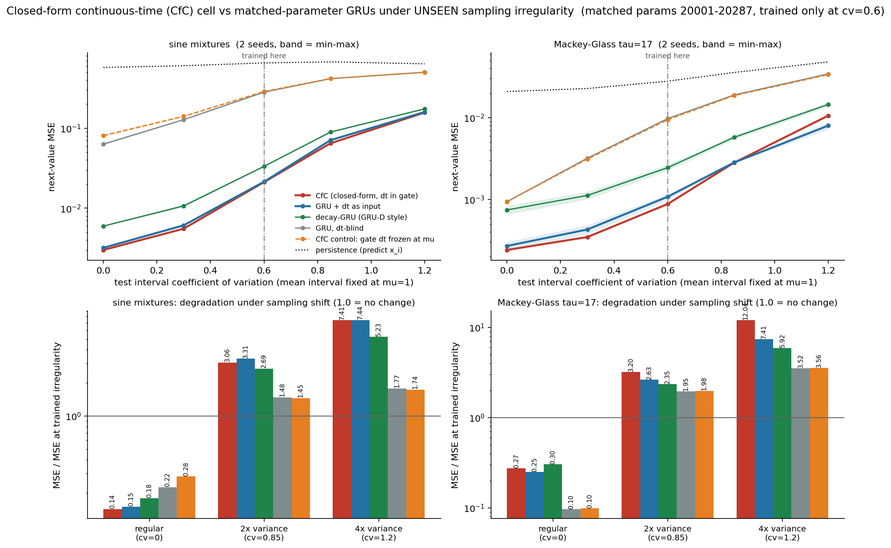

# CfC (closed-form continuous-time / "liquid") vs dt-blind, dt-as-input and decay GRUs under UNSEEN sampling irregularity

**Date:** 2026-07-26 · **Status:** done (hypothesis half-confirmed, half-refuted — the honest "dt-as-input matches CfC" outcome)

## Hypothesis
A hand-rolled CfC cell (Hasani et al., [arXiv:2106.13898](https://arxiv.org/abs/2106.13898), Eq. 10),
whose state-mixing coefficient is a closed-form sigmoid of the elapsed time `dt`, **degrades
gracefully when the test sampling irregularity is 2–4x more variable than anything seen in training,
while a dt-blind GRU collapses** — but the honest question under test is whether simply appending
`dt` as an input feature to a matched-parameter GRU already closes that gap.

## Method

### The cell (hand-rolled — no `ncps`, no `raminmh/CfC` clone)
Exactly Eq. (10) of arXiv:2106.13898:

> x(t) = σ(−f(x, I; θ_f) t) ⊙ g(x, I; θ_g) + (1 − σ(−[f(x, I; θ_f)] t)) ⊙ h(x, I; θ_h)

implemented in the parametrisation of the official `CfCCell` (raminmh/CfC, `ncps`): a shared
`tanh` backbone over `z = [input ; state]` feeding four linear heads — `ff1` (= h), `ff2` (= g),
`time_a` (= −f) and `time_b` — with

```
c      = sigmoid(time_a(z) * dt + time_b(z))
state' = (1 - c) * ff1(z) + c * ff2(z)
```

`time_b` is an elapsed-time-independent bias that the reference implementation has and Eq. (10)
as printed does not; without it the mixing coefficient is pinned to 0.5 at `dt = 0`. Everything
else is Eq. (10) verbatim, and **the mixing coefficient is the only place `dt` enters**.

### Arms (5, all at matched parameters, 20 001–20 287 = ±0.7%)
| arm | how `dt` reaches the state | hidden | params |
|---|---|---|---|
| `cfc` | closed-form σ(−f·dt + b) mixing coefficient (Eq. 10) | 63 | 20 287 |
| `gru_dt` | `dt` concatenated to the input — **the cheap fix the CfC has to beat** | 80 | 20 241 |
| `decay_gru` | GRU-D-style per-unit exponential state decay `h ← h·exp(−dt·softplus(w))` before the GRU update | 80 | 20 081 |
| `gru_blind` | not at all | 80 | 20 001 |
| `cfc_fixed_dt` | **control**: identical CfC, but the gate always sees `dt = µ` | 63 | 20 287 |

`cfc_fixed_dt` is the control that separates "the CfC architecture" from "the CfC uses `dt`".
`gru_blind`/`gru_dt` use the fused `nn.GRU` (identical recurrence and identical parameter shapes
as `nn.GRUCell`; purely a speed choice), the other three run an explicit Python-loop scan.

### Task
Every arm runs the *same* recurrence:

```
h_{i+1}    = Cell(x_i, h_i, dt_i),   dt_i = t_{i+1} - t_i
yhat_{i+1} = W h_{i+1} + b           -> target x_{i+1}
```

`dt_i` is *simultaneously* the elapsed time of the state update **and the forecast horizon**, so
the task is well posed for a model that sees `dt` and genuinely under-determined for one that does
not — that is exactly the property under test, not a handicap bolted on.

Two continuous-time signal families, both generated in `run.py`:
- **sine mixtures** (primary): `x(t) = Σ_{k=1,2} a_k sin(2π f_k t + φ_k)`, per-sequence random
  `a ~ U(0.5,1.5)`, `f ~ U(0.03,0.20)`, `φ ~ U(0,2π)`, per-sequence variance normalised to 1.
  Each sequence is a *different function*, so the model must identify it in context.
- **Mackey-Glass τ=17** (secondary): the RK4 integrator reused from
  `experiments/2026-07-25_esn-reservoir/`, but kept **dense** (grid step 0.05, no subsampling) so it
  can be sampled at arbitrary continuous times by linear interpolation; `tanh(x−1)` squashed then
  standardised; sequences are random windows of one 3300-time-unit trajectory.

### The irregularity sweep (what is varied)
Intervals are drawn `Δ ~ Gamma(k = 1/cv², scale = µ/k)`, giving **mean exactly µ = 1 and coefficient
of variation exactly `cv`**, nothing clipped. Training is at **`cv = 0.6` only**. Evaluation is at
`cv ∈ {0.0, 0.3, 0.6, 0.8485, 1.2}` = regular / half-variance / **trained** / **2x interval
variance** / **4x interval variance**. Because the *mean* interval is pinned at µ in every regime,
the average forecast horizon never changes — the shift is pure sampling-variance, in both directions.
The eval set holds the **underlying signals fixed** across regimes (512 sequences, same `a,f,φ` /
same MG windows); only the sampling grid changes.

### Held fixed / controls
700 steps, batch 48, sequence length 48, burn-in 8 (first 8 predictions excluded from loss and
metrics), AdamW with cosine schedule + 10% warmup, wd 0.01 on 2-D weights only, grad clip 1.0,
2 seeds per (arm, dataset). Fresh data every step (no overfitting), eval on 512 held-out sequences
from a disjoint generator seed. **Every arm sees byte-identical training batches** (the data
generator is seeded by `(dataset, seed)` only). **The learning rate is not a confound**: a
documented pre-sweep (`metrics.lr_pre_sweep_mse_at_train_cv`, 15 short runs over
lr ∈ {1e-3, 3e-3, 1e-2}) selected `1e-2` as best for *all five* arms, so every arm runs at its own
grid-best lr and they happen to coincide.

**Shrinks to fit the ~12-minute CPU time-box** (2 shared cores, 1 thread): 20k params rather than
the 0.02–0.1M upper end, 700 steps, sequence length 48 (from 64), batch 48, 2 seeds. 35 runs
(15 pre-sweep + 20 headline) in **675 s = 11.25 min**.

## How to run
```bash
pip install -r requirements.txt
python run.py                 # full experiment (~11 min, 1 CPU thread)
python run.py --chart-only    # redraw chart.png from an existing results.json
python run.py --probe         # per-arm ms/step timing probe
```

## Result



**Next-value MSE, mean of 2 seeds** (`metrics.mse_headline`; target variance ≈ 1.0 in every cell):

**Sine mixtures**
| arm | regular `cv=0` | **trained** `cv=0.6` | 2x variance `cv=0.85` | 4x variance `cv=1.2` |
|---|---|---|---|---|
| **CfC** | **0.00300** | **0.02116** | **0.06475** | **0.15685** |
| GRU + dt | 0.00320 | 0.02140 | 0.07093 | 0.15933 |
| decay-GRU | 0.00597 | 0.03333 | 0.08954 | 0.17444 |
| GRU, dt-blind | 0.06327 | 0.28210 | 0.41630 | 0.50073 |
| CfC, gate dt frozen (control) | 0.08082 | 0.28735 | 0.41755 | 0.49888 |
| *persistence* | *0.5749* | *0.6542* | *0.6746* | *0.6379* |

**Mackey-Glass τ=17**
| arm | regular `cv=0` | **trained** `cv=0.6` | 2x variance `cv=0.85` | 4x variance `cv=1.2` |
|---|---|---|---|---|
| **CfC** | **0.00024** | **0.00088** | **0.00282** | 0.01059 |
| GRU + dt | 0.00027 | 0.00108 | 0.00283 | **0.00799** |
| decay-GRU | 0.00074 | 0.00245 | 0.00575 | 0.01450 |
| GRU, dt-blind | 0.00094 | 0.00974 | 0.01897 | 0.03426 |
| CfC, gate dt frozen (control) | 0.00094 | 0.00944 | 0.01865 | 0.03360 |
| *persistence* | *0.02087* | *0.02792* | *0.03568* | *0.04811* |

**1. The dt-blind GRU does collapse — 13.3x (sine) / 11.1x (MG) worse MSE than the CfC at the
trained irregularity.** That half of the hypothesis holds, decisively and on both datasets.

**2. But `dt`-as-input closes the gap, and the residual difference changes sign between datasets —
so there is no consistent CfC robustness advantage.** At the trained level the CfC−GRU+dt gap is
−0.00024 (sine) and −0.00020 (MG), both inside the GRU+dt seed spread (0.00162 / 0.00017). Under the
*unseen* regimes: at 2x variance the CfC wins by 8.7% on sine (per-seed 0.0647/0.0649 vs
0.0710/0.0708 — non-overlapping) and ties on MG (+0.5%); at 4x variance the CfC wins by 1.6% on sine
(inside spread) and **loses by 33% on MG** (0.01059 vs 0.00799, per-seed 0.0102/0.0110 vs
0.0071/0.0088 — non-overlapping). A 20k-param GRU with one extra input scalar is as robust to
unseen sampling irregularity as the closed-form continuous-time cell.

**3. The frozen-dt control lands exactly on the dt-blind GRU, so none of the CfC's advantage is
architectural.** `cfc_fixed_dt` (same backbone, same two `tanh` heads, same multiplicative
interpolation, gate fed a constant) scores 0.28735 vs the dt-blind GRU's 0.28210 on sine (ratio
1.019) and 0.00944 vs 0.00974 on MG (ratio 0.970). Everything the CfC buys, it buys through the
elapsed time entering the mixing coefficient — the closed-form gating structure itself is worth
nothing here.

**4. GRU-D-style exponential decay is a real but coarse continuous-time channel.** decay-GRU is
1.6x (sine) / 2.8x (MG) worse than the CfC at the trained level, yet only 1.11x / 1.37x worse at 4x
variance: a single scalar leak rate per unit recovers most of the benefit and its *relative*
degradation is the mildest of the three dt-aware arms.

**5. The "graceful degradation" ratio is a trap, and it inverts the ranking.** Measured as
MSE(cv=1.2)/MSE(cv=0.6), the dt-blind GRU looks like the *most robust* model on both datasets
(1.78 and 3.52) and the CfC the *least* (7.41 and 12.04) — purely because the dt-blind arms start
from a ~11x worse floor and saturate against the persistence/variance ceiling. In absolute MSE the
dt-aware arms are better in every single cell of the sweep. Any robustness claim read off relative
degradation alone would have come out backwards.

**6. Shifting the other way (to *regular* sampling) does not rescue the dt-blind model.** At
`cv = 0`, where `dt` is constant and carries no information at all, the dt-blind GRU is still 21.1x
(sine) / 3.9x (MG) worse than the CfC. Training under horizon uncertainty *without* the horizon
damages what the model learns, and that damage does not heal when the test grid becomes regular.

Every arm beats persistence everywhere; the CfC is ~31x (sine) / ~32x (MG) better than persistence
at the trained level, and still 4.1x / 4.5x better at 4x interval variance.

## Takeaway
On univariate irregularly-sampled forecasting at 20k parameters, the closed-form continuous-time
cell's advantage over recurrent baselines is **entirely the `dt` channel, not the closed form**: a
CfC whose gate is fed a constant `dt` is statistically indistinguishable from a dt-blind GRU, and a
plain GRU with `dt` appended to its input is statistically indistinguishable from the full CfC — at
the trained irregularity, at 2x interval variance, at 4x interval variance (where the sign of the
gap flips between the two datasets), and under the reverse shift to perfectly regular sampling. The
one robust and large effect in this row is the *cost of ignoring `dt` at all* (11–13x MSE), which
persists even when the test grid is regular. The methodological finding is worth as much as the
architectural one: relative-degradation ratios rank the worst model as the most robust here, so
"degrades gracefully" must be argued in absolute error. Caveats: 700 steps, 20k params, 2 seeds,
length-48 univariate sequences with fully-observed values — none of the multivariate
missingness/masking structure that GRU-D and the CfC were actually designed for, and where a richer
time-aware state may still separate from a single appended scalar; the lr grid's winner (1e-2) was
at the grid edge for every arm; and only the CfC's default interpolation mode was tested, not the
gated variant or the full LTC/NCP wiring. Next: (a) rerun with multivariate inputs and per-channel
missingness, the regime the prior art targets; (b) push the shift to a *mean*-interval shift rather
than a pure variance shift, where a continuous-time parametrisation has a stronger a-priori claim;
(c) 10x the step budget to separate "cannot represent" from "not yet trained", since the CfC's edge
at 2x variance on sine was the only non-overlapping win it recorded.

## Novelty check
- **Verdict: partial-prior-art.** Checked 2026-07-26. `scripts/novelty_check.py` returned
  `unchecked` (arXiv and OpenAlex both 403 from this environment); the verdict rests on 3 web
  searches plus 2 direct paper fetches.
- Closest prior work:
  - **CfC** — [arXiv:2106.13898](https://arxiv.org/abs/2106.13898) /
    [Nature Machine Intelligence 2022](https://www.nature.com/articles/s42256-022-00556-7),
    [raminmh/CfC](https://github.com/raminmh/CfC), `ncps`. Eq. (10) is the equation implemented
    here. Direct fetch of the PDF confirms it benchmarks against LSTM/GRU/GRU-D/Phased-LSTM/
    ODE-RNN/CT-GRU on datasets with *inherent* irregularity, but **does not vary the irregularity
    level between train and test**.
  - **GRU-D** — [Che et al. 2018](https://www.nature.com/articles/s41598-018-24271-9), the source of
    the `decay_gru` arm.
  - **"Still Competitive: Revisiting Recurrent Models for Irregular Time Series Prediction"** —
    [arXiv:2510.16161](https://arxiv.org/html/2510.16161v2). This is the strongest prior art for
    our headline: it argues simple time-aware GRUs (GRU-Δt, GRU-D, their GRUwE) match or beat
    Neural-ODE, CRU and transformer models on USHCN/PhysioNet/MIMIC-III at far lower cost. Direct
    fetch confirms it likewise **does not evaluate generalization to an unseen irregularity level**.
  - Also surveyed: CRU ([arXiv:2111.11344](https://arxiv.org/pdf/2111.11344)), mTAND, ContiFormer.
- How this differs: (a) a **controlled sampling-irregularity distribution shift** with the mean
  interval pinned so only the variance moves, evaluated in *both* directions (2x/4x more irregular
  and fully regular) — the axis neither the CfC paper nor 2510.16161 tests; (b) a **frozen-dt CfC
  control** that isolates the closed-form architecture from the `dt` channel and shows the
  architecture contributes nothing; (c) strict **iso-parameter** matching at 20k params on CPU with
  a per-arm lr pre-sweep; (d) the explicit demonstration that the relative-degradation metric
  inverts the robustness ranking. Searches: "CfC closed-form continuous-time network vs GRU with
  delta-t as input feature irregular sampling ablation"; "'time gap as input' GRU baseline matches
  continuous-time RNN irregularly sampled time series critique"; "train test mismatch sampling
  irregularity generalization continuous-time RNN liquid network robustness unseen interval
  distribution shift". The "not previously published" claim is a negative search result over those
  3 searches plus 2 paper fetches, not an exhaustive literature review.
