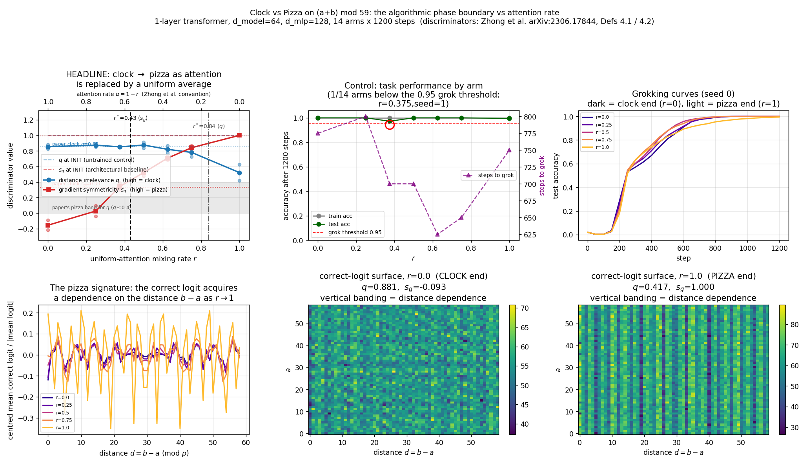

# Clock vs pizza on (a+b) mod 59: the two canonical discriminators disagree about where the phase boundary is

**Date:** 2026-07-26 · **Status:** done

## Hypothesis

Zhong et al. ([arXiv:2306.17844](https://arxiv.org/abs/2306.17844), "The Clock and the Pizza") show
that a 1-layer transformer on `(a+b) mod p` can settle into either of two genuinely different
algorithms, and that which one it picks is controlled by an **attention rate** α that interpolates
the attention matrix toward a constant matrix:

- **clock** (α high, real attention): attention multiplies rotations; the correct-answer logit does
  **not** depend on the distance `b - a`.
- **pizza** (α low, near-constant attention): the model **averages** the two operand embeddings and
  then applies a nonlinearity. The average of two Fourier components picks up an amplitude factor
  `cos(π w (a-b) / p)`, so the correct-answer logit **does** depend on `b - a`.

We predicted that sweeping this knob would move both of the paper's discriminators — **gradient
symmetricity** `s_g` (Def 4.1) and **distance irrelevance** `q` (Def 4.2) — monotonically, and that
both would place the clock→pizza boundary at the same place.

**They do not.** The two metrics disagree by roughly a factor of two in the location of the boundary.

## Method

**Knob.** We interpolate attention toward uniform with a mixing rate `r`:

```
att = (1 - r) * softmax(QK^T / sqrt(d_head))  +  r * (1 / T)
```

`r = 0` is a standard transformer (the paper's α = 1) → predicted clock.
`r = 1` is constant attention (the paper's α = 0, their "Model A") → predicted pizza.
Throughout, `α = 1 - r`; the chart carries both axes. (The paper writes `M' = Mα + J(1-α)` with `J`
the all-*one* matrix; we keep attention rows stochastic, which is the same family up to a constant
row scale that the learnable `W_O` absorbs, and makes `r` exactly "the fraction of the attention
average that is forced to be uniform".)

**Model / task.** 1-layer, LayerNorm-free, bias-free transformer over `[a, b, "="]`, logits read from
the last position. `p = 59` (the paper's own modulus, *not* shrunk), `d_model = 64`, 4 heads,
`d_mlp = 128`, **40,576 params**. Full-batch AdamW, lr 1e-3, weight decay 1.0, betas (0.9, 0.98),
`train_frac = 0.5` (1740 train / 1741 test) — the recipe already validated in this lab by
`2026-07-25_grokking-modular-addition` and `2026-07-25_grokking-weight-decay-phase`.

**What is varied vs held fixed.** Only `r`. At equal seed, every arm gets the *identical*
initialisation, the *identical* data split, and the *identical* 1200 optimiser steps — 1200 is well
past the grokking point of every arm (600–950 steps), so all arms are compared in the same
"grokked and consolidated" state rather than at whatever step each happened to converge.

**Arms.** `r ∈ {0, 0.25, 0.375, 0.5, 0.625, 0.75, 1.0}` × 2 seeds = **14 runs**, all of which fit the
budget (0 skipped). `r = 0.375` and `0.625` are boundary-refinement points.

**Discriminators** (implemented verbatim from the paper):

1. **Gradient symmetricity** `s_g` (Def 4.1) —
   `s_g = mean over random (a,b,c) of cos( ∂Q_abc/∂E_a , ∂Q_abc/∂E_b )`, 400 triples, `c` sampled
   uniformly and *not* required to be the correct answer. *Why it discriminates:* under uniform
   attention the last-position stream depends on the operands only through `(E_a + E_b) W_V / T`, so
   the network is an exactly symmetric function of the two embedding vectors → `s_g = 1`. Real
   attention makes the mixing weights query-dependent, so the operands enter asymmetrically.
   Paper reference: **0.9937** (their pizza) vs **0.3336** (their clock).
2. **Distance irrelevance** `q` (Def 4.2) — with the correct-logit matrix `L[i,j] = Q_{ij, i+j}`,
   `q = mean_d std_i( L[i, i+d] ) / std(L)`. Hold the distance `d = b-a` fixed and see how much the
   correct logit still varies as the *sum* sweeps: pizza (a function of `d`) → `q → 0`; clock
   (ignores `d`) → `q → 1`. Paper reference: **0.17** (pizza) vs **0.85** (clock), with the stated
   bands pizza ∈ [0, 0.4] and clock ∈ [0.4, 1].

Also reported: a scale-free amplitude of the distance modulation of the correct logit, the
embedding Fourier spectrum (an *algorithm-agnostic* check that every arm actually learned a Fourier
solution), and the realised attention deviation from uniform (a check that the knob does what we
think).

**Validity control (the piece the naive design needs).** Mixing attention toward uniform makes the
network a more symmetric function of its two operands *whether or not it has learned anything*, so a
rising `s_g`-vs-`r` curve could be purely architectural. We therefore measure both discriminators on
the **untrained** model at the same `r` and seed, before a single gradient step.

## How to run

```bash
pip install -r requirements.txt
python run.py
```

## Result



| `r` | α = 1−r | `q` (dist. irrelevance) | `s_g` (grad. symmetricity) | test acc | steps to grok |
|---|---|---|---|---|---|
| 0.000 | 1.000 | **0.854** | **−0.156** | 1.000 | 650 / 900 |
| 0.250 | 0.750 | 0.874 | 0.027 | 1.000 | 650 / 950 |
| 0.375 | 0.625 | 0.852 | 0.343 | 0.972 | 700 / — *(1 censored)* |
| 0.500 | 0.500 | 0.875 | 0.521 | 1.000 | 600 / 800 |
| 0.625 | 0.375 | 0.820 | 0.708 | 1.000 | 650 / 600 |
| 0.750 | 0.250 | 0.780 | 0.841 | 1.000 | 650 / 650 |
| 1.000 | 0.000 | **0.521** | **1.000** | 0.995 | 800 / 700 |

**1. The endpoints reproduce the paper — on one metric each.** At `r = 0` we get `q = 0.854`, almost
exactly the paper's clock value of 0.85, and `s_g = −0.156`, i.e. *more* clock-like than their clock
model (0.334). At `r = 1` we get `s_g = 1.000` against their pizza's 0.9937. So the sweep really does
run between the two published archetypes.

**2. But `r = 1` never becomes a textbook pizza by the `q` criterion.** Its distance irrelevance is
`0.521`, versus the paper's pizza value of 0.17, and it sits **above** the paper's stated pizza
ceiling of 0.4. Under the paper's own classification bands, our fully-uniform-attention model would
be labelled *clock*.

**3. The two discriminators locate the boundary in different places.**

| boundary definition | `r*` | α* |
|---|---|---|
| `s_g` crosses its own endpoint midpoint (0.422) | **0.431** | 0.569 |
| `s_g` crosses the paper-referenced threshold (0.664) | **0.596** | 0.404 |
| `q` crosses its own endpoint midpoint (0.687) | **0.840** | 0.160 |
| `q` crosses the paper's pizza ceiling (0.40) | **never** | — |

Gradient symmetricity says the model is half-pizza by `r ≈ 0.43–0.60`. Distance irrelevance says it
is still essentially clock until `r ≈ 0.84`. That is a factor-of-two disagreement on the same 14 runs.

**4. `s_g` is a far better-behaved measurement than `q` at this scale.** `s_g` is **monotone across
all seven `r` values**, swings 1.156 end to end, and its worst seed-to-seed spread is 0.134 — a
signal-to-noise ratio of **8.6**. `q` is **not monotone** (0.854 → 0.874 → 0.852 → 0.875 → 0.820 →
0.780 → 0.521), swings only 0.333, and its worst seed spread is 0.207 — signal-to-noise **1.6**, i.e.
barely above the run-to-run noise floor. Concretely, at `r = 1` the two seeds give `q = 0.417` and
`q = 0.625`: one lands inside the paper's pizza band and the other nowhere near it.

**5. The crossover is gradual for `s_g`, abrupt for `q` — and they are abrupt/gradual in different
places.** The "sharpness ratio" (largest single-interval change ÷ mean interval change; 1.0 = a
perfectly linear ramp) is **1.64** for `s_g` — nearly a straight ramp, not a sharp phase transition —
versus **3.72** for `q`, whose entire movement is concentrated in the final `r: 0.75 → 1.0` interval.
So the picture is not "a sharp switch at some `r*`" but "the gradient structure symmetrises smoothly
and early, while the behavioural distance-dependence appears late and suddenly."

**6. The control: the `s_g` ramp is *learned*, not architectural.** On the untrained model,
`s_g ∈ [0.9998, 1.0000]` and `q = 0.9994` **at every `r`, including `r = 0`** — because at
initialisation the QK weights are small, the attention logits are near-zero and softmax is already
almost uniform. The untrained baseline is therefore *flat* in `r` (init swing **0.0002** against a
trained swing of **1.156**, a ratio of **5781×**), so none of the measured swing is a mechanical
artefact of the knob. Training is what drives `s_g` down to −0.156 at `r = 0`: the low-`r` models
*learn* to break the operand symmetry. (Honest caveat in the other direction: `s_g = 1.000` exactly
at `r = 1` **is** forced by the architecture, since uniform attention makes the network a literally
symmetric function of `E_a, E_b`. That single endpoint is not evidence; the interior of the curve is.)

**7. Controls all pass.** Every arm reached **train accuracy 1.000**, and 13/14 reached test accuracy
≥ 0.95. Effective embedding-frequency count stays at 5.1–6.1 across all `r`, so every arm learned a
sparse Fourier solution rather than degenerating. Realised attention deviation from uniform falls
0.936 → 0.000 monotonically in `r`, confirming the knob acts as intended. **One censored arm:**
`r = 0.375, seed 1` finished at test accuracy **0.9443**, just under the 0.95 grokking threshold, so
its `r = 0.375` row is a mean over one grokked and one marginal run and should be read with caution.

## Takeaway

Sweeping attention from real to uniform does move a 1-layer transformer from clock to pizza, and the
endpoints land on the published archetypes — but **the two metrics the field uses to certify which
algorithm a model implements do not agree on where the transition happens**, differing by roughly a
factor of two in `r*` (0.43–0.60 vs 0.84) on identical runs. At this width the honest summary is that
*gradient symmetricity is the usable discriminator and distance irrelevance is not*: `q`'s total
swing is only 1.6× its own seed-to-seed noise, it is non-monotone in the knob, and even the
maximally-pizza arm fails to enter the paper's pizza band. The mechanistic reading is that the two
metrics measure different things and genuinely come apart — `s_g` probes the *computational graph*
(does the network treat its two operands symmetrically?) and moves smoothly and early, while `q`
probes the *behaviour* (does the answer logit depend on `b − a`?) and only fires once the model is
almost entirely attention-free. A model can be structurally symmetric long before that symmetry
shows up as distance-dependent logits.

This is best read as **"we can cleanly discriminate the endpoints, but we cannot cleanly locate a
single phase boundary at this scale and budget"** — which the backlog item explicitly names as a
successful outcome. The most likely culprits for `q`'s weakness are width and seeds: the paper fixes
width 128 for its attention-rate figure and reports that the phase-change point *moves with width*,
while we run width 64 with 2 seeds. Next steps, cheapest first: (a) 4–6 seeds at `r ∈ {0.75, 1.0}` to
pin down whether `q`'s bimodality there is real algorithmic bistability or just noise; (b) the same
sweep at `d_model ∈ {32, 64, 128}` to reproduce the paper's width-dependence of `r*` and see whether
`q` sharpens at larger width; (c) `q` measured on the *margin* rather than the raw correct logit,
which may be less sensitive to the overall logit-scale drift that weight decay induces.

## Novelty check

- **Verdict: replication** (shrunk, with one control added).
- **Checked on:** 2026-07-26. arXiv/OpenAlex APIs 403 from this environment
  (`scripts/novelty_check.py` returns `unchecked`), so the verdict rests on 3 web searches plus 2
  direct fetches of the paper.
- **Closest prior work:** Zhong, Liu, Andreas, Tegmark, *The Clock and the Pizza*
  ([arXiv:2306.17844](https://arxiv.org/abs/2306.17844), NeurIPS 2023). This is not adjacent prior
  art — it is **the same experiment**. They define the attention-rate interpolation, define both
  discriminators (Defs 4.1/4.2), sample α uniformly in [0,1], and report "a clear phase transition
  from the Pizza algorithm to the Clock algorithm" with "an almost linear phase boundary with regards
  to both attention rate and layer width". Their reported values (pizza `s_g` 0.9937 / `q` 0.17;
  clock `s_g` 0.3336 / `q` 0.85) are used here as fixed reference thresholds, not fitted.
  Also checked: *Algorithmic Capabilities of Random Transformers* (arXiv:2410.04368, same first
  author, reuses these metrics) and *Algorithmic Phase Transitions in Language Models*
  (arXiv:2412.07386). Registry siblings: `2026-07-25_grokking-modular-addition`,
  `2026-07-25_grokking-weight-decay-phase`, `2026-07-25_sae-on-grokked-model` — same task and
  recipe, none of them touched clock-vs-pizza.
- **How this differs:** (a) it is a ~40k-param, 11-minute, CPU-only reproduction at width 64, about
  half the paper's attention-rate-figure width; (b) it reports **both** discriminators on the *same*
  axis with a per-`r` seed-spread noise floor, which is what surfaces their disagreement about `r*`
  and `q`'s poor signal-to-noise — the paper reports the metrics but, as far as these searches found,
  does not put a boundary from each on the same axis or publish a noise floor for them; (c) the
  **untrained-initialisation control** for both metrics, which we did not find in the paper and which
  is what licenses reading the `s_g` ramp as learned rather than architectural. The "not in the
  paper" claims are negative results from web search plus two full-text fetches, not an exhaustive
  reading of the appendices.
