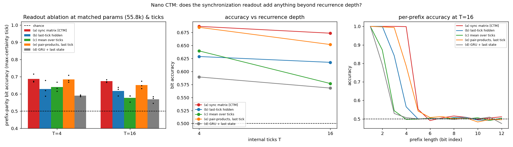

# Nano CTM parity: the synchronization readout wins, but a single-tick pair-product control takes most of the win

**Date:** 2026-07-26 · **Status:** done (hypothesis partly refuted, partly refined)

## Hypothesis
Pre-registered in `experiment.yaml`: on cumulative (prefix) parity, at matched core / internal ticks /
parameters / steps, the Continuous Thought Machine's neuron-pair **synchronization** readout is *not*
doing the work the paper attributes to it — a last-tick or mean-over-ticks readout on the **same**
recurrent core, and a plain GRU with a last-state readout, will land within seed noise of it, i.e. the
win is recurrence depth (T), not neuron-timing synchronization.

## Method
Hand-rolled nano CTM in pure PyTorch (**no code from SakanaAI/continuous-thought-machines**), ~55.8k params:

- **Shared core** (identical for arms a/b/c/e): 12-bit string presented *statically* as token+position
  embeddings; at each of T internal ticks the model forms a query from its own post-activations,
  attends over the 12 bit-slots, feeds `[z_{t-1}, o_t]` through a **synapse MLP** to pre-activations
  `a_t`, keeps a rolling window of the last **M=4** pre-activations per neuron, and passes each
  neuron's private history through its **own small MLP** (4 -> 8 -> 1, one per neuron, N=64 neurons).
- **Only the readout differs.** All five arms use one linear projection to 12x2 prefix-parity logits:

  | arm | readout feature | dim |
  |---|---|---|
  | (a) `sync` | CTM synchronization matrix: decay-weighted time-average of neuron-pair products over the tick history, `numer_t = r*numer_{t-1} + z_i z_j`, `denom_t = r*denom_{t-1} + 1`, `S = numer/sqrt(denom)`, learnable per-pair `r` | 256 pairs |
  | (b) `last` | last-tick post-activation vector | 64 |
  | (c) `mean` | mean post-activation over ticks | 64 |
  | (e) `pairlast` | **control:** neuron-pair products at the **last tick only** — same quadratic feature, same 256 pairs, same dimensionality, **zero time-integration** | 256 pairs |
  | (d) `gru` | plain `GRUCell` core (no per-neuron history MLPs), last state | 109 |

- **Iso-parameter.** The sync arm is the reference (55,800 params); every other arm's free width is
  integer-searched to match it (`last`/`mean` synapse hidden 286 vs sync's 256; GRU hidden 109).
  Realised spread across all 30 runs: **0.46%**.
- **Loss** is the CTM's own two-tick objective (mean of the loss at the min-loss tick and at the
  max-certainty tick), applied *identically* to every arm; evaluation reports the paper's
  max-certainty-tick prediction (final-tick numbers are also in `results.json` and rank the same).
- **Held fixed:** 475 steps, batch 64, AdamW lr 3e-3 (warmup + cosine), wd 0.01, grad-clip 1.0,
  identical seeded batch stream per seed, the same fixed 256-pair subset, and a fixed 2000-string
  held-out eval set shared by every run. 5 arms x T in {4,16} x 3 seeds = **30 runs**.
- run.py first times every (arm, T) cell and then picks **one global step count** for all 30 runs, so
  no arm is ever silently given more optimisation than another (an earlier pilot capped two GRU cells
  by wall clock; that pilot was discarded — see Caveats).

**Shrinks made to fit the 12-minute box (be aware when reading the numbers):** 12 bits instead of the
backlog's 24-40; T in {4,16} instead of {4,8,16} (traded for a 3rd seed, because a 2-seed pilot showed
seed spread larger than the arm gaps); 475 steps; 0.056M params; the CTM paper uses 75-100 ticks.
At this budget **no arm comes close to solving the task** (exact-match <= 0.007) — the comparison is
about *how far up the prefix each readout gets*, not about who solves parity.

## How to run
```bash
pip install -r requirements.txt
python run.py
```

## Result

**Prefix-parity bit accuracy at the max-certainty tick (chance 0.5), mean of 3 seeds:**

| arm | T=4 | T=16 | per-seed at T=16 |
|---|---|---|---|
| (a) sync [CTM] | **0.6866** | **0.6735** | 0.671 / 0.667 / 0.683 |
| (e) pairlast (control) | 0.6848 | 0.6517 | 0.649 / 0.631 / 0.675 |
| (b) last-tick | 0.6287 | 0.6175 | 0.627 / 0.638 / 0.588 |
| (c) mean-over-ticks | 0.6395 | 0.5768 | 0.589 / 0.554 / 0.588 |
| (d) GRU + last state | 0.5894 | 0.5681 | 0.574 / 0.584 / 0.546 |

Max seed spread anywhere in the sweep: **0.0912**.

**1. The pre-registered null is refuted: sync really does beat a last-tick readout on the same core.**
`sync - last = +0.056` at T=16 and `+0.058` at T=4. At T=16 the seeds are *fully separated*
(worst sync 0.667 > best last 0.638). `sync - gru = +0.105`, also fully separated at both T. So the
CTM's readout is not decoration.

**2. But it is not *synchronization*. A single-tick pair-product control captures most of the gain.**
Arm (e) uses the same 256 neuron-pair products with **no time-integration at all** — and it
*ties sync at T=4* (0.6848 vs 0.6866, a 0.002 gap against a 0.02 seed sd) and sits 0.022 behind at
T=16 with fully overlapping seeds (pairlast best 0.675 > sync worst 0.667). Decomposing the
sync-over-last gap:

| component | T=4 | T=16 |
|---|---|---|
| quadratic pair expansion (`pairlast - last`) | +0.056 | +0.034 |
| time-integration on top of it (`sync - pairlast`) | +0.002 | +0.022 (not seed-separated) |

**~60-100% of the CTM readout's advantage is the pairwise/quadratic feature map, not the
neuron-timing synchronization the paper names as its central representation.**

**3. Recurrence depth buys nothing here — every arm is flat-to-worse from T=4 to T=16**
(sync -0.013, last -0.011, gru -0.021, pairlast -0.033, mean -0.063). So the backlog's framing
("is it sync, or just recurrence depth?") has a third answer at this budget: it is *neither*; it is
the readout's feature map. 4x more internal ticks at matched steps is pure cost.

**4. Time-*averaging* the hidden state is actively harmful.** `mean` is the biggest loser from extra
depth and at T=16 falls below the plain `last` readout, nearly to GRU level. Averaging over ticks
destroys the state; multiplying pairs of neurons and *then* averaging (sync) does not.

**5. The per-neuron history MLPs are load-bearing.** `last` vs `gru` — same last-state readout, same
attention, same params — is +0.049 at T=16, seed-separated at T=4.

**6. What the accuracy actually means (right panel).** Every arm is at exactly chance beyond some
prefix depth and near-perfect below it; the arms differ only in *where the cliff falls*. Effective
solved prefix depth (`sum_i max(0, 2*(acc_i - 0.5))`, from `acc_by_prefix_pos_at_Tmax`) at T=16:
**sync 4.19, pairlast 3.69, last 2.85, mean 1.87, gru 1.69** out of 12. Training loss ranks
identically (0.444 / 0.478 / 0.513 / 0.569 / 0.585), so this is an optimisation-progress difference,
not an eval artifact.



## Takeaway
The honest headline is a *refinement*, not a debunking: the CTM synchronization readout genuinely
outperforms every cheaper readout on the same core at matched parameters, ticks and steps — but the
control that isolates its two ingredients says the credit belongs to the **quadratic expansion of the
readout feature** (256 random neuron pairs instead of 64 raw neurons), not to **synchronization over
the tick history**. At T=4 the time-integration term is worth 0.002 accuracy; at T=16 it is worth
0.022 and does not separate across seeds. That is a testable, cheap claim about the architecture: if
it holds up, `S^t = Z^t (Z^t)^T` is doing the job of a fixed random quadratic feature map, and the
"neurons synchronizing in time" story is not where the performance comes from. The paper never runs
this ablation — it reports only a footnote that snapshot representations were unstable, with no
numbers — so there was no published number to check against.

The second finding is the more uncomfortable one for the CTM framing: **more internal ticks made every
single arm worse** at matched optimisation. The CTM paper's parity result uses 75-100 ticks and many
more steps; at 16 ticks and 475 steps the extra depth is only extra credit-assignment distance. That
is consistent with this lab's own `2026-07-25_loop-test-time-compute` result that fixed-K recurrence
degrades past its trained depth, and with `2026-07-25_shadow-loop-vs-depth-isoflop` where the loop
lost at iso-FLOPs.

**Next:** (i) the cheapest decisive follow-up is a random-projection control — expand the last-tick
hidden state to 256 dims with a *fixed random linear* map and with a fixed random *quadratic* map, to
separate "quadratic" from "just wider readout"; (ii) sweep `n_pairs` in {64, 256, 1024} — if accuracy
tracks pair count rather than tick history, the feature-map reading is confirmed; (iii) rerun at
2-5k steps and T up to 64 to check whether time-integration only starts paying once the model is
actually near solving the task.

## Caveats
- Heavily shrunk: 12 bits (backlog asked 24-40), 475 steps, 0.056M params, T <= 16 vs the paper's
  75-100. No arm solves the task (exact-match <= 0.007); all conclusions are about early-training
  progress at matched compute, not about converged performance.
- One hyperparameter setting (lr 3e-3, batch 64), chosen by a short pilot on the sync arm — not tuned
  per arm. 3 seeds.
- One fixed 256-pair subset, shared by both quadratic arms (so sync vs pairlast is exactly controlled,
  but pair-subset variance is not measured).
- A 2-seed pilot that also included T=8 is kept as `pilot_2seed_3tick.log`. It reproduces the same
  arm ordering and the same flat/declining depth trend (sync 0.671, pairlast 0.674, last 0.629,
  mean 0.584 at T=16), but its two GRU T=16 cells were wall-clock-capped at 68/193 steps instead of
  550, which broke the matched-steps control — that is why it was discarded and the budget logic
  rewritten. Its T=8 column (sync 0.697, pairlast 0.679, last 0.667, mean 0.618, gru 0.594) is
  consistent with the T=4/T=16 endpoints reported here.

## Novelty check
- Checked on 2026-07-26 via WebSearch + WebFetch of the paper HTML (arXiv/OpenAlex APIs 403 from this
  environment; `scripts/novelty_check.py` returned `unchecked`).
- Verdict: **novel** (the architecture is published; this specific ablation is not).
- Closest prior work: [Continuous Thought Machines, arXiv:2505.05522](https://arxiv.org/abs/2505.05522)
  (NeurIPS 2025) and [SakanaAI/continuous-thought-machines](https://github.com/SakanaAI/continuous-thought-machines).
  The paper defines the synchronization matrix (Eq. 5) and the learnable decay (Eq. 9-10), and runs the
  64-length cumulative-parity demo, but its baselines are whole-architecture LSTMs — it does **not**
  swap the readout on a fixed core. A direct read of the paper HTML found only a footnote: *"We did
  begin with snapshot representations but struggled to get stable behavior owing to the emergent
  oscillatory behavior of neurons"* — an anecdote with no quantitative comparison.
- How this differs: (1) first head-to-head of sync vs last-tick vs mean-over-ticks vs plain-GRU
  readouts on an **identical core at iso-parameter (0.46% spread), iso-tick and iso-step** control;
  (2) introduces the **single-tick pair-product control**, which is what actually separates "pairwise
  feature map" from "synchronization", and which no published work runs; (3) does it at 0.056M params
  on CPU, three orders of magnitude below the paper's scale.
