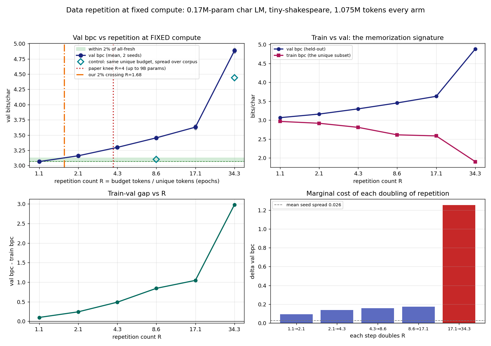

# Data repetition at fixed compute: where is the "~4 epochs is free" knee at 0.17M params?

**Date:** 2026-07-26 · **Status:** done (hypothesis confirmed in direction, but the naive measurement
is 90% confounded — the control moves the knee to the *other* side of 4)

## Hypothesis
Muennighoff et al. ([arXiv:2305.16264](https://arxiv.org/abs/2305.16264)) find that at up to 9B params
/ 900B tokens, "training with up to 4 epochs of repeated data yields negligible changes to loss
compared to having unique data". At **0.17M params** on a ~1M-character corpus — 60x smaller than the
smallest model in that paper (10M) — the knee should **not** sit at 4 epochs, and follow-up work
([arXiv:2511.13421](https://arxiv.org/html/2511.13421v1)) argues the allowance grows with unique-dataset
size, so with tiny unique pools we expected the knee **earlier** than 4.

## Method
- **Architecture:** nanoGPT-style 2-layer pre-norm decoder-only char LM, d_model=80, 4 heads, d_ff=320,
  block 96, learned absolute positions, no biases, untied head. **172,480 params.** Identical shape and
  identical init (same seed) in every arm — only the *data pool* differs.
- **Task / dataset:** tiny-shakespeare, character level, V=65, 1,115,394 chars
  (`md5 6fb458f1232090904fb40fe944165e91`). Last 10% (111,539 chars) is **val**, fixed and disjoint
  from every unique subset; headline val bpc is measured on the first 46,080 val chars (475
  non-overlapping windows), the same windows for every run.
- **Fixed compute:** every arm sees exactly **700 steps × batch 16 × 96 tokens = 1,075,200 tokens**.
  Same LR schedule (AdamW 3e-3, 70-step warmup, cosine to 10%), wd 0.1 on 2-D weights, grad clip 1.0.
- **What is varied:** the *unique fraction* `u ∈ {1, ½, ¼, ⅛, 1/16, 1/32}` of the train split, taken as
  a **contiguous prefix**. Repetition count `R = budget_tokens / unique_chars`, giving
  **R ≈ 1.07, 2.14, 4.28, 8.57, 17.13, 34.32**. Data ordering is true epoching: the unique subset is
  cut into non-overlapping 97-char windows, shuffled, consumed, reshuffled.
- **Memorization metric:** train bpc measured on 300 evenly-spaced windows *from the unique subset the
  model trained on*; `gap = val bpc − train bpc`.
- **Control (`mode: spread`):** at `u = ⅛` and `u = 1/32`, the *same* number of unique windows but
  sampled **evenly across the whole train split** instead of as a prefix. Same R, same unique-char
  count, same compute — only corpus **coverage** differs. This exists because the prefix design has a
  confound: a smaller prefix is not just less data, it is a narrower and textually more distant slice
  of Shakespeare relative to a val split taken from the *end* of the corpus.
- 6 fractions × 2 seeds + 2 control points × 2 seeds = **16 runs, 572 s (9.5 min)** on 1 CPU thread.

## How to run
```bash
pip install -r requirements.txt
python run.py
```

## Result

**Part 1 — as literally specified (contiguous prefixes), the knee is nowhere near 4: it is at R ≈ 1.7.**

| R (epochs) | unique chars | val bpc | vs fresh | train bpc | train–val gap |
|---|---|---|---|---|---|
| 1.07 (all fresh) | 1,003,853 | **3.0658** | — | 2.9665 | +0.099 |
| 2.14 | 501,878 | 3.1608 | +3.10% | 2.9178 | +0.243 |
| 4.28 | 250,939 | 3.2984 | +7.59% | 2.8092 | +0.489 |
| 8.57 | 125,518 | 3.4552 | +12.70% | 2.6116 | +0.844 |
| 17.13 | 62,759 | 3.6301 | +18.41% | 2.5835 | +1.047 |
| 34.32 | 31,331 | 4.8851 | +59.34% | 1.9020 | +2.983 |

The 2% band around the all-fresh value is [3.0658, 3.1271]. **Only R = 1.07 is inside it**; the very
first doubling (R = 2.14) already costs +3.10%. Log-interpolated crossing: **R = 1.68**, i.e. **2.4x
below the paper's 4**. Seeds are tight (mean spread 0.026 bpc, total range 70x that), so the curve is
not noise. Degradation is *smooth* from R = 1 to 17 (0.095 → 0.175 bpc per doubling) and then
**explodes**: the 17.1 → 34.3 doubling alone costs **+1.255 bpc**, 7x the previous doubling and 48x the
seed spread. Train bpc falls monotonically (2.97 → 1.90) while val bpc rises — a textbook memorization
signature, with the train–val gap growing 30x (+0.099 → +2.983).

**Part 2 — the control says ~90% of that penalty at moderate R is *corpus coverage*, not repetition.**

| point | R | prefix val bpc | spread val bpc | Δ | share of penalty from coverage |
|---|---|---|---|---|---|
| u = ⅛ | 8.57 | 3.4552 (+12.70%) | **3.1022 (+1.19%)** | −0.353 | **90.6%** |
| u = 1/32 | 34.32 | 4.8851 (+59.34%) | 4.4414 (+44.87%) | −0.444 | 24.4% |

At R = 8.57 with coverage held fixed, val bpc is **+1.19% over all-fresh — inside the 2% band**. The
train–val gap collapses too (0.175 spread vs 0.844 prefix): the "memorization" at moderate R was mostly
*distribution shift*. So the repetition-only knee is bracketed at **8.6 < R_knee ≤ 34.3**, i.e. **above**
the paper's 4, while the naive prefix measurement puts it at 1.7, **below** 4. The two readings bracket
4 from opposite sides, and neither lands on it. At R = 34.3 the control no longer rescues the run
(+44.9%): that degradation is real repetition damage, so the steep-collapse point sits between 17 and 34
epochs regardless of how the subset is drawn.



## Takeaway
The headline answer to the backlog question is **"the knee is nowhere near 4 at 0.17M params"** — but
the more useful finding is *why the number you get depends entirely on how you shrink the corpus*. Taking
contiguous prefixes (the obvious and the specified design) conflates two effects, and at R = 8.57 the
confound is **9x larger than the thing being measured**: 90.6% of the apparent repetition penalty
vanishes when the same number of unique characters is spread over the whole corpus. Any data-repetition
sweep built on contiguous subsets will therefore systematically *understate* the repetition allowance.
With that controlled, a 0.17M-param model tolerates at least ~8.6 epochs at 2% — consistent in direction
with [2511.13421](https://arxiv.org/html/2511.13421v1)'s claim that the allowance is dataset-dependent,
but pointing the *opposite* way from our prior: the tiny model is so far from being data-bottlenecked at
this compute budget that repeating a 125k-char pool nine times costs it almost nothing, because it has
not extracted what is in the pool even once. The genuine repetition wall shows up only past ~17 epochs on
a 63k-char pool, where train bpc drops to 1.90 and the gap hits 3.0 bits. **Caveats:** (1) this is an
early-training, compute-poor regime — every arm sits at 3.0–4.9 bpc against a converged tiny char LM's
~1.5, so what is measured is *fitting speed under repetition*, not a converged loss, and the paper's
regime is the opposite (compute-rich, data-poor); (2) 2 seeds, one model size, one LR, one corpus;
(3) the control was run at only 2 points, so the coverage-corrected knee is bracketed, not localized;
(4) character-level Shakespeare has far more redundancy than the token-level web text the paper used.
**Next:** run the spread control at every u to localize the corrected knee, and re-run at 5–10x the step
budget to test whether the knee moves as the model stops being compute-starved.

## Novelty check
- Verdict: **partial-prior-art** (replication attempt at a new scale + a methodological control we could
  not find published).
- Checked 2026-07-26. `scripts/novelty_check.py` returned **unchecked** (arXiv and OpenAlex both 403
  from this environment — known). Verdict rests on 2 web searches plus 3 direct page fetches.
- Closest prior work:
  - [Scaling Data-Constrained Language Models (arXiv:2305.16264, NeurIPS 2023)](https://arxiv.org/abs/2305.16264)
    — the source of the 4-epoch claim. Fetched: "training with up to 4 epochs of repeated data yields
    negligible changes to loss compared to having unique data"; "more than 400 models ranging from
    **10 million to 9 billion parameters**", up to 900B tokens. **Smallest model in the paper is 10M —
    ~60x larger than ours**, so the ≤1M regime is untested there.
  - [Larger Datasets Can Be Repeated More (arXiv:2511.13421)](https://arxiv.org/html/2511.13421v1) —
    argues directly against a universal 4-epoch constant: the effective reuse rate saturates at a point
    that **grows with unique-dataset size N** (Θ(log N) under strong convexity, a power of N under
    power-law data). Predicts our tiny unique pools should tolerate *fewer* repeats.
  - [To Repeat or Not To Repeat (arXiv:2305.13230)](https://ar5iv.labs.arxiv.org/html/2305.13230) and
    [Anthropic, scaling laws and interpretability of learning from repeated data](https://www.anthropic.com/research/scaling-laws-and-interpretability-of-learning-from-repeated-data)
    — repeated-data degradation and its interpretability signature, both at ≥100M scale.
- How this differs: (a) the repetition sweep at **0.17M params**, ~60x below the smallest published
  point, on CPU in under 10 minutes; (b) the **prefix-vs-spread control**, which decomposes the measured
  repetition penalty into corpus-coverage and true-repetition components (90.6% / 9.4% at R = 8.6) — we
  found no published version of this control, and it inverts the sign of the answer relative to the
  paper's 4; (c) the train–val gap reported per repetition level as an explicit memorization readout.
  The "no published version of this control" claim is a negative search result over web/paper search,
  not an exhaustive literature review.
