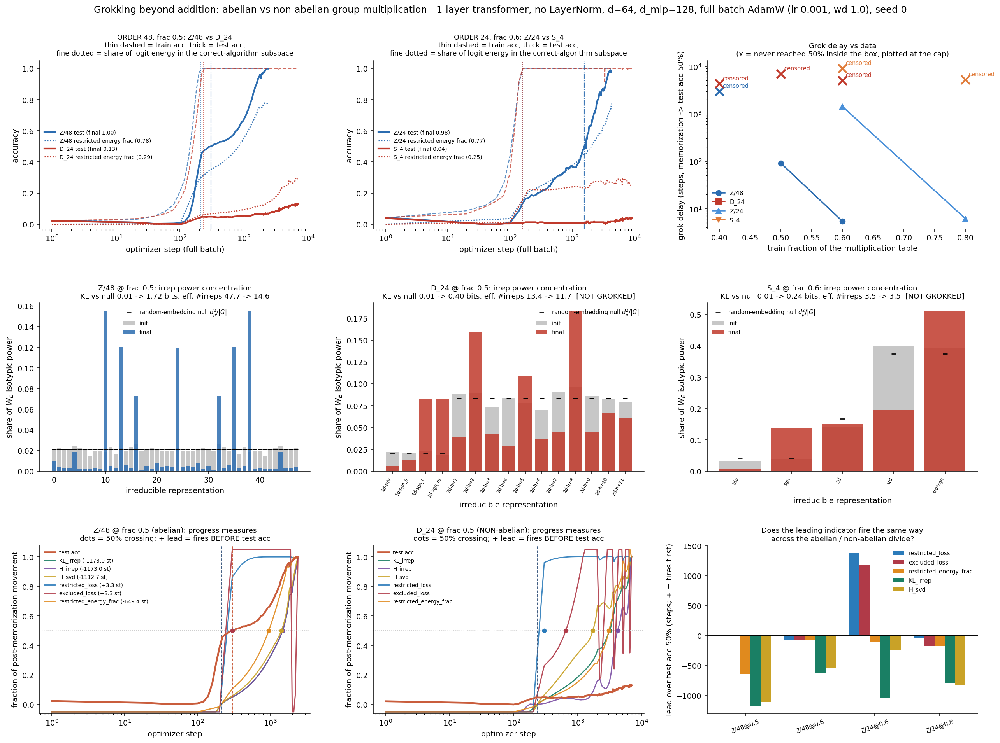

# Grokking beyond addition: does the abelian/non-abelian divide change WHEN a model groks and WHETHER the same progress measure fires?

**Date:** 2026-07-26 · **Status:** done (headline result is a **censored / negative** one, and that is the finding)

## Hypothesis

A 1-layer transformer learning `(a, b) -> a*b` groks on a **non-abelian** group as well as on an
**abelian** group of the *same order*, but with a longer delay and a higher data requirement; and the
two progress measures that worked on modular addition — restricted/excluded loss and Fourier power
concentration of the embeddings — generalise verbatim once "Fourier frequency" is replaced by
"irreducible representation", so the leading indicator fires the same way on both sides of the divide.

**Verdict: the first half is refuted in the direction of "much worse than expected", and the second
half is untestable-as-posed and had to be replaced by a measure that does work.**

## Method

**Recipe.** The lab's proven grokking recipe, reused verbatim from
`2026-07-25_grokking-modular-addition` and `2026-07-25_grokking-weight-decay-phase`: 1-layer
transformer, **no LayerNorm, no biases**, sequence `[a, b, "="]`, logits read from the last position
only, **full-batch AdamW**, lr 1e-3, **weight decay 1.0**, betas (0.9, 0.98), `init_std_scale` 0.8,
`d_model` 64, `n_heads` 4. `d_mlp` is **shrunk 256 -> 128** following `2026-07-26_clock-vs-pizza`
(measured there: groks at ~650 steps instead of ~1850). 39,168 params at order 48; 36,096 at order 24.

**Groups — two matched-order pairs.** Within a pair the table size, vocabulary and parameter count are
*identical*; the only difference is commutativity.

| order | cells | abelian | non-abelian |
|---|---|---|---|
| 48 | 2304 | **Z/48** (48 one-dim irreps) | **D_24**, symmetries of the 24-gon (irreps 1,1,1,1 + eleven 2-dim) |
| 24 | 576 | **Z/24** (24 one-dim irreps) | **S_4** (irreps 1,1,2,3,3) |

D_24 is the sharpest available partner for Z/48: `D_24 = Z/24 ⋊ Z/2`, i.e. the same order, differing
from a cyclic group by exactly one semidirect twist. S_4 is included because it is the group family the
prior art (Chughtai et al.) uses and it has the richest irrep set. **Shrink:** the backlog asked for
S_5 (order 120, 14,400 cells) — far outside a 12-minute CPU box.

**Sweep.** Random train/test split of the multiplication table at fractions 0.4/0.5/0.6 (order 48) and
0.6/0.8 (order 24). Step caps are **asymmetric in favour of the non-abelian arms** (abelian 3–6k steps,
non-abelian 5–16k), so no censoring below is an artifact of a stingier box.

### The two progress measures, generalised (this is the methodological core)

Both measures the lab used on modular addition are phrased in terms of "Fourier frequency". The
group-theoretic object that a frequency *is*, is an irreducible representation of Z/n — so both
generalise verbatim, and **both reduce exactly to the abelian versions when G is cyclic**. That is what
makes this one experiment rather than two.

1. **Irrep power concentration of `W_E`.** The orthogonal projector onto the ρ-isotypic component of
   the regular representation is `P_ρ[x,y] = (d_ρ/|G|)·χ_ρ(y x⁻¹)`; power in ρ is `tr(Wᵀ P_ρ W)`. For
   `G = Z/n` every `d_ρ = 1` and this is exactly the squared DFT magnitude at frequency ρ. Because
   different groups have different numbers of irreps of different dimensions, raw entropy is **not**
   comparable across the divide; the cross-group-comparable statistic is the excess concentration
   against the group's own random-embedding null, `KL_bits = Σ p_ρ log₂(p_ρ/q_ρ)` with `q_ρ = d_ρ²/|G|`.
2. **Restricted / excluded loss** (Nanda et al.), generalised. The correct algorithm must produce
   logits of the form `L(a,b,c) = φ(a b c⁻¹)` with φ a **class function**, because the ideal target
   `δ(a b c⁻¹ = e)` equals `(1/|G|) Σ_ρ d_ρ χ_ρ(a b c⁻¹)`. The functions `f_ρ(a,b,c) = χ_ρ(a b c⁻¹)`
   are orthogonal with `‖f_ρ‖² = |G|³`, so the centred logit tensor splits cleanly into the part on the
   model's key irreps (**restricted**) and the rest (**excluded**). For `G = Z/n` this is Nanda's
   measure on the diagonal frequency triples (k,k,k) — the canonical version, slightly tighter than his
   product mask.

**Everything above is asserted numerically at startup, not assumed.** Every group table is checked to
be a Latin square and associative over all n³ triples; every character table is checked for
`χ(e) = d`, `Σd² = |G|`, row orthonormality and the class-function property; the isotypic projectors
are checked to sum to `I`, be idempotent and Hermitian, and have trace `d_ρ²`. The restricted subspace
is checked to reconstruct the **ideal delta-logits to ≤1.4e-14** and to leave **≥99.75% of random-logit
energy outside** it.

### One correction made mid-experiment (worth reading)

Restricted-only **test accuracy** turned out to be a **1-bit quantity**: a restricted logit `φ(a b c⁻¹)`
has *provably identical* cross-entropy on every `(a,b)` cell, so its accuracy is 1.0 whenever φ merely
peaks at the identity — however tiny φ is. It is 1.0 in **all 10 runs**, including ones at chance. The
quantity that actually carries information is the **restricted energy fraction**, `‖R‖²/‖L‖²`: the share
of centred logit energy sitting in the correct-algorithm subspace. That measure was added and is the
one reported. (The train-vs-test CE identity is asserted in code as a sanity check.)

## How to run
```bash
pip install -r requirements.txt
python run.py
```

## Result

10 runs, **710 s of CPU compute** (single-threaded), 0 runs skipped.

| run | abelian | n_train | steps run | memorized | test 50% | **grok delay** | final test acc | chance | restricted energy frac |
|---|---|---|---|---|---|---|---|---|---|
| Z/48 @ 0.4 | yes | 922 | 2967 | 217 | – | **CENSORED** | 0.161 | 0.021 | 0.208 |
| **Z/48 @ 0.5** | yes | 1152 | 2402 | 213 | 303 | **90** | **0.998** | 0.021 | 0.779 |
| Z/48 @ 0.6 | yes | 1382 | 1602 | 215 | 220 | **5** | **1.000** | 0.021 | 0.874 |
| D_24 @ 0.4 | **no** | 922 | 4310 | 218 | – | **CENSORED** | 0.015 | 0.021 | 0.033 |
| **D_24 @ 0.5** | **no** | 1152 | 6988 | 235 | – | **CENSORED** | 0.130 | 0.021 | 0.287 |
| D_24 @ 0.6 | **no** | 1382 | 5075 | 258 | – | **CENSORED** | 0.284 | 0.021 | 0.355 |
| Z/24 @ 0.6 | yes | 346 | 4301 | 158 | 1580 | **1422** | **0.983** | 0.042 | 0.774 |
| Z/24 @ 0.8 | yes | 461 | 2792 | 154 | 160 | **6** | **0.965** | 0.042 | 0.706 |
| S_4 @ 0.6 | **no** | 346 | 9133 | 158 | – | **CENSORED** | 0.039 | 0.042 | 0.246 |
| S_4 @ 0.8 | **no** | 461 | 5268 | 176 | – | **CENSORED** | 0.035 | 0.042 | 0.311 |

**1. The headline: 4/4 abelian arms above the data threshold grok; 0/5 non-abelian arms grok.** Every
model memorises at essentially the same step (154–258, independent of group), and then the two sides
part company. Matched-order lower bounds on the delay ratio, taking the non-abelian censoring point as
a lower bound on its delay:

| matched pair | abelian delay | non-abelian post-memorisation steps at the cap | delay ratio |
|---|---|---|---|
| order 48, frac 0.5 | 90 | ≥ 6753 | **≥ 75×** |
| order 48, frac 0.6 | 5 | ≥ 4817 | ≥ 890× |
| order 24, frac 0.6 | 1422 | ≥ 8975 | **≥ 6.3×** |
| order 24, frac 0.8 | 6 | ≥ 5092 | ≥ 835× |

**Censoring is not the same as impossibility, and the two non-abelian groups behave differently.**
D_24 is still *climbing* at the cap (0.015 → 0.130 → 0.284 as the train fraction goes 0.4 → 0.5 → 0.6),
so it is on a slow trajectory, not a flat one. S_4 is the harder negative: at **80% of its
multiplication table memorised**, the remaining 115 cells sit at 0.035 against a chance of 0.042 — no
progress at all.

**2. The abelian arms have a data threshold too, so this is not simply "non-abelian is different".**
Z/48 @ 0.4 is also censored (0.161). The threshold just sits in a different place: between 0.4 and 0.5
of the table for Z/48, and above 0.6 (order 48) / above 0.8 (order 24) for the non-abelian groups.

**3. "Does the leading indicator fire the same way across the divide?" — the question cannot be asked
as posed, because the event never happens.** A lead time is defined relative to the test-accuracy jump,
and no non-abelian run has one. All non-abelian lead times are `null`. On the abelian side the earlier
lab result reproduces: **restricted/excluded loss leads, spectral concentration lags.**

| measure | Z/48@0.5 | Z/48@0.6 | Z/24@0.6 | Z/24@0.8 | mean |
|---|---|---|---|---|---|
| restricted loss | **+3** | −80 | **+1380** | −40 | +316 |
| excluded loss | **+3** | −80 | **+1167** | −176 | +229 |
| restricted energy frac | −649 | −80 | −111 | −173 | −253 |
| **KL irrep concentration** | −1173 | −624 | −1045 | −798 | **−910** |
| H_svd of `W_E` | −1113 | −548 | −247 | −838 | −686 |

(+ = fires before the test jump.) The two runs where restricted loss "lags" are exactly the two whose
grok delay is 5 and 6 steps — there is no gap left to lead. The irrep-concentration measure lags by
~900 steps on **4/4** abelian runs, replicating this lab's 2026-07-25 finding that
spectral-entropy-style measures lag while restricted/excluded lead — now confirmed with the
group-general version.

**4. What *does* transfer across the divide: the restricted energy fraction, and it separates
perfectly.** Every model, abelian or not, builds a correctly-*signed* group-composition circuit
(restricted-only test accuracy is 1.0 in all 10 runs — the 1-bit statement above). What separates
grokking from not-grokking is the **magnitude**:

* grokked runs: **0.706 – 0.874** (mean 0.783)
* censored runs: **0.033 – 0.355** (mean 0.240)

**No overlap**, and the ordering ignores the abelian/non-abelian divide entirely — censored *abelian*
Z/48@0.4 sits at 0.208, right inside the censored band. The non-abelian arms stall at roughly a third
of the way along the same axis the abelian arms run to completion on. Using every irrep instead of the
selected key irreps changes nothing, so the key-irrep selection is not doing the work.

**5. False-positive control.** Two runs memorised and *never left the plateau*: S_4 @ 0.6 (test 0.039
vs chance 0.042 after 9133 steps) and D_24 @ 0.4 (0.015 vs 0.021). In both, the irrep concentration
still rose — **+0.235 and +0.108 bits** of KL — with literally zero generalisation. The generalised
concentration measure inherits the false-positive behaviour that Fourier entropy showed on the abelian
side; it is a structure detector, not a generalisation detector.

**6. A methodological trap the null catches.** For S_4 the top-3 irreps hold 0.858 of the final
embedding power — which sounds like strong concentration until you notice the *random* null already
holds 0.917, because S_4's irreps have dimensions 1,1,2,3,3. Raw concentration statistics are
meaningless across groups; only the KL against the group's own null is interpretable. Meanwhile the
non-abelian models *are* selecting irreps: D_24 moves power off its four 1-dim irreps onto 2-dim ones,
and S_4 moves power off the trivial irrep onto `std` and `std⊗sgn`.



## Takeaway

At a matched order, a matched table, a matched parameter count and a *more generous* step budget, the
non-abelian side of the divide did not grok at all while the abelian side grokked reliably — a delay
ratio of at least 75× at the cleanest matched point (order 48, 50% of the table), and no grokking for
S_4 even with 80% of its table memorised. The mechanism the numbers point at is not "the non-abelian
model fails to find the algorithm": every model finds a correctly-signed one. It is that the correct
circuit never wins the *magnitude* competition against the memorising circuit — the share of logit
energy in the correct-algorithm subspace stalls near 0.3 instead of climbing past 0.7, and 0.7 is
where generalisation happens on **both** sides of the divide. That single scalar is the one thing here
that is group-blind, and it is the obvious candidate to promote into the lab's reusable
progress-measure kit.

The second half of the hypothesis was answered by being dissolved: you cannot compare *lead times*
across the divide when only one side has an event to lead. The honest replacement question — "is there
a measure whose value predicts grokking regardless of the group?" — has a clean yes.

**What to try next:** (a) give D_24 10–50× the steps at frac 0.6, where it was still climbing, to
separate *slow* from *cannot* — the same "cannot-represent vs slow-to-learn" cut this lab has already
had to make on `mqar-state-capacity`; (b) widen `d_mlp`/`d_model`, since D_24 must carry eleven 2-dim
irreps through a width-64 residual stream while Z/48 needs a handful of 1-dim ones; (c) test whether
*forcing* the energy fraction up (e.g. penalising the excluded component directly) induces
generalisation on the non-abelian side, which would turn a correlational measure into a causal knob.

## Caveats

* **One seed.** No seed replication — the budget went to the group × fraction grid. The abelian/
  non-abelian split is 4/4 vs 0/5 across four distinct groups and five fractions, which is a strong
  pattern, but each cell is n=1.
* **Censoring is a wall-clock cap, not a proof.** D_24's test accuracy was still rising when the cap
  hit. Chughtai et al. train S_5 far longer and wider; this result is consistent with "non-abelian needs
  much more compute/width at this scale", **not** with "non-abelian cannot grok".
* **"Grok delay" degenerates at high train fraction.** At frac 0.6/0.8 the abelian arms go from
  memorisation to generalisation in 5–6 steps, so there is barely a grokking gap to measure and the
  lead-time analysis has nothing to bite on. The informative abelian points are Z/48@0.5 (delay 90) and
  Z/24@0.6 (delay 1422).
* **Composite moduli.** Z/48 and Z/24 are not prime, unlike the lab's earlier p=59 rows; they were
  chosen to match the non-abelian orders exactly. Composite cyclic groups have subgroup structure of
  their own.
* **Key-irrep selection uses the final model** (Nanda's own protocol, so the measure is not causally
  available online). The all-irreps control gives identical restricted-only accuracy in every run.
* `run.py` was executed four times during development as metrics were added. Which arms grokked, the
  delays (90 / 5 / 1422 / 6) and the full censoring pattern were **identical every time**; only
  `steps_run` varied, because the wall-clock caps bite at different step counts under varying machine
  load. Reported compute is one complete run.

## Novelty check

- **Verdict: partial-prior-art.**
- Checked on 2026-07-26. `scripts/novelty_check.py` returned `unchecked` (arXiv and OpenAlex both 403
  from this environment — a known limitation); four web searches and three direct fetches were used
  instead.
- Queries: "grokking non-abelian group composition transformer irreducible representations progress
  measure"; "Chughtai Chan Nanda A Toy Model of Universality group composition representations grokking
  S5"; "grokking delay comparison cyclic group versus dihedral symmetric group matched order
  transformer"; "restricted loss excluded loss progress measure generalized to non-abelian groups irrep
  power concentration embeddings". Fetched: arXiv 2302.03025, 2312.06581, 2509.06931.
- **Closest prior work.** [Chughtai et al. 2302.03025](https://arxiv.org/abs/2302.03025) is the direct
  ancestor: networks learn group composition via irreducible representations (the GCR algorithm), and
  the restricted subspace used here is exactly their `χ_ρ(a b c⁻¹)` form.
  [Stander et al. 2312.06581](https://arxiv.org/abs/2312.06581) *disputes* that account on S_5/S_6,
  arguing the circuit decomposes via cosets — so the representation-theoretic reading is contested prior
  art, not settled, and nothing here adjudicates it (the restricted subspace used here is agnostic: it
  is the space of *correct* logits, whatever circuit produces them).
  [arXiv 2509.06931](https://arxiv.org/html/2509.06931) trains MLPs on both abelian and non-abelian
  groups — including S_4 and D_8 — and reports that "the required fraction of examples and how
  pronounced the grokking turns out to be, depends on the underlying group", but explicitly does **not**
  compare grokking delay across the divide. Power et al. 2201.02177 is the origin of the task family.
- **How this differs.** (a) A **matched-order** abelian/non-abelian comparison (Z/48 vs D_24, same
  order, same table, same vocab, same parameter count, differing by one semidirect twist) with the delay
  as the reported quantity — none of the above controls order this way. (b) Nanda's restricted/excluded
  loss **carried across the divide** by replacing the frequency mask with a class-function-of-`abc⁻¹`
  projection, with the equivalence to the abelian case and the exactness of the ideal-logit
  reconstruction verified numerically rather than asserted. (c) The **null-referenced** irrep
  concentration `KL(p ‖ d_ρ²/|G|)`, which is the only form of "spectral collapse" that is comparable
  between groups with different irrep dimensions — and the S_4 case above shows the raw form is actively
  misleading. (d) The **restricted energy fraction** as a group-blind grokking predictor, and the
  observation that restricted-only *accuracy* is a vacuous 1-bit statistic. (e) The negative itself:
  a concrete boundary marker that a 40k-parameter, width-64, 12-minute box that groks four cyclic-group
  arms cleanly cannot reach non-abelian grokking at all, which tells this lab where the cheap
  non-abelian experiments stop being cheap.
- The "no published version of this specific matched-order accounting" claim is a negative search result
  over four web searches and three fetches, not an exhaustive review; arXiv/OpenAlex APIs 403 here.
