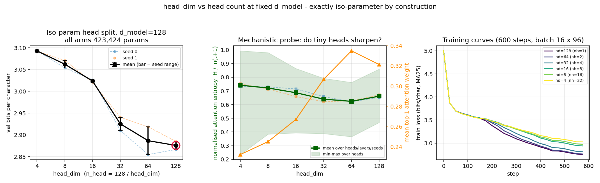

# Head dim vs head count at fixed d_model: no U-curve — the curve is monotone, and one giant head wins

**Date:** 2026-07-26 · **Status:** done (hypothesis refuted)

## Hypothesis
At fixed `d_model=128`, a moderate `head_dim` beats both extremes (1 giant head, many tiny heads),
producing a clean iso-parameter **U-curve** in validation bits-per-character.

## Method
- **Architecture:** nanoGPT-style 2-layer pre-norm decoder-only char LM, `d_model=128`, `d_ff=512`,
  learned absolute positions, no biases, GELU MLP. **423,424 parameters in every arm.**
- **Task / dataset:** tiny-shakespeare, char level (V=65), 90/10 train/val split, block size 96.
  Metric is val **bits per character** on a fixed 46,080-char held-out slice.
- **Varied:** `(n_head, head_dim) ∈ {(1,128), (2,64), (4,32), (8,16), (16,8), (32,4)}`.
- **Held fixed:** everything else — 600 steps, batch 16 × 96 (0.92M tokens/run), AdamW lr 3e-3 with
  60-step warmup and cosine decay to 10%, wd 0.1 on 2-D weights, grad clip 1.0. 2 seeds × 6 configs
  = 12 runs, ~10 min CPU (1 thread).

**Why this is a uniquely clean control.** At fixed `d_model` the attention block's parameters do not
depend on the head split at all: q/k/v is `d → 3d` and the output projection is `d → d` for every
`(n_head, head_dim)` with `n_head · head_dim = d_model`. So this is **iso-parameter by construction**
(verified in `results.json`: `iso_param_exact: true`, one param count across all 12 runs), and
iso-FLOP too — the `T×T` score matrix is computed `n_head` times over `head_dim` channels, and
`n_head · head_dim = d`. Because every arm also has *identical module shapes*, seeding the
constructor identically gives all six arms **bit-identical initial weights**
(`identical_init_across_arms_per_seed: true`), and each seed replays the **same batch stream**. The
only difference between two arms is how the same q/k/v vectors are reshaped before the softmax, plus
the `1/sqrt(head_dim)` score scale that follows from it.

**Mechanistic side-probe.** After training, per-head causal attention entropy on fixed val batches,
normalised by the entropy of the uniform distribution over the prefix (`H_t / ln(t+1)`, positions
`t ≥ 8`), plus mean top-1 attention weight and effective number of keys attended (`exp H`).

## How to run
```bash
pip install -r requirements.txt
python run.py
```

## Result
**Refuted, and not marginally: there is no interior optimum.** Val bpc is *perfectly monotone* in
`head_dim` — Spearman(log₂ head_dim, mean val bpc) = **−1.00** across all six points
(`metrics.shape_verdict: "monotone in head_dim"`, `interior_optimum: false`).

| head_dim | n_head | val bpc (seed 0 / 1) | mean | Δ vs head_dim=128 | attn entropy H/ln(t+1) | top-1 weight | eff. keys |
|---|---|---|---|---|---|---|---|
| **128** | 1 | 2.8666 / 2.8851 | **2.8759** | — | 0.662 | 0.321 | 19.4 |
| 64 | 2 | 2.8549 / 2.9186 | 2.8868 | +0.011 | 0.624 | 0.335 | 15.6 |
| 32 | 4 | 2.9103 / 2.9404 | 2.9254 | +0.050 | 0.640 | 0.307 | 15.7 |
| 16 | 8 | 3.0265 / 3.0209 | 3.0237 | +0.148 | 0.687 | 0.267 | 18.6 |
| 8 | 16 | 3.0539 / 3.0708 | 3.0623 | +0.187 | 0.722 | 0.245 | 22.7 |
| 4 | 32 | 3.0930 / 3.0928 | 3.0929 | +0.217 | 0.742 | 0.232 | 25.5 |

- **The effect is large relative to noise.** Config spread **0.217 bpc** vs mean within-config seed
  spread **0.0225 bpc** — a ratio of **9.65×**. The 32-tiny-heads arm is worse than the 1-giant-head
  arm by ~10 seed-widths.
- **The "many tiny heads are bad" half of the hypothesis is confirmed; the "one giant head is bad"
  half is refuted.** The edge gap at the `head_dim=128` end is **0.0** — that end *is* the optimum.
- **But the top of the curve is a plateau, not a peak.** head_dim 128 and 64 differ by 0.011 bpc,
  well inside the 0.064 seed range of the 64 arm, and the two seeds disagree about which wins
  (`seeds_agree_on_best: false` — seed 0 ranks 64 > 128, seed 1 ranks 128 > 64). The honest reading:
  **head_dim ≥ 64 is flat; head_dim ≤ 32 degrades monotonically.** With `d_model=128` and only 2
  layers, halving to 2 heads costs nothing, and everything past that costs.
- **Train loss orders identically to val loss** (1.912 / 1.920 / 1.953 / 2.041 / 2.065 / 2.098 nats
  at head_dim 128→4), so this is a fitting/optimisation deficit, not a generalisation gap — many
  tiny heads simply fit the training data worse at matched steps.
- **The mechanistic hint comes out backwards.** Tiny heads do **not** collapse to sharp single-token
  attention — they get *blurrier*. Normalised entropy climbs from 0.624 (head_dim=64) to 0.742
  (head_dim=4), mean top-1 weight falls 0.335 → 0.232, and the effective number of keys attended
  rises 15.6 → 25.5. Spearman(log₂ head_dim, entropy) = **−0.83**. A 4-dimensional query-key space
  apparently cannot express sharply peaked, content-selective score patterns, so most tiny heads
  drift toward near-uniform averaging.
- **Tiny heads are heterogeneous, though.** At head_dim=4 the per-head normalised entropy spans
  0.235 → 0.994, and the single sharpest head is *sharper* than anything in the 1-head model
  (max top-1 weight 0.749 vs 0.487). So the picture is a few sharp heads plus a majority of
  near-uniform ones — not a uniform collapse in either direction.



## Takeaway
At 0.42M parameters on natural text, the folk U-curve is not there: **at fixed `d_model`, wider heads
are weakly better and never worse**, and the entire cost of the head split shows up at the many-tiny-heads
end. This is directionally what Bhojanapalli et al.'s low-rank-bottleneck argument predicts (shrinking
`head_dim` below the sequence length caps the rank of the attention score matrix), though the empirical
knee here sits at head_dim ≈ 32–64 rather than exactly at the sequence length (96). The mechanistic probe
sharpens the story in an unexpected direction: the failure mode of a 4-dimensional head is *diffuse*
attention, not degenerate spiky attention — the low-rank QK space loses the ability to be selective at
all. Practically, for a tiny char LM the head count is a nearly free knob down to head_dim=64 and a
real tax below head_dim=32; the "8 heads because GPT-2 said so" default costs 0.148 bpc here.

Two caveats bound this hard. (1) **Undertrained**: 600 steps / 0.92M tokens leaves every arm at bpc
2.88–3.09 where a converged tiny char LM reaches ~1.5–1.7, so part of the many-heads deficit could be
slower learning rather than a lower ceiling — the train-loss ordering says the arms differ in *fit*,
but not whether the gap survives to convergence. (2) **The score temperature is confounded with the
split**: `1/sqrt(head_dim)` changes by 5.7× across the sweep, and this is inherent to the standard
formulation rather than a bug, but it means "low-rank bottleneck" and "wrong softmax temperature" are
not separated here. The obvious next run is the QK-norm control — re-run the sweep with q and k
L2-normalised and a learned scale, which fixes the temperature and isolates the rank effect; if the
monotone trend survives QK-norm, it is rank, and if it flattens, the whole thing was temperature.

## Novelty check
- Verdict: **partial-prior-art**.
- Closest prior work:
  - [Bhojanapalli et al., *Low-Rank Bottleneck in Multi-head Attention Models* (arXiv:2002.07028,
    ICML 2020)](https://arxiv.org/abs/2002.07028) — fetched the
    [PMLR PDF](http://proceedings.mlr.press/v119/bhojanapalli20a/bhojanapalli20a.pdf) and confirmed it
    runs the same axis: heads swept 8→16→32 at fixed embedding size 1024 in BERT_LARGE, with
    performance degrading past 8 heads (SQuAD F1 90.89 → 90.45), plus the theoretical claim that the
    bottleneck bites once `head_dim < sequence length`, and a fix (fix head size independent of head
    count) under which performance then improves monotonically with more heads.
  - [*Leaner Transformers: More Heads, Less Depth* (arXiv:2505.20802)](https://arxiv.org/html/2505.20802)
    — fetched; it holds `head_dim` fixed and lets `d_model` grow with head count at *varying* parameter
    budgets, so it is not the iso-`d_model` axis and reports no interior optimum.
  - [Michel et al., *Are Sixteen Heads Really Better than One?*](https://blog.ml.cmu.edu/2020/03/20/are-sixteen-heads-really-better-than-one/)
    — head *pruning* after training, not a head-split ablation.
  - [Zhai et al., *Stabilizing Transformer Training by Preventing Attention Entropy Collapse*
    (arXiv:2303.06296)](https://arxiv.org/pdf/2303.06296) — attention entropy as a diagnostic, but as a
    function of training dynamics/σReparam, not of `head_dim`.
- How this differs: the 2020 result is the same question at 340M params, 3 grid points, and a
  head_dim range of 32–128. This is (to our search) the first tiny-CPU version: 0.42M params, 6 grid
  points spanning the full degenerate range (1 head to head_dim=4), 2 seeds with reported spread, and
  an *exactly* iso-parameter, identical-init, shared-batch-stream paired design rather than a matched
  budget. The specific findings that appear unreported are (a) the curve is monotone with a **plateau
  at head_dim ≥ 64** rather than an interior optimum, at a scale where the folk U-curve is usually
  asserted, and (b) the attention-entropy signature runs *opposite* to the intuition that small heads
  sharpen — tiny heads attend more diffusely (entropy 0.62 → 0.74, top-1 weight 0.34 → 0.23), which is
  a mechanistic fingerprint of the low-rank bottleneck that the original paper does not measure.
- Search record: `scripts/novelty_check.py` returned `unchecked` (arXiv and OpenAlex both 403 from
  this environment — known issue). Verdict rests on 3 web searches plus 2 direct paper fetches, run
  2026-07-26.
