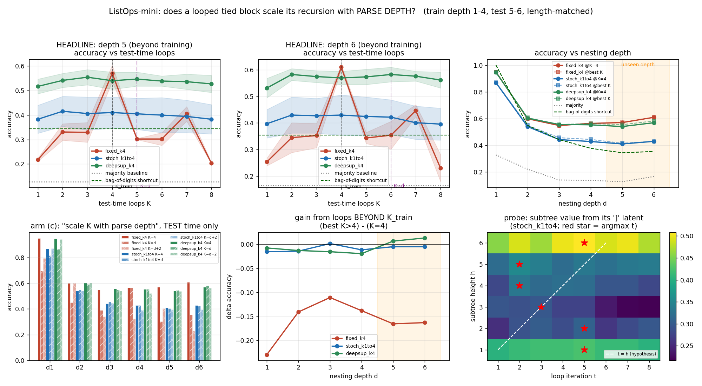

# Latent recursion on nested expressions: loops do NOT track parse depth

**Date:** 2026-07-26 · **Status:** done (hypothesis refuted — an honest negative)

## Hypothesis

The stochastic-depth recipe that turned a weight-tied loop into a real test-time-compute
axis on a **serial** task (registry `2026-07-25_loop-test-time-compute`,
`2026-07-26_looped-halt-nrasp`) should also work on a **hierarchical** one: a tied block
trained on nesting depth 1–4 with `k ~ U{1..4}` should keep improving on unseen depth 5–6
expressions when given more loops at test time, with loop iteration *t* resolving nesting
level *t*.

**Every part of that is refuted.** Stochastic depth is the *worst* of the three arms here,
no arm's optimal K grows with parse depth, and the per-iteration probe finds no
level-by-level resolution.

## Method

**Task — ListOps-mini.** Nested prefix expressions such as
`[MAX 2 [MIN 4 7] 9 [MED 1 5 8]]` over digits 0–9 with ops `MAX / MIN / MED` (`SUM_MOD`
dropped per the backlog item; `MED` = floor median, so answers stay in 0–9). Synthetic,
seeded, generated by `listops.py`. 40,000 deduplicated training expressions at depths
1–4; 384 held-out expressions per depth for depths 1–6, checked disjoint from train.
10-way classification of the root value, read off a prepended `[CLS]` token.

**The control that makes this experiment worth running: depth and length are DECOUPLED.**
A depth-6 tree is naturally longer than a depth-2 tree, so the naive setup would confound
"depth extrapolation" with plain **length** extrapolation — and the registry already knows
(`2026-07-26_looped-halt-nrasp`) that fixed-K only fails when train length is locked to
train depth. Here every expression at every depth is grown, by appending extra digit
arguments and shallow sibling subtrees that can never raise the tree's height, to a target
token length drawn from the **same band [25, 34]**. Measured mean expression length is
29.68 / 29.53 / 29.61 / 29.62 / 29.63 / 29.44 tokens at depths 1 / 2 / 3 / 4 / 5 / 6 —
matched to 0.8%. Depth 5–6 test expressions are length-in-distribution w.r.t. training.

**Architecture.** One pre-LN transformer block (d_model 96, 4 heads, d_ff 384),
**bidirectional** attention with PAD masking, learned absolute positions, applied K times
weight-tied with recurrent-depth-style per-iteration input injection (adapter on `[h ; e]`);
final LayerNorm + 10-way head at position 0. **136,138 parameters, identical in every
arm.** Because the readout is `ln_f + head` applied to the iterate, reading the answer out
at iteration *t* of one K=8 forward pass is bit-identical to having run the model at K=*t*,
so the whole accuracy(depth, K) table costs one pass.

**Arms** (matched params, matched 700 steps, matched batch stream per seed, 2 seeds):

| arm | training loop |
|---|---|
| `fixed_k4` | always 4 loops, loss on the last |
| `stoch_k1to4` | `k ~ U{1..4}` per batch, loss on the last |
| `deepsup_k4` | always 4 loops, loss at **every** iteration (the `filler-vs-recur` probe) |

Backlog arm (c) — *K scaled to parse depth at TEST time only* — needs no extra training and
is read straight off the table at K=d and K=d+2.

**Baselines.** Chance 0.10; per-depth majority class 0.33/0.22/0.14/0.14/0.13/0.17; and the
one that matters, the **bag-of-digits shortcut** — apply the *root* operator to the flat
multiset of all digits in the expression, ignoring all structure. It scores
**1.000 / 0.550 / 0.443 / 0.378 / 0.344 / 0.354** at depths 1–6 (exact at depth 1 by
construction). A model that only learned the shortcut cannot beat that line.

**Bonus probe.** Multinomial logistic probe on the latent at every subtree's `]` token, for
the value of that subtree, per loop iteration *t* × subtree height *h*, on the
`stoch_k1to4` seed-0 model (70/30 split, ≤1200 subtrees per height).

**Shrinks to fit the ~12 min CPU box** (2 shared cores, single thread): 0.136M params
rather than the backlog's 0.2–0.6M, 700 steps × batch 64 (~45k examples seen), 2 seeds,
384 eval expressions per depth. All arms are therefore **undertrained** — final train loss
0.87–1.42 nats — so these are early-training numbers.

## How to run

```bash
pip install -r requirements.txt
python run.py          # ~11 min, CPU, single thread
python listops.py      # sanity-check the generator
```

## Result



### 1. The headline: extra test-time loops do not help on deeper expressions

Accuracy at depths 5–6 (mean of d5 and d6), averaged over 2 seeds:

| arm | @ K=4 (trained) | @ best K | gain from any K>4 | best K at d5 / d6 | in-dist (d1–4) @K=4 |
|---|---|---|---|---|---|
| `fixed_k4` | **0.5898** | 0.5898 | **−0.1641** | 4 / 4 | 0.6651 |
| `stoch_k1to4` | 0.4200 | 0.4225 | −0.0052 | 2 / 2 | 0.5700 |
| `deepsup_k4` | 0.5548 | 0.5683 | **+0.0097** | 3 / 2 | 0.6647 |

Only `deepsup_k4` gets *anything* from loops beyond the trained depth, and +0.010 is
inside its 0.025–0.035 seed spread. `fixed_k4` is catastrophically punished for extra
loops (−0.164 at depths 5–6, −0.325 in-distribution at K=8). `stoch_k1to4` is flat.

### 2. No arm's optimal K grows with parse depth — the central claim, refuted

`best K by depth 1..6`: `fixed_k4` **4,4,4,4,4,4**; `stoch_k1to4` **3,2,2,2,2,2**;
`deepsup_k4` **4,3,4,2,3,2**. The optimum is pinned to the training schedule (or to 2),
never to the depth. Scoring the "scale loops with depth" policy directly, at depths 5–6:

| arm | K=4 flat | K=d | K=d+2 |
|---|---|---|---|
| `fixed_k4` | **0.5898** | 0.3281 | 0.3177 |
| `stoch_k1to4` | **0.4200** | 0.4134 | 0.3952 |
| `deepsup_k4` | 0.5548 | **0.5645** | 0.5488 |

For the fixed-K model, matching K to the parse depth costs **−0.26 accuracy** versus just
leaving K at its trained value. For the other two it is a wash (+0.010 / −0.007).

### 3. Stochastic depth does not transfer from serial to hierarchical structure

This is the sharpest result. On prefix-parity, `k ~ U{1..K}` took frontier accuracy from
0.55 to 0.85 and later to a perfect 1.000 at 5× the trained depth. Here the same recipe on
the same size of tied block is the **worst** arm at every depth: −0.170 at depths 5–6 and
−0.095 in-distribution versus plain `fixed_k4`, with **no seed overlap** (per-seed mean of
d5/d6 at K=4: fixed 0.611 / 0.569, stochastic 0.490 / 0.350). It also has 2–3× the seed
spread of the other arms.

What stochastic depth *does* buy is exactly what `2026-07-25_filler-vs-recur` reported:
**depth-invariance, not compute-scaling.** Its in-distribution degradation from K=4 to K=8
is −0.047, against `fixed_k4`'s −0.325. It has learned a fixed point whose extra iterations
are free of charge *and* free of benefit — and it paid ~0.10–0.17 accuracy for the
privilege. Deep supervision buys the same robustness (−0.056 at K=8) for free, while
keeping `fixed_k4`'s accuracy (0.6647 vs 0.6651 in-distribution).

### 4. The models are genuinely recursive-ish — they are not just the shortcut

The margin over the structure-blind bag-of-digits shortcut **grows** with depth for
`fixed_k4`: −0.051 / +0.050 / +0.106 / +0.186 / +0.227 / **+0.255** at depths 1–6 (same
shape for `deepsup_k4`; only +0.07 at depth 6 for `stoch_k1to4`). So the loop is using
structure, and using it *more* as trees deepen. It just does not spend a variable number of
iterations doing so.

Note also that accuracy is nearly **flat in depth** (fixed_k4: 0.949 / 0.599 / 0.548 /
0.564 / 0.570 / 0.609), i.e. unseen depths 5–6 are *not* harder than trained depths 3–4.
See the caveat below before reading that as free depth generalization.

### 5. Probe: iteration *t* does not resolve nesting level *t*

Subtree values are weakly linearly decodable from the `]` latent — probe accuracy
0.40 (h=1, majority 0.22), ~0.28–0.34 (h=2..5, majority 0.13–0.14), 0.50 (h=6, majority
0.17) — so partial results are present. But decodability is **flat in iteration**: within
each height the spread across t=1..8 is ≤0.05, and the argmax iteration by height is
**5, 5, 3, 2, 2, 5** for h=1..6 — no monotone relation to h, and nothing on the t=h
diagonal. Whatever the loop computes, it is not "one nesting level per iteration".

## Takeaway

**Loops do not track parse depth.** On a hierarchical task with length held constant, a
weight-tied looped transformer pins its useful iteration count to whatever it was trained
with, never to the structure of the input; matching test-time K to the parse depth is at
best neutral and at worst (fixed-K) costs a quarter of the accuracy. The stochastic-depth
recipe that is our strongest positive result for serial length/depth extrapolation is here
the *worst* arm — it transfers as **depth-invariance only**, reproducing
`2026-07-25_filler-vs-recur` rather than `2026-07-25_loop-test-time-compute`. The pattern
across the registry now looks consistent: the loop buys real test-time compute when the
task's required sequential steps are *externally enumerable and serial* (a prefix chain,
where the architecture makes step count = difficulty), and buys only a fixed point when
they are *hierarchical and latent*. Deep supervision at every iteration is the cheap
practical winner: fixed-K accuracy plus stochastic-depth robustness, at no extra cost.

Next: (a) give the loop a reason to iterate — supervise *intermediate* subtree values
(answer-space refinement, per `2026-07-25_trm-nano-sudoku`) rather than only the root, and
see whether iteration t then locks to level t; (b) train a PonderNet-style halting head on
this task, since `2026-07-26_looped-halt-nrasp` showed trained halting learns real
difficulty tracking where inference-time halting does not; (c) fix arity as well as length,
or train longer, to remove the caveats below.

## Caveats

1. **Arity confound.** Length is matched across depths, but at fixed length depth trades
   against branching factor: mean max arity falls 26.7 → 7.9 → 5.6 → 4.8 → 4.2 → 3.6 from
   depth 1 to 6. Deeper trees here are *narrower*, so each node's operation is over fewer
   operands. The flat accuracy-vs-depth curve should therefore **not** be read as "depth is
   free" — it is depth-gets-harder against arity-gets-easier, netting out. The claims about
   *K* (nothing helps, optimum never tracks depth) are unaffected, since they are
   within-depth comparisons.
2. **Undertrained.** 700 steps, batch 64, ~45k examples, final train loss 0.87–1.42 nats;
   accuracies are 0.42–0.67, not converged. A converged model could behave differently, and
   in particular the stochastic arm (which sees each depth 1/4 as often at k=4) may simply
   be further from convergence. This is the largest threat to conclusion 3.
3. **2 seeds, one width, one op set, one length band, one learning rate.**
4. Depth-1 instances are wide flat digit lists (arity ~27) by construction — that is the
   price of the length control, and it is why the bag-of-digits shortcut is exact there.
5. `fixed_k4` shows a reproducible secondary bump at K=7 (e.g. 0.447 at depth 6 vs 0.354 at
   K=6), i.e. its iterate is on something like a period-3 orbit rather than converging.
   Noted, not investigated.

## Novelty check

- **Verdict: partial-prior-art.**
- Checked 2026-07-26 with 5 WebSearch queries + 3 direct paper fetches. `scripts/novelty_check.py`
  returned `unchecked` (arXiv/OpenAlex 403 from this environment, as documented).
- Closest prior work:
  - [2603.21676 — *Thinking Deeper, Not Longer: Depth-Recurrent Transformers for
    Compositional Generalization*](https://arxiv.org/abs/2603.21676) is the direct hit and
    was fetched: it trains a depth-recurrent transformer on **nested boolean logic** at
    nesting depths 1–8 with the thinking-step count sampled `T ~ U(1,12)` — i.e. exactly the
    stochastic-depth recipe — and reports >90% accuracy out to depth 14. It explicitly does
    **not** manipulate sequence length independently of nesting depth.
  - [2604.07822 — *Loop, Think, & Generalize*](https://arxiv.org/abs/2604.07822): depth
    extrapolation for recurrent-depth transformers, but on multi-hop knowledge-graph chains
    (serial), analysed with logit-lens rather than per-subtree probes.
  - [2402.00976 — *Investigating Recurrent Transformers with Dynamic Halt*](https://arxiv.org/abs/2402.00976)
    evaluates recurrent/universal transformers on ListOps, but as a benchmark score, not as
    a depth-extrapolation study.
  - [ListOps (Nangia & Bowman, NAACL-SRW 2018)](https://aclanthology.org/N18-4013/) — the
    task family. [UW-Madison-Lee-Lab/looped-tf](https://github.com/UW-Madison-Lee-Lab/looped-tf) —
    the backlog's listed prior art.
- **How this differs:** (i) the length-decoupled construction, which none of the above
  applies — the prior positive results are all obtained where depth and length co-vary, so
  they cannot separate depth extrapolation from length extrapolation, and this run finds no
  depth extrapolation once they are separated; (ii) a structure-blind bag-of-digits
  shortcut baseline as the floor, which turns out to be the number that makes the accuracies
  interpretable; (iii) the per-iteration × per-subtree-height decodability matrix as a
  direct test of "iteration t resolves level t"; (iv) a same-harness three-way comparison of
  fixed-K, stochastic depth and deep supervision at exactly matched parameters and steps.
  This is a **negative** result against a 2026 positive one, at 0.136M params on CPU, and it
  is undertrained — it should be read as "the recipe did not transfer *here, at this scale,
  under a length control*", not as a refutation of 2603.21676.
