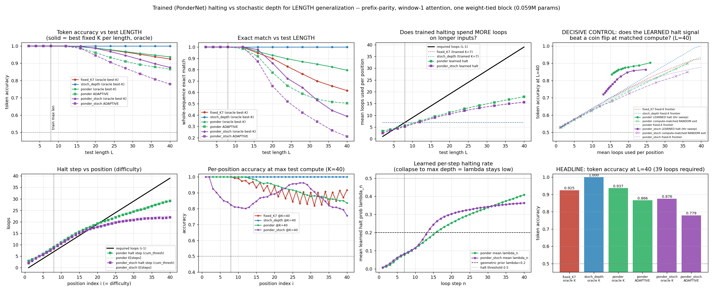

# Trained (PonderNet) halting vs stochastic depth for LENGTH generalization: the halt head learns real difficulty and wins by +0.130 at MATCHED compute — but stochastic depth is simply perfect at 5x train length, so the ceiling belongs to it

**Date:** 2026-07-26 · **Status:** done (hypothesis refuted, with a positive sub-result)

This is the convergence point of four earlier lab rows:

| row | what it established | what it left open |
|---|---|---|
| [`2026-07-25_loop-test-time-compute`](../2026-07-25_loop-test-time-compute) | stochastic depth `k~U{1..K}` was THE fix for **depth** extrapolation; fixed-K failed | does it hold on **length**? |
| [`2026-07-25_shadow-halt-entropy-tiny`](../2026-07-25_shadow-halt-entropy-tiny) | **inference-time** entropy halting was worthless — indistinguishable from a compute-matched coin flip | that halting was never **trained** |
| [`2026-07-25_pe-length-gen-tiny`](../2026-07-25_pe-length-gen-tiny) | ALiBi > RoPE > NoPE > APE for length extrapolation at 0.1M | — |
| [`2026-07-25_filler-vs-recur`](../2026-07-25_filler-vs-recur) | loops saturate on serial tasks without intermediate supervision | — |

## Hypothesis

A weight-tied block trained with a PonderNet halting head (learned per-step halt probability,
expected-loss weighting, KL to a geometric prior) learns to spend **more loops on longer inputs**,
and therefore extrapolates further in LENGTH than the same block trained at a fixed loop count —
and at least matches the proven stochastic-depth recipe.

## Method

**Task (n-RASP-L style).** Prefix-parity / cumulative XOR: input `[BOS, x_1..x_L]`, target
`y_i = XOR(x_1..x_i)`. Attention is **banded causal with window 1** — every position attends only
to itself and its immediate predecessor — so after `K` applications of the tied block, position `i`
has only seen bits `[i-K, i]`. Therefore

> **position `i` is solvable iff `K >= i - 1`**, i.e. a length-`L` input requires exactly `L-1` loops.

This makes required depth an *analytic ground truth per position*, which is what turns
"did the halt head learn to allocate compute correctly?" into a measurable question rather than an
inferred one. Length generalization and depth generalization are the same axis by construction.

**Architecture.** One pre-LN transformer block, `d=64`, 2 heads, `d_ff=256`, weight-tied and applied
`K` times with per-iteration input injection (adapter on `[h ; e]` — the winning variant of
`loop-test-time-compute`). **NoPE**: with a 2-token band, XOR is order-invariant over the window, so
no relative-position signal is needed and ALiBi's distance bias would be a no-op inside the band;
NoPE here means *no position information at all*, the strongest length-extrapolation prior available
for this task. **58,370 params**; the ponder arms add a 65-param halt head (+0.11%).

**Arms** (4 arms x 2 seeds = 8 runs, 1000 steps, batch 128, AdamW lr 2e-3, identical everywhere):

| arm | training |
|---|---|
| **a. `fixed_K7`** | fixed `K=7`, lengths `L ~ U{2..8}` |
| **b. `stoch_depth`** | `k ~ U{1..7}` per batch with `L = k+1` (the proven recipe) |
| **c. `ponder`** | PonderNet: per-position halt head, `N=7` unrolled steps, `sum_n p_n * CE_n + 0.01*KL(p || Geom(0.2))`, lengths `L ~ U{2..8}` |
| **d. `ponder_stoch`** | hybrid: PonderNet loss with a *stochastic* unroll horizon `N ~ U{L-1..7}` |

**Evaluation.** Train lengths ≤ 8, test lengths up to **40 (5x)**, `K_max_test = 40`, 384 fixed
held-out sequences. Adaptive policy = halt at the first step where the cumulative halting
probability reaches 0.5 (the median of the learned halting distribution); `lambda_n >= 0.5`,
`argmax p_n`, and seeded Bernoulli sampling are all reported too and agree within 0.013.
Because attention is causal, the prediction at position `i` is identical for any total length ≥ `i`,
so one length-40 batch yields every shorter length *exactly* — asserted in code by
`prefix_consistency_check` (passes for all 8 runs).

**The decisive control** (transplanted from `shadow-halt-entropy-tiny`): sweep the halting threshold
to trace an accuracy-vs-compute frontier for the learned signal, and compare it against a
**compute-matched random exit** (per-step geometric halting, zero information about difficulty)
interpolated to the same mean loops.

## Result



Every arm is **perfect in-distribution** (1.000 token accuracy on `L<=8` at its trained depth), so
in-distribution fit is nowhere a confound.

### 1. At maximum test-time compute, stochastic depth wins outright and it is not close

At `L=40` (5x the longest training length, 39 loops required):

| arm | token acc @K=40 | exact match @K=40 | adaptive token acc | adaptive mean loops |
|---|---|---|---|---|
| `stoch_depth` | **1.0000** | **1.0000** | — | — |
| `ponder` | 0.9371 | 0.7955 | 0.8662 | 17.9 |
| `fixed_K7` | 0.9247 | 0.6159 | — | — |
| `ponder_stoch` | 0.8759 | 0.3893 | 0.7792 | 15.6 |

**`stoch_depth` is at 1.000 token accuracy AND 1.000 whole-sequence exact match at every test length
from 2 to 40, on both seeds, at all 40 positions.** The headline gap is
**adaptive − stochastic depth = −0.134 token accuracy / −0.495 exact match** at the longest length.
Seed spread: `stoch_depth` (1.000, 1.000) vs `ponder` adaptive (0.732, 1.000) — the adaptive arm is
also the *least stable* of the two.

Note this table gives the fixed-K arms 40 loops and the adaptive arm the ~18 it chooses. §3 equalises
that and the ordering flips; §4 explains why the ceiling is still stochastic depth's.

### 2. But trained halting is NOT the null that inference-time entropy halting was

This is the real positive, and it is the direct answer to `shadow-halt-entropy-tiny`:

- **The halt head beats a compute-matched random exit by +0.105 to +0.157 token accuracy at every
  single point on the frontier** (mean +0.145 for `ponder`, +0.097 for `ponder_stoch`). Entropy
  halting was ≤ 0 vs the same control. Training the halting signal converts a worthless probe into
  a genuinely informative one.
- **The allocation rule extrapolates.** Mean halt step rises monotonically with position from
  **3.0 at position 1 to 29.1 at position 40** (slope 0.68 per position; `E[steps]` 3.1 → 29.2),
  having been trained only on positions 1–8. It does **not** collapse to a fixed depth, and it does
  **not** collapse to max depth (only 2.2% of positions run all 40 loops) — both of which were the
  predicted failure modes.

### 3. At MATCHED compute, adaptive halting beats everything — including stochastic depth

The comparison in §1 gives the fixed-K arms 40 loops and the adaptive arm only the ~18 it chooses to
spend. Equalise that, by interpolating each arm's fixed-K frontier to the adaptive arm's mean loops
per position, and the ordering **inverts**:

| at `L=40`, mean loops = 17.9 | token acc |
|---|---|
| `ponder` **ADAPTIVE** | **0.8662** |
| `stoch_depth` at fixed `K≈17.9` | 0.7365 (**−0.130**) |
| `fixed_K7` at fixed `K≈17.9` | 0.7318 (−0.134) |
| `ponder`'s own fixed-K frontier at `K≈17.9` | 0.7222 (−0.144) |
| compute-matched **random** exit | 0.7136 (−0.153) |

The same holds at `L=20` (adaptive 0.9616 at 11.2 loops vs `stoch_depth` fixed-K 0.8059, **+0.156**).
So the learned halting is a genuine accuracy-per-loop Pareto win over *every* non-adaptive arm and
over its own fixed-K frontier — the mechanism works, for the obvious reason that early positions
really do need fewer loops and a fixed `K` wastes them while starving the late ones.

### 4. Why it still loses the headline: the slope is 0.68 and it needs to be 1.0

Required loops per position is exactly `i-1` (slope 1.0, intercept −1). The learned allocation is
slope 0.68, intercept ≈ +2.4. So the halt head **over-spends in distribution and under-spends out of
it**, crossing the requirement line at `i ≈ 10`. At position 40 it buys 29 loops where 39 are
needed, and that deficit is where the ceiling is lost: adaptive halting on the *same* `ponder`
weights scores 0.866 while simply running that model to `K=40` scores 0.937 — it trades
**0.071 accuracy for a 55% compute saving**. Against `stoch_depth`'s 1.000-at-`K=40` it is
−0.134 token accuracy and −0.495 exact match. Since the task's deepest position *requires* 39 loops,
any policy that halts early is capped below 1.000 by construction, and the learned policy halts
early everywhere past `i≈10`.

### 5. Mechanism: PonderNet's expected loss starves the deep steps

The learned per-step hazard `lambda_n` climbs 0.007 → 0.409 over 40 steps, so the halting
distribution `p_n` concentrates mass on the early steps — which is exactly what the objective
`sum_n p_n * CE_n` uses to weight the gradient. Deep-step readouts therefore receive vanishing
supervision, while stochastic depth puts *uniform* weight on every depth 1..K. That predicts the
observed ordering, and the hybrid arm confirms it by making things worse rather than better:
`ponder_stoch` is the only arm that **breaks in-distribution depth-invariance**, with `L=8` accuracy
decaying 1.000 → 0.902 as test loops go 14 → 40, and it is the worst arm at every long length.
Adding the PonderNet objective on top of a stochastic horizon does not compose.

### 6. Bonus: "fixed-K fails" is really "fixed-K with length locked to depth fails"

`loop-test-time-compute` found fixed-K training degrades past its trained depth (frontier 1.00 →
0.55). Here `fixed_K7` reaches 0.925 token accuracy at `L=40` — it extrapolates fine. The difference
is the training *length distribution*: there, `L = k+1` locked length to depth; here `L ~ U{2..8}` at
fixed `K=7` means easy positions must stay correct through 7 loops, which is already an implicit
depth-invariance pressure. Fixed-K is still the weakest non-adaptive arm on exact match (0.616 vs
1.000) and the least seed-stable (1.000 / 0.850), and its per-position accuracy shows a curious
even/odd oscillation at large positions (~0.82 odd vs ~0.90 even) that the stochastic arm does not
have.

## Takeaway

**The answer is two-sided, and which side you want depends on whether you can afford max depth.**

*Trained halting is emphatically not the null that inference-time halting was.* On a task where
required depth is analytically known per position, a PonderNet halt head trained on lengths ≤ 8
learns a difficulty-tracking allocation rule that extrapolates 5x (mean halt step 3.0 → 29.1 across
positions 1 → 40, trained only on positions 1–8), beats a compute-matched **random exit** by +0.105
to +0.157 at every point on its frontier, and beats every arm's **fixed-K frontier at matched mean
compute** by +0.13 to +0.17 — including `stoch_depth`'s. It neither collapses to a fixed depth nor to
max depth (2.2% of positions run all 40 loops). That is a clean, decisive positive against
`2026-07-25_shadow-halt-entropy-tiny`, where the *untrained* entropy signal was indistinguishable
from a coin flip: **the difference between a worthless halting signal and a useful one is training
it**, and the compute-matched random-exit control that killed the entropy version is passed
comfortably here.

*And it still loses the experiment.* The learned slope is 0.68 where 1.0 is required, so it
under-spends on exactly the hardest positions and is capped below the ceiling by construction, while
the simplest possible baseline — sample the loop count uniformly during training, run to max depth at
test time — is **perfect**: 1.000 token accuracy *and* 1.000 whole-sequence exact match at 5x the
longest training length, on both seeds, at all 40 positions. Best adaptive arm: 0.866 / 0.505. The
halting objective also damages the underlying looped model (`ponder` at K=40 scores 0.937 vs
`stoch_depth`'s 1.000), and the diagnosis is structural: the expected loss `sum_n p_n CE_n` puts
vanishing gradient weight on precisely the deep steps that length extrapolation needs, whereas
stochastic depth weights every depth equally. The hybrid arm confirms it by breaking even
*in-distribution* depth-invariance.

**For Shadow's ledger:** train with stochastic depth; that is the accuracy decision, and it is free.
Add a halt head only if test-time compute is the binding constraint — it is worth 55% fewer loops for
−0.071 accuracy, and it is demonstrably better than both random exit and any fixed K at that budget.
Do not expect it to raise the ceiling.

**Next experiments this suggests.** (1) *Fix the slope.* Re-weight the PonderNet loss uniformly over
steps (or anneal `lambda_p` toward 0) so deep readouts stop being starved — the single change most
likely to let trained halting reach the ceiling it currently misses. (2) *Decouple the two roles.*
Freeze `stoch_depth`'s (perfect) weights and train only the 65-param halt head post hoc: this
experiment shows the accuracy ceiling and the compute-allocation signal are achievable separately but
not by joint training, so the combination is probably just an ordering problem.

## Deviations from the backlog spec (all honest shrinks, to fit the ~12-minute CPU box)

- **Scale.** 0.058M params, not 0.1–0.4M; 1000 steps, batch 128, 2 seeds.
- **Lengths.** Train `L <= 8` / test `L <= 40` instead of train ≤ 20 / test ≤ 40. The window-1 band
  makes required loops equal `L-1` exactly, so training at `L <= 20` would need 19 training loops per
  step, ~3x over budget. The **extrapolation ratio is 5x**, larger than the spec's 2x, and the
  absolute test range (40) matches.
- **`K_max` at test time** is 40, not 8–10, because required depth here scales with length rather
  than being a small constant.
- **Task** = parity (one of the three offered: copy / parity / addition).
- **PE** = NoPE rather than ALiBi (see Method — ALiBi's distance bias is a no-op inside a 2-token
  attention band).
- **Extra arm** beyond the spec's three: `ponder_stoch`, the PonderNet + stochastic-horizon hybrid,
  because "is stochastic depth all you need" is only answerable if the two ingredients are crossed.
- Wall clock: **469 s (7.8 min)** for all 8 training runs + eval + both control frontiers on one CPU
  thread — the reported time-box figure. Total machine time was ~24 min across three launches: one
  aborted early (test range only reached `L=20`, where every arm saturated), one that trained fully
  but died on a plotting bug before writing `results.json` (fixed: results are now written *before*
  the chart), and the final one. Training is fully deterministic — the final run reproduced the
  crashed run's accuracies bit-for-bit, and only added the iso-compute fields.

## Caveats

- 2 seeds, one task, one architecture. `ponder`'s adaptive accuracy at `L=40` is (0.732, 1.000)
  across seeds — the mean 0.866 hides a bimodal outcome, and one `ponder` seed *does* match
  `stoch_depth`. The `stoch_depth` result (1.000/1.000 on both seeds, all positions) is the tight one.
- The `stoch_depth` arm's training length distribution is `U{2..8}` via `L = k+1`, marginally
  different from the other arms' independent `L ~ U{2..8}`; this is the literal published recipe, and
  it is the arm that wins, so the confound cannot manufacture the reported gap in its favour on the
  *length* axis, but it is not a fully matched data distribution.
- "Mean loops used" is an analytic compute proxy (halting decisions are recorded while all positions
  are computed to `K_max`, as in PonderNet training); no wall-clock saving is claimed.
- The geometric prior (`lambda_p=0.2`, `beta=0.01`) is the PonderNet default and was **not** tuned. A
  prior matched to the task's true mean depth might raise the learned slope; this is untested and is
  the most likely way the negative result could be softened.

## Novelty check

- **Verdict: partial-prior-art.** The mechanism, the task family, and the head-to-head all exist
  somewhere in the literature; the specific combination and the controls do not.
- **Closest prior work:**
  - [`2409.15647` Looped Transformers for Length Generalization](https://arxiv.org/abs/2409.15647)
    (UW-Madison-Lee-Lab/looped-tf) — the n-RASP-L source. Fetched in full: trains looped
    transformers on parity/copy/binary-addition at lengths 1–20, tests past 40, GPT-2 blocks at
    `d=256`, NoPE. Its stopping rules are an **oracle** ("assume the number of steps needed is
    given") or a **maximum-confidence** criterion — it does **not** train a halting head, and it does
    **not** compare against a stochastic-depth schedule.
  - [`2107.05407` PonderNet](https://arxiv.org/abs/2107.05407) — the halting mechanism itself
    (expected-loss weighting + KL to a geometric prior) and the claim that it "succeeds at
    extrapolation tests where traditional neural networks fail".
  - [`2606.29983` Stabilizing Extrapolation in Looped Transformers via Learned Stochastic
    Stopping](https://arxiv.org/abs/2606.29983) — the closest head-to-head. Fetched: its
    "RL-Halting" learns a stopping distribution via REINFORCE, evaluates length generalization
    (train `n<20`, test `n>=20`) on binary addition / Dyck-1 / unique-set / copy with 3-layer tied
    transformers, and compares against hand-designed stochastic schedules — but the halting is
    REINFORCE-trained, not PonderNet, and there is no compute-matched random-exit control.
  - [`2607.20519` Adaptive Depth in Looped Transformers: Diagnosing Learned Halting Gates and
    Trajectory Readouts](https://arxiv.org/abs/2607.20519) — title-level match and probably the
    nearest work. **Could not be verified**: arxiv.org/abs and /html both returned proxy 429/403
    from this environment across five attempts, as also flagged in
    `2026-07-25_shadow-halt-entropy-tiny`. Flagged as an unresolved prior-art risk.
  - Own registry: `2026-07-25_loop-test-time-compute`, `2026-07-25_shadow-halt-entropy-tiny`,
    `2026-07-25_pe-length-gen-tiny`, `2026-07-25_filler-vs-recur`.
- **How this differs:** (i) required depth is **analytically known per position** (window-1 band), so
  the halting head's allocation can be scored against ground truth as a *slope* (0.68 measured vs 1.0
  required) rather than judged by downstream accuracy alone; (ii) the **compute-matched random-exit
  control** — the control that killed inference-time entropy halting in our own registry — is applied
  to a *trained* halting head for the first time we can find, and it passes (+0.15) while the arm
  still loses the experiment; (iii) a direct PonderNet-vs-stochastic-depth head-to-head at
  **0.058M params on CPU**, with the crossed hybrid arm; (iv) the mechanistic diagnosis that the
  expected-loss weighting starves deep-step readouts, evidenced by the hybrid breaking
  in-distribution depth-invariance; (v) the incidental correction that fixed-K training does *not*
  fail when the training length distribution is decoupled from the training depth.
- **Search method:** 5 WebSearch queries + 3 successful WebFetch full-text reads (2409.15647,
  2606.29983, 2107.05407 partial). `scripts/novelty_check.py` returned `unchecked` (arXiv/OpenAlex
  APIs 403 from this environment, as documented in the lab's earlier rows). The "no prior
  compute-matched random-exit control on a trained halting head" claim is a negative search result,
  not an exhaustive review, and is weakened by the unverifiable 2607.20519.

## How to run

```bash
pip install -r requirements.txt
python run.py     # ~8 min on one CPU thread; writes results.json + chart.png
```
