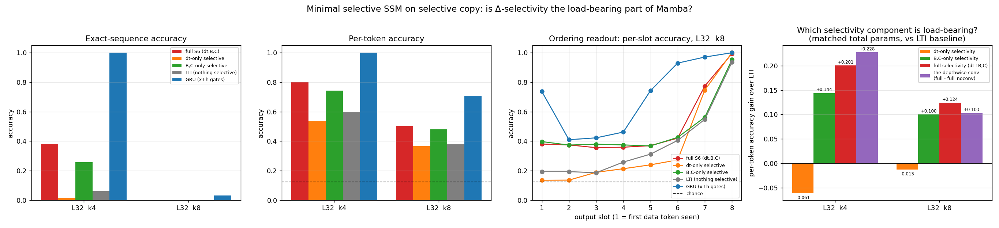

# Is Δ-selectivity the load-bearing part of Mamba? On selective copy it is worth ~nothing — B/C-selectivity and the depthwise conv are

**Date:** 2026-07-26 · **Status:** done (hypothesis **refuted in the direction that matters**, and the Mamba paper's own selectivity ranking **inverts** on the task the paper invented to motivate selectivity)

## Hypothesis

Mamba ([arXiv:2312.00752](https://arxiv.org/abs/2312.00752)) motivates input-dependent state updates with the
**selective-copy** task, and its own ablation (Table 7, ~350M params, language-modelling perplexity) singles
out the step size **Δ** as *"the most important parameter (Theorem 1)"*. But Δ is a function of the **current
input only** — it cannot see the hidden state. Our own row [`2026-07-25_minrnn-selcopy`](../2026-07-25_minrnn-selcopy/)
showed that exactly this property costs minGRU the **ordering** of stored items: its per-slot accuracy collapses
to the last ~2 tokens. So the sharp question is: **does Δ-selectivity hit the same ordering wall, or does the
SSM's structured N-dimensional state — whose per-(channel, state) decay rates `exp(Δ·A)` form a spectrum of
timescales rather than one leak rate — escape it?**

We predicted the SSM would partially escape: Δ-only beating a fully LTI baseline and beating minGRU's recency
profile, while still losing to a GRU whose gates see the state.

## Method

- **Task.** Mamba-style selective copy, generator **reused verbatim** from `2026-07-25_minrnn-selcopy`: a
  length-`L` sequence of a blank token (id 0) with `k` data tokens (ids 1..8) at uniformly random positions;
  target = the `k` values **in order of appearance**. Core cells `L=32 × k∈{4,8}`; span control at `L=64, k=4`.
  Fresh data every step; eval = 1024 held-out sequences from a disjoint seed (binomial SE ≈ 0.016).
- **Architecture.** Hand-rolled minimal Mamba/S6 block in pure PyTorch — **no `mamba.py`, no
  `state-spaces/mamba`, no CUDA kernels**. Sequential scan (mathematically identical to the parallel scan):

  `h_t = exp(Δ_t ⊙ A) ⊙ h_{t-1} + (Δ_t ⊙ B_t) ⊙ x_t`,  `y_t = Σ_N (h_t ⊙ C_t) + D ⊙ x_t`

  with `d_inner = 2·d_model`, `N = 8` states/channel, diagonal real `A = -exp(A_log)` (S4D-real init),
  Mamba's log-uniform `dt` bias init, depthwise causal conv (width 4), SiLU gating by `z`, pre-LN residual
  block, then a shared GELU bottleneck(64) → `k` linear slot heads **on the last position**.
- **The five arms** differ *only* in which of {Δ, B, C} is a function of the current input. Everything else —
  embedding, conv, SiLU gate, readout, optimiser, data, seed — is identical:

  | arm | Δ | B, C | note |
  |---|---|---|---|
  | `full` | input-dep | input-dep | Mamba S6 |
  | `delta` | input-dep | learned constants | the paper's claimed core mechanism |
  | `bc` | learned constant | input-dep | |
  | `lti` | learned constant | learned constants | S4-lite / LTI baseline |
  | `gru` | — | — | `nn.GRU` reference; gates see `x` **and** `h` |

- **Matched params.** Each arm's `d_model` is fitted so *total* params ≈ 60k (**58.7k–60.9k for every arm**).
  The LTI arm gets the *largest* state (d_model 88 vs 86), so the comparison is conservative against our claim.
- **Held fixed.** 600 steps, batch 32, AdamW lr 8e-3 (OneCycle, 10 % warmup), grad-clip 1.0. Weight decay 0.01
  on 2-D weights only — **never** on `A_log`, `D`, `dt` bias or norms (decaying `A_log` would itself be an
  ablation). Iso-step, not train-to-convergence.
- **The lr is not a confound.** A documented pre-sweep (`metrics.lr_pre_sweep`) ran all five arms at
  lr ∈ {3e-3, 8e-3}: **8e-3 is best or tied-best for every arm** (full 0.103→0.381, delta 0.019→0.017,
  bc 0.163→0.257, lti 0.022→0.062, gru 0.999→1.000), so the shared rate favours nobody.
- **Controls / probes.** `full_noconv` (conv removed — is the win the SSM or the conv?); seed 1 for all five
  arms at `L=32,k=8`; span control at `L=64,k=4`; a 2-block `delta` depth probe.
- **Shrinks vs the backlog spec** (2-core shared CPU box): 60k params instead of 0.1–0.25M — chosen to match
  `minrnn-selcopy` exactly for cross-row comparison — `N=8` instead of Mamba's 16, 1 block for the main sweep,
  vocab 8, 600 steps, `L≤64` instead of the paper's 4096. **21 runs, 795 s** total (a first pass under a 660 s
  cap left 2 probe runs, topped up with the `RESUME=1` path; each run is seeded from its own config, so a
  resumed run is identical to the same run in one uninterrupted pass).

## How to run
```bash
pip install -r requirements.txt
python run.py
```

## Result

**Δ-selectivity is not load-bearing on selective copy. B/C-selectivity is — and the depthwise conv beats both.**

Exact-sequence and per-token accuracy at matched params (`metrics.headline_exact_match`), seed 0:

| arm | k=4 exact | k=4 token | k=8 exact | k=8 token (2-seed mean) |
|---|---|---|---|---|
| `gru` (x+h gates) | **1.000** | **1.000** | **0.032** | **0.700** |
| `full` S6 (Δ,B,C) | 0.381 | 0.800 | 0.001 | 0.497 |
| `bc` (B,C only) | 0.257 | 0.743 | 0.000 | 0.482 |
| `lti` (nothing selective) | 0.062 | 0.599 | 0.000 | 0.374 |
| `delta` (Δ only) | **0.017** | **0.538** | 0.000 | 0.403 |
| chance | 2.4e-4 | 0.125 | 6e-8 | 0.125 |



**1. The paper's own ranking inverts.** Decomposed against the LTI baseline at matched params:

| component | k=4 (exact / token) | k=8 (token, 2-seed mean) |
|---|---|---|
| Δ-only selectivity | **−0.046 / −0.061** | **+0.030** (delta's own seed spread is 0.073 — *within noise*) |
| B,C-only selectivity | +0.194 / +0.144 | **+0.109** (spreads ≤0.012 — ~9× the noise) |
| full (Δ + B,C) | +0.318 / +0.201 | +0.123 |
| **the depthwise conv** | — / **+0.228** | — / +0.103 |

Mamba's Table 7 (350M, Pile perplexity) reports Δ-only recovering 1.12 of the 2.22 ppl gained by full
selectivity — half of it, and more than B-only (0.78) or C-only (0.95). Here, on the task that paper invented
to *motivate* selectivity, **Δ-only recovers none of it** (slightly negative at k=4, inside seed noise at k=8)
while B/C recovers most of it. **At k=4 the depthwise conv alone (+0.228 token) is worth more than all three
selectivity mechanisms combined (+0.201).**

**2. It is not that Δ fails to learn — it learns, and the learning is what hurts.**
`metrics.by_cell.*.*.state_spectrum` reads the retention `exp(Δ·A)` per (channel, state) while the model idles
on blanks:

| arm (L=32, k=4) | median retention on noise | median half-life | fraction of states with half-life > L |
|---|---|---|---|
| `lti` | 0.950 | 13.5 tokens | 0.310 |
| `full` | 0.968 | 21.2 tokens | 0.415 |
| `bc` | 0.952 | 14.2 tokens | 0.332 |
| `delta` | **0.700** | **1.95 tokens** | **0.134** |

Making Δ input-dependent hands the optimiser a knob that it uses to push Δ **up** — and since `Ā = exp(Δ·A)`
with `A<0`, larger Δ means **faster forgetting**. The Δ-only arm destroys the long-timescale states that the
LTI baseline keeps for free: it retains less than half as many long-lived states and its median memory
half-life collapses from ~14 tokens to ~2. It bought a gate and paid for it with its memory.

**3. The ordering wall is real, and Δ hits it harder than minGRU did.** Per-slot accuracy at L=32, k=8
(slot 1 = first data token seen; chance 0.125):

| arm | slot 1 → 8 | recency index |
|---|---|---|
| `gru` | 0.74, 0.41, 0.42, 0.46, 0.74, 0.93, 0.97, 1.00 | 0.367 |
| `bc` | 0.40, 0.37, 0.38, 0.38, 0.37, 0.43, 0.56, 0.95 | **0.371** |
| `full` | 0.38, 0.38, 0.36, 0.36, 0.37, 0.42, 0.77, 0.99 | 0.506 |
| `lti` | 0.19, 0.19, 0.19, 0.26, 0.31, 0.41, 0.55, 0.94 | 0.483 |
| `delta` | **0.14, 0.14, 0.19, 0.21, 0.24, 0.27, 0.75, 1.00** | **0.675** |
| *minGRU (prior row, L=64 k=8)* | *0.31, 0.34, 0.35, 0.39, 0.38, 0.41, 0.90, 1.00* | *0.375* |

The Δ-only arm reproduces minGRU's signature **more extremely**: the last two items are perfect, the first four
are at or barely above the 0.125 chance floor. So the answer to the framing question is **(a), not (b)**: the
structured N-dimensional state does **not** rescue an input-only gate. What flattens the profile is making
**B and C** input-dependent — `bc` has the flattest SSM profile (recency 0.371, on par with the GRU's 0.367)
and lifts slot 1 from 0.14 to 0.40. That is the mechanistically sensible split: **Δ is a scalar "how fast do I
forget right now" knob (a leak rate — exactly minGRU's `z`), whereas B is a "which state dimensions does this
token write into" knob — an *address*.** Ordering needs an address, not a leak rate.

**4. Nobody beats the GRU.** Full Mamba at k=4 reaches 0.381 exact against the GRU's 1.000 — and against
minGRU's 0.389 in the prior row at the same 60k params / 600 steps. So the answer to *"does full-Mamba beat the
GRU where minGRU failed?"* is **no, and at this budget it does not even beat minGRU**. At k=8 the GRU is ~1.4×
every SSM arm on per-token accuracy (0.700 vs 0.497) and the only arm with non-trivial exact match. The
hidden-state-dependent gate remains the thing that wins this task.

**5. Probes.**
- *Conv control:* removing the depthwise conv takes `full` from 0.381 → **0.036** exact at k=4 (0.800 → 0.572
  token). Independently corroborated by [arXiv:2506.11891](https://arxiv.org/abs/2506.11891), which finds a
  1-layer Mamba solves MQAR *without* any input-dependence in its SSM and stresses "the importance of
  convolution and gating".
- *Span control (L=64, k=4):* the GRU is still 1.000; among the SSM arms the ranking **flips** (`delta` 0.085 >
  `full` 0.023). Single seed, and `delta`'s seed spread at k=8 was 0.073, so we read this as *the SSM arms are
  unstable at L=64 under this budget*, not as evidence for Δ.
- *Depth probe:* a 2-block `delta` at the same 60k params goes 0.017 → **0.065** exact (0.538 → 0.671 token),
  with slot 3 jumping 0.47 → 0.995. Depth partially substitutes for the missing state-dependent gate —
  the same mechanism `minrnn-selcopy` found for minGRU, and plausibly part of why real Mamba stacks many layers.

## Takeaway

On the synthetic task Mamba's authors chose to *justify* selectivity, the component they name as most important
is the one that does nothing. **Δ-selectivity is a gate — a per-channel leak rate computed from the current
token — and a gate cannot express "this is the 3rd data token, put it in slot 3."** That is precisely the
deficit our minGRU row isolated, and the SSM's structured state does not rescue it; if anything it makes it
worse, because an input-dependent Δ gives the optimiser a lever it uses to shorten memory (median half-life
14 → 2 tokens). What *does* buy ordering is **input-dependent B and C**: those choose *which* state dimensions a
token is written into and read out of, which is an addressing mechanism, and they flatten the per-slot profile
to GRU-like. The two results are consistent once you stop calling both things "selectivity" — Mamba's Δ is
minGRU's `z` wearing a continuous-time hat, and its `B_t` is the part with no minRNN analogue at all.

Two caveats that keep this honest. First, this is a **600-step, 60k-param, iso-step** ranking on **one
synthetic task**; the Mamba ablation it contradicts was run at 350M params on **language-modelling perplexity**,
where aggressive forgetting is a feature and per-item ordering is never scored — the two findings can both be
true and are not in logical conflict. Second, at k=8 exact match is on the floor for every SSM arm, so the k=8
column rests on per-token accuracy, and the Δ-only-vs-LTI gap there (+0.030) is inside Δ's own seed spread
(0.073). The claim we will defend is the *negative* one: **at this scale Δ-selectivity buys nothing measurable
on selective copy, while B/C-selectivity and the depthwise conv each buy a lot.**

Next: (a) run the same five-arm ablation on **language modelling** (tiny-shakespeare bpc) at the same 60k
params — if Δ-only wins *there* while losing here, we have localised the inversion to the metric rather than
the scale, which is the cheapest decisive experiment; (b) sweep `N` (8 → 32) to test whether B-selectivity's
advantage is an addressing-capacity effect that grows with state size; (c) push k=8 to 5–10× steps to check
whether the ordering deficit is a wall or a constant factor, as it turned out to be for minGRU at k=4.

## Novelty check

- **Verdict: partial-prior-art** (checked 2026-07-26; `scripts/novelty_check.py` returned `unchecked` —
  arXiv/OpenAlex 403 from this environment, known — so the verdict rests on 4 WebSearches and 4 direct fetches).
- **Closest prior work.**
  - **[arXiv:2312.00752 (Mamba), Table 7](https://arxiv.org/pdf/2312.00752)** — the exact Δ/B/C ablation axis
    already exists: at ~350M params on language-modelling perplexity, nothing-selective 10.93, B-only 10.15,
    C-only 9.98, **Δ-only 9.81**, all three 8.71, with the verbatim conclusion *"Δ is the most important
    parameter (Theorem 1), but using multiple selective parameters together synergizes."* Its Table 1 reports
    selective copying at 97.0–99.8 % for S6 vs 18.3 % for S4 — but **selectivity there is all-or-nothing; the
    per-parameter ablation is never run on selective copy.**
  - **[arXiv:2506.11891 (Understanding Input Selectivity in Mamba)](https://arxiv.org/abs/2506.11891)**,
    ICML 2025 — theoretical treatment of a "simplified S6 where the input-dependence only affects the state
    matrix via Δ(x)", and finds a 1-layer Mamba solves MQAR *without* SSM input-dependence, stressing
    convolution and gating. It does not run a controlled matched-parameter Δ-vs-B/C ablation on selective copy.
  - Own registry: `2026-07-25_minrnn-selcopy` (the ordering-vs-span decomposition this row extends),
    `2026-07-26_mqar-state-capacity` and `2026-07-25_zoology-mqar-recall` (scalar gates were a no-op on MQAR —
    the same "minimum useful selectivity" question from the other side).
- **How this differs.** (i) The Δ/B/C ablation run **on selective copy** rather than on LM perplexity, at
  matched total parameters — and the ranking **inverts** relative to Mamba Table 7. (ii) A **per-slot ordering
  readout** (recency index) that ties the result to a specific, previously isolated failure mode of input-only
  gates, showing Δ-only reproduces minGRU's profile more extremely than minGRU does. (iii) A **mechanism**:
  the retention-spectrum measurement showing input-dependent Δ *shortens* memory half-life 14 → 2 tokens.
  (iv) The **depthwise conv measured on the same scale as the selectivity terms**, where it dominates them.
  (v) A matched-parameter **GRU reference**, which the Mamba and minRNN papers both omit on this task.
- **Caveats.** 60k params (Mamba's ablation: 350M), 600 steps, 1 block, `N=8`, `L≤64` (paper: 4096), vocab 8,
  2 seeds at `L=32,k=8` and 1 seed elsewhere. Note our `bc` arm turns B **and** C on together, whereas Mamba
  Table 7 reports them one at a time, so the comparison is Δ-only-vs-LTI (directly comparable) plus
  B+C-vs-LTI (their two single rows combined). Cross-row comparisons to `minrnn-selcopy` are indicative only:
  same task/generator/param budget/step count, but a different lr (8e-3 vs 3e-3) and a different residual-block
  scaffold, which is why our GRU scores 0.032 at k=8 where that row's scored 0.382. All comparisons *within*
  this experiment share byte-identical scaffolding.
