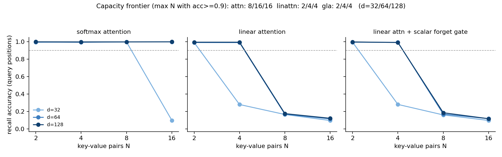

# MQAR at nano scale: where does linear-attention recall break, and does a selective gate move the capacity frontier?

**Date:** 2026-07-26 · **Status:** done

## Hypothesis
On multi-query associative recall (MQAR), softmax attention stays near-perfect regardless of width; vanilla linear attention falls off a cliff once the number of key-value pairs approaches its per-head state capacity (~d_head); and the cheapest possible selectivity — one input-dependent scalar forget gate per head — shifts that cliff to more pairs at the same width.

## Method
- Task: zoology-style MQAR, generated fresh every batch. Sequence = `k1 v1 ... kN vN | q1 ... qN` (queries are the N context keys, permuted); loss and accuracy only on query positions. 64 keys, 64 values, N distinct keys per sequence.
- Architecture: identical 2-block pre-norm transformer skeleton (2 heads, 2x MLP, learned positions, 27k–304k params); only the sequence mixer varies:
  - `attn` — causal softmax attention;
  - `linattn` — causal linear attention, elu+1 feature map (per-head state d_head × d_head);
  - `gla` — same + one input-dependent scalar forget gate per head (bias init +3, so it starts ~vanilla). Both linear mixers computed exactly in closed form as decay-masked attention (`exp(A_t − A_s)` weights from the cumulative log-gate), fully vectorized.
- Varied: mixer × N ∈ {2, 4, 8, 16} × d_model ∈ {32, 64, 128} (27 runs). Held fixed: 2000-step AdamW budget (lr 1e-3, wd 0.01, batch 64), early stop at 0.99, one seed, same train stream and 512-sequence eval set per (N, seed) across all mixers and widths. Total sweep: 13.3 min CPU.

## How to run
```bash
pip install -r requirements.txt
python run.py
```

## Result
**Capacity frontier (max N with acc ≥ 0.9), d = 32/64/128: attn 8/16/16 · linattn 2/4/4 · gla 2/4/4.**

- Softmax attention is flat at ~1.0 everywhere except (d=32, N=16), where it fails to fit within the 2000-step budget (0.099) — its only failure is optimization at the smallest width, not recall.
- Linear attention has a hard cliff between N=4 and N=8: 0.99 → 0.17. The refuted part of the story is *where* the cliff sits — it does NOT move when d_head goes 16 → 32 → 64 (acc at N=8: 0.166 / 0.170 / 0.176). A 4x-wider state, which the state-capacity account (state = d_head × d_head) says should hold ~4x more pairs, buys nothing at this training budget. Only the N=4 column responds to width (d=32 fails at 0.281, d≥64 solves it).
- The scalar forget gate is a no-op: |gla − linattn| ≤ 0.011 in all 12 cells, identical frontier. Minimal scalar selectivity does not buy recall per unit state here.
- The residual 0.17 at N=8 (~11x the 1/64 chance) is **position-uniform** (0.148–0.201 across context slots 0–7, `recency_probe.json`), i.e. partial distributed recall — not "remembers the most recent pairs", which is what a decaying-state story would predict.



## Takeaway
At nano scale and a fixed small step budget, the linear-attention recall bottleneck behaves like a **feature-map/optimization limit, not a state-size limit**: the cliff is pinned at N≈8 across a 4x sweep of d_head, and one-scalar-per-head selectivity does nothing. This is consistent with why the zoology/BASED line of work needed better feature maps (Taylor-exp) and hybrids rather than just bigger states or simple gates. Caveats: single seed, one feature map (elu+1), fixed 2000-step budget — this measures "does not learn recall within budget", not "cannot represent it"; the attn d=32/N=16 failure shows the budget binds even for attention at the smallest width. Follow-ups worth a night each: (1) give the failing linattn cells a 10x step budget to separate cannot-represent from slow-to-learn; (2) swap elu+1 for a Taylor-exp feature map (BASED-style) at identical budget and see if the cliff finally moves with width; (3) matrix-valued (per-channel) gates instead of scalar, i.e. interpolate toward full GLA/Mamba selectivity and find the minimum selectivity that beats vanilla.

## Novelty check
- Verdict: partial-prior-art
- Closest prior work: [Zoology: Measuring and Improving Recall in Efficient Language Models (2312.04927)](https://arxiv.org/abs/2312.04927) (defines MQAR; shows the attention/sub-quadratic recall gap and ties recall to recurrent state size), [Zoology blogpost 2 / BASED](https://hazyresearch.stanford.edu/blog/2023-12-11-zoology2-based), [Gated Slot Attention (NeurIPS 2024)](https://proceedings.neurips.cc/paper_files/paper/2024/file/d3f39e51f5f634fb16cc3e658f8512b9-Paper-Conference.pdf), [Dissecting Linear Recurrent Models: gating strategies, selectivity and generalization (2601.12598)](https://arxiv.org/html/2601.12598), [RAM-Net (2602.11958)](https://arxiv.org/html/2602.11958), [Kernelized Linear Attention: Breaking the Capacity Wall (2607.17419)](https://arxiv.org/html/2607.17419).
- How this differs: pure-PyTorch nano harness (27k–304k params, 13 min CPU, no zoology dependency); the specific measurement — width-invariance of the elu+1 cliff at fixed step budget, a scalar-gate-is-a-no-op control at matched everything, and the position-uniform residual — is not reported at this scale in the sources above. The broad attention-vs-linear gap itself is a replication.
