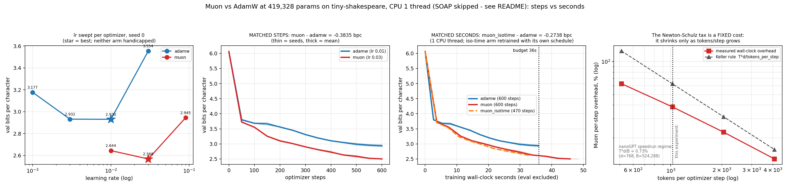

# Muon vs AdamW at 0.42M params on CPU: seconds, not steps

**Date:** 2026-07-26 · **Status:** done (**hypothesis refuted — Muon survives the wall-clock correction with a 1.45x margin**)

> **Naming note — SOAP was skipped.** The backlog item is `muon-vs-adamw-vs-soap` and the id is kept
> so the registry lines up, but the experiment that actually ran is **Muon vs AdamW**. SOAP =
> Shampoo eigenbasis + Adam, which needs a periodic eigendecomposition of per-layer left/right
> preconditioners plus a state that is 2x Adam's; a *correct* implementation does not fit the
> 12-minute single-thread CPU budget, and a wrong one would be worse than no data. The backlog
> explicitly sanctions this shrink ("SOAP only if trivially implementable in budget — otherwise
> SKIP it, rename the comparison honestly"). It is renamed here and in `results.json`
> (`metrics.soap_included = false`).

## Hypothesis

Muon's per-step win over AdamW survives at tiny scale, **but shrinks or reverses per WALL-CLOCK
SECOND on CPU**, because the 5-iteration Newton-Schulz orthogonalization is a *fixed per-parameter*
cost that does not shrink with the token count of a step. Keller Jordan's own rule of thumb puts the
FLOP overhead at `T * d_model / tokens_per_step` — about **0.73%** at nanoGPT-speedrun scale
(T=5, d=768, 524,288 tokens/step) but **62.5%** here (T=5, d=128, 1,024 tokens/step), a ~85x larger
tax. This should therefore be the regime where "seconds, not steps" bites.

## Method

- **Model.** nanoGPT-style char LM, 2 pre-norm layers, d_model 128, 4 heads, d_ff 512, ctx 64,
  **419,328 params**. 393,216 of them (the eight block weight matrices: qkv 384x128, proj 128x128,
  fc 512x128, out 128x512, per layer) go to Muon; the remaining 26,112 (token + positional
  embeddings, LM head, all LayerNorm gains/biases) stay on AdamW, exactly as the Muon recipe
  prescribes.
- **Muon, hand-rolled** (`class Muon` in `run.py`; no dependency on the reference repo, which assumes
  CUDA + distributed): Nesterov momentum 0.95 → `zeropower_via_newtonschulz5` with the tuned quintic
  `(a,b,c) = (3.4445, -4.7750, 2.0315)`, 5 iterations, spectral-norm pre-scaling → update scaled by
  `max(1, rows/cols)**0.5`.
- **Data.** tiny-shakespeare, char level, 65-symbol vocab, 90/10 split (1,003,854 / 111,540 chars).
  600 steps x batch 16 x ctx 64 = 614,400 tokens = **0.61 epochs** (all arms see identical data).
- **Fairness.** lr swept per optimizer at seed 0, best picked per optimizer, **plus an automatic
  edge guard**: if the best lr lands on a grid endpoint the grid is extended one point further (x3).
  It fired — AdamW's best was 0.01, the top of `[1e-3, 3e-3, 1e-2]`, so 0.03 was run too (3.554 bpc,
  clearly worse), and the AdamW optimum is now bracketed on both sides. Muon's optimum (0.03) was
  interior from the start. In the Muon arm the auxiliary AdamW (embeddings/head/norms) runs at
  AdamW's own best lr. Identical init and identical batch stream per seed across all arms;
  identical warmup/cosine/grad-clip/weight-decay.
- **Three arms.** `adamw` (600 steps) · `muon` (600 steps, **matched STEPS**) · `muon_isotime`
  (**470 steps, matched SECONDS** — the step count is derived from the measured in-training
  overhead factor and the cosine schedule is *rewritten over its own 470 steps*, so Muon is not
  handicapped by a truncated LR schedule). 2 seeds at the best lr. 13 runs, **547 s** total.
- **Clock discipline.** Every eval pass is excluded from the training wall clock. A separate
  **interleaved A/B micro-benchmark** (AdamW and Muon steps alternated, median of 6 reps) measures
  the per-step overhead at 4 batch sizes, so machine-load drift on this 2-shared-core box hits both
  arms equally.

## How to run
```bash
pip install -r requirements.txt
python run.py
```

## Result

**Refuted, in the interesting direction: Muon wins per step by a lot, and the win is so large that a
27.7% wall-clock tax cannot eat it.** Every number below is in `results.json`.

| arm | steps | train s | val bpc (2 seeds) | vs AdamW |
|---|---|---|---|---|
| `adamw` (lr 0.01) | 600 | 35.9 | **2.9468** [2.9305, 2.9631] | — |
| `muon` (lr 0.03) | 600 | 45.9 | **2.5633** [2.5681, 2.5586] | **−0.3835 bpc** (matched STEPS) |
| `muon_isotime` (lr 0.03) | 470 | 33.5 | **2.6730** [2.6786, 2.6674] | **−0.2738 bpc** (matched SECONDS) |

- **Matched steps: Muon wins by 0.3835 bpc**, both seeds same sign (−0.362, −0.404), **21.6x the
  mean seed spread** (0.0178). Muon reaches AdamW's final bpc in **279 steps** where AdamW needs
  **517** → **step-domain speedup 1.85x**.
- **Matched seconds: Muon still wins by 0.2738 bpc**, both seeds same sign, 15.4x the seed spread.
  Wall-clock speedup to AdamW's final loss: **1.49x** (20.6 s vs 30.8 s). The schedule-unfair
  secondary reading (interpolating the full 600-step Muon curve at AdamW's 35.9 s budget) agrees:
  −0.336 bpc.
- **Measured per-step overhead: x1.277 (+27.7%)** in training; the optimizer step goes from **7.2%
  of wall clock under AdamW to 33.4% under Muon** (4.3 → 25.6 ms/step).
- **The overhead would have to be x1.85 to break even** (that is exactly the step-domain speedup).
  Measured x1.277 leaves a **1.45x margin** — and `step_speedup / overhead = 1.85/1.277 = 1.45`
  reproduces the directly measured 1.49x wall-clock speedup, so the two accountings agree.
- **The overhead is a fixed cost and behaves like one** (panel 4). Measured wall-clock overhead vs
  tokens/step: **+62.7% @512, +38.4% @1024, +22.6% @2048, +12.8% @4096** — a clean
  `~tokens^-0.76` decay. Extrapolating that fit, the x1.85 break-even is only reached at **~351
  tokens/step (batch 5.5 at ctx 64)**. On this box there is essentially **no practical batch size
  at which the Newton-Schulz tax eats Muon's win**.
- **Keller's rule is a loose upper bound, and that is why the hypothesis failed.** It predicted
  62.5%; the exact FLOP count for these matrix shapes gives 47.5%; the *measured* wall-clock cost is
  27.7% — **2.26x smaller than the rule**. The rule is stated as "at most", and the slack is
  the difference in achieved FLOP/s between the NS quintic (a handful of small, cache-resident,
  perfectly-shaped GEMMs) and the training step (attention, GELU, embedding gather, cross-entropy,
  optimizer element-wise traffic).
- **A landmine, quantified: do NOT port the reference bfloat16 Newton-Schulz to CPU.** The precision
  probe measured bf16 NS at **0.0299 s vs float32 0.00875 s per layer's matrices — bf16 is 3.4x
  SLOWER** on this CPU. Substituting that cost projects a Muon step of 118.7 ms, an overhead of
  **x1.984 — above the x1.85 break-even**. A naive bf16 port would have flipped this row's verdict
  to "Muon loses on wall clock", and the flip would have been an implementation artifact, not a
  property of the algorithm. (Projection from the measured probe, not a re-run.)



## Takeaway

The "seconds not steps" correction is real and it is large here — it costs Muon 0.11 bpc of its
0.38 bpc margin, i.e. **29% of the win is paid back at the till** — but it is nowhere near enough to
flip the ranking, even in about the most hostile setting available: one CPU thread, 1,024 tokens per
step, a 0.42M-param model, and 94% of the parameters routed through Newton-Schulz. The reason is a
ratio, and stating it that way is the useful output of this row: **Muon loses on wall clock only
when its per-step time ratio exceeds its step-domain speedup.** Here that is 1.28 vs 1.85. Because
the overhead falls as `tokens_per_step^-0.76` while the step-domain speedup does not, the danger zone
is *below* this experiment's batch size, not above it — the opposite of the intuition that motivated
the hypothesis, and consistent with the large-batch literature (Liu et al. 2025 find Muon's edge is
non-decreasing in batch size) extended down 128x below their smallest batch. Two honest caveats:
600 steps at 0.61 epochs is an early-training regime where a better-conditioned optimizer has the
most to gain, and the AdamW bottom is flat (2.932 at 3e-3 vs 2.930 at 1e-2) so its best-case is
genuinely bracketed but not finely resolved. Next: (a) the real threat to the wall-clock story is
`ns_steps` and precision, not batch — sweep T in {1,2,3,5} and ask how few NS iterations still buy
the 1.85x, since T is the one term the overhead scales linearly in; (b) run the same accounting at
d_model 256/512 where NS cost grows as `d^3` but the training step only as `d^2`, which is where the
fixed-cost argument should finally win; (c) this row is the `mup-lr-transfer` backlog item's
prerequisite — Muon's optimum sat at 0.03, 3x AdamW's, so the two optimizers do not share an lr axis.

## Novelty check

- **Verdict: partial-prior-art** (checked 2026-07-26).
- **Closest prior work.**
  [Keller Jordan's Muon post](https://kellerjordan.github.io/posts/muon/) — the algorithm, the
  parameter split, and the `T*m/B` overhead rule (0.7% at nanoGPT, 0.5% at Llama-405B scale), with
  results reported in both sample-efficiency and wall-clock terms and the explicit note that "Muon
  has a slower per-step wallclock time than AdamW".
  [Fantastic Pretraining Optimizers and Where to Find Them (arXiv:2509.02046)](https://arxiv.org/abs/2509.02046)
  — against a properly tuned AdamW, matrix-based optimizers give ~1.3x, and "the speedup of
  matrix-based optimizers is inversely proportional to model scale, decreasing from 1.4x for 0.1B to
  1.1x for 1.2B"; they deliberately compare in **tokens, not wall clock**, arguing the step overhead
  can be held under 10%.
  [Practical Efficiency of Muon for Pretraining (arXiv:2505.02222)](https://arxiv.org/abs/2505.02222)
  — states the same `Θ(m/B)` overhead scaling and finds Muon's token-ratio advantage **non-decreasing
  in batch size** across 128K–16M-token batches.
  [Gram Newton-Schulz (Dao AI Lab, 2026)](https://tridao.me/blog/2026/gram-newton-schulz/) — the
  hardware-aware side of the same cost question.
- **How this differs.** All three prior sources measure in the large-batch, GPU regime and either
  assume the overhead away (2509.02046: "under 10% through proper implementation") or observe it
  where the rule already predicts <1%. This row runs the accounting **where the rule predicts 62.5%
  instead of 0.73%** — 1 CPU thread, 1,024 tokens/step, 128x below the smallest batch in 2505.02222 —
  and contributes: (a) a retrained **iso-wall-clock arm** with its own LR schedule rather than a
  truncated curve, which is the control that makes a seconds comparison fair; (b) the measured
  overhead-vs-tokens/step curve (`~tokens^-0.76`, 62.7%→12.8% over 8x) against Keller's `T*m/B`,
  showing the rule overshoots the *wall-clock* cost by 2.26x; (c) the break-even framing
  (overhead 1.28 vs step-speedup 1.85) that says exactly when Muon loses; (d) the measurement that
  the reference **bfloat16** Newton-Schulz is 3.4x *slower* on CPU and would alone have flipped the
  verdict; (e) an lr-grid **edge guard** so the AdamW baseline is provably not capped — the
  failure mode most likely to fake a Muon win.
- Search was 4 WebSearch queries plus direct fetches of the Muon post, arXiv:2509.02046 and
  arXiv:2505.02222. `scripts/novelty_check.py` returned `unchecked` — **arXiv and OpenAlex both 403
  from this environment**, as is known for this box. The "no published version of this specific
  accounting" claim is a negative search result, not an exhaustive literature review.

## Deviations from the backlog spec

1. **SOAP skipped** (sanctioned by the backlog); comparison renamed Muon vs AdamW.
2. **Shrunk to fit ~12 min CPU:** 600 steps, batch 16, ctx 64, 0.61 epochs — an early-training,
   undertrained regime. The backlog's 1–3 hr budget is not available here.
3. **Newton-Schulz in float32, not the reference bfloat16** — measured as 3.4x faster on this CPU;
   the bf16 counterfactual is reported explicitly above rather than hidden.
4. **A 4th AdamW lr (0.03) was added automatically** by the edge guard, so the AdamW sweep is 4
   values and Muon's 3. This favours AdamW, which is the safe direction.
