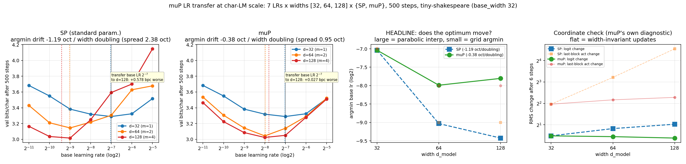

# muP LR transfer at char-LM scale: the optimum drifts 3x less, but it does not stand still

**Date:** 2026-07-26 · **Status:** done (hypothesis partially confirmed — muP wins the practical
question decisively and loses the literal one)

## Hypothesis
Under muP (Yang & Hu, *Tensor Programs V*, [arXiv:2203.03466](https://arxiv.org/abs/2203.03466)) the
loss-optimal learning rate of a nanoGPT-style char LM is **width-invariant**; under standard
parametrization (SP) it **drifts toward smaller LR as width grows**. Measured as the shift of
`argmin_lr` in octaves per width doubling.

## Method

### The parametrization, spelled out
Hand-rolled — `microsoft/mup` is **not** installed. **base_width n0 = 32**, width multiplier
`m = d_model / n0 ∈ {1, 2, 4}`. Rules follow TP5 **Table 3** (abc-parametrization, muP column, Adam
rows) and **Table 8** (the same rules in width-multiplier form, which is what the mup package
ships), plus the *1/d attention* rule of TP5 §4 / Table 8:

| layer | SP (baseline) | muP (implemented) |
|---|---|---|
| input / embedding | std σ₀, Adam lr η | std σ₀, Adam lr η **(same)** |
| hidden matrices | std 1/√fan_in, lr η | std 1/√fan_in, **lr η / m** |
| readout (d→V) | std 1/√d, mult 1, lr η | std **1/√n0**, **mult 1/m**, lr η |
| LayerNorm gains/biases | lr η | lr η **(same)** |
| attention logits | q·k / √d_head | q·k · **√d_head₀ / d_head** |

Two deliberate, documented deviations from a naive reading of the paper:

1. **Readout row.** TP5's *output weights* row (mult 1/fan_in, init var 1/fan_in², Adam lr 1/fan_in)
   is put through the abc-symmetry of TP5 §3.3 — `(mult, std, lr) → (mult/θ, θ·std, θ·lr)` leaves
   Adam training *exactly* invariant, because Adam's per-entry step size is independent of parameter
   scale — with θ = m. That yields the (mult 1/m, width-independent init, width-independent lr) form
   the mup package actually ships: `MuReadout` applies `output_mult/width_mult` in the forward pass
   and `MuAdam` classifies the readout as *vector-like* (one finite dim) and leaves its LR alone.
   This is the one row where practitioner tables disagree; the Θ(1)-logit-update condition pins it
   (`Δ(mult·W·h) ≈ mult·lr·d·h_rms = (1/m)·η·(m·n0)·h_rms = Θ(1)` requires lr = Θ(1) given mult 1/m),
   and the coordinate check below confirms it empirically.
2. **Attention constant.** Written `√d_head₀ / d_head` rather than bare `1/d_head`. The constant
   `√d_head₀` is the mup package's tunable `attn_mult` (its README uses literally
   `query @ key.T * 8 / d` — 8 = √64 for a base head dim of 64), fixed here to the value that makes
   muP coincide with SP at the base width. Without this base-width HP alignment the two arms would
   already differ at m=1 by a constant and the comparison would be confounded.

**The design's main control follows from this:** at d = 32 = base_width, SP and muP are *the same
parametrization*, so their curves must coincide exactly. They do —
`base_width_identity_max_abs_bpc_diff = 0.0` across all 7 LRs. Every difference at d = 64 and
d = 128 is therefore attributable to width scaling alone.

### The sweep
2-layer pre-norm decoder-only char LM, n_head = 2 **held fixed** so width scaling grows head_dim
(16 → 32 → 64), d_ff = 4d, ctx 64, tiny-shakespeare (65 chars). **7 base LRs (2⁻¹¹…2⁻⁵, integer
octaves) × widths {32, 64, 128} × {SP, muP} = 42 runs**, 500 steps, batch 16, **1 seed**. Pure Adam
(weight_decay 0 — decoupled WD interacts with muP and is a separate question), 20-step linear warmup
then **constant** LR, grad clip 1.0. Every run sees the identical seeded init draw and the identical
batch stream, so the design is tightly paired.

**This is a SHAPE experiment** — where the lr-vs-loss minimum sits — **not a quality experiment.**
500 steps at 0.031–0.419M params does not train these models out; absolute bpc (3.0–3.7) is far from
converged and is not the point.

Argmin is reported both as the discrete grid point and as the vertex of the parabola through the
grid minimum and its two neighbours (sub-octave resolution). All 6 minima are **interior** and
**0 of 42 runs diverged**, so no argmin is a boundary artifact.

Also run: **muP's own diagnostic, the coordinate check** — RMS change in activations and logits over
6 Adam steps at fixed LR, which muP is designed to hold width-invariant.

## How to run
```bash
pip install -r requirements.txt
python run.py
```

## Result

**muP cuts the drift by ~3x and the zero-shot transfer penalty by ~22x, but the optimum is not
width-invariant at this scale.**

| | d=32 | d=64 | d=128 | drift (oct / width doubling) | spread |
|---|---|---|---|---|---|
| **SP** argmin log₂(lr) | −7.04 | −9.03 | −9.42 | **−1.19** | 2.38 oct |
| **muP** argmin log₂(lr) | −7.04 | −7.99 | −7.80 | **−0.38** | 0.95 oct |

The headline the practitioner actually cares about — **tune the LR on the d=32 proxy (2⁻⁷), apply it
zero-shot at d=128, pay the gap against that width's own tuned optimum**:

| | d=64 | d=128 |
|---|---|---|
| SP transfer penalty | +0.160 bpc | **+0.578 bpc** |
| muP transfer penalty | +0.096 bpc | **+0.027 bpc** |

**21.6x less penalty at d=128.** And it is not just the minimum that transfers: the mean |Δbpc|
between the d=64 and d=128 curves across all 7 LRs is **0.204 bpc under SP vs 0.049 under muP** — a
4.2x tighter agreement of the *whole* curve. The SP curve also gets much sharper with width (depth
0.394 → 0.534 → 1.132 bpc) while muP's stays flat (0.394 → 0.493 → 0.485), so under SP a
mis-transferred LR is punished harder *and* is more likely.

**The coordinate check is unambiguous and independently validates the implementation:** over 6 steps
at fixed LR, the RMS change of the last block's activations grows **6.01x** across a 4x width
increase under SP (3.91 → 9.30 → 23.48, i.e. ~linear in width — exactly the instability muP exists
to remove) but only **1.25x** under muP (3.91 → 4.49 → 4.87). Logit updates: SP 1.46x
(1.399 → 1.770 → 2.039), muP **0.93x** (1.399 → 1.364 → 1.302). Init logit RMS decays as intended
under muP (1.03 → 0.65 → 0.48 ≈ 1/√m) and is flat under SP (1.03 → 0.93 → 0.98).

**The honest negative.** muP's residual −0.38 oct/doubling is not noise-shaped: it is *entirely* the
32 → 64 step (−0.95 oct), while 64 → 128 moves **+0.19 oct**, i.e. essentially perfect transfer
between the two widest models. That is the expected signature of a base width too narrow to be in
the asymptotic regime — the Cerebras/EleutherAI practitioner guide picks a proxy hidden size of 256
"to ensure a large-enough scale for the law of large numbers and central limit theorem to converge",
and d=32 (head_dim 16) is 8x below that. So the failure of literal width-invariance here looks like a
*small-proxy* effect, not a refutation of muP — but with 1 seed and a 1-octave grid I cannot separate
that from ordinary curvature, and I am not claiming to.

**muP is not a quality win here.** Best bpc at d=128 is SP 3.016 vs muP 3.023 — a tie (and at d=64,
muP 3.043 vs SP 3.144). muP buys *tunability*, not loss.



## Takeaway
At 0.03–0.42M params and 500 steps the classic muTransfer picture reproduces qualitatively and
survives quantification, with one asterisk. The SP optimum marches left at ~1.2 octaves per width
doubling, close to the textbook 1/width story, and paying the base-width LR at 4x width costs
0.578 bpc — enormous. muP flattens that to −0.38 oct/doubling and 0.027 bpc, and the coordinate check
shows *why*: SP's activation updates grow roughly linearly in width while muP's are flat. But
"width-invariant" is too strong a description of what happened: muP still lost a full octave between
d=32 and d=64 and only stopped drifting once both models were ≥64 wide. The practical reading is the
mup package's own advice restated with a number — **the proxy has to be wide enough, and d=32 with
head_dim 16 is not**; between 64 and 128 transfer is effectively exact (0.19 oct).

Next, cheapest first: (a) re-run with base_width 64 and widths {64, 128, 256} to test the
"proxy-too-narrow" explanation directly — it predicts the residual drift collapses; (b) **decompose
the muP diff**, since arXiv:2605.21486 (2026) claims essentially all of muP's AdamW benefit is the
*relative* embedding LR and that the readout/attention rules contribute negligibly — this row bundles
all three and cannot separate them; (c) 2–3 seeds, since 1 seed cannot bound the ±0.2-octave wobble.
The backlog's "does it survive Muon?" sub-question was dropped for budget (as sanctioned) and is the
natural follow-up given `2026-07-26_muon-vs-adamw-vs-soap`.

## Novelty check
- **Verdict: replication (at a new, much smaller scale), with two new measurements.**
- Checked 2026-07-26. `scripts/novelty_check.py` returned `unchecked` (arXiv and OpenAlex both 403
  from this environment, as documented); verified via 4 web searches + 3 direct fetches.
- Closest prior work:
  - [Tensor Programs V (arXiv:2203.03466)](https://arxiv.org/abs/2203.03466) — the origin of the
    claim and of the rules implemented here; [microsoft/mup](https://github.com/microsoft/mup) whose
    README pins the two ambiguous rows (hidden Adam LR = `globalLR / width_mult`;
    `query @ key.T * 8 / d`).
  - [A Large-Scale Exploration of µ-Transfer (arXiv:2404.05728)](https://arxiv.org/html/2404.05728v5)
    — the definitive empirical study. A direct fetch confirms it sweeps **widths 128 / 512 / 2048 /
    8192 and does not test widths below 128**, and finds SP's 1/√d attention scale on its own
    prevents transfer.
  - [The Practitioner's Guide to muP (EleutherAI / Cerebras)](https://blog.eleuther.ai/mutransfer/)
    — the canonical SP-drifts-vs-muP-aligned figure; a fetch confirms it does not publish the
    smallest width or quantify the drift, and recommends a proxy hidden size of 256.
  - [arXiv:2605.21486](https://arxiv.org/html/2605.21486) (2026) — argues muP's AdamW benefit is
    almost entirely the embedding-layer LR; directly relevant to the decomposition this row does
    *not* do.
- How this differs: (a) it runs an octave below the smallest published µ-Transfer width (32 vs 128)
  and finds the regime where muP *partially* fails, with the failure localized to the narrowest
  width; (b) it reports the drift as a **scalar slope in octaves per width doubling** with
  sub-octave parabolic argmin interpolation, and the **zero-shot transfer penalty in bpc**, rather
  than as a figure to eyeball; (c) the **base-width identity control** (SP ≡ muP at m=1, measured at
  exactly 0.0) is a check the published treatments do not report, and it is what licenses attributing
  the whole SP/muP gap to width. The "not previously published at this scale" claim rests on 4 web
  searches and 3 fetches, not an exhaustive review.
