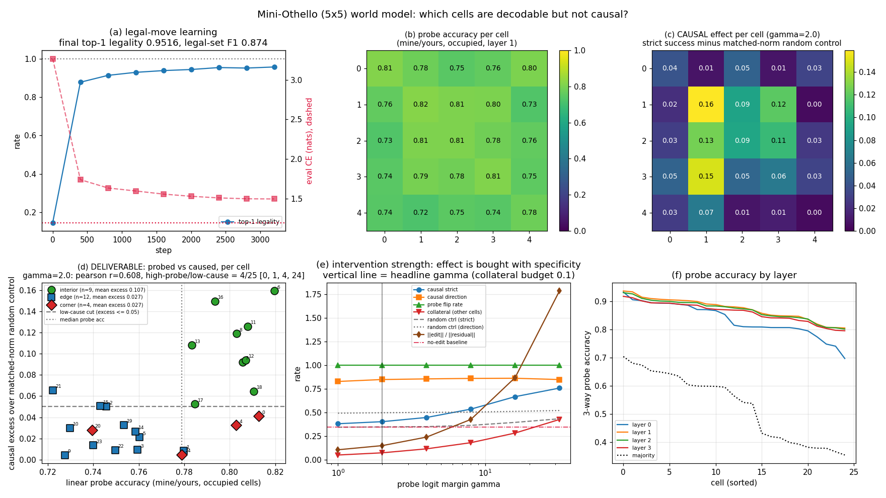

# Probed vs caused on a mini-Othello world model: which board cells are decodable but not causal?

**Date:** 2026-07-26 · **Status:** done · **Compute:** 461.5 s (7.7 min), CPU, 1 thread

## Hypothesis

A tiny GPT trained only on random-legal 5x5 Othello move sequences forms a linearly decodable board
world model, but decodability and causal use come apart *per cell*: some cells will probe at high
accuracy while a directional edit of their probe subspace fails to move the model's legal-move
prediction the way the edited board implies. This is the world-model version of the arc in
`2026-07-25_dyck-probe-can-lie` and `2026-07-26_tracr-ground-truth-lab` — probes are all recall,
intervention is what localizes.

## The mandatory shrink (and why)

The published setup (8x8 Othello, pretrained Othello-GPT, 20M games) does not fit a 2-core CPU box.
What was actually run:

| published | here |
|---|---|
| 8x8 board, 60 moves | **5x5 board, 21 moves** |
| Othello-GPT, 8 layers, d=512, ~25M params | **4 layers, d=64, 4 heads, 204,800 params** |
| 20M championship + synthetic games | **150,000 random-legal games (3,115,943 moves)** |
| probe every layer, intervene from layer 4/8 | probe all 4 layers, intervene at **layer 1 of 4** |

**4x4 was tried first and rejected**: the game tree is too small (only 13,784/20,000 generated games
are distinct, and every game caps at 12 moves). 5x5 with the standard 2x2 centre block at rows/cols
1-2 gives 19,997/20,000 distinct games and a median length of 21, so it is the smallest board that
is not degenerate. Passes are kept (the standard Othello-GPT convention, no pass token) — 51.6% of
games contain at least one pass, which is what forces the model to reconstruct the board rather than
read the turn off position parity.

**The engine is hand-written and self-tested**, because a wrong flipping rule would silently
invalidate everything downstream. `run.py` asserts 6 hand-checked facts before doing anything else,
including the canonical 8x8 opening (black's only legal moves from the standard start are D3, C4,
F5, E6 = flat indices 19, 26, 37, 44) and a two-disc line flip. All 6 pass.

## Method

1. **Task model.** Next-move prediction over `[BOS, m_0 ... m_20]`, vocab 26. Because the generator
   picks uniformly among legal moves, the Bayes-optimal predictor is uniform over the legal set, so
   the irreducible CE is exactly `E[log |legal set|]` = **1.1988 nats** — a real floor to measure against.
2. **Probes.** One multinomial logistic probe per board cell for `{empty, mine, yours}` *relative to
   the player to move next*, on the raw residual stream at all 4 layers, split **by game**
   (59,266 train / 29,663 test positions).
3. **Causal test.** For an occupied cell, flip its colour **in the residual stream** along the
   probe's own direction — a closed-form minimum-norm patch that drives cell *c*'s probe to read the
   opposite colour with logit margin ≥ γ over the runner-up class (Li et al.'s gradient-descent edit,
   solved analytically). Probe flip rate is **1.000** at every γ, so the edit always takes.
   Then ask whether the model's move probabilities change the way the **edited** board implies.
   Only instances where the edit actually changes the legal set are used (200 per cell).
4. **Controls.** Every intervention is paired with (a) a **random-direction patch of identical norm**,
   (b) the **no-edit baseline**, (c) **collateral** = fraction of the *other* 24 cells whose probe
   readout moved, and (d) a **clean-edit subset** (target flipped, no other cell moved).

Two outcome metrics: `direction` = does p(move) move the right way on the moves whose legality the
edit changes; `strict` = does the model's thresholded legal-set *decision* now match the edited board.

**The headline γ is chosen by a pre-stated specificity constraint** (largest γ with mean collateral
≤ 0.10 → **γ = 2.0**), *not* by maximizing the outcome. The outcome-maximizing γ = 32 is reported too.

## Result

**The task model works.** Top-1 legality **0.9516**, legal-set F1 0.874 (P 0.836 / R 0.916), exact
legal-set match 0.486, CE 1.4933 vs the 1.1988 floor (excess **0.295 nats**). **Probes work**: best
at layer 1, 3-way accuracy **0.873** vs a 0.528 majority baseline (0.773 restricted to occupied cells).

### 1. The world model IS causally used — and the evidence is the *direction* metric, at any strength

| γ | ‖edit‖/‖resid‖ | collateral | direction | random ctrl | strict | random ctrl |
|---|---|---|---|---|---|---|
| 1 | 0.10 | 0.049 | **0.826** | 0.491 | 0.379 | 0.343 |
| 2 | 0.15 | 0.072 | **0.847** | 0.496 | 0.401 | 0.346 |
| 4 | 0.24 | 0.114 | 0.853 | 0.499 | 0.446 | 0.349 |
| 8 | 0.43 | 0.179 | 0.858 | 0.502 | 0.534 | 0.362 |
| 16 | 0.87 | 0.281 | 0.860 | 0.510 | 0.666 | 0.394 |
| 32 | 1.78 | 0.424 | 0.846 | 0.519 | 0.756 | 0.432 |

The `direction` column is **flat and saturated** (0.826 → 0.860) while the random matched-norm control
sits at chance (0.491 → 0.519). Even the gentlest edit — 10% of the residual norm, 4.9% collateral —
moves the model's probabilities the way the edited board implies **82.6%** of the time, +0.335 over
control. On the 41% of γ=1 instances where the edit was *surgically clean* (target flipped, zero other
cells moved) the strict score is 0.403, slightly **above** the all-instance 0.379, so the effect is
not collateral damage. Li et al.'s result replicates at 5x5 with a 205k-param model.

### 2. But flipping the model's legality *decision* is bought with magnitude, not content

`strict` rises monotonically 0.379 → 0.756 — and so do the random control (0.343 → 0.432), the
collateral (0.049 → 0.424) and the edit norm (0.10x → **1.78x the residual itself**). At γ=32 you are
not editing one cell, you are demolishing the board: 42% of the other cells' readouts change. At the
specificity-constrained γ=2 the strict excess over the matched-norm control is only **+0.056**. Anyone
reporting a single headline intervention number without a norm-matched control and a collateral
number is reporting the norm.

### 3. The deliverable: per-cell probed vs caused

At γ=2, with per-cell causal effect measured as **excess over the matched-norm random control**:

- **pearson r = +0.608**, spearman +0.565 (probe accuracy on occupied cells vs causal excess).
- **4 of 25 cells are high-probe/low-cause** (probe accuracy ≥ median AND causal excess ≤ 0.05):
  cells **0, 1, 4, 24** — three of the four corners plus one corner-adjacent edge.
- Probe accuracy is nearly **flat** across the board (range 0.722–0.820, a 0.098 spread) while causal
  excess spans **0.004–0.159, a 36x ratio**.

### 4. The dissociation is geometric, and the two probe metrics disagree about its sign

| cells | n | probe acc (occupied) | probe acc (3-way) | causal excess | mean legal moves changed |
|---|---|---|---|---|---|
| **interior** | 9 | 0.802 | 0.841 | **0.107** | 1.56 |
| edge | 12 | 0.747 | 0.882 | 0.027 | 1.13 |
| **corner** | 4 | 0.784 | **0.919** | **0.027** | 1.10 |

Interior minus border causal excess = **+0.0804**, permutation p = **5.0e-05** (20,000 permutations);
the ranges barely overlap (interior 0.052–0.159, border 0.004–0.065). And the reversal:

> **The 3-way probe accuracy that the Othello-GPT literature reports is *anti*-correlated with causal
> effect: pearson r = -0.594, spearman -0.570.** The corners — the cells the probe reads *best*
> (0.919, the highest on the board) — are the cells the model uses *least* (excess 0.027).

The mechanism is not mysterious, which is the point: a corner disc can never be flipped and can only
anchor a bracket along 3 of 8 directions, so its colour gates ~1.1 legal moves against ~1.6 for an
interior cell; and it is empty for most of the game, which is exactly what inflates a 3-way probe.
The probe is reading a cell that is *easy*, not a cell that is *load-bearing*.



## Takeaway

**The hypothesis is half-refuted and half-confirmed, and the half that survives is sharper than the
one that died.** On the *matched* metric (2-way mine/yours on occupied cells) probe accuracy and
causal effect are **positively** correlated (r = +0.608) — there is no wholesale probe-lies story
here as there was for Dyck depth-parity or the 14/35 dead Tracr cells, because on a task where the
board *is* the computation, most decodable cells really are used. But the per-cell dissociation is
real, systematic and geometric: 4/25 cells decode at or above the median while buying ≤ 0.05 over a
random matched-norm patch, they are the corners, and a 0.10 spread in probe accuracy hides a 36x
spread in causal effect. **Probe accuracy is not a ranking of causal importance even when it is
positively correlated with it** — and if you use the 3-way accuracy the literature actually reports,
the ranking is *inverted* (r = -0.594).

The second lesson is methodological and transfers to full-scale Othello-GPT: **intervention success
is a function of intervention norm**, and at the strength where the strict legal-set metric looks
impressive (0.756) the patch is 1.78x the residual stream and has scrambled 42% of the rest of the
board. The sensitive, specific, cheap measurement is the *direction* metric at small γ, which is
saturated at 0.85 while collateral is still 5%.

Next: (i) run the same per-cell analysis on the real 8x8 Othello-GPT checkpoint, where the corner
prediction is directly testable and the 64-cell scatter has far more dynamic range; (ii) replace the
probe-direction patch with a LEACE-style certified erasure per cell (as in `dyck-probe-can-lie`) to
separate "the direction is not used" from "the direction is not reachable"; (iii) train to a higher
legality rate — at 0.9516 the model's own legal-set ceiling on the changed moves is 0.658, which caps
the strict metric and is the largest single source of noise in the scatter.

## Caveats

- One model, one seed, one board size. The interior/border split is p=5e-05 over cells, but cells are
  not independent samples and there is no seed-level replication.
- `strict` has a built-in negative dependence on the model's own accuracy about the *true* board
  (pearson(ceiling, strict) = -0.641), which is exactly why the headline uses excess over a
  matched-norm control that shares the same starting point.
- The edit is a colour flip on occupied cells only; empty↔occupied edits are not tested.
- The edited boards are not constrained to be reachable by legal play (Li et al.'s "unnatural" case).
- γ is swept on the same positions the effect is measured on; the choice rule (collateral ≤ 0.10) is
  pre-stated in `experiment.yaml` and the entire sweep is reported, but it is not a held-out selection.

## How to run

```bash
pip install -r requirements.txt
python run.py          # ~8 min, CPU, 1 thread; OTHELLO_FAST=1 for a ~35 s smoke test
```

## Novelty check

- **Verdict: partial-prior-art.** Checked 2026-07-26 by web search + 3 direct fetches
  (`scripts/novelty_check.py` not used; arXiv/OpenAlex 403 from this box, a known issue).
- **Closest prior work.** [Li et al., ICLR 2023](https://arxiv.org/html/2210.13382v5) /
  [othello_world](https://github.com/likenneth/othello_world) invented this exact intervention. A
  direct fetch confirms they report **per-intervention aggregate error rates** (0.12 natural / 0.06
  unnatural vs baselines 2.68 / 2.59) and explicitly **do not report per-tile intervention success,
  per-tile probe accuracy, or any decodable-but-not-causal dissociation**.
  [Nanda's linear-probe follow-up](https://www.neelnanda.io/mechanistic-interpretability/othello)
  does probe-direction interventions but states its intervention results are "mostly a series of case
  studies"; a fetch confirms **no systematic per-cell breakdown**.
  [Baldwin, "Exploring the Limits of OthelloGPT's Emergent Representations"](https://bpb-us-w2.wpmucdn.com/voices.uchicago.edu/dist/9/3887/files/2024/02/FINALBaldwinXLabSRF23-LimitsOfOthelloGPTsEmergentRepresentation-204d4ed6c6475eac.pdf)
  reports aggregate probe accuracy over all 64 squares, not per-tile causal effect.
  [Emergent Linear Representations (BlackboxNLP 2023)](https://aclanthology.org/2023.blackboxnlp-1.2.pdf)
  establishes the mine/yours linear representation but does not do the per-cell causal comparison.
- **How this differs.** (a) the per-cell scatter of probe accuracy against causal-edit success, with
  the causal axis defined as **excess over a norm-matched random-direction control** rather than raw
  success; (b) the **intervention-strength sweep** showing that strict success is bought with edit
  norm and collateral while the direction metric is saturated and specific at 1/10th the norm —
  which reframes the aggregate numbers in the original paper; (c) the **geometric** result that
  interior cells carry 4x the causal effect of border cells at near-equal probe accuracy
  (p = 5e-05), and that **3-way probe accuracy is anti-correlated (r = -0.594) with causal effect**;
  (d) the whole thing at 5x5 / 205k params in 8 CPU-minutes, which makes it a reusable harness.
  The "no published version of this specific per-cell analysis" claim is a negative search result
  over 3 web searches and 3 direct fetches, not an exhaustive review.
