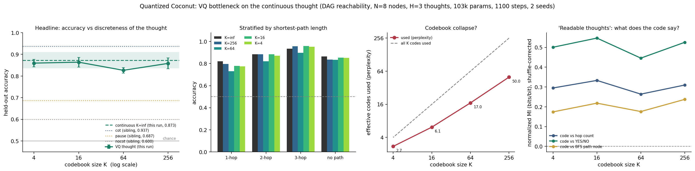

# Quantized Coconut: a continuous thought survives being squeezed to 2 bits

**Date:** 2026-07-26 · **Status:** done (hypothesis **refuted** — there is no knee; quantization is
essentially free all the way down to K=4)

Direct follow-up to [`2026-07-25_coconut-toy-graph`](../2026-07-25_coconut-toy-graph/), whose task
generator, model, forward pass and curriculum are **reused verbatim**.

## Hypothesis
Putting a VQ-VAE-style vector-quantization bottleneck on each continuous thought degrades held-out
DAG-reachability accuracy as the codebook shrinks, with a knee at some K\* above which quantized
thoughts match the unquantized continuous baseline (0.873 in the sibling run); and the surviving
discrete codes carry readable structure.

## Method

- **Everything except the bottleneck is the sibling's.** Same 2-layer pre-norm decoder
  (d_model=64, 4 heads, FFN 256, **103,168 params**), same synthetic DAG task (N=8 nodes,
  out-degree ≤ 2, E=10 edges, adjacency-slot encoding, 21 prefix tokens, "is dst reachable from src
  within 3 hops?", 50/50 balanced, positives stratified over path length 1/2/3), same generator
  seeds, same H=3 thought slots, same staged Coconut curriculum (k=0→1→2 latents over the first 60%
  of steps, then k=3), same AdamW lr 2e-3 / wd 0.01 / batch 64 / **1100 steps** / 2 seeds.
- **The one change — a VQ bottleneck on the thought.** A continuous thought is the model's own last
  hidden state fed back as the next input embedding (arXiv:2412.06769). With H=3 slots there are 3
  such fed-back vectors per example; **all 3 are replaced by their nearest codebook entry** before
  being fed back:
  - hard `argmin` nearest-neighbour forward, **straight-through estimator** backward;
  - VQ-VAE loss `‖sg[h]−e‖² + β‖h−sg[e]‖²` with β=0.25, weight 1.0 (arXiv:1711.00937);
  - codebook init `N(0,1)` per dim (matches the LayerNorm'd hidden), excluded from weight decay;
  - **dead-code restarts** every 100 steps: any code unused since the last restart is reset to a
    thought vector from the current batch (+0.01 noise). Without this the large-K arms would be
    silently small-K arms.
  - **VQ, not Gumbel-softmax.** VQ was stable in every arm (no NaNs, no collapse to a single code
    except where noted below, loss curves smooth), so the Gumbel fallback the backlog allowed was
    not needed.
- **Arms:** K ∈ {4, 16, 64, 256} plus the unquantized continuous baseline (K=∞). 5 arms × 2 seeds =
  10 runs, **594 s total**, one CPU thread.
- **Readability analysis** (the bonus): on the 3000 held-out graphs, per-slot codebook usage
  perplexity `2^H(code)`, and normalized mutual information between the emitted code and (a) the
  YES/NO label, (b) the hop count, (c) the node on the ground-truth BFS path — each **minus a
  label-shuffled control** computed identically, which measures the finite-sample MI bias (large
  when K=256 codes meet 3000 examples: the raw bias is up to 0.078).

### Sanity check: the K=∞ arm reproduces the sibling exactly
Per-seed accuracy 0.8350 / 0.9107, mean **0.8728** — bit-identical to the sibling's `coconut` arm
(0.8350 / 0.9107, mean 0.8728). The reuse is genuinely verbatim, so the sibling's other arms
(`cot` 0.937, `pause` 0.687, `nocot` 0.600) are legitimate reference lines here.

## How to run
```bash
pip install -r requirements.txt
python run.py
```

## Result

### Headline: accuracy vs K is flat

| arm | bits/thought | accuracy | ±std | **paired Δ vs K=∞** | 1-hop | 2-hop | 3-hop | no path | code perplexity |
|---|---|---|---|---|---|---|---|---|---|
| K=∞ (continuous) | ∞ | **0.873** | 0.038 | — | 0.821 | 0.884 | 0.934 | 0.865 | — |
| K=256 | 8 | 0.858 | 0.025 | −0.015 | 0.796 | 0.885 | 0.956 | 0.836 | 50.0 |
| K=64 | 6 | 0.826 | 0.013 | −0.047 | 0.731 | 0.820 | 0.898 | 0.835 | 17.0 |
| K=16 | 4 | 0.864 | 0.023 | −0.009 | 0.778 | 0.884 | 0.958 | 0.853 | 6.1 |
| K=4 | **2** | 0.860 | 0.017 | −0.013 | 0.775 | 0.872 | 0.953 | 0.851 | 2.7 |

Seed dominates arm here (seed 1 beats seed 0 by ~0.05 in *every* arm), so the **paired** delta —
each quantized run minus the continuous run *at the same seed* — is the informative statistic.
Because every arm uses the same two seeds, the paired *mean* is arithmetically the same as the
difference of means; what pairing buys is the error bar. Across all 8 paired comparisons the cost of
quantization is **−0.021 with a spread of 0.024** (range +0.007 to −0.072), against a between-seed
std of 0.038 — so the whole quantization effect is smaller than one seed. And it is **not monotone in
K**: K=64 is the worst arm and K=16 the best quantized one, which is the signature of noise, not of
an information bottleneck. (Paired numbers computed from `metrics.per_run` in results.json;
`run.py` writes the aggregate and per-run values, not the pairing.)

**The hypothesis is refuted. There is no knee.** K\* — the smallest codebook matching the continuous
baseline within one seed-std — is **4**, the smallest we swept. Two bits per thought, six bits for
the entire latent reasoning chain, costs 0.013 accuracy. And a 2-bit thought keeps essentially all of
Coconut's advantage: **0.860 vs 0.687 for pause tokens and 0.600 for no-CoT** at identical positions
and compute. The thing that makes continuous thoughts work on this task is worth ~2 bits per step.

### The model never wanted the bits anyway

| K | effective codes used (perplexity) | slot 1 | slot 2 | slot 3 | distinct codes ever emitted | dead-code restarts |
|---|---|---|---|---|---|---|
| 256 | 50.0 | 9.3 | 58.0 | 82.8 | 187 / 256 | 1387 |
| 64 | 17.0 | 3.1 | 24.0 | 23.8 | 57.5 / 64 | 300 |
| 16 | 6.1 | 2.2 | 7.2 | 9.0 | 15.5 / 16 | 63 |
| 4 | 2.7 | 1.5 | 3.4 | 3.4 | 4 / 4 | 13 |

Usage saturates: given 256 codes the model uses ~50 effectively, and the marginal codes buy nothing.
**The first thought is nearly free of content at every K** — perplexity 9.3 at K=256 (one seed used
literally 3 codes out of 256), 1.5 at K=4, and in one K=4 seed slot 1 collapsed to a **single code,
i.e. zero bits**, while that run still scored 0.877. The first latent step is doing the work of a
pause token; the information appears in thoughts 2 and 3.

### "Readable thoughts": partly, and mostly the answer

Shuffle-corrected normalized MI between the emitted code and each target (best slot; the shuffled
control was 0.000–0.078 raw and is subtracted):

| K | code ↔ YES/NO | code ↔ hop count | code ↔ BFS path node |
|---|---|---|---|
| 256 | 0.526 | 0.310 | 0.237 |
| 64 | 0.446 | 0.264 | 0.176 |
| 16 | 0.547 | 0.333 | 0.218 |
| 4 | 0.501 | 0.295 | 0.174 |

The codes are readable — but what they mostly encode is **the answer**, not the search state: over
half the label's entropy, roughly a third of the hop count's, and much less about which node the BFS
is standing on. Even that path-node number is inflated, because the CoT trace is NONE-padded for
short/negative paths, so its MI is partly label leakage. With 4 codes at slot 3 carrying 0.50
normalized MI with YES/NO, the honest reading is that by the second thought the model has largely
decided, and the latent chain is committing to a decision rather than carrying a frontier — which
agrees with the sibling's finding that the thought is not a linearly-readable BFS frontier.



## Takeaway

**Quantization does not destroy the thought; it barely dents it.** On this task the continuous
thought channel is worth about **2 bits per step** — a 4-entry codebook matches 64 free-floating
floats to within 0.013 accuracy, and the model declines to use more codes when offered 256. Combined
with the sibling's result that the thought is not a readable BFS frontier, the picture is that
Coconut's latent step here is a low-bandwidth control signal (roughly: "which branch am I on / have I
found it yet") rather than a rich continuous state. That is good news for interpretability — a
2-bit thought is enumerable — and bad news for the "continuous thoughts hold a superposition of many
reasoning paths" story, at least at this scale.

The practical corollary: if you want discrete, inspectable latent reasoning, you do not need the
large codebooks used in the literature (64–1024 in Token Assorted, 2.5k–40k in DLR). Start small and
check whether your model asks for more.

## Caveats (read these)

1. **The bottleneck is on the thought, not on the model.** The final thought position still attends
   to the whole prefix through the KV cache, so quantization limits the *thought channel*, not total
   information flow. This is the standard Coconut setup, and it is exactly why "K=4 is fine" is not
   as surprising as it first sounds — the model can re-read the graph. It does mean the result
   bounds the bandwidth *of the recurrent channel*, not of the computation.
2. **2 seeds, and seed variance (0.038) is larger than every arm effect.** The paired analysis is
   what carries the claim; the conclusion is "no detectable K-dependence", not "K provably does not
   matter". A 5-seed replication could resolve the K=64 dip (−0.047 paired), which we currently read
   as noise.
3. **Nano scale, 1100 steps, one task.** 103k params on 8-node DAGs. Larger models with longer
   chains may have more to say per thought.
4. **Dead-code restarts are load-bearing for large K** and are a deviation from vanilla VQ-VAE
   (1387 restarts fired at K=256). Without them the K=256 arm would have measured as a much smaller
   codebook. Restarted codes keep their stale Adam moments; we did not reset optimiser state.
5. **Time-box.** 10 runs in 594 s on one shared CPU thread, inside the ~12 min budget. Shrinks
   relative to the backlog row: model 0.1M (not 0.5–1M) and 1100 steps, both inherited from the
   sibling so the comparison is exact. No 3rd seed and no K=2/K=1024 arm for the same reason.
6. MI is a plug-in estimate on 3000 examples; the shuffled control is subtracted but the correction
   is first-order only.

## Novelty check

**Checked:** 2026-07-26. **Verdict: partial-prior-art.**

- `scripts/novelty_check.py "vector quantization bottleneck continuous thought coconut latent
  reasoning codebook size"` → `unchecked` (arXiv/OpenAlex 403 from this environment, as expected).
- WebSearch: *"vector quantization discrete bottleneck on continuous thought latent reasoning Coconut
  codebook"*; *"discrete latent tokens chain-of-thought VQ-VAE codebook size accuracy latent
  reasoning transformer"*; *"'codebook size' ablation quantized latent thoughts accuracy degrade
  Coconut continuous thought discrete bottleneck 2026"*.
- WebFetch of the two closest hits:
  - **Token Assorted / "Mixing Latent and Text Tokens"** ([2502.03275](https://arxiv.org/pdf/2502.03275))
    — applies a VQ-VAE to *reasoning traces*, codebook fixed per benchmark (64 for ProntoQA/ProsQA,
    512 for maze, 1024 for math). Confirmed by fetch: **no codebook-size ablation** (it ablates the
    compression rate r instead) and **no direct comparison against unquantized Coconut** (COCONUT is
    only approximated by a "Curriculum-Replace" baseline).
  - **DLR / "Why Struggle with Continuous Latents?"** ([2606.29712](https://arxiv.org/html/2606.29712))
    — does sweep codebook size, K ∈ {2.5k, 5k, 10k, 20k, 40k}, and reports improvement to 10k then a
    plateau/slight degradation. But it quantizes *rendered-image OCR features* of a textual CoT at
    LLM scale, and its smallest codebook is 2500 — three orders of magnitude above the regime where
    we find the curve is already flat.
- Prior art we build on: VQ-VAE ([1711.00937](https://arxiv.org/abs/1711.00937)), Coconut
  ([2412.06769](https://arxiv.org/abs/2412.06769)), and dynamic/robust VQ bottlenecks
  ([2202.01334](https://arxiv.org/abs/2202.01334), [2005.08520](https://arxiv.org/pdf/2005.08520)).

**Conclusion.** VQ-on-latent-reasoning exists; the *small-K* end of the curve does not. To our
search, nobody has quantized Coconut's own fed-back hidden state directly and swept K down to 4
against a matched unquantized control on the same task, model, seeds and curriculum. The specific
findings — that the accuracy-vs-K curve is **flat from K=∞ to K=4** (paired cost −0.021 ± 0.024),
that a 2-bit thought retains the full +0.26 Coconut advantage over no-CoT, that codebook usage
**saturates at ~50 effective codes when 256 are offered**, and that the *first* thought collapses to
1–3 codes and can carry literally zero bits without hurting accuracy — are, to our search,
unreported. Scale caveat applies throughout (103k params, 1100 steps, 2 seeds).
