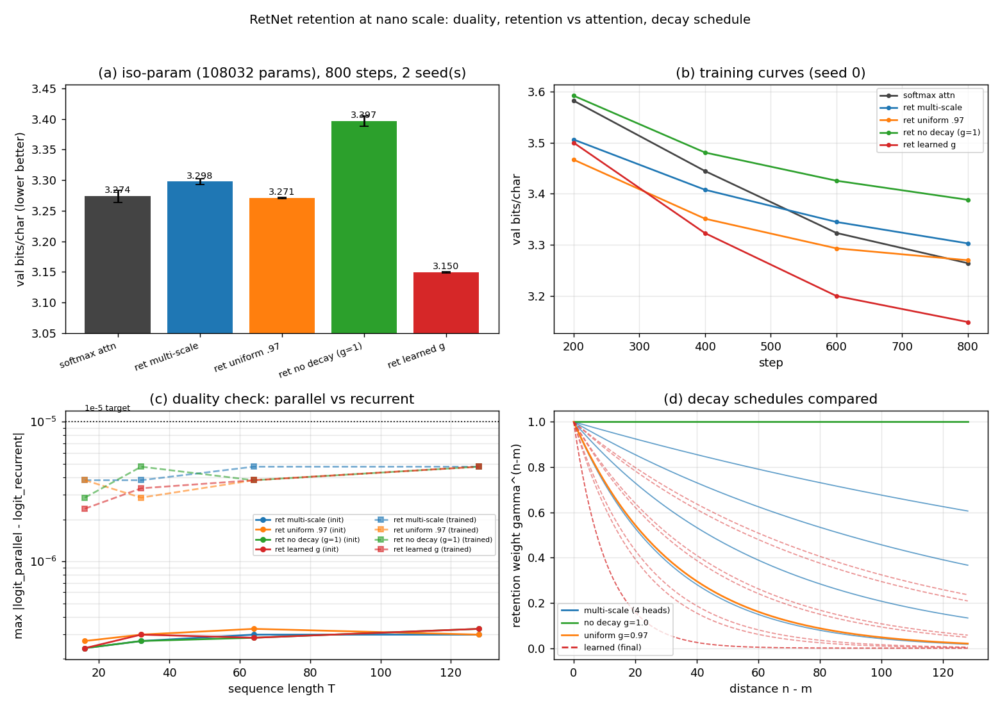

# RetNet retention at nano scale: parallel == recurrent to 3e-7, and the decay schedule is the whole ball game

**Date:** 2026-07-26 · **Status:** done

## Hypothesis
Hand-rolled multi-scale retention reproduces the paper's parallel/recurrent duality to floating-point
precision (max abs logit deviation ≤ ~1e-5); on a tiny char LM at matched params/steps retention
trails softmax attention in val bits/char; and the decay schedule (multi-scale geometric vs uniform
vs no-decay vs learned) makes a difference **smaller than seed noise**.

Two of three held. The third — "the decay schedule doesn't matter" — was **refuted, hard**: the decay
schedule spread is 0.247 bpc, **12.7×** the seed-to-seed spread, and a learned schedule beats softmax
attention outright.

## Method
- **Retention, hand-rolled** (no `yet-another-retnet` dependency), implemented **twice**:
  - parallel: `Y = (Q Kᵀ ⊙ D) V`, `D[n,m] = γ_h^(n-m)` for `n ≥ m`, else 0;
  - recurrent: `S_t = γ_h S_{t-1} + k_tᵀ v_t`, `y_t = q_t S_t` (state `d_head × d_head`, Python loop).
  Both share the identical post-path (headwise GroupNorm → swish gate → output projection), so any
  deviation is pure floating-point.
- **Model:** 2 pre-norm blocks, d_model 64, 4 heads (d_head 16), d_ff 192, ctx 128, char vocab 65,
  learned absolute position embeddings, **108,032 params**.
- **Reference arm:** standard causal softmax multi-head attention. **Iso-parameter** by binary-searching
  its d_ff (225) → 108,098 params, spread **0.061%**.
- **Decay schedules** (only thing varied across the four retention arms):
  | arm | γ per head | half-life (chars) |
  |---|---|---|
  | multi-scale (paper) | 1 − 2^−(5+h) = .96875 / .984375 / .992188 / .996094 | 22 / 44 / 88 / 177 |
  | uniform | .97 all heads | 23 |
  | no decay | 1.0 all heads (= pure causal linear attention) | ∞ |
  | learned | σ(θ_h), θ init at the multi-scale values, trained | (learned; see result) |
- **Training (identical for all 5 arms):** tiny-shakespeare char level, 90/10 split, 800 steps,
  batch 16 × ctx 128 (1.64M tokens), AdamW lr 2e-3 (60-step warmup, cosine to 10%), wd 0.1, clip 1.0,
  **the same seeded batch stream for every arm**, 2 seeds (0, 1). Metric: val bits/char on a fixed
  40-batch held-out set.
- **Shrink to fit the 12-minute CPU box** (backlog said ~0.5–1M params / 20–40 min): 0.108M params,
  800 steps, ctx 128, 2 seeds → 10 training runs in **9.5 min** on 1 thread. Everything below is
  therefore in the *undertrained* regime (all curves still descending at step 800).
- **Deviation from the paper:** no xPos rotation on Q/K; learned absolute position embeddings instead,
  shared with the attention arm so the two families stay matched. Single-chunk parallel form only
  (no chunkwise-recurrent third form).

## Result



**1. The duality is real, and it is float32-exact.** Same weights, same batch, parallel vs recurrent:

| | T=16 | T=32 | T=64 | T=128 |
|---|---|---|---|---|
| max abs logit deviation, **at init** | 2.4e-07 | 2.7e-07 | 3.0e-07 | 3.0e-07 |
| max abs logit deviation, **trained** | 3.8e-06 | 3.8e-06 | 4.8e-06 | 4.8e-06 |

Max **relative** deviation is 2–5e-07 everywhere — one float32 epsilon (1.2e-07) times a small constant —
and it is **flat in sequence length**, i.e. the recurrence does not drift. Identical for all four decay
schedules including γ=1.0. This is the target "~1e-5", beaten by 2–40×.
(Wall-clock aside, honestly reported: the Python-loop recurrent form takes 28.9 ms vs 6.5 ms parallel
for one B=4, T=128 forward — on CPU at this size the O(1)-per-step form is 4.4× *slower*, because the
win is memory/asymptotics, not Python loop overhead.)

**2. Retention vs attention: essentially a tie, in retention's favour if you tune the decay.**

| arm | val bpc (mean of 2 seeds) | seeds | Δ vs attention |
|---|---|---|---|
| **ret learned γ** | **3.1496** | 3.1488 / 3.1504 | **−0.1242** |
| ret uniform γ=.97 | 3.2706 | 3.2698 / 3.2714 | −0.0032 |
| softmax attention | 3.2738 | 3.2640 / 3.2835 | — |
| ret multi-scale (paper) | 3.2977 | 3.2927 / 3.3027 | +0.0239 |
| ret no decay (γ=1) | 3.3965 | 3.3880 / 3.4049 | +0.1227 |

Max seed spread within an arm: **0.0195 bpc**. So the paper's multi-scale retention trails attention by
+0.024 bpc — real but only ~1.2 seed-spreads, i.e. a wash; uniform-γ retention ties attention exactly;
and learned-γ retention beats attention by 0.124 bpc = **6.4 seed-spreads**, fully separated.

**3. The decay schedule matters enormously, and the paper's schedule is not the best one.**
Ranking (best→worst): **learned 3.1496 < uniform .97 3.2706 < multi-scale 3.2977 < no-decay 3.3965.**
Spread **0.2469 bpc = 12.7× the seed spread**; every adjacent pair is fully seed-separated.
- Removing decay entirely (pure causal linear attention) is the worst arm by 0.10 bpc — **the decay is
  load-bearing**, it is not cosmetic.
- One well-chosen scalar γ shared by all heads **beats** the multi-scale geometric ladder (−0.027 bpc,
  separated in both seeds). Multi-scale-*ness* is not what pays.
- What pays is the **timescale**. Learned γ moves every head *down* from its multi-scale init, in both
  layers and both seeds: half-lives go 22/44/88/177 chars → **7.5 / ~16 / ~29 / ~57 chars** (seed-to-seed
  agreement to ±1 char). The winning schedule is a shorter, still-multi-scale ladder that fits inside the
  128-char context, whereas two of the paper's four heads have half-lives ≥ 88 chars, i.e. barely decay
  at all within the window — which is exactly the arm we independently measured to be worst.
- Not an early-training artifact: the learned arm *starts behind* uniform (3.500 vs 3.467 at step 200)
  and its lead **grows** monotonically (−0.028 at 400, −0.093 at 600, −0.121 at 800).

## Takeaway
The RetNet duality is not an approximation — at nano scale, parallel and recurrent retention agree to
one float32 epsilon and the agreement does not degrade with sequence length, so anyone can freely train
in the parallel form and serve in the recurrent one. The interesting result is the ablation the paper
never ran: **the decay schedule is the single biggest lever in the retention block**, worth up to
0.25 bits/char (12.7× seed noise) at fixed parameters, steps and data. The story is *timescale, not
multi-scale-ness*: γ=1 (no decay) is the worst thing you can do; a single tuned scalar γ beats the
paper's geometric ladder; and letting γ learn — a naked 4-scalars-per-layer sigmoid parameterisation,
8 extra parameters total — beats everything, including iso-parameter softmax attention, by pulling every
head's half-life **well below** the paper's values (7–57 chars inside a 128-char window).

**Frame against this lab's zoology rows.** `2026-07-25_zoology-mqar-recall` and `2026-07-26_mqar-state-capacity`
found decay-gated linear attention *pinned to the query-ignoring guessing floor* on multi-query associative
recall (margin ≤ 0 vs a no-recall baseline; frontier N=2–4 vs attention's 8–16). Here, in the friendly
regime, the same mechanism class is within 0.02 bpc of attention and a decay-tuned variant beats it. Both
results are the same fact seen from two sides: **the decay that buys bits/char is precisely the decay that
destroys recall.** Optimisation pushed the half-lives down to 7–57 characters, i.e. the model chose to
*forget faster* to model local text statistics — the opposite of what an associative memory needs. Retention
does shine on language modelling, and the reason it shines is the reason it cannot recall.

**Caveats.** (i) Undertrained: 800 steps / 1.64M tokens, all curves still descending; absolute bpc ~3.15–3.40
is far from converged, and rankings at convergence could differ. (ii) 0.108M params, ctx 128, 2 seeds —
the multi-scale ladder is designed for long contexts, and 128 chars is short enough that its two slowest
heads are effectively decay-free; this is a real limit on how far the "multi-scale loses" claim generalises.
(iii) Iso-hyperparameter, not per-arm-tuned LR. (iv) No xPos. (v) The learned arm has 8 more parameters
(0.007%) than the others.
**Next:** re-run the schedule ablation at ctx 512 to test whether the multi-scale ladder's advantage is a
context-length effect, and check whether the learned short half-lives collapse recall on the MQAR harness
from `2026-07-26_mqar-state-capacity` — a direct test of the "decay that buys bits/char costs recall" claim.

## Novelty check
- **Verdict:** partial-prior-art
- Queries (WebSearch, 2026-07-26): "RetNet retention decay schedule ablation gamma multi-scale vs uniform
  vs learned decay language model"; "RetNet parallel recurrent equivalence numerical check tiny character
  language model reproduction"; "'learned decay' vs fixed gamma linear attention ablation ... retention
  small language model". `scripts/novelty_check.py` returned `unchecked` (arXiv/OpenAlex 403 from this
  environment, known).
- Closest prior work: **RetNet, arXiv 2307.08621** — defines the parallel/recurrent/chunkwise forms and the
  γ_h = 1 − 2^−(5+h) schedule; asserts the duality without a published numerical deviation, and its ablation
  table varies the gate/GroupNorm/architecture, **not** the decay schedule. **fkodom/yet-another-retnet** —
  ships unit tests asserting parallel/recurrent/chunkwise agreement (so equivalence-testing per se is not
  new; a measured deviation-vs-sequence-length curve at both init and trained weights is what we add).
  **"Disentangle to Decay" (COLING 2025, aclanthology 2025.coling-main.660)** — trainable decay factors for
  linear attention at 137M on OpenWebText, and explicitly states it does **not** compare against RetNet.
- How this differs: a single matched-everything (iso-param 0.061%, iso-step, iso-data-stream, 2 seeds)
  four-way decay-schedule ablation — paper multi-scale vs uniform vs no-decay vs learned — with softmax
  attention as an iso-parameter reference, at 0.1M params on char-level data, reporting that the paper's
  own schedule loses to a single tuned scalar and to learned γ. We found no published head-to-head of these
  four schedules, and none at ≤1M params.

## How to run
```bash
pip install -r requirements.txt
python run.py     # ~9.5 min, CPU, 1 thread
```
