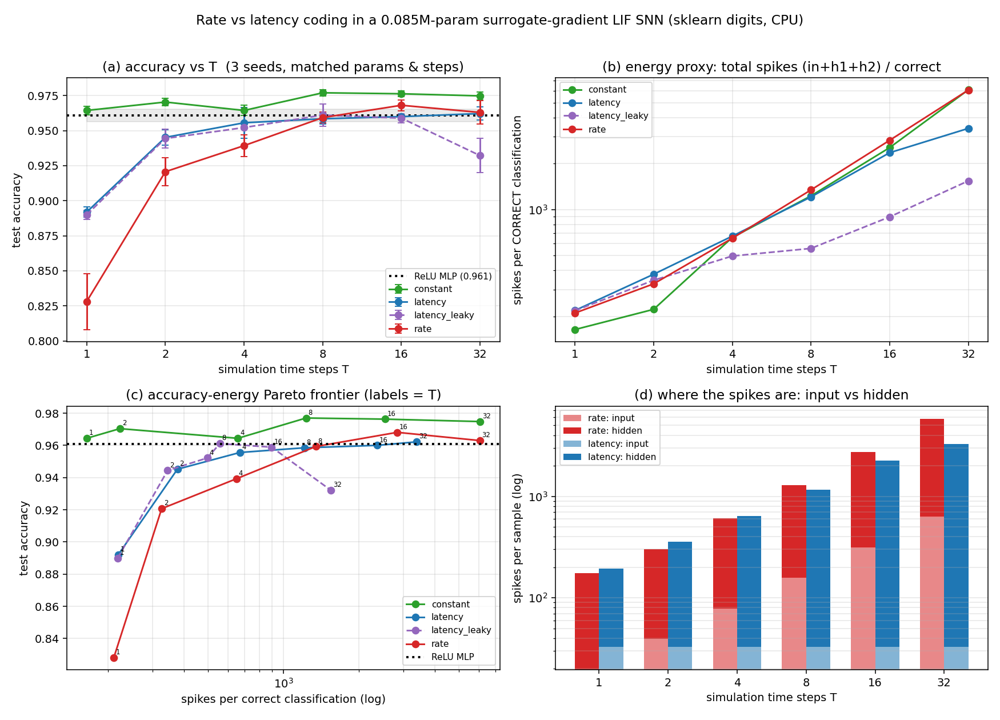

# Rate vs latency coding in a hand-rolled surrogate-gradient SNN: the time-step / accuracy / energy frontier

**Date:** 2026-07-26 · **Status:** done (hypothesis **half-confirmed, half-refuted** — and dissolved by a control)

## Hypothesis
On sklearn digits with a matched-parameter 2-hidden-layer LIF network trained by surrogate gradients,
**latency (time-to-first-spike) coding dominates rate coding at small simulation depth T** — rate coding
needs many steps to average out its Bernoulli noise, latency needs only enough steps to resolve an ordering
— and **latency reaches the non-spiking ReLU MLP reference at a smaller T and at far fewer spikes per
classification.**

## Method
- **Architecture (identical in every arm):** 64 → 256 → 256 → 10, **85,002 params**. The two hidden layers
  are LIF neurons (`u[t] = β·u[t-1] + I[t] − θ·s[t-1]`, β = 0.9, θ = 1.0, **subtract reset** with the reset
  path detached), spikes generated by a Heaviside with a **fast-sigmoid surrogate gradient**
  `1/(1+25·|u−θ|)²`. Hand-rolled in ~40 lines of PyTorch; **snntorch was not used or installed**.
  Readout = mean over t of the output-layer current (a spike-count readout, identical for all input codings).
- **Reference:** a non-spiking **ReLU MLP** with exactly the same layer shapes and parameter count
  (85,002), same optimiser, same batch size, same number of steps.
- **Task:** `sklearn.datasets.load_digits` (8×8, 1797 samples, pixels 0–16, no download). One **fixed**
  stratified split used by every arm and every seed: 1078 train / 269 val / 450 test. Pixels scaled to [0,1].
- **Input codings under test (this is the only thing that differs between the three main arms):**
  - `rate` — Bernoulli(pixel/16) resampled independently at every time step (fresh noise every training step).
  - `latency` — brighter pixel → earlier **single** spike, `t = floor((1−x)·T)`; zero pixels never spike.
  - `constant` — control. The analog value `x` is injected as a **constant input current** at every step
    (the "direct input encoding" of DIET-SNN). The input is no longer a spike train; the two hidden
    layers are still fully spiking.
  - `latency_leaky` — readout control. Identical to `latency` but the output layer is a leaky integrator
    (`v[t] = 0.9·v[t-1] + I[t]`, logits = `v[T-1]`), which weights **early** spikes more — i.e. the readout
    latency coding is supposed to want. 2 seeds instead of 3 (budget).
- **Swept:** T ∈ {1, 2, 4, 8, 16, 32} (the backlog asks for {2,…,32}; T=1 was nearly free and turns out to
  be the most informative point). Held fixed: params, 500 Adam steps, batch 32, grad clip 1.0, no weight
  decay, seeds {0,1,2}.
- **Learning rate is swept per arm, not assumed:** grid {1e-3, 3e-3, 1e-2} on the **val** split at seed 0
  (250 steps), at T ∈ {2, 8, 32}; every other T inherits the largest swept T ≤ it. The optima genuinely
  move (rate is flat at 3e-3; latency goes 1e-3 → 3e-3 → 1e-2 as T grows; the MLP picks 1e-3).
- **Time-box (honest shrink):** 500 steps at batch 32 is ~15 epochs — **iso-compute, not
  train-to-convergence**. 99 training runs (30 in the lr sweep, 69 final), **927 s (15.5 min)** on 1 CPU thread, which **overran the
  declared 900 s budget by 3%**; `run.py` prints the warning.

## How to run
```bash
pip install -r requirements.txt
python run.py
```

## Result



**ReLU MLP reference: 0.9607 ± 0.0046** test accuracy (3 seeds, 85,002 params, same 500 steps).

Test accuracy (mean ± sd over 3 seeds; `metrics.by_arm.*.test_acc_mean`):

| T | rate | latency | latency − rate | `constant` (control) | latency_leaky |
|---|---|---|---|---|---|
| 1 | 0.8281 ± .0200 | **0.8919** ± .0038 | **+0.064** | **0.9644** ± .0031 | 0.8900 |
| 2 | 0.9207 ± .0100 | **0.9452** ± .0055 | **+0.025** | **0.9704** ± .0028 | 0.9444 |
| 4 | 0.9393 ± .0076 | **0.9556** ± .0109 | **+0.016** | **0.9644** ± .0036 | 0.9522 |
| 8 | 0.9593 ± .0038 | 0.9585 ± .0038 | −0.001 | **0.9770** ± .0021 | 0.9611 |
| 16 | **0.9681** ± .0038 | 0.9600 ± .0018 | −0.008 | 0.9763 ± .0021 | 0.9589 |
| 32 | 0.9630 ± .0084 | 0.9622 ± .0048 | −0.001 | 0.9748 ± .0028 | 0.9322 |

**1. The folk claim is CONFIRMED, but it is small and it expires at T=8.** Latency beats rate by +0.064
(≈3σ), +0.025 (≈2σ) and +0.016 at T = 1, 2, 4, and then the two curves are **indistinguishable or
reversed** at T = 8, 16, 32 (−0.001, −0.008, −0.001). The rate-coding penalty at small T is real and it is
exactly the Bernoulli-noise story: rate at T=1 is a *single stochastic binarisation* of the image (0.828,
and the largest seed spread of any cell, ±0.020), whereas latency at T=1 degenerates to a *deterministic
binary mask* "is this pixel on at all" (0.892) — which discards intensity entirely and still wins by 6 points.

**2. The second half of the hypothesis is REFUTED: latency does NOT reach the reference sooner.**
On the strict criterion (first T whose mean ≥ the MLP mean of 0.9607), **rate matches at T=16 and latency
only at T=32** — the opposite of the prediction. Latency climbs fast to ~0.955 and then **flattens**
(0.9556 → 0.9585 → 0.9600 → 0.9622 over an 8× increase in T); rate keeps climbing and overtakes it.
Latency buys you the first 95% cheaply and then has nothing left to spend extra time steps on. On the
looser criterion (MLP mean − 1σ) both codings arrive together at T=8.

**3. The control dissolves the question. The entire deficit is caused by binarising the INPUT, not by the
LIF dynamics and not by the time budget.** With `constant` (analog) input current and the hidden layers
still fully spiking, the SNN gets **0.9644 at T=1** — already at the ReLU MLP's level with a *single*
time step — and **0.9770 at T=8**, which is +0.016 (≈3.5 MLP σ) *above* the non-spiking reference. The
constant arm is above both spike codings at **every** T. So the "accuracy vs time steps frontier" that the
rate/latency arms trace out is not a property of spiking computation; it is the cost of throwing the input
away and re-acquiring it by temporal sampling.

**4. Is latency actually cheaper? Only where it does not win.** Total spikes per **correct** classification
(input + both hidden layers), rate ÷ latency:

| T | 1 | 2 | 4 | 8 | 16 | 32 |
|---|---|---|---|---|---|---|
| spikes: rate ÷ latency | 0.96 | 0.87 | 0.97 | 1.11 | 1.21 | **1.78** |
| SynOps: rate ÷ latency | 0.84 | 1.01 | 1.27 | 1.76 | 2.07 | **3.96** |

At T ≤ 4 — precisely where latency wins on accuracy — latency is **not cheaper at all, it is slightly more
expensive**. Latency only becomes cheaper at T ≥ 8, where it has no accuracy advantage left. Panel (d)
explains why: latency's input layer is gloriously sparse and **flat in T** (32.9 spikes/sample at every T,
one per non-zero pixel) versus rate's 19.6·T (629 at T=32) — a **19× input saving** — but the *hidden*
layers do not inherit the sparsity, they settle into a firing rate and end up only 1.3× cheaper
(2807 vs 3709 second-hidden-layer spikes at T=32). Because the input layer has fanout 256, latency looks
much better in SynOps (4.0× at T=32) than in raw spike counts (1.8×); the "one spike per neuron" saving is
a **first-layer-only** phenomenon here.

**5. The readout control clears latency of a rigged-experiment charge — and is the best spiking point.**
Giving latency the leaky-integrator readout that weights early spikes more changes its small-T accuracy by
**nothing** (0.890/0.944/0.952 vs 0.892/0.945/0.956 at T=1/2/4), so the small-T result is not an artifact of
the shared spike-count readout. It does cut spikes hard (557 vs 1209 per correct at T=8) and destabilises at
T=32 (0.9322 ± 0.0122, the only arm that degrades). **`latency_leaky` at T=8 — 0.9611 accuracy for 557
spikes and 44k SynOps — is the cheapest fully-spike-coded configuration that matches the ReLU MLP.**
The overall Pareto winner, though, is `constant` at T=1: MLP-level accuracy for 158 spikes and 12k SynOps.

## Takeaway
The folk claim "latency coding wins at small T" survives, but it is worth about 2–6 accuracy points, it is
gone by T=8, and it comes with **no energy saving in the regime where it applies** — latency is cheaper
only at large T, where it has already stopped being more accurate. Meanwhile the honest control makes the
whole rate-vs-latency debate look like a fight over how to pay for a self-inflicted wound: injecting the
analog pixel as a constant current beats both spike codings at every T, matches an iso-parameter ReLU MLP
with **one** time step, and beats it by 3.5σ with eight, while keeping every hidden layer spiking. If the
goal is cheap accuracy, the lever is not the input coding but *not encoding the input as spikes at all*;
if the input genuinely arrives as events (DVS cameras, audio), the finding that transfers is the one in
panel (d) — sparsity at the sensor does **not** propagate, so a temporal-coding energy argument has to be
made about hidden-layer firing rates, not about the input. Next: (a) add an explicit firing-rate
regulariser and re-draw the Pareto frontier, since hidden-layer spikes are 80–95% of the budget; (b) test
whether latency's plateau at ~0.96 is a representational ceiling or an optimisation one by giving it 10×
steps; (c) rerun on a genuinely event-based input (DVS-gesture-style) where `constant` is not available,
which is the only setting in which the rate-vs-latency question is actually forced.

**Caveats.** Iso-compute (500 steps ≈ 15 epochs at batch 32), not trained to convergence — latency's
plateau in particular could be an optimisation effect. 3 seeds (2 for `latency_leaky`), and the data split
is fixed, so the reported spread is init/batch-order only and understates true variance; the 450-sample
test set gives ~±0.009 binomial resolution, so the T ≥ 8 rate-vs-latency differences are inside noise
(that is the claim: they tie). The lr grid edge-guard **fired without being extended** for `latency` at
T=32 (best = 1e-2, top of grid) and for `constant`/`latency` at T=2 (best = 1e-3, bottom), so those cells
may be under-tuned — the budget did not allow extension, and `metrics.lr_sweep_val.*.at_grid_edge` records
which. β, θ and the surrogate slope were fixed at standard values and not swept. `constant`'s SynOps count
excludes its input layer, which is dense MACs rather than event-driven accumulates, so its energy number is
optimistic and not apples-to-apples. digits is easy (~0.98 ceiling), which compresses the top of the frontier.

## Novelty check
- **Verdict: partial-prior-art** (the headline rate-vs-latency comparison is a **replication**; the control
  structure and the accuracy/energy Pareto framing are the added piece).
- Checked 2026-07-26. `scripts/novelty_check.py` returned `unchecked` (arXiv and OpenAlex both 403 from this
  environment); the verdict rests on 3 WebSearches.
- **Closest prior work:**
  - [snntorch](https://github.com/jeshraghian/snntorch) and Eshraghian et al., *Training Spiking Neural
    Networks Using Lessons From Deep Learning* — the surrogate-gradient LIF recipe and both encodings ship
    as tutorials; this experiment re-implements them from scratch rather than importing them.
  - Neftci, Mostafa & Zenke, *Surrogate Gradient Learning in Spiking Neural Networks*
    ([arXiv:1901.09948](https://arxiv.org/abs/1901.09948)) — the fast-sigmoid surrogate used here.
  - Guo et al., *Neural Coding in Spiking Neural Networks: A Comparative Study for Robust Neuromorphic
    Systems* ([Front. Neurosci. 2021](https://www.frontiersin.org/journals/neuroscience/articles/10.3389/fnins.2021.638474/full))
    — the direct ancestor: rate / TTFS / phase / burst compared for accuracy and robustness.
  - Rathi & Roy, *DIET-SNN: Direct Input Encoding with Leakage and Threshold Optimization*
    ([arXiv:2008.03658](https://arxiv.org/abs/2008.03658)) — **finding 3 is a replication of theirs**:
    direct (analog) input encoding is what buys low-latency SNNs their time steps back.
  - [*First-spike coding promotes accurate and efficient spiking neural networks…*](https://www.frontiersin.org/journals/neuroscience/articles/10.3389/fnins.2023.1266003/full)
    and [*Latency Coding for Efficient and Low-Latency Deep SNNs*](https://arxiv.org/html/2603.23206) — the
    pro-latency side of the literature this row is testing.
- **How this differs:** the three encodings are run at **matched parameters, matched optimiser steps and a
  per-arm-swept learning rate** against an **iso-parameter non-spiking ReLU MLP**, with the accuracy frontier
  and the spikes-per-*correct*-classification frontier reported on the same axes — so the question "is
  latency actually cheaper *where it is actually better*?" can be answered, and the answer here is **no,
  the two frontiers cross**. The `constant`-current arm is included not as a competing method but as the
  control that shows the rate-vs-latency gap is entirely an input-binarisation artifact, and the
  early-weighted readout control rules out the most obvious way of rigging the comparison against latency.
  The layer-resolved spike accounting (input sparsity 19×, hidden sparsity 1.3×) is the mechanism behind
  the crossing and is not something the comparative studies above report. None of this is claimed as a new
  phenomenon — it is a cheap, fully-reproducible, single-CPU-thread version of a comparison that is usually
  published without the iso-parameter ANN reference or the matched-budget control.
