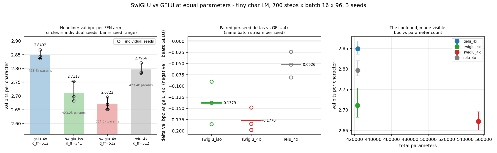

# SwiGLU vs GELU at equal parameters: the edge does NOT shrink — 78% of the folk margin survives the iso-param correction

**Date:** 2026-07-26 · **Status:** done (hypothesis refuted; SwiGLU wins the fair fight)

## Hypothesis
SwiGLU's edge over GELU shrinks (or vanishes into seed noise) once you equalize parameters — the
iso-parameter control most demos skip. *Expected outcome when this was queued: an honest iso-param tie.*

## Method
- **Architecture:** nanoGPT-style 2-layer pre-norm decoder-only char LM, `d_model=128`, 4 heads,
  learned absolute positions, no biases, untied output head. Only the FFN block changes.
- **Task / dataset:** tiny-shakespeare, char level (V=65), 90/10 train/val split, block size 96.
  Metric is val **bits per character** on a fixed 46,080-char held-out slice.
- **The four arms** (a GLU FFN has three matrices — gate `W`, up `V`, down `W2` — where a vanilla
  FFN has two, so at equal `d_ff` it carries 1.5× the FFN weights):

| arm | FFN | `d_ff` | `d_ff / d_model` | FFN weights (2 layers) | total params | FFN MACs/token |
|---|---|---|---|---|---|---|
| `gelu_4x` | `W2·gelu(W x)` | 512 | 4.000 | 262,144 | **423,424** | 262,144 |
| `swiglu_iso` | `W2·(silu(W x)⊙V x)` | 341 | 2.664 | 261,888 | **423,168** | 261,888 |
| `swiglu_4x` | `W2·(silu(W x)⊙V x)` | 512 | 4.000 | 393,216 | 554,496 | 393,216 |
| `relu_4x` | `W2·relu(W x)` | 512 | 4.000 | 262,144 | 423,424 | 262,144 |

  `swiglu_iso` uses Shazeer's standard 2/3 correction, `d_ff = (8/3)·d_model = 341.3 → 341`.
  **Iso-param verified: 423,424 vs 423,168 = 0.0605% apart** (`iso_param_within_1pct: true`), and
  also iso-MAC to 0.1%. `swiglu_4x` is the *unfair* comparison most blog demos run: **+31.0% total
  parameters, +50% FFN parameters.**
- **Held fixed:** 700 steps, batch 16 × 96 (1.08M tokens/run), AdamW lr 3e-3 with 70-step warmup and
  cosine decay to 10%, wd 0.1 on 2-D weights, grad clip 1.0. **3 seeds × 4 arms = 12 runs**, 708 s
  (11.8 min) CPU, 1 thread.
- **Pairing:** every seed replays an *identical batch stream* across all four arms. Init cannot be
  shared (the FFN shapes differ by construction), so the per-seed spread is the honest error bar.
- **Shrunk to fit the 12-minute box:** 700 steps at `d_model=128` rather than the backlog's ~1.5 h.
  Every arm ends at bpc 2.67–2.85 where a converged tiny char LM reaches ~1.5–1.7, so this is an
  **early-training** comparison. Note the backlog's "~0.1–0.2M params" estimate was low for
  `d_model=128, 2 layers` — the actual models are 0.42M (0.55M for `swiglu_4x`).

## How to run
```bash
pip install -r requirements.txt
python run.py
```

## Result
**The hypothesis is refuted, and cleanly.** SwiGLU still wins at matched parameters, by
**−0.138 bpc**, with *all three seeds agreeing in sign* and the gap at **3.0× the mean within-arm
seed spread** (0.0462 bpc). Verdict field: `"seed-separated: SwiGLU wins at iso-param"`.

| arm | params | val bpc per seed (0/1/2) | mean | std | Δ vs `gelu_4x` | final train loss (nats) |
|---|---|---|---|---|---|---|
| `swiglu_4x` | 554,496 (+31%) | 2.6512 / 2.6697 / 2.6958 | **2.6722** | 0.0224 | **−0.1770** | 1.7346 |
| `swiglu_iso` | 423,168 | 2.6980 / 2.6824 / 2.7535 | **2.7113** | 0.0374 | **−0.1379** | 1.7573 |
| `relu_4x` | 423,424 | 2.7831 / 2.7867 / 2.8200 | 2.7966 | 0.0204 | −0.0526 | 1.8381 |
| `gelu_4x` | 423,424 | 2.8357 / 2.8678 / 2.8440 | 2.8492 | 0.0167 | — | 1.8883 |

- **The ranking is identical in every single seed** (`seeds_agree_on_best: true`):
  `swiglu_4x < swiglu_iso < relu_4x < gelu_4x`. No seed inverts any pair.
- **The parameter-count decomposition — the number this experiment exists to produce.** The unfair
  `swiglu_4x` beats `gelu_4x` by 0.1770 bpc. The iso-param `swiglu_iso` beats it by 0.1379 bpc.
  So **77.9% of the folk margin survives the parameter correction; only 22.1% is buyable with the
  extra 31% of parameters** (`frac_of_swiglu4x_margin_surviving_isoparam: 0.7792`). The premise
  behind the hypothesis — that the demoed SwiGLU win is *substantially* a parameter artefact — is
  wrong here by roughly a factor of four. Growing SwiGLU from `d_ff=341` to `d_ff=512` (+31% params,
  +50% FFN FLOPs) buys only **0.039 bpc**, less than the mean seed spread.
- **Surprise: ReLU-4x beats GELU-4x**, by 0.0526 bpc, and again in all three seeds. Shazeer's Table 1
  has ReLU nominally ahead of GELU too (1.677 vs 1.679) but calls it inside noise; here the gap is
  consistent and about the size of one seed spread. Whatever GELU is doing for this tiny model at
  700 steps, it is a small negative, not a positive.
- **This is a fitting effect, not a regularization effect.** Train loss orders exactly like val loss
  (1.888 / 1.838 / 1.757 / 1.735 nats for gelu / relu / swiglu_iso / swiglu_4x). The gated FFN fits
  the training data faster at the same parameter count; it is not winning by generalizing better.
- **Iso-param and iso-MAC is not iso-wall-clock, and that partly bites back**
  (`metrics.wall_clock_matched_approx`, derived from the stored train-loss curves — indicative only,
  see caveats). Three skinnier GEMMs plus an elementwise product cost **1.135× GELU's seconds per
  step** despite identical MAC counts. Inside `gelu_4x`'s 48.8 s budget, `swiglu_iso` completes 616
  of 700 steps and is still ahead on train bpc by **−0.127** — the win survives a CPU-seconds budget.
  `swiglu_4x`, at 1.559× the seconds per step, completes only 448 steps and is **+0.090 *worse* than
  GELU** at matched seconds. The param-advantaged configuration wins per step and loses per second.



## Takeaway
At 0.42M parameters on natural text, the iso-parameter control does **not** dissolve SwiGLU's
advantage — it removes about a fifth of it. The headline replicates Shazeer at four orders of
magnitude smaller scale: shrink `d_ff` by 2/3 so the three-matrix GLU FFN is parameter- and
FLOP-matched to the two-matrix baseline, and SwiGLU still wins by 3 seed-widths. The honest
correction this run supplies to the folk wisdom is not "SwiGLU doesn't really win" but the sharper
"**SwiGLU wins for the reason claimed, and the extra `d_ff` you are probably also giving it is nearly
worthless**": +31% params buys 0.039 bpc, inside the noise floor, while the gating itself buys 0.138.
The secondary finding is that at this scale **GELU is the weakest of the three activations tested**,
losing to plain ReLU at identical parameters in all three seeds — a reminder that the ReLU→GELU step
in the folk progression is much less load-bearing than the vanilla→gated step.

Bounds on this. (1) **Early training**: 700 steps / 1.08M tokens leaves every arm at bpc 2.67–2.85
against a converged ~1.5–1.7, so what is measured is *fitting speed at matched parameters*, and a
faster-fitting arm at step 700 need not have a lower ceiling — the direct next run is 5–10× the steps
on the `gelu_4x` / `swiglu_iso` pair alone to see whether the 0.138 gap is a level difference or a
schedule offset. (2) **One learning rate (3e-3) for all arms**: gated FFNs change the effective
gradient scale, so part of the margin could be that 3e-3 happens to suit SwiGLU better; a small
per-arm LR sweep is the proper control and is the cleanest thing to add next. (3) 2 layers, one
corpus, one width, 3 seeds; `d_ff=341` rounds 341.33 down, leaving `swiglu_iso` 256 parameters
(0.06%) *below* the baseline, i.e. very slightly handicapped rather than favoured. (4) The
wall-clock-matched panel uses train loss and truncates a cosine schedule written for 700 steps, so it
under-serves the truncated arms; it is indicative, not a substitute for a genuinely time-budgeted
rerun.

## Novelty check
- Verdict: **replication** (of Shazeer's own iso-parameter control), with one component that appears
  unreported: the explicit **decomposition of the demoed SwiGLU margin into gating vs parameter
  count** (78% / 22%) at nano scale with per-seed spread.
- Closest prior work:
  - [Shazeer, *GLU Variants Improve Transformer* (arXiv:2002.05202)](https://arxiv.org/abs/2002.05202)
    — the direct prior art, fetched in full. It **does** apply the correction, verbatim: *"To keep the
    number of parameters and the amount of computation constant, we reduce the number of hidden units
    d_ff (the second dimension of W and V and the first dimension of W2) by a factor of 2/3 when
    comparing these layers to the original two-matrix version."* Its Table 1 heldout log-perplexity at
    524,288 steps: FFN_ReLU 1.677, FFN_GELU 1.679, FFN_SwiGLU **1.636**, with ±~0.005 inter-run std
    reported on the shorter 65,536-step runs (4 runs per architecture). So the paper's own iso-param
    SwiGLU margin is ~0.043 log-ppl ≈ 8× its run-to-run std — the same qualitative picture found here.
  - [Narang et al., *Do Transformer Modifications Transfer Across Implementations and Applications?*
    (arXiv:2102.11972, EMNLP 2021)](https://arxiv.org/abs/2102.11972) — fetched; an independent
    large-scale audit that found *most* transformer modifications do not transfer, with GLU variants
    among the small set that did: *"SwiGLU and GeGLU improve performance on pre-training,
    fine-tuning, and supervised training without sacrificing any efficiency in terms of speed"*, under
    a design where *"each variant has approximately the same number of parameters or total operations
    as the vanilla Transformer."* This is the strongest existing evidence that the iso-param SwiGLU
    win is real rather than a budget artefact, and this run agrees with it.
  - The "SwiGLU just wins" folk wisdom in modern LM stacks (LLaMA, PaLM, Mistral, OLMo), and the many
    tutorial/blog demos that swap in SwiGLU at unchanged `d_ff` — the behaviour arm `swiglu_4x`
    exists to quantify.
- How this differs: the axis is thoroughly published, so this is a replication, not a discovery. What
  the search did not turn up is (a) the iso-param control run at **nano scale (0.42M params, CPU,
  minutes)** with all three seeds reported individually, and (b) anyone actually **measuring the
  uncorrected-vs-corrected gap side by side** to say what fraction of the demoed win is parameter
  count — the answer here, 22%, is the one number a practitioner reading a blog demo would want. The
  ReLU > GELU ordering at iso-param is also stated with a consistent sign here where the paper leaves
  it inside noise.
- Search record, 2026-07-26: `scripts/novelty_check.py` returned `unchecked` (arXiv **and** OpenAlex
  both 403 from this environment — known issue). Verdict rests on 4 web searches
  ("SwiGLU vs GELU iso-parameter ablation 8/3 d_ff correction"; "Shazeer GLU variants parameter
  matched two thirds criticism replication"; "nanoGPT SwiGLU ablation within noise"; "gated MLP gains
  disappear when parameter matched") plus 2 direct paper fetches (arXiv PDF 2002.05202, ar5iv HTML
  2102.11972). The "nobody has published the 78/22 decomposition at nano scale" claim is a negative
  search result over paper/blog search, not an exhaustive literature review.
