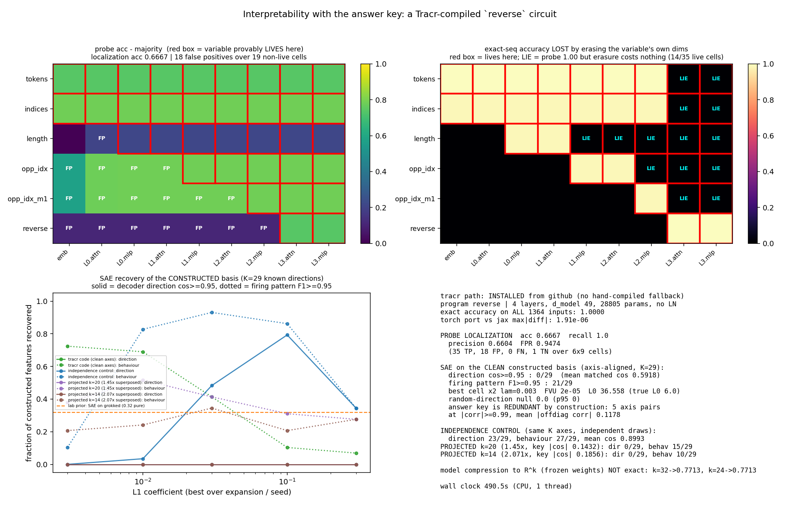

# Interpretability with the answer key: probes and SAEs against a Tracr-compiled `reverse` circuit

**Date:** 2026-07-26 · **Status:** done (mixed: probes behave as predicted, the SAE prediction is refuted)

**Tracr path taken: REAL TRACR.** `pip install tracr` fails (no such PyPI package), but
`pip install "tracr @ git+https://github.com/google-deepmind/tracr.git"` installs cleanly and
compiles the program on CPU in **5.6 s**. The sanctioned hand-compiled fallback was **not** needed.

## Hypothesis

On a transformer where every residual dimension is a labelled variable *by construction*:

1. **Probes** will find each intermediate variable at the layer where it is built, but will *also*
   fire above chance at layers where the variable provably does not exist yet — because it is
   *inferable* from what is there. Probe accuracy localizes **information**, not **computation**.
2. **SAEs** should **ace** this basis. It is axis-aligned, non-negative, one-hot and sparse: the
   friendliest possible ground truth, and a calibration point for the lab's two prior SAE rows
   (0.32 purity on the grokked model vs 0.75 for raw neurons; 8/8 merged directions but 0/16 true
   features on the merged-pair toy model).

Leg 1 is confirmed, and more strongly than expected. **Leg 2 is refuted.**

## Method

**The model.** RASP program `reverse(tokens)`, built exactly as in `tracr.compiler.lib` so that
every intermediate SOp has a handle: `length = SelectorWidth(TRUE)` → `opp_idx = length - indices`
→ `opp_idx-1` → `reverse = Aggregate(Select(indices, opp_idx-1, EQ), tokens)`. Compiled with
vocab `{a,b,c,d}`, `max_seq_len=6`, BOS + PAD. Result: **4 layers, 1 head, key_size 14,
d_mlp 42, d_model 49, no LayerNorm, non-causal, 28,805 params**. Every one of the 49 residual
dimensions carries a label like `opp_idx_4:3` — that is the answer key.

**Verification (both directions).**
- The compiled model is run on the **exhaustive** input set: *all* 1,364 sequences of length 1–5
  over the 4-symbol vocab. Exact-sequence accuracy **1.0000**.
- The Haiku/JAX weights are ported to a hand-written torch forward pass (no LN, non-causal, ReLU
  MLP, `1/sqrt(key_size)` scaling). Max |difference| vs JAX over 9 residual sites × 40 inputs:
  **1.9e-06** (JAX runs float32, the port float64). All probing/SAE work uses the torch port.
- The RASP program and every intermediate are also evaluated symbolically and cross-checked.

**Sites (9):** `emb`, then the residual after each attention and each MLP sub-layer,
`L0.attn … L3.mlp`. **Positions:** all 6,372 non-BOS non-PAD positions.

**Where each variable LIVES (the constructive key).** A variable lives at a site iff its own
dedicated one-hot block *exactly* decodes it there (accuracy 1.0 and the block is genuinely
one-hot on every position). This gives the birth chain

| variable | born at | dims |
|---|---|---|
| `tokens`, `indices` | `emb` | 6, 6 |
| `length` | `L0.mlp` | 7 |
| `opp_idx` | `L1.mlp` | 12 |
| `opp_idx-1` | `L2.mlp` | 12 |
| `reverse` (the output) | `L3.attn` | 4 |

**Probes.** Multinomial logistic regression on the full 49-d residual at every site for every
variable, split **by sequence** (4,473 train / 1,899 test positions), each paired with a
shuffled-label control. Detection rule (ported from `2026-07-25_dyck-probe-can-lie`):
`test acc − majority ≥ 0.05`.

**Causal test.** Zero the variable's *own known dims* at a site, run the rest of the model, measure
exact-sequence accuracy; compare against 8 random rank-matched subspace projections at the same
site. With the answer key we know which sites *should* matter.

**SAE.** Standard L1 ReLU dictionary (unit-norm decoder rows, dead-feature resampling at 40%/70%,
Adam 3e-3, 1,500 steps, batch 512) on the final residual, activations scaled to E‖x‖=√d.
Answer key = the **K=29 alive residual axes** (24 exact 0/1 indicators + 5 non-binary). Grid:
expansion {1,2,4} × λ {0.003, 0.01, 0.03, 0.1, 0.3} × 2 seeds = **30 SAEs**. Scoring uses two
independent matchings, both greedy-injective (the duplicate trap from `sae-on-merged-pairs`):
- **direction**: signed cosine between key axis and unit decoder direction, threshold 0.95;
- **behaviour**: best-F1 of the feature's firing pattern against the axis indicator (|corr| for the
  non-binary axes), threshold 0.95, matched on the correlation matrix.
Plus a random-direction null (20 draws).

**Three SAE arms beyond the real code:**
- **Independence control** — the same 29 axes with the same marginal firing rates, drawn
  *independently*. Same SAE code, same scoring. This is the arm that says whether a failure is the
  SAE's fault or the code's.
- **Constructed superposition** — the same code linearly projected into R^k (k = 20, 14) with an
  orthonormal-row matrix, so the K key directions provably cannot be mutually orthogonal.
- **Model compression** (the thing the backlog asked for) — residual moved to R^k with
  `read = r@W`, `write = y@W^T`, tracr weights frozen, W trained on output CE + layer-wise MSE.

## Result

### 1. Probes find the variable almost everywhere it isn't (recall 1.00, FPR 0.95)

| | |
|---|---|
| live cells detected (TP) | **35 / 35** |
| non-live cells falsely detected (FP) | **18 / 19** |
| localization accuracy | **0.667** (precision 0.660, recall 1.000, FPR **0.947**) |

The probe never misses. It also almost never abstains. And **every false positive has an exact,
pre-statable cause**:

- **`length` at `L0.attn` (0.991)** — not a probe error at all. Tracr's selector-width trick writes
  length in a *numerical* encoding (`length_5_selector_width_attn_output`, exactly 1/(1+L)) one
  half-layer before the MLP converts it to a one-hot block. Length is numerically exact from
  `L0.attn` onward. The strict one-hot answer key is what is wrong here.
- **`opp_idx` / `opp_idx-1` at `emb` (0.787)** — pure marginal leakage: 80% of positions come from
  length-5 sequences, so predicting `opp_idx = 5 − i` from the index alone scores 0.787, which is
  within 0.017 of the analytic Bayes bound (0.8035) for a predictor that sees only its own index.
- **`opp_idx` / `opp_idx-1` at `L0.mlp`, `L1.attn` (1.000)** — once one-hot `length` and one-hot
  `indices` are both present, `L − i` is *exactly linearly decodable* (an additive logit
  `w[L,c] + w[i,c]` can realise `argmax_c = L − i`), one to two full layers before the model
  computes it.
- **`reverse` at all 7 pre-birth sites (0.3655 vs majority 0.2596)** — the palindromic fixed points.
  At the 17.1% of positions where `opp_idx-1 == indices` the answer *is* the current token, so the
  probe scores 0.997–1.000 there and 0.237 elsewhere. Predicted 0.3768, observed 0.3655.

No detection threshold fixes this: raising the margin to 0.2 leaves 11 FPs (accuracy 0.796) and at
0.4 the FNs start (7). **The false-positive rate is not noise; it is what "linearly decodable"
means.**

### 2. Erasure recovers the true causal window exactly — and 14/35 live cells are lies

Zeroing a variable's own dims and measuring exact-sequence accuracy gives a perfectly crisp window
per variable (1.0 = untouched, ~0.01 = destroyed):

| variable | erasure is catastrophic at | erasure is a complete no-op at |
|---|---|---|
| `tokens` | `emb` … `L2.mlp` | `L3.attn`, `L3.mlp` |
| `length` | `L0.mlp`, `L1.attn` | `L1.mlp` … `L3.mlp` (5 sites) |
| `opp_idx` | `L1.mlp`, `L2.attn` | `L2.mlp` … `L3.mlp` |
| `opp_idx-1` | `L2.mlp` | `L3.attn`, `L3.mlp` |
| `reverse` | `L3.attn`, `L3.mlp` | — |

Each variable is load-bearing exactly from where it is written to where it is consumed, and dead
weight afterwards. **In 14 of the 35 cells where the variable genuinely lives, the probe reads it
at 1.000 and erasing it costs 0.000** — e.g. `length` at `L1.mlp`, where a *random* rank-7 erasure
costs 0.087 on average and the real thing costs nothing. This is the `dyck-probe-can-lie` result
reproduced with a provable answer key instead of an inferred one, and it shows the lie is not
exotic: it is the generic state of any variable past its last consumer.

### 3. The SAE does NOT ace the clean constructed basis: 0/29 directions, in all 30 SAEs

| arm | direction (cos ≥ 0.95) | behaviour (F1 ≥ 0.95) | best mean matched cos |
|---|---|---|---|
| **tracr code (clean axes, K=29)** | **0/29 in all 30 SAEs** | 21/29 | 0.592 |
| independence control (same axes, independent) | **23/29** | 27/29 | 0.899 |
| projected k=20 (1.45× superposed) | 0/29 | 15/29 | 0.634 |
| projected k=14 (2.07× superposed) | 0/29 | 10/29 | 0.671 |
| raw residual dims ("neuron" baseline) | 29/29 by construction | — | 1.000 |
| random-direction null | 0.0 (p95 0) | — | — |

Reconstruction is perfect and *carries no signal*: FVU is 2e-05 at the best cell and ≤ 6e-03
everywhere — the same "FVU tells you nothing about recovery" observation as both prior lab SAE rows.

**The independence control is the point.** Identical 29 axes, identical marginal firing rates
(mean 0.207, true L0 = 6.0), only the *dependence* removed: the SAE goes from 0/29 to 23/29 and the
mean matched cosine from 0.59 to 0.90. So the failure is **not** the dictionary size, the sparsity
coefficient, the density of the features, or this harness. It is the **correlation structure of the
tracr code itself**:

- variables are one-hot blocks, so within a block exactly one axis fires (perfect mutual exclusion);
- blocks are deterministically linked (`opp_idx = length − indices`, `opp_idx-1 = opp_idx − 1`), so
  **5 of the 29 axes are exact duplicates of 5 others** (`opp_idx-1:j ≡ opp_idx:j+1`, |corr| = 1.000)
  and no behavioural method can ever separate those pairs;
- every position activates exactly 6 axes, always in one of a few hundred fixed combinations.

An L1 dictionary therefore prefers one feature per *state* to one feature per *variable*. The
signature is in the number: the best mean matched cosine is 0.49–0.59 ≈ 1/√4, exactly what you get
when ~4 unit axes are bundled into one direction. And the naive max-cosine score (0.593) does *not*
inflate here, so this is not the duplicate mirage from `sae-on-merged-pairs` — the directions
genuinely are not in the dictionary.

The behavioural score is the honest silver lining: **21/29 axes have a dictionary feature that
fires almost exactly when they do**, so the SAE does find the right *events*; it just refuses to put
them on the right *axes*.

### 4. The compressed-tracr arm: an honest negative

Training a read/write matrix W with the tracr weights frozen does **not** produce an exact
compressed model at any size tried: k=32 → 0.7713 exact-sequence accuracy, k=24 → 0.7713
(identical, at 1,500–3,000 steps, both lr 1e-2 with and without a cosine schedule, MSE weight 1.0
and 0.1). The superposed case was therefore built in **activation space** instead (rows 3 above) —
which tests the SAE question correctly but is *not* a functioning compressed transformer, and is
labelled as such throughout.

## Takeaway

With a network whose circuit is known by construction, the two standard tools fail in opposite,
diagnosable ways. **Probes are all recall and no precision**: they found every variable at every
site where it lives (35/35) and also at 18 of 19 sites where it provably does not exist, and each
false positive is a legitimate inference — marginal leakage, an additive linear identity, a
fixed-point coincidence, or an alternative numerical encoding the answer key was too strict to
count. Layer-attribution from probe accuracy is therefore not merely noisy, it is *systematically*
wrong in the early direction. Erasure fixes this completely here (crisp write→consume windows) and
simultaneously exposes 14 of 35 live cells where a 1.000-accurate probe reads a variable that the
model no longer uses at all.

**The SAE result is the headline negative.** The prediction going in — from the backlog and from
this lab — was that the clean tracr basis is the one case an SAE *should* ace. It scores **0/29
directions in all 30 SAEs**, on a basis that is axis-aligned, one-hot, non-negative and perfectly
reconstructed, while the *raw residual dimensions* are 29/29 correct by definition. That makes
three consecutive lab rows where the untouched basis beats the dictionary (0.75 vs 0.32 on the
grokked model; 8 merged directions and 0 true features on the merged-pair model; 29 vs 0 here). But
the diagnosis is sharper this time, because the independence control moves the score to 23/29 with
nothing changed but the joint distribution: **the SAE's failure mode is feature *dependence*, not
feature density and not superposition** — the projected/superposed arms score no worse than the
unprojected one. Tracr codes are maximally dependent by construction (one-hot blocks plus exact
arithmetic identities), which is simultaneously why they are a perfect probing benchmark and why
they are a *hostile*, not a friendly, SAE benchmark. Any future "SAEs recover ground truth" claim
validated on Tracr should report the dependence structure of its key first.

Next: (a) the same grid with a decorrelation-aware objective (top-k or matryoshka SAEs, or an
explicit whitening step) to see whether 0/29 is specific to the L1 prior; (b) a RASP program chosen
to have *independent* intermediate variables, which would make Tracr the friendly SAE benchmark it
is assumed to be; (c) revisit compression with the attention temperature relaxed, since the frozen
softmax margins look like the reason W cannot be trained past 0.77.

## Novelty check

- **Verdict: partial-prior-art.**
- Checked 2026-07-26 via 5 web searches + 2 direct fetches; `scripts/novelty_check.py` returned
  `unchecked` (arXiv and OpenAlex both 403 from this environment, a known issue).
- Closest prior work:
  - [Tracr (2301.05062)](https://arxiv.org/abs/2301.05062) — proposes exactly this use ("the known
    structure of Tracr-compiled models can serve as ground-truth for evaluating interpretability
    methods") and provides the compressed-model code, but does not run a probe-localization or SAE
    evaluation.
  - [InterpBench (2407.14494)](https://arxiv.org/html/2407.14494) — 85 Tracr-derived semi-synthetic
    transformers with known circuits; a direct fetch confirms it evaluates **circuit-discovery**
    methods (ACDC, SP, EAP) and explicitly **not** probes or SAEs.
  - [SAGE (2410.07456)](https://arxiv.org/abs/2410.07456) and
    [SynthSAEBench (2602.14687)](https://arxiv.org/html/2602.14687v1) — ground-truth SAE
    evaluations, but on real LMs / synthetic feature generators, not Tracr.
  - The lab's own [`2026-07-25_dyck-probe-can-lie`, `2026-07-25_sae-on-grokked-model`,
    `2026-07-25_sae-on-merged-pairs`].
- How this differs: (a) a **layer-resolved probe localization score** against the constructive
  answer key, with every one of the 18 false positives explained analytically rather than reported
  as noise; (b) per-variable **causal windows** from own-dims erasure vs rank-matched random
  controls, which recover the write→consume interval exactly and expose 14 decodable-but-unused
  cells; (c) the SAE **direction-vs-behaviour decomposition** on a constructed basis, with an
  **independence control** that pins the 0/29 failure on feature dependence rather than density,
  dictionary size, or superposition. The "no published version of this specific evaluation" claim
  is a negative search result over 5 searches and 2 fetches, not an exhaustive review.



## How to run

```bash
pip install -r requirements.txt   # tracr must come from git, not PyPI
python run.py                     # ~8.2 min (490 s), CPU, 1 thread
```
