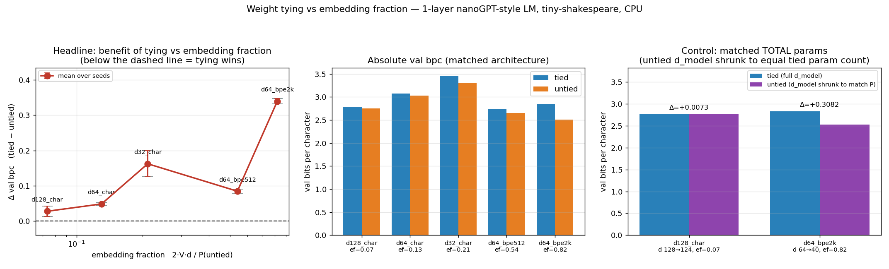

# Weight tying vs embedding fraction: does tying only help when the vocab owns most of the parameters?

**Date:** 2026-07-26 · **Status:** done (hypothesis refuted — and refuted with the sign reversed)

## Hypothesis
Tying the input embedding to the output unembedding helps **only when the vocab/param ratio is high**:
Δ val bpc (tied − untied) should be **negative at high embedding fraction** and ~0 or positive at low,
with a crossover somewhere in between. (The folk rule: "tie small models with big vocabularies, untie
big models with small vocabularies.")

## Method
- **Architecture:** 1-layer pre-norm decoder-only transformer (nanoGPT-style): 4 heads, `d_ff = 4·d`,
  learned absolute position embeddings, block size 96, no biases, GELU MLP. 17k–312k params.
- **Task / dataset:** next-token LM on tiny-shakespeare (1.115 MB), first 90% train / last 10% val.
- **Embedding fraction moved two ways** (5 grid points, embedding fraction 0.07 → 0.82):
  - (a) **vocab at fixed `d_model`=64**: char (V=65) → BPE 512 → BPE 2000. BPE is a plain greedy
    byte-pair merge fitted **on the train split only** and replayed onto val (2.22 and 3.18 chars/token).
  - (b) **`d_model` at fixed char vocab**: 32 / 64 / 128.
- **Matching policy (stated once, applied throughout):**
  - **PRIMARY = matched architecture.** Tied and untied share `d_model`, `n_layer`, `n_head`, `d_ff`,
    block size and vocab; the *only* difference is whether the output projection reuses the token
    embedding matrix. The untied model therefore carries `V·d` **more** parameters — that is deliberate:
    it is the question a practitioner actually asks ("is dropping those parameters free, or better?").
  - **SECONDARY = matched total params**, run at the two extremes of the axis: the untied model's
    `d_model` is shrunk until its total parameter count equals the tied model's
    (d 128→124 at ef=0.07, gap −2.2%; d 64→40 at ef=0.82, gap −0.2%).
- **Held fixed:** 800 steps, batch 16 × 96 tokens (1.23M tokens), AdamW lr 3e-3 (80-step warmup, cosine
  to 10%), wd 0.1 on 2-D weights, grad clip 1.0, identical batch stream for tied and untied at a given
  (config, seed). 2 seeds per primary point, 1 seed per control point. 22 runs total.
- **Metric:** val **bits per CHARACTER** — token NLL summed in nats and divided by the number of
  *characters* those tokens cover, so the number is comparable across vocabularies.
- **Shrunk to fit the 12-minute CPU box:** 1 layer (not 2), 800 steps, 2 seeds, block 96, batch 16,
  BPE built by a hand-rolled numpy merge loop instead of a real tokenizer library.
  Total wall clock **10.25 min** (26.5 s of it building the BPE merges).

## How to run
```bash
pip install -r requirements.txt
python run.py     # downloads tiny-shakespeare if data/ is empty; ~10 min on one CPU core
```

## Result
**Refuted, and refuted in the opposite direction from the prediction.** At this scale tying *never* wins,
and the penalty for tying **grows** with embedding fraction instead of turning into a benefit
(Spearman ρ(embedding fraction, Δ bpc) = **+0.90**; no crossover exists; `metrics.pattern` =
`"tying never helps at this scale"`).

Primary sweep (matched architecture, mean of 2 seeds; positive Δ = tying is worse):

| config | V | d | emb. fraction | bpc tied | bpc untied | **Δ bpc** | sd | sign consistent |
|---|---|---|---|---|---|---|---|---|
| d128_char  | 65 | 128 | 0.074 | 2.7798 | 2.7527 | **+0.027** | 0.015 | yes |
| d64_char   | 65 | 64  | 0.130 | 3.0766 | 3.0286 | **+0.048** | 0.005 | yes |
| d32_char   | 65 | 32  | 0.211 | 3.4606 | 3.2985 | **+0.162** | 0.037 | yes |
| d64_bpe512 | 512 | 64 | 0.541 | 2.7411 | 2.6570 | **+0.084** | 0.006 | yes |
| d64_bpe2k  | 2000 | 64| 0.821 | 2.8515 | 2.5119 | **+0.340** | 0.008 | yes |

All 10 tied/untied pairs have the same sign — untied wins every single one.

The obvious objection is that under matched-architecture the untied model simply has more parameters
(70% more at ef=0.82). **The matched-total-params control kills that objection:**

| control | tied | untied (shrunk) | params | Δ bpc |
|---|---|---|---|---|
| d128_char, ef=0.07 | d=128, 217,984 | d=124, 213,280 (−2.2%) | matched | **+0.007** (a wash) |
| d64_bpe2k, ef=0.82 | d=64, 183,680  | d=40, 183,280 (−0.2%)  | matched | **+0.308** |

At the *high* embedding fraction — precisely where the hypothesis said tying should win — an untied model
forced to pay for its unembedding by shrinking `d_model` from 64 to **40** still beats the tied `d=64`
model by **0.31 bpc**. The decomposition is stark: at V=2000, going from `d`=40 to `d`=64 buys only
**0.024 bpc** (2.5259 → 2.5021), while untying buys **0.34 bpc**. Those parameters are worth ~14× more in
a separate output matrix than in extra width. At the *low* embedding fraction the same control is a wash
(+0.007), i.e. tying there is nearly free — which is the only part of the folk rule that survives, and it
survives with the sign flipped from "tying helps" to "tying costs nothing".



## Takeaway
At ~0.02–0.3M params and 800 steps, the benefit-of-tying curve does not have the predicted shape: there is
no crossover, tying loses everywhere, and it loses **most** exactly where the standard argument says it
should win. The intuition behind the folk rule is a *parameter-budget* argument ("tying frees up 45% of the
model") and it is silently assuming those freed parameters are worth as much elsewhere as the unembedding
is. Here they are not, by more than an order of magnitude — an untied output matrix is doing work that a
wider residual stream cannot replicate. A plausible mechanism, consistent with the concurrent finding in
arXiv:2603.26663 that tying biases embeddings toward the output space and that output gradients dominate
early training, is that a single matrix asked to be both a good input code and a good output code is
strictly worse at the output job, and the output job is the one the loss measures — and that penalty scales
with how much of the loss the vocabulary is responsible for, which is exactly the embedding fraction.

**The honest caveat that would most likely change the answer is training length.** These models are heavily
undertrained (val bpc 2.5–3.5, where a converged tiny char LM on this corpus reaches ~1.5–1.7) and the
tying penalty is known to be an early-training phenomenon in the gradient-imbalance account. The correct
follow-up is the same one this lab wrote for `pe-length-gen-tiny`: rerun the two extreme points with 10–20×
the steps and see whether Δ shrinks toward zero, crosses, or holds. Second follow-up: sweep learning rate
per arm — tied and untied were given identical hyperparameters, and the shared matrix receives the sum of
two gradient signals, so the tied arm may simply be at the wrong LR.

Other caveats: 1 layer only; 2 seeds (1 for the controls); iso-hyperparameter, not per-arm tuned; the BPE
configs make ~3 passes over their train split while the char config makes ~1.2, so *absolute* bpc is not
comparable across configs (the tied/untied Δ within a config is, since the two share a batch stream);
weight decay touches one matrix in the tied arm and two in the untied arm, an asymmetry inherent to tying;
and the embedding fraction is confounded with total model size along the `d_model` axis (d=32 is both the
highest-ef char point and the smallest model), which is why the vocab axis carries most of the evidence.

## Novelty check
- **Verdict: partial-prior-art.** Checked 2026-07-26.
- Queries (WebSearch, 4): "weight tying input embedding output embedding ablation embedding fraction
  vocabulary size small language model when does tying help"; "'weight tying' language model hurts large
  vocabulary fraction of parameters embedding untied scaling ablation 2024 2025"; "tied embeddings hurt
  large models 'untied' better when embeddings are small fraction of parameters Gemma OLMo ablation
  nanoGPT char level"; "Press Wolf tying '1608.05859' replication tied vs untied perplexity varying
  vocabulary size character level small transformer experiment". Plus `scripts/novelty_check.py`
  (arXiv/OpenAlex 403 from this environment → returned `unchecked`), and direct fetches of
  arxiv.org/abs/2603.26663, blog.silennai.com/tied-embeddings, and the Medium "when and why LLMs share
  embeddings" post.
- Closest prior work:
  - [Press & Wolf, *Using the Output Embedding to Improve Language Models*, arXiv:1608.05859](https://arxiv.org/abs/1608.05859)
    — introduces tying and shows it improves perplexity, at a **fixed** vocabulary and architecture. No
    embedding-fraction axis.
  - [Inan et al., arXiv:1611.01462](https://arxiv.org/abs/1611.01462) — independent contemporaneous result.
  - [*Weight Tying Biases Token Embeddings Towards the Output Space*, arXiv:2603.26663 (2026)](https://arxiv.org/abs/2603.26663)
    — a *mechanistic* account (tied embeddings align with unembeddings; output gradients dominate early
    training). Explains a penalty; does not measure it as a function of embedding fraction.
  - [*Beyond Weight Tying*, W18-6308](https://aclanthology.org/W18-6308.pdf) — a softer joint input/output
    representation, again at fixed vocab.
  - The "tie small models, untie large ones / vocab decides whether tying matters" rule is asserted in
    practitioner writing ([silennai](https://blog.silennai.com/tied-embeddings), the Medium explainer) but
    both were checked and **neither reports a measured tied-vs-untied loss delta across embedding
    fractions** — the savings arithmetic (20.5% of a 1B model, 0.3% of a 70B model) is presented in place
    of an experiment.
- How this differs: to our search, this is the first controlled measurement of Δ loss from tying **as a
  function of embedding fraction**, moving that fraction along *two* independent axes (vocab size and
  `d_model`) on the same corpus, with an explicit matched-total-params control at both ends. The finding
  that the curve has the wrong sign — that tying's cost *grows* with embedding fraction, and that at
  ef=0.82 an untied model with 37% less width still wins by 0.31 bpc — is, to our search, unreported.
  Scale caveat applies throughout: 0.02–0.3M params, 800 steps, undertrained.
