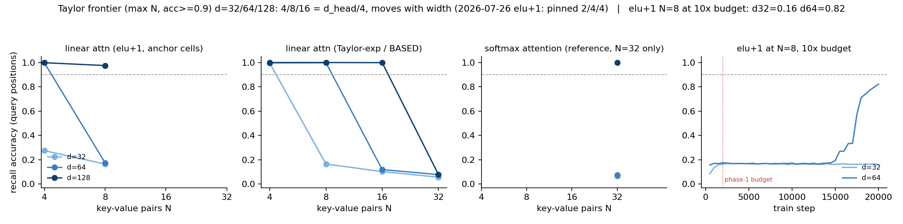

# MQAR feature map vs width: the Taylor-exp kernel unpins the recall cliff into N\*=d_head/4 — and the elu+1 cliff dissolves into an optimization plateau

**Date:** 2026-07-27 · **Status:** done

## Hypothesis
On the 2026-07-26 `mqar-state-capacity` harness, swapping the elu+1 feature map for a BASED-style second-order Taylor-exp kernel (score = 1 + s + s²/2, s = q·k/√d_head) at the identical 2000-step budget moves the linear-attention recall cliff out past N=16 AND makes the frontier finally respond to width; and giving the failing elu+1 N=8 cells a 10x step budget does NOT rescue them (i.e. the pinned cliff was a feature-map limit, not slow learning).

## Method
- Task, skeleton, data generators, optimizer, budget: byte-identical to `2026-07-26_mqar-state-capacity` (zoology-style MQAR, 64 keys / 64 values, 2-block pre-norm transformer, 2 heads, 2x MLP, AdamW 1e-3 / wd 0.01, batch 64, 2000 steps, early stop at 0.99, same per-(N, seed) train/eval streams). Only the sequence mixer's score function varies.
- `taylor` (the experiment): scores = 1 + s + s²/2 with s = (q·kᵀ)/√d_head — the kernel-trick form of φ(x) = [1, x, x⊗x/√2] (BASED). Non-negative by construction (min 0.5), causally masked, row-sum normalized exactly like the elu+1 arm. The implied per-head state is (1 + d_head + d_head²) × d_head, so a state-size account predicts the frontier must now move with width. Full grid N ∈ {4, 8, 16, 32} × d ∈ {32, 64, 128}.
- `linattn` (anchor): elu+1 rerun at N ∈ {4, 8} × d ∈ {32, 64, 128} to re-pin yesterday's cliff on today's code path.
- `attn` (reference): N=32 only (the one load the prior run did not cover).
- Phase 2 (budget): elu+1 N=8 at d ∈ {32, 64} with a 10x budget (20,000 steps), accuracy trajectory recorded every 500 steps. d=128 dropped for the 2-core time-box.
- One seed (0), matching the prior run. One deliberate difference, which turned out to matter: the per-run init seed formula replaces a `hash(mixer)` term (non-deterministic across interpreter invocations) with `sum(ord)`, so today's init draws differ from yesterday's. 38.1 min CPU total.

## How to run
```bash
pip install -r requirements.txt
python run.py
```

## Result
**Taylor frontier (max N with acc ≥ 0.9) at d = 32/64/128: 4 / 8 / 16 = exactly d_head/4 — it doubles with every width doubling, where elu+1 sat pinned at 2/4/4.** Cells inside the frontier solve in 500–750 steps; cells outside it sit at the same ~0.10–0.17 residual plateau as elu+1 (taylor d=32 N=8: 0.165 vs elu+1's 0.165).

But the second half of the hypothesis is **refuted**, and it takes yesterday's headline down with it:

- **10x budget, d=64, N=8:** flat at ~0.17 for ~15,000 steps, then a sharp breakthrough — 0.19 at 15k, 0.33 at 16.5k, 0.82 at 20k and still climbing. The elu+1 cliff at d=64 is *slow-to-learn*, not cannot-represent: an optimization plateau with an escape time ~8x the phase-1 budget.
- **10x budget, d=32, N=8:** flat at 0.16 for all 20,000 steps. No escape at the smallest width.
- **Anchor surprise, d=128, N=8:** today's elu+1 anchor scores **0.975 within the ordinary 2000-step budget** — yesterday's identical cell scored 0.176. The only change is the init draw (seed-formula fix). So the "cliff pinned across a 4x width sweep" was init-fragile at its widest point: near the plateau boundary, whether a run escapes within budget is a coin-flip over inits.
- `attn` at N=32 fails inside the budget at d=32/64 (0.064/0.076) and solves instantly at d=128 (1.000 at 1000 steps) — replicating yesterday's point that the step budget binds even for softmax attention at small width.



## Takeaway
The 2026-07-26 story ("the linear-attention recall bottleneck is a feature-map limit, not a state-size limit — the cliff does not move with width") **dissolves under a better feature map and a longer budget**. What fixed-budget MQAR sweeps actually measure is *plateau escape time vs budget*, not representational capacity: the elu+1 cliff at N=8 is escapable at d=64 given 8x the steps and at d=128 given a luckier init, and the Taylor-exp kernel's contribution is to shorten the escape time to inside the budget — precisely up to N\* = d_head/4, beyond which it too plateaus. The clean quantitative product is that under the Taylor kernel the budget-conditional frontier finally behaves like a capacity law (N\* doubles with d_head, the BASED/zoology state-size story restored), while under elu+1 the same protocol produces a width-invariant artifact. Methodological lesson for the registry: a "capacity frontier" claim at fixed steps needs either a budget sweep or a plateau-escape-time measurement to deserve the word capacity — and single-seed cells adjacent to a cliff are untrustworthy (our own d=128 anchor flipped 0.176 → 0.975 on an init change). Follow-ups: (1) escape-time vs (N, d, kernel) directly — train to breakthrough with a step cap and map iso-escape-time contours; (2) does N\* = d_head/4 hold at 4x the budget, or drift toward d_head; (3) the still-open `mqar-min-selectivity` backlog item, now with the caveat that any gate verdict needs a budget sweep.

## Novelty check
- Verdict: partial-prior-art
- Note: `scripts/novelty_check.py` was blocked in tonight's sandbox (HTTP 403 from both arXiv and OpenAlex); the search was done via web search instead, plus a registry grep (`mqar`, `taylor`, `feature map` — only the two 2026-07-25/26 MQAR parents).
- Closest prior work: [BASED: Simple linear attention language models balance the recall-throughput tradeoff (2402.18668)](https://arxiv.org/abs/2402.18668) (introduces the Taylor-exp feature map and shows it closes most of the MQAR recall gap at 360M–1.3B), the [zoology2/BASED blog](https://hazyresearch.stanford.edu/blog/2023-12-11-zoology2-based) and [together.ai writeup](https://www.together.ai/blog/based) (MQAR sweeps showing recall tracks recurrent state size), [Kernelized Linear Attention: Breaking the Capacity Wall (2607.17419)](https://arxiv.org/html/2607.17419) (capacity-wall framing for kernelized linear attention).
- How this differs: BASED reports that the Taylor map works; it does not report the width-scaling law of the frontier at a fixed nano budget (N\* = d_head/4 at 28k–309k params), the plateau-escape decomposition showing the elu+1 "cliff" is slow-to-learn at d≥64 (15k-step plateau then breakthrough), or the init-fragility of fixed-budget cliff cells. The headline critique — fixed-step MQAR frontiers measure optimization plateaus, not capacity — is aimed at our own 2026-07-26 rows and is not made in the sources above.
