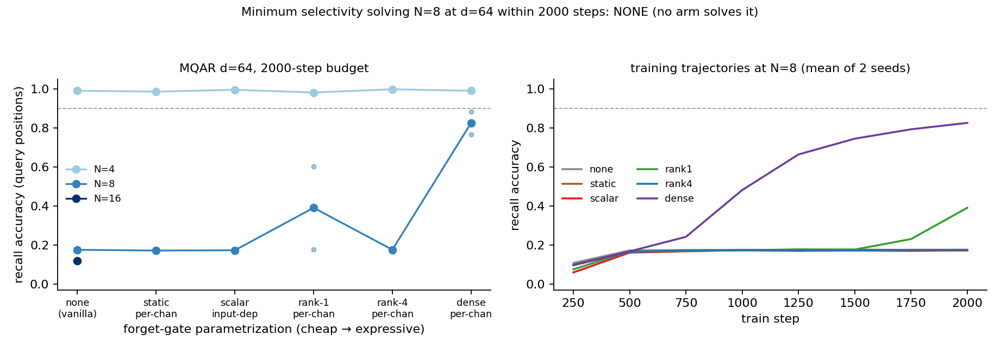

# MQAR minimum selectivity: the gate-rank axis is a cliff, not a ramp — only the full-rank per-channel gate reliably beats vanilla, and even it does not "solve" inside the budget

**Date:** 2026-07-28 · **Status:** done

## Hypothesis
On the `mqar-state-capacity` harness at d=64 (the cell where vanilla elu+1 linear attention fails N=8 inside the 2000-step budget, twice replicated), input-dependent PER-CHANNEL forget gates rescue recall, and the required gate rank is small — rank 1–4 should suffice and match the dense gate — while the two cheaper points on the selectivity axis (a learned but input-INDEPENDENT per-channel decay, and the input-dependent scalar gate already shown to be a no-op on 2026-07-26) should not beat vanilla.

## Method
- Harness byte-identical to `2026-07-26_mqar-state-capacity` / `2026-07-27_mqar-feature-map-vs-width`: zoology-style MQAR (64 keys / 64 values, queries are the N keys permuted), 2-block pre-norm transformer, 2 heads, 2x MLP, d=64 (d_head=32), AdamW 1e-3 / wd 0.01, batch 64, 2000 steps, early stop at 0.99, same per-(N, seed) train/eval streams, `sum(ord)` init-seed formula (the 2026-07-27 determinism fix).
- Only the forget gate of the elu+1 linear-attention mixer varies, ordered by gate budget: `none` (vanilla, g=1) → `static` (learned per-channel decay, input-independent — RetNet-style control that separates *learned decay* from *selectivity*) → `scalar` (input-dependent scalar per head; exact replication of the 2026-07-26 `gla` arm) → `rank1` / `rank4` (input-dependent per-channel gate through a LoRA-style U·V bottleneck, U zero-init) → `dense` (full d_model→h·d_head linear; GLA-style upper bound; 8.3k gate params vs 86k model). All gated arms share one exact closed-form code path (per-channel decay-masked attention, the closed form of S_t = diag(g_t)S_{t-1} + φ(k_t)v_tᵀ) and start at g = sigmoid(3) ≈ 0.953, near-vanilla.
- Cells: N=8 × seeds {0,1} × all 6 arms (decisive cell); N=4 × seed 0 (sanity); N=16 × seed 0 adaptively, only for arms with mean N=8 acc ≥ 0.9 plus the `none` anchor. Accuracy trajectory recorded every 250 steps (the 2026-07-27 lesson: fixed-budget endpoints near a plateau are uninterpretable without trajectories). 28.3 min CPU total.

## How to run
```bash
pip install -r requirements.txt
python run.py
```

## Result
**No arm reaches the 0.9 solve threshold at N=8 within 2000 steps — but the arms separate cleanly into three behaviors, and the split is NOT the graded ramp the hypothesis predicted:**

| arm | gate params | N=8 acc (seed 0 / 1) | Δ vs vanilla (mean) | trajectory |
|---|---|---|---|---|
| none | 0 | 0.174 / 0.177 | — | flat plateau |
| static | 128 | 0.171 / 0.172 | −0.004 | flat plateau |
| scalar | 260 | 0.171 / 0.175 | −0.002 | flat plateau |
| rank1 | 384 | **0.603** / 0.178 | +0.215 | breakout at ~1750 on seed 0 only |
| rank4 | 1152 | 0.172 / 0.179 | +0.001 | flat plateau |
| dense | 8320 | **0.767 / 0.885** | **+0.651** | breakout at ~750–1000, both seeds, still climbing |

- `static` and `scalar` sit on the vanilla plateau to the third decimal — learned decay without input-dependence buys nothing, and the 2026-07-26 scalar-gate no-op replicates exactly on today's code path.
- The rank axis is non-monotone: `rank4` (3x the gate params of rank1) does nothing on either seed, while `rank1` breaks out on one seed at step ~1750 and is flat on the other. Near the plateau boundary, whether a low-rank gate escapes within budget is an init coin-flip — the same fragility the d=128 anchor showed on 2026-07-27.
- `dense` is the only arm that reliably beats vanilla: breakout on **both** seeds, and ~10–20x earlier than ungated elu+1 at this width (escape ~750–1000 steps vs ~15,000 in yesterday's 10x-budget run) — yet at 2000 steps it is still mid-climb (0.83 mean), so under the registry's own frontier rule the capacity frontier would record dense as "not solved," exactly the kind of endpoint artifact the trajectories exist to catch.
- Sanity holds: all six arms solve N=4 (0.98–1.00); vanilla N=16 anchor 0.120 (replicates 0.116). The adaptive N=16 stage ran only the anchor since no arm cleared 0.9 at N=8.



## Takeaway
"Minimum selectivity" has no smooth answer at this scale because selectivity does not act as capacity — it acts as an *optimization accelerant* on the same plateau-escape event identified on 2026-07-27. The gate-rank sweep is a cliff: everything below full rank is either a strict no-op (static, scalar, rank4) or an init lottery (rank1), and the full-rank per-channel gate wins not by storing more (its state is identical, d_head×d_head per head) but by making the breakthrough happen ~10–20x sooner — while still failing a naive fixed-budget "solved" criterion. Two consequences for the registry: (1) the mamba-mini-induction claim that "what buys ordering is an address, not a leak rate" now has a recall-side counterpart — a *rich* leak rate (full-rank per-channel decay) does buy recall, but only at full width of input-dependence, and (2) any published MQAR gate ablation run at a fixed step budget with single seeds (which is most of them) can order gate variants almost arbitrarily — our own table would rank rank1 > rank4 on mean accuracy, which is certainly init noise. Follow-ups appended to the backlog: escape-time (not endpoint) as the primary metric for a rank × budget sweep with ≥5 seeds; and testing whether the dense gate's advantage is input-dependence per se or just gate-gradient dimensionality (train-time-only gate noise control).

## Novelty check
- Verdict: partial-prior-art
- Note: `scripts/novelty_check.py` blocked again in tonight's sandbox (HTTP 403 from both arXiv and OpenAlex); searched via web search instead, plus registry grep (`mqar`, `gate`, `selectivity` — parents: 2026-07-25_zoology-mqar-recall, 2026-07-26_mqar-state-capacity, 2026-07-27_mqar-feature-map-vs-width, 2026-07-26_mamba-mini-induction).
- Closest prior work: [Gated Linear Attention (2312.06635)](https://arxiv.org/pdf/2312.06635) (introduces the per-channel data-dependent gate — itself parametrized low-rank — and ablates gate variants at 340M–1.3B), [Gated Slot Attention (2409.07146)](https://arxiv.org/pdf/2409.07146) (gate structure vs recall at scale), [zoology blog](https://hazyresearch.stanford.edu/blog/2023-12-11-zoology1-analysis) (MQAR as the recall probe; gated convolutions vs attention), [Kernelized Linear Attention: Breaking the Capacity Wall (2607.17419)](https://arxiv.org/html/2607.17419) (capacity framing this row argues against at fixed budget), [Wall Attention (Tilde blog)](https://blog.tilderesearch.com/blog/wall-attn) (diagonal gates for length generalization — different axis).
- How this differs: GLA-lineage papers report that per-channel gates work and pick a rank by engineering judgment; none sweeps the gate-rank axis {static, scalar, rank-1, rank-4, dense} on MQAR at matched budget with an input-independence control, and none frames the gate's contribution as plateau-escape acceleration rather than capacity (our dense arm escapes 10–20x earlier at *identical* state size). The non-monotone rank result (rank4 no-op, rank1 coin-flip) and the resulting "fixed-budget gate ablations are init-noise-ordered" critique are aimed at our own prior rows as much as the literature and are not made in the sources above.
