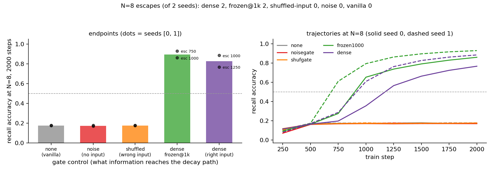

# MQAR gate noise control: the dense gate's win is routing on the RIGHT input — wrong-input and pure-noise gates are exact no-ops, and the gate's work is done by the time of breakout

**Date:** 2026-07-29 · **Status:** done

## Hypothesis
On the `mqar-min-selectivity` harness (d=64, N=8, 2000 steps — the cell where the dense per-channel gate reliably escapes the vanilla linear-attention plateau while every cheaper gate fails), the dense gate's advantage is input-dependent routing per se: a gate with identical parametrization and gradient dimensionality but fed the WRONG sequence's content (batch-shuffled input), and a train-time-only random per-channel gate (pure decay-path noise), should both stay on the vanilla plateau, while freezing the dense gate at step 1000 (post-breakout) should keep most of the win.

## Method
- Harness byte-identical to `2026-07-26_mqar-state-capacity` / `2026-07-28_mqar-min-selectivity`: zoology-style MQAR (64 keys / 64 values, queries are the N keys permuted), 2-block pre-norm transformer, 2 heads, d=64 (d_head=32), 2x MLP, AdamW 1e-3 / wd 0.01, batch 64, 2000 steps, same per-(N, seed) train/eval streams and `sum(ord)` init-seed formula — so the `none` and `dense` arms are byte-identical reruns of the 2026-07-28 rows.
- Five arms on one shared exact decay-masked linear-attention code path, varying only WHAT reaches the decay path:
  - `none` — vanilla elu+1 (g=1), plateau anchor [replication]
  - `noisegate` — learned per-channel bias + train-time-only Gaussian logit noise (σ=1, fresh per step/position/channel; eval uses bias alone). Pure stochastic perturbation: no input, no extra gradient dimensions.
  - `shufgate` — the full dense gate, but its input is the batch-SHUFFLED activations (detached): identical parametrization (8320 gate params), identical gradient dimensionality through the decay path, identical input *statistics* — wrong *content*. The gate cannot route this sequence.
  - `frozen1000` — dense gate trained normally, gate params `requires_grad=False` from step 1000 (grads zeroed via set_to_none, so AdamW skips them).
  - `dense` — the 2026-07-28 winner [replication].
- Cells: N=8 × seeds {0,1} × 5 arms (decisive cell); N=4 × seed 0 for the two new mechanisms (can they learn at all?). Both endpoint accuracy AND escape step (first eval ≥ 0.5) reported — the 2026-07-28 lesson that fixed-budget endpoints near a plateau are init-noise-ordered. 14.9 min CPU total.

## How to run
```bash
pip install -r requirements.txt
python run.py
```

## Result
**Clean three-way separation, exactly as hypothesized — and both replications land to the third/fourth decimal:**

| arm | what reaches the decay path | N=8 acc (seed 0 / 1) | escape step | Δ vs vanilla (mean) |
|---|---|---|---|---|
| none | nothing (g=1) | 0.174 / 0.177 | — / — | — |
| noisegate | noise, no input | 0.170 / 0.176 | — / — | −0.002 |
| shufgate | full gate, WRONG input | 0.176 / 0.175 | — / — | +0.001 |
| frozen1000 | right input, learning stops @1k | **0.860 / 0.930** | 1000 / 750 | **+0.720** |
| dense | right input throughout | **0.767 / 0.885** | 1250 / 1000 | +0.651 |

- `shufgate` is an exact no-op (Δ +0.001) despite having every non-informational property of the dense gate: same 8320 params, same gradient dimensionality through the decay path, same activation statistics flowing in. The "gate as extra trainable machinery / optimization conditioning" story is dead: the machinery with the wrong content buys nothing.
- `noisegate` is an exact no-op (Δ −0.002): stochastic perturbation of the decay path does not shake the model off the plateau, so the dense gate's win is not noise-assisted escape either.
- `frozen1000` escapes on both seeds (1000 / 750) and its endpoint matches dense (its +0.07 edge over dense is within the harness's known init noise — the two arms have different init seeds by construction). Continued gate adaptation after breakout is unnecessary: the post-escape climb is carried by the non-gate parameters.
- Replications: vanilla endpoints (0.174/0.177) and dense endpoints (0.767/0.885) reproduce the 2026-07-28 values exactly, as they should (byte-identical init seeds and data streams).
- Sanity: both new mechanisms solve N=4 (noisegate 0.969, shufgate 0.996) — the controls impair the recall circuit specifically, not learning in general.



## Takeaway
Selectivity is information routing, full stop. The 2026-07-28 row established that only the full-rank input-dependent gate escapes the MQAR plateau but could not distinguish *what the gate contributes* — content-based routing, extra gradient dimensionality through the decay path, or stochastic perturbation. Tonight's controls kill both deflationary explanations at matched everything: the identical gate fed the wrong sequence's content sits on the vanilla plateau to the third decimal, and so does pure decay-path noise. Meanwhile freezing the gate at step 1000 costs nothing, so the gate's causal role is concentrated in (or before) the breakout window — it opens the door to the recall circuit and can then stop learning. This sharpens the registry's running account of the elu+1 plateau: escape requires *specific, content-dependent decay* during a specific early window, which is why every input-independent or low-rank approximation on the 2026-07-28 sweep failed. Next follow-up (appended to backlog): freeze the dense gate BEFORE the breakout window (e.g. at step 250/500) to time the door-opening precisely — does an early half-trained gate suffice, or must gate learning span the whole pre-escape window?

## Novelty check
- Verdict: novel (control design; the harness and question descend from our own registry thread)
- Note: `scripts/novelty_check.py` blocked again in tonight's sandbox (HTTP 403 from both arXiv and OpenAlex); searched via web search instead, plus registry grep (`gate`, `noise`, `shuf` — parents: 2026-07-26_mqar-state-capacity, 2026-07-27_mqar-feature-map-vs-width, 2026-07-28_mqar-min-selectivity, 2026-07-26_mamba-mini-induction).
- Closest prior work: [Gating is Weighting (2504.04308)](https://arxiv.org/abs/2504.04308) (theory: GLA gating implements data-dependent weighted preconditioned GD in in-context learning — predicts content should matter, but proves it in a linear-regression setting, no shuffled-content control), [Gated Linear Attention (2312.06635)](https://arxiv.org/abs/2312.06635) and [Gated Slot Attention (2409.07146)](https://arxiv.org/abs/2409.07146) (gate ablations at 340M–1.3B, always comparing parametrizations, never information content at fixed parametrization), [Improving the Gating Mechanism (Gu et al. 2020)](http://proceedings.mlr.press/v119/gu20a/gu20a.pdf) and [Unreasonable Effectiveness of the Forget Gate (1804.04849)](https://arxiv.org/pdf/1804.04849) (treat gates partly as optimization devices — the hypothesis our shufgate/noisegate arms test and refute for MQAR recall), [zoology blog](https://hazyresearch.stanford.edu/blog/2023-12-11-zoology1-analysis) (MQAR as the recall probe).
- How this differs: gate ablations in the literature vary the gate's *parametrization*; none we found holds the parametrization fixed and degrades only the *information* reaching it (shuffled-batch content, train-time-only noise) on a recall task, and none freezes the gate post-breakout to localize its causal window. The result gives the "gates as optimization aids" folklore a clean negative instance and the "gating is weighting" theory a controlled empirical confirmation at 94k params.
