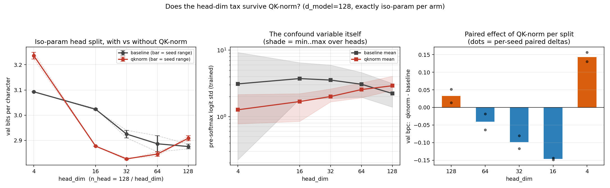

# Does the head-dim tax survive QK-norm? Removing the attention-temperature confound from the iso-param head-split sweep

**Date:** 2026-07-30 · **Status:** done

## Hypothesis
2026-07-26_head-dim-vs-count-isoparam found val bpc perfectly monotone in head_dim at fixed
d_model=128 (Spearman −1.00, one giant head best, 32 tiny heads a 0.217-bpc tax) but flagged its
own confound: 1/√head_dim only equalises the attention temperature at init, and the trained
logit scale drifted differently per split. If the tiny-head tax is mostly mis-set temperature,
per-head RMS-norm on q and k (QK-norm) should flatten the curve; if rank-head_dim attention is
intrinsically weaker, the monotone ordering should survive.

## Method
- Architecture: 2-layer pre-norm char GPT, d_model=128, d_ff=512, exactly as 2026-07-26.
  Splits (n_head, head_dim) ∈ {(1,128), (2,64), (4,32), (8,16), (32,4)} — iso-parameter by
  construction (423,424 params). Second arm adds QK-norm: per-head RMS-norm on q and k with
  learnable per-channel gains of length d_model (+512 params, same for every split, so the
  qknorm arm is also exactly iso-param across splits), then the usual 1/√head_dim scale.
- Task / dataset: tiny-shakespeare char LM, block 96, batch 16, 600 AdamW steps (cosine, wd 0.1),
  val bits per character on 480 held-out blocks.
- Controls: identical init across ALL arm×split cells at a given seed (gains init to ones and
  consume no RNG — verified by an init signature over the shared weights), shared batch stream
  per seed, 2 seeds. Probes on the trained models: per-head pre-softmax logit std (the confound
  variable itself) and normalised attention entropy.
- 20 runs, 584 s total on 2 CPU threads.

## How to run
```bash
pip install -r requirements.txt
python run.py        # SMOKE=1 python run.py for a 40-step smoke test
```

## Result
**The head-dim tax is two different taxes, and QK-norm separates them.**

| head_dim (n_head) | baseline bpc | qknorm bpc | Δ (qknorm − baseline) |
|---|---|---|---|
| 128 (1) | 2.876 | 2.909 | +0.033 |
| 64 (2) | 2.887 | 2.846 | −0.041 |
| 32 (4) | 2.925 | **2.827** | −0.099 |
| 16 (8) | 3.024 | 2.877 | −0.146 |
| 4 (32) | 3.093 | 3.236 | +0.143 |

- The baseline arm replicates 2026-07-26 to the 4th decimal (fresh clone, fresh torch install) —
  monotone, Spearman −1.00.
- Under QK-norm the monotone shape does **not** survive: Spearman collapses to −0.30 and a clean
  interior optimum appears at head_dim=32 (U-curve verdict: both edges outside seed spread,
  config spread 28.6× seed spread). The mid-range tax was substantially temperature: QK-norm's
  help grows exactly where the baseline tax grew (−0.04 → −0.10 → −0.15 bpc at hd 64/32/16), and
  qknorm hd=32 (2.827) beats **everything** in the baseline sweep including the giant head
  (−0.049 bpc vs baseline best).
- The tiny-head end is intrinsic and QK-norm makes it *worse* (+0.143 bpc at hd=4). Mechanism
  visible in the probes: with unit-RMS q/k a head's logits are bounded by ≈ √head_dim · (gain
  scale), so 4-dim qknorm heads cannot sharpen — normalised attention entropy 0.90 (vs 0.74
  baseline), mean top-1 weight 0.107 (vs 0.232), trained logit std pinned at 1.27. The baseline's
  hd=4 model instead lets individual heads blow up their logit scale (per-head trained std spans
  0.22–9.24, a ~40× within-model spread; QK-norm compresses it to 0.78–2.14).
- Headline metric `fraction_of_head_dim_tax_removed_by_qknorm` = −0.88 (the end-to-end spread
  *grows*) — an honest reminder that "remove the confound" was the wrong summary statistic: the
  confound was real for the mid-range and irrelevant-to-backwards at the hd=4 edge.



## Takeaway
The 2026-07-26 conclusion "val bpc is perfectly monotone in head_dim" was an artifact of
uncontrolled attention temperature for everything except the extreme tiny-head end. With QK-norm
the fair answer to "how should I split d_model=128?" becomes the textbook one — a moderate
number of moderate heads (4×32) is best, and it beats every unnormalised split. What survives is
a real, sign-flipped edge effect: heads at hd≈4 are limited by attention *sharpness capacity*
(bounded cosine logits), not temperature, so QK-norm — which helps every other split — actively
deepens that cliff. Next: does the qknorm U-curve's optimum track √d_model (rerun at d=64/256)?
And does a per-head learnable temperature on top of QK-norm rescue hd=4 by restoring sharpness
without unbounded drift?

## Novelty check
- Verdict: partial-prior-art
- Closest prior work: QK-norm itself is established ([2010.04245](https://arxiv.org/abs/2010.04245),
  ViT-22B, small-scale-proxies — all motivate it by stability/saturation, not by head-split
  allocation); head-count vs head-dim allocation is studied theoretically in
  [2510.03784](https://arxiv.org/html/2510.03784v1) (no temperature control); our own
  2026-07-26_head-dim-vs-count-isoparam is the direct parent and flagged this exact confound.
- How this differs: nobody appears to have used QK-norm as a *control* to ask whether the
  iso-param head-split curve is a temperature artifact — the U-curve restoration and the
  sign-flip at hd=4 (QK-norm hurting because it caps sharpness) are new observations at any scale.
  (novelty_check.py's arXiv/OpenAlex endpoints were 403-blocked in tonight's sandbox; the check
  was done via web search from the session instead — sources above.)
