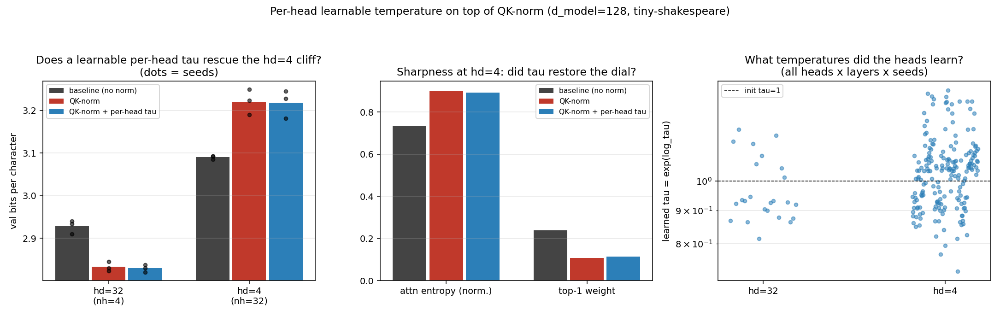

# Per-head learnable temperature on top of QK-norm: the causal test of the hd=4 sharpness cap

**Date:** 2026-07-31 · **Status:** done (negative result: no rescue)

## Hypothesis
2026-07-30_qknorm-head-dim found that QK-norm helps every iso-param head split of d_model=128
except head_dim=4, where it costs +0.143 bpc, and inferred a mechanism from probes: unit-RMS
4-dim heads are *sharpness-capped* (bounded cosine logits — entropy 0.90 vs 0.74 baseline,
top-1 weight 0.107 vs 0.232, trained logit std pinned at 1.27). That was correlational. If the
sharpness cap is THE mechanism, handing the model back an explicit sharpness dial — a per-head
learnable temperature tau (logits scaled by exp(log_tau), init 1, no weight decay, the same
device the original QK-norm paper uses as its learnable g) — should restore sharpness and close
the hd=4 cliff back to the unnormalised baseline, while leaving the hd=32 optimum intact.

## Method
- Architecture: 2-layer pre-norm char GPT, d_model=128, d_ff=512, exactly the
  2026-07-30 harness. Configs (n_head, head_dim) ∈ {(4,32), (32,4)} — the qknorm optimum
  and the cliff. Three arms: baseline (no norm), qknorm (per-head RMS on q,k + length-128
  learnable gains), qknorm_temp (qknorm + per-head per-layer log_tau, q scaled by
  exp(log_tau) before the dot product, so probe and SDPA see identical effective logits).
- Training: identical recipe (AdamW 3e-3 cosine, wd 0.1 with gains/taus excluded, 600 steps,
  batch 16, block 96, tiny-shakespeare, val bpc on 480 held-out blocks).
- Controls: identical shared-weight init across all 6 arm×config cells per seed (gains init
  to ones, log_tau to zeros — RNG-free, verified by init signature), shared batch stream per
  seed, 3 seeds. log_tau adds n_layer×n_head params (8 or 64 out of ~424k; arm-vs-arm
  comparisons at fixed config are what carry the result).
- 18 runs, 779 s total on 2 CPU threads.

## How to run
```bash
pip install -r requirements.txt
python run.py        # SMOKE=1 python run.py for a 40-step smoke test
```

## Result
**The dial rescues nothing — and the model does not even reach for it.**

| arm | hd=32 bpc | hd=4 bpc |
|---|---|---|
| baseline | 2.928 | 3.090 |
| qknorm | 2.833 | 3.221 |
| qknorm + per-head tau | 2.829 | 3.218 |

- The cliff replicates: qknorm − baseline at hd=4 = **+0.130 bpc** (parent: +0.143), positive
  in 3/3 paired seeds (+0.104 to +0.156).
- The rescue is **0.003 bpc = 2.1% of the cliff** (per-seed paired rescue −0.004/+0.004/+0.008
  — zero within seed spread 0.06). The causal prediction of the sharpness-cap story fails.
- The mechanism probe explains why, and it is the interesting part: **gradient descent leaves
  the dial alone.** Learned taus at hd=4 sit at mean 1.04, range 0.73–1.38 across all 64
  heads × 2 layers × 3 seeds — to match the baseline's trained logit scale (std 3.25) tau
  would need to reach ≈2.6, and nothing pulls it there. Trained sharpness stays capped-looking
  (entropy 0.894 vs qknorm 0.902 vs baseline 0.736; top-1 0.114 vs 0.108 vs 0.239) even though
  uncapping now costs one scalar. The hd=4 qknorm model is not straining against a bound; the
  loss gradient simply does not point toward sharper attention.
- Do-no-harm control passes: at hd=32 the tau arm matches qknorm (−0.004 bpc, and taus there
  also stay in 0.81–1.20).



## Takeaway
The 2026-07-30 inference "the hd=4 cliff is a sharpness cap" is refuted as a *causal* story:
restoring an explicit per-head temperature — the exact dial the probes said was missing —
recovers 2% of the 0.130-bpc cliff, and the optimizer barely moves it off init even though it
is free. What the unnormalised baseline has at hd=4 and qknorm(+tau) lacks is therefore not a
static per-head logit scale. The remaining suspects are what RMS-norm destroys and a static
scalar cannot restore: **query-dependent** (per-token) logit magnitude — the baseline's heads
can modulate sharpness by token via ‖q_t‖ — and per-channel magnitude information within the
4-dim head. Low sharpness at hd=4 looks like a symptom both arms share, not the disease.
Next: feed the pre-norm ‖q_t‖ back as a per-token temperature on top of QK-norm
(tau_t = f(‖q_t‖)) — if THAT rescues the cliff, the load-bearing quantity is dynamic, not
static, temperature (added to backlog as `qknorm-hd4-dynamic-temperature`).

Caveats: 600-step early-training regime (taus might migrate further with 10× steps — but the
baseline reaches logit std 3.25 in the same budget, so the asymmetry is real), one dataset,
d_model=128 only.

## Novelty check
- Verdict: partial-prior-art
- Closest prior work: a learnable scale on top of normalised q/k is standard — the original
  QK-norm paper's g ([2010.04245](https://arxiv.org/abs/2010.04245)), learnable-temperature
  softmax writeups (e.g. [Nick Ryan's blog](https://nickcdryan.com/2024/08/02/introducing-a-learnable-temperature-value-into-the-self-attention-scores/)),
  and per-head scaling variants collected in
  [x-transformers](https://github.com/lucidrains/x-transformers) /
  [QK-norm surveys](https://www.emergentmind.com/topics/query-key-normalization-qk-norm);
  logit-scale dynamics under QK-norm discussed in
  [Ross Taylor's logit-drift post](https://rossjtaylor.com/blog/qk-norm-and-the-curious-case-of-logit-drift/).
- How this differs: nobody appears to use the learnable temperature as a *causal probe* of
  the tiny-head-dim penalty, and the negative result — the optimizer declines a free sharpness
  dial exactly where sharpness was the inferred bottleneck — is a new observation that
  overturns our own 2026-07-30 mechanism story. (novelty_check.py's arXiv/OpenAlex endpoints
  were 403-blocked in tonight's sandbox, as last night; the check was done via web search from
  the session — sources above — plus a registry grep.)
